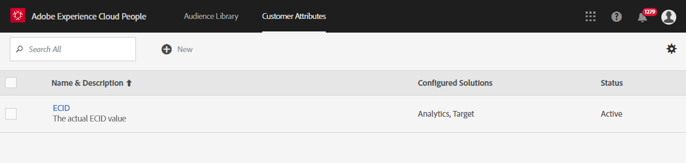
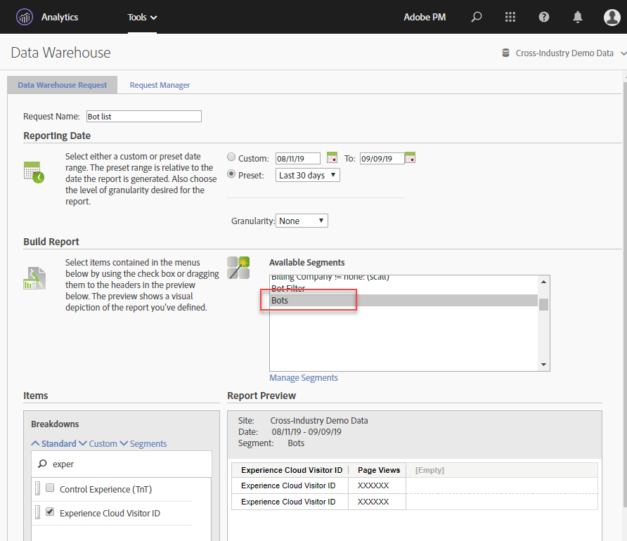

# Bot verwijderen in Adobe Analytics

In Adobe Analytics hebt u meerdere opties om beide verkeer uit de rapportage te verwijderen:

## Bot-regels gebruiken

Filtermethoden voor zowel standaard als aangepaste bot worden ondersteund in **[!UICONTROL Analytics]** > **[!UICONTROL Admin]** > **[!UICONTROL Report Suites]** > **[!UICONTROL Edit Settings]** > **[!UICONTROL General]** > **[!UICONTROL Bot Rules]**:

| Type regel | Beschrijving |
|--- |--- |
| Standaardregels voor IAB-bot | Selecteren **[!UICONTROL Enable IAB Bot Filtering Rules]** gebruikt de [IAB&#39;s](https://www.iab.com/) (International Advertising Bureau) International Spiders &amp; Bots List om beide verkeer te verwijderen. De meeste klanten selecteren deze optie op een minimum. |
| Aangepaste botregels | U kunt de regels van de douanebot bepalen en toevoegen die op gebruikersagenten, IP adressen, of IP waaiers worden gebaseerd. |

Zie voor meer informatie [Overzicht van beide regels](/help/admin/admin/bot-removal/bot-rules.md).

## Gebruik de [!UICONTROL websiteBot] insteekmodule voor het identificeren van bots

De [!UICONTROL websiteBot] Met de insteekmodule kunt u dynamisch vaststellen of bezoekers van een bureaublad de meeste gebruikers hebben. U kunt deze gegevens gebruiken om grotere nauwkeurigheid in alle types van rapportering te drijven, die u een betere manier geeft om wettig plaatsverkeer te meten.

Deze plug-in voert twee controles uit:

* Eerst, bepaalt het of het apparaat een Desktop of een mobiel apparaat gebruikend de navigator.UserAgent variabele is. Mobiele apparaten worden genegeerd.
* Als het een desktopapparaat is, wordt er een gebeurtenislistener toegevoegd voor muisbewegingen.

Zie voor meer informatie de [Adobe Analytics-implementatiehandleiding](https://experienceleague.adobe.com/docs/analytics/implementation/vars/plugins/websitebot.html).

## Een combinatie van Adobe-gereedschappen gebruiken

Bovendien biedt Adobe, aangezien bots snel morferen, verschillende andere krachtige functies die, wanneer ze op een correcte manier en op regelmatige basis worden gecombineerd, kunnen helpen om deze vijanden van gegevenskwaliteit te verwijderen. Deze functies zijn: De Dienst van identiteitskaart van Experience Cloud, Segmentatie, Data Warehouse, de Attributen van de Klant, en Virtuele Reeksen van het Rapport. Hier volgt een overzicht van hoe u deze gereedschappen kunt gebruiken.

### Stap 1: Geef de Experience Cloud-id van uw bezoekers door in een nieuwe gedeclareerde id

Maak een nieuwe gedeclareerde id in het dialoogvenster [People Core-service](https://experienceleague.adobe.com/docs/core-services/interface/audiences/audience-library.html). Geef de Experience Cloud-id van uw bezoeker door aan deze nieuwe gedeclareerde id, die u snel en eenvoudig kunt gebruiken met [tags in Adobe Experience Platform](https://experienceleague.adobe.com/docs/experience-platform/tags/extensions/adobe/id-service/overview.html). Gebruik de naam ECID voor de gedeclareerde id.



Hieronder wordt beschreven hoe deze id kan worden vastgelegd via het gegevenselement. Ben zeker om uw Experience Cloud OrgID in het Element van Gegevens correct te bevolken.

```return Visitor.getInstance("REPLACE_WITH_YOUR_ECORG_ID@AdobeOrg").getExperienceCloudVisitorID();```

Nadat dit gegevenselement is ingesteld, volgt u [deze instructies](https://experienceleague.adobe.com/docs/experience-platform/tags/extensions/adobe/id-service/overview.html) om gedeclareerde id&#39;s door te geven aan het ECID-hulpprogramma met tags in Adobe Experience Platform.

### Stap 2: Segmentatie gebruiken om vlekken te identificeren

Nu de ECID van uw bezoeker is doorgegeven aan een gedeclareerde id, kunt u [segmentering in Analysis Workspace](https://experienceleague.adobe.com/docs/analytics/analyze/analysis-workspace/components/segments/t-freeform-project-segment.html) om bezoekers te identificeren die zich als bots gedragen. Bots worden vaak gedefinieerd door hun gedrag: één toegangsbezoek, ongebruikelijke gebruikersagenten, onbekende apparaat/browser informatie, geen referentie, nieuwe bezoekers, ongebruikelijke landingspagina&#39;s, enz. Gebruik de bevoegdheden van de boor-downs van de Werkruimte en segmentatie om de bots te identificeren die het filtreren IAB en uw de boomregels van de rapportsuite hebben omzeild. Hier ziet u bijvoorbeeld een schermafbeelding van een segment dat u kunt gebruiken:


### Stap 3: Alles exporteren [!DNL Experience Cloud IDs] van het segment via Data Warehouse

Nu u de bots gebruikend segmenten hebt geïdentificeerd, is de volgende stap Data Warehouse te gebruiken om alle Experience Cloud IDs te halen verbonden aan dit segment. In deze schermafbeelding ziet u hoe u uw [Data Warehouse](/help/export/data-warehouse/data-warehouse.md) verzoek:



Vergeet niet Experience Cloud Visitor-id te gebruiken als uw dimensie en het segment Bots toe te passen.

### Stap 4: Geef deze lijst terug naar Adobe als Attribuut van de Klant

Zodra het rapport van de Data Warehouse aankomt, hebt u een lijst van ECIDs die van historische gegevens moet worden gefiltreerd. Kopieer en plak deze ECID&#39;s in een leeg CSV-bestand met slechts twee kolommen, ECID en Bot-vlag.

* **ECID**: Zorg ervoor dat deze kolomkop overeenkomt met de naam die u aan de bovenstaande nieuwe gedeclareerde id hebt gegeven.
* **Bot-vlag**: Voeg &#39;Bot Flag&#39; toe als schemadimensie van kenmerk van klant.

Gebruik dit .CSV-bestand als het importbestand voor klantkenmerken en abonneer vervolgens uw rapportsuite(s) op het kenmerk Klant zoals beschreven in deze [blogbericht](https://theblog.adobe.com/link-digital-behavior-customers).


### Stap 5: Creeer een segment dat hefboomwerkingen de nieuwe Attributen van de Klant

Als uw gegevensset eenmaal is verwerkt en geïntegreerd in Analysis Workspace, maakt u nog een segment dat gebruikmaakt van de nieuwe klantkenmerkdimensie &quot;Bot Flag&quot; en een [!UICONTROL Exclude] container:


### Stap 6: Dit segment gebruiken als het filter Virtuele rapportsuite

Tot slot creeer een [Virtuele rapportsuite](/help/components/vrs/vrs-about.md) die dit segment gebruikt om de geïdentificeerde bots uit te filteren:


Deze nieuwe gesegmenteerde Virtual Report Suite zal nu leiden tot een schonere set gegevens, waarbij de geïdentificeerde &#39;bots&#39; zijn verwijderd.

### Stap 7: Herhaal stap 2, 3 en 4 regelmatig

Stel ten minste een maandelijkse herinnering in om nieuwe vlekken te identificeren en te filteren, misschien vóór een regelmatig geplande analyse.
