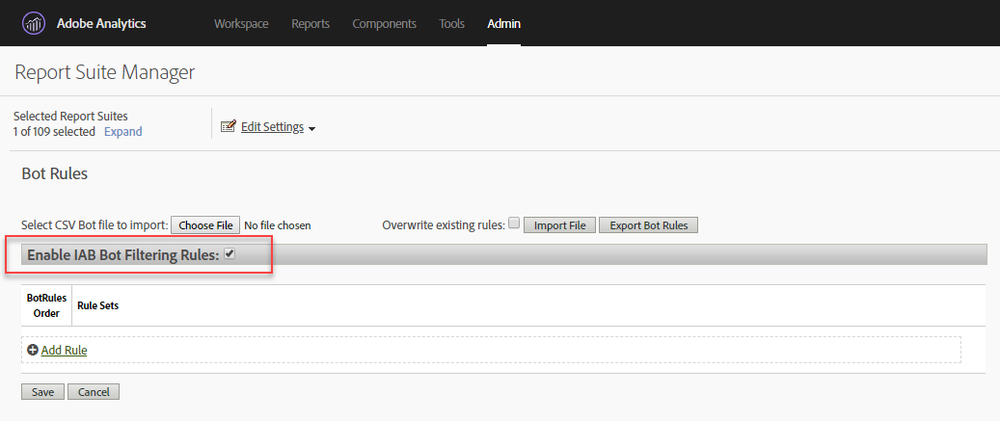

# Bot Rules - overzicht

Met beide regels kunt u verkeer verwijderen uit uw rapportsuite die wordt gegenereerd door bekende spinnen en bots. Door beide verkeer te verwijderen, kunt u de gebruikersactiviteit op uw website nauwkeuriger meten.

Hier is een video over het configureren van beide regels:

>[!VIDEO](https://video.tv.adobe.com/v/335738/?quality=12)

Nadat beide regels zijn gedefinieerd, wordt al het inkomende verkeer vergeleken met de gedefinieerde regels. Het verkeer dat om het even welk van deze regels aanpast wordt niet verzameld in de rapportreeks en is niet inbegrepen in verkeersmetriek.

Als u beide regels wilt bijwerken of uploaden, navigeert u naar **[!UICONTROL Analytics]** > **[!UICONTROL Admin]** > **[!UICONTROL Report Suites]**. Selecteer de juiste rapportsuite en ga naar **[!UICONTROL Edit Settings]** > **[!UICONTROL General]** > **[!UICONTROL Bot Rules]**.

Het verwijderen van beide verkeer vermindert typisch het volume van verkeer en omzettingsmetriek. Vele klanten vinden dat het verwijderen van beide verkeer in verhoogde omzettingspercentages en verhogingen van andere bruikbaarheidsmetriek resulteert. Alvorens beide verkeer te verwijderen, moet u met de belanghebbenden communiceren om ervoor te zorgen dat zij als gevolg van deze wijziging de noodzakelijke aanpassingen kunnen aanbrengen in de belangrijkste prestatie-indicatoren. Indien mogelijk, adviseren wij eerst verwijderend beide verkeer van een kleine rapportreeks om de potentiële impact te schatten.

Beide verkeersgegevens worden opgeslagen in een aparte gegevensopslagruimte die kan worden weergegeven in de rapporten Bots en Bot Pages. Er zijn twee opties om beide filters in te schakelen:

| Type regel | Beschrijving |
|--- |--- |
| Standaardregels voor IAB-bot | Selecteren [!UICONTROL Enable IAB Bot Filtering Rules] gebruikt de [IAB&#39;s](https://www.iab.com) (International Advertising Bureau) International Spiders &amp; Bots List om beide verkeer te verwijderen. De meeste klanten selecteren deze optie op een minimum. |
| Aangepaste botregels | U kunt de regels van de douanebot bepalen en toevoegen die op gebruikersagenten, IP adressen of IP waaiers worden gebaseerd. |

## Standaardregels voor IAB-bot

Standaard IAB-botregels kunnen worden ingeschakeld door de [!UICONTROL Enable IAB Bot Filtering Rules] selectievakje. Deze selectie zal bots verwijderen uit de International Spiders &amp; Bots List van IAB (International Advertising Bureau) om beide verkeer te verwijderen. Adobe werkt deze lijst van IAB maandelijks bij.



Adobe kan de gedetailleerde IAB-bonenlijst niet aan klanten aanbieden, maar u kunt het Bots-rapport gebruiken om een lijst weer te geven met bots die toegang hebben tot uw site. Als u een beide naar de IAB-lijst wilt verzenden, gaat u naar [IAB](https://www.iab.com).

## Aangepaste botregels

>[!NOTE]
>
>In de gebruikersinterface kunnen 500 regels handmatig worden gedefinieerd. Nadat deze limiet is bereikt, moeten de regels bulksgewijs worden beheerd via de opties voor het importeren van bestanden en het exporteren van regels.

Met aangepaste botregels kunt u op verkeer gebaseerde voorwaarden die u definieert, filteren.

De regels voor aangepaste bones worden gedefinieerd met behulp van de volgende voorwaardetypen:

* User Agent
* IP-adres
* IP-bereik

Meerdere voorwaarden kunnen voor één regel worden gedefinieerd. Meerdere voorwaarden komen overeen met &#39;of&#39;. Bijvoorbeeld, als u een waarde voor de Agent van de Gebruiker en IP Adres verstrekt, wordt het verkeer beschouwd als zowel verkeer als één van beide voorwaarde wordt voldaan aan.

### Gebruikersagent

Een voorwaarde van de Agent van de Gebruiker controleert de waarde van de gebruikersagent om te zien of het **[!UICONTROL starts with]** of **[!UICONTROL contains]** de opgegeven tekenreeks. Indien **[!UICONTROL contains]** is geselecteerd, komt de subtekenreeks overeen als deze ergens in de gebruikersagent voorkomt.

Optionele waarden kunnen worden opgenomen in de **[!UICONTROL does not contain]** lijst om waarden te bepalen die de gebruikersagent voor een succesvolle gelijke niet mag bevatten. U kunt meerdere waarden opgeven door één waarde per regel op te nemen. Als de gebruikersagent aan de criteria voldoet die in het gelijke koord worden gespecificeerd, maar ook een koord op bevat bevat geen lijst, wordt het beschouwd als geen gelijke.

De **[!UICONTROL contains]** veld mag maximaal 100 tekens bevatten. De lijst bevat geen lijst bevat maximaal 255 tekens min een scheidingsteken voor elke nieuwe regel. (Dit is gelijk aan het aantal tekenreeksen - 1. Als u 4 *bevat niet* tekenreeksen, 3 scheidingstekens zijn vereist.) Alle tekenreeksovereenkomsten zijn niet hoofdlettergevoelig.

### IP Adres (met inbegrip van vervangingsgelijken)

Komt een IP adres of veelvoudige adressen in het zelfde blok met vervangingen (*) overeen. Geef de numerieke waarden op van het IP-adres dat u wilt afstemmen. Vervangen * voor alle waarden die u met een jokerteken wilt laten overeenkomen. De volgende lijst bevat voorbeelden van IP het koord van de adresgelijke:

```
10.10.10.1
10.10.10.*
```

### IP-adresbereik

Verstrek de begin en eindwaaiers van de IP adressen om aan te passen. Vervangen * voor alle waarden die u met een jokerteken wilt laten overeenkomen.

### Een aangepaste botregel definiëren

1. Ga naar **[!UICONTROL Analytics]** > **[!UICONTROL Admin]** selecteert u een of meer rapportsuites en klikt u op **[!UICONTROL General]** > **[!UICONTROL Bot Rules]**.
1. Klikken **[!UICONTROL Add Rule]** en definieert u een of meer voorwaarden.
1. Klik op **[!UICONTROL Save]**. De wijziging moet binnen 30 minuten van kracht worden.

## Regels voor het uploaden van boten

Als u beide regels voor bulkimport wilt opgeven, kunt u een CSV-bestand uploaden dat de regels definieert.

Maak een CSV-bestand met de volgende kolommen in de aangegeven volgorde:

| Kolom 1 | Kolom 2 | Kolom 3 | Kolom 4 | Kolom 5 |
|--- |--- |---|---|---|
| Bot-naam | IP-begin | IP-einde | Agent Match-regel<br>(bevat of begint met)</br> | Agent Exclude<br>(Maximaal 255 tekens)</br> |

U kunt drie soorten beide regels definiëren:

* Gebruikersagent bevat of begint met
* Enig IP adres of vervangingsgelijke
* IP-bereik

Elke rij in het importbestand kan slechts een van de volgende twee definities bevatten:

* **Gebruikersagent bevat of begint met**: Verstrek één enkel koord van de gebruikersagent om in de Agent te passen omvat kolom. Geef het type overeenkomst op dat u wilt uitvoeren door *contains* of *begint met* in het gebied van de Regel van de Overeenkomst van de Agent. Een facultatieve waarde kan in de kolom van de Uitsluiting van de Agent omvatten die één of meerdere door buizen-afgebakende ( `|` ) die de Agent niet bevat. Tekenreeksovereenkomsten zijn niet hoofdlettergevoelig. Zowel moeten de IP kolommen van het Begin als IP van het Eind leeg zijn.

* **Enig IP adres of vervangingsgelijke**: Eén IP-adres ( `10.10.10.1`) of IP-adres met jokerteken ( `10.10.*.*`), plaats de zelfde waarde in zowel de IP kolommen van het Begin als van het IP Eind. De Regel van de gelijke, Agent omvat, en de Uitsluiting van de Agent moet leeg zijn.

* **IP-bereik**: Bepaal een waaier van IP adressen gebruikend de IP kolommen van het Begin en IP Eind. Jokertekens kunnen bijvoorbeeld worden gebruikt om IP-bereiken aan te passen `10.10.10.*` tot `10.10.20.*`. De Regel van de gelijke, Agent omvat, en de Uitsluiting van de Agent moet leeg zijn.

### Meerdere regels gecombineerd met OF

Om een bot aan te passen die een combinatie regels gebruikt die met OF (bijvoorbeeld, gebruikersagent of IP adres) worden verbonden, verstrek een identieke naam voor alle regels die u op het gebied van de beide naam wilt combineren. EN overeenkomsten worden niet ondersteund.

### Alle regels overschrijven met een geüpload bestand

Selecteer **[!UICONTROL Overwrite existing rules]** Schakel het selectievakje in om alle bestaande regels te verwijderen en deze te vervangen door de regels die zijn gedefinieerd in het uploadbestand.

### Exportregels

De **[!UICONTROL Export Uploaded Bot File]** exporteert alle regels die in de gebruikersinterface zijn gedefinieerd in een CSV-indeling.


## Gevolgen van beide regels voor gegevensverzameling {#section_F01A3130E7A04A9993371CF26F6586F2}

Beide regels worden toegepast op alle analysegegevens. Gegevens die door Bot Rules zijn verwijderd, zijn alleen zichtbaar in de Boot and Bot Pages Reports.

De VISTA-regels worden toegepast na de Bot-regels (zie [Verwerkingsvolgorde).](/help/admin/admin/c-processing-rules/c-processing-rules-configuration/processing-rule-order.md)

**Bezoek met hoge frequentie verwerken:** Als er tijdens een bezoek meer dan 100 bezoekers zijn, bepaalt de rapportage of de tijd van het bezoek in seconden minder is dan of gelijk is aan het aantal bezoekers. In deze situatie, die te wijten is aan de kosten van het verwerken van lange, intensieve bezoeken, begint de rapportage opnieuw met een nieuw bezoek. Hoog-raakbezoeken worden typisch veroorzaakt door beide aanvallen en worden niet beschouwd als normaal bezoekersbladeren.

>[!NOTE]
>
>Hits gemarkeerd als *`bots`* worden gefactureerd als [serveraanroepen.](/help/admin/c-server-call-usage/overage-overview.md)

## Gevolgen van IP Obfuscatie op bot filtreren {#section_92E60B95BE8940D983F28C79E0CD6B12}

De IAB bot- lijst is uitsluitend gebaseerd op gebruikersagent, zodat wordt het filtreren gebaseerd op die lijst niet beïnvloed door IP verduisteringsmontages. Voor niet-IAB bot filtreren (douaneregels), kan IP deel van de het filtreren criteria uitmaken. Als het filtreren bots gebruikend IP, beide het filtreren gebeurt nadat het laatste octet is verwijderd als dat het plaatsen wordt toegelaten, maar vóór de andere IP verduisteringsopties, zoals het schrappen van volledige IP of het vervangen van het met één of andere unieke identiteitskaart.

Als IP de verwarring wordt toegelaten, gebeurt IP de uitsluiting alvorens het IP adres wordt verduisterd, zodat moeten de klanten om het even wat niet veranderen wanneer zij IP verduistering toelaten.

Als het laatste octet wordt verwijderd, wordt dat gedaan vóór IP het filtreren. Als dusdanig, wordt het laatste octet vervangen met 0, en IP de uitsluitingsregels zouden moeten worden bijgewerkt om IP adressen met nul op het eind aan te passen. Overeenkomende * moet overeenkomen met 0.
