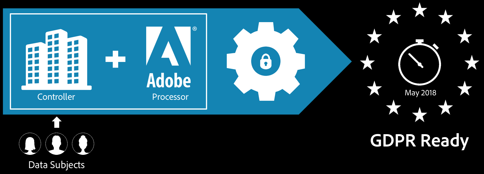

# Adobe Analytics en GDPR

In dit document wordt beschreven wat u in Adobe Analytics moet doen om de GDPR-toegangs- en verwijderingsrechten van uw geregistreerde personen te ondersteunen.

## Overzicht van Adobe {#section_E582A1D77583410EBB790BB646854A2C}

>[!IMPORTANT]
>
>De inhoud van dit document is geen juridisch advies en is niet bedoeld ter vervanging van juridisch advies. Raadpleeg de juridische afdeling van uw bedrijf voor advies over GDPR.

Op 25 mei 2018 is Algemene verordening gegevensbescherming (AVG, of GDPR: General Data Protection Regulation) van de Europese Unie in werking getreden. Raadpleeg [GDPR en uw bedrijf](https://www.adobe.com/nl/privacy/general-data-protection-regulation.html) voor meer informatie over de reactie van Adobe en wat dit voor u als Adobe-klant betekent.

Wanneer Adobe software en services levert aan een onderneming, fungeert Adobe als dataverwerker voor alle persoonlijke data namens onze klanten worden ontvangen en opgeslagen, als onderdeel van de levering van de services. Als dataverwerker verzamelt Adobe persoonlijke data overeenkomstig de toestemming en instructies van uw bedrijf (zoals bijvoorbeeld vermeld in uw overeenkomst met Adobe).

Als datacontroller bepaalt u welke persoonlijke data Adobe namens u verwerkt en opslaat. Als u Adobe Experience Cloud-oplossingen gebruikt, kan het zijn dat Adobe persoonlijke data voor u host, afhankelijk van de oplossingen die u gebruikt en de gegevens die u wilt verzenden naar uw Adobe Experience Cloud-account. Zie [Adobe Experience Cloud-privacy](https://www.adobe.com/privacy/marketing-cloud.html#collect) voor een lijst met voorbeelden.

## Hoe Adobe omgaat met GDPR-data {#section_A20BCC08A80B410D97601BFB1CAF83F1}

Het Adobe Cloud Platform (ACP) biedt een geïntegreerde oplossing waarmee de infrastructuur van de data-governance van uw merk wordt gekoppeld aan de Adobe-tools die worden gebruikt om klantervaringen te maken en te beheren. Met de functies voor data-governance van het Adobe Cloud Platform kunt u een rechtstreekse koppeling maken tussen het data-governancebeleid en het datagebruik.

Maak u vertrouwd met [Hoe Adobe Analytics omgaat met GDPR](https://www.adobe.com/data-analytics-cloud/analytics/general-data-protection-regulation.html), waarin de stappen voor GDPR-gereedheid en de integratie met de Adobe Experience Cloud GDPR-API worden besproken.

## GDPR-gereedheid en uw Adobe Analytics-data {#section_9A47CDCD614C42238F6E05CFF0180195}

Adobe beseft dat u zelf de aangepaste data in uw rapportensuites het best kent, en we bieden u de mogelijkheid om de instellingen en voorkeuren voor uw data-governance te definiëren.

Met het oog hierop biedt Adobe Analytics een Data Governance-gebruikersinterface waarmee u, als datacontroller, [privacylabels](/help/admin/admin/c-data-governance/data-labeling/gdpr-labels.md#data-governance-labels) kunt instellen op uw Analytics-rapportsites, en alle dimensies en cijfers in deze rapportsuites. U kunt in uw dataset de kolommen identificeren die direct of indirect identificeerbare data bevatten, zodat u uw toegang kunt verzenden en aanvragen kunt verwijderen om die data te bekijken. Voor elke aanvraag worden de labels die zijn gedefinieerd in de Analytics Data Governance-gebruikersinterface, gehonoreerd voor de specifieke id die overeenkomt met deze aanvraag.

Zie [Rapportsuitedata labelen](/help/admin/admin/c-data-governance/data-labeling/gdpr-setup-reportsuite.md) voor meer informatie over het instellen van de labels.

## Vereisten {#section_3C766371CE0641C0821FE8E750E5AE0C}

* Maak u vertrouwd met [GDPR-terminologie.](/help/admin/c-data-governance/gdpr-terminology.md)
* Koppel uw aanmeldingsbedrijf aan een Experience Cloud-organisatie, als dat nog niet het geval is. Neem contact op met de klantenservice van Adobe en raadpleeg [Organisaties en accountkoppelingen.](https://experienceleague.adobe.com/docs/core-services/interface/manage-users-and-products/organizations.html)
* Stel voor elke rapportsuite een dataretentiebeleid in, zodat GDPR-verwijderings- en toegangsaanvragen kunnen worden gehonoreerd.

   >[!NOTE]
   >
   >Adobe Analytics kan u niet helpen bij het verwerken van aanvragen bij de GDPR-API, dat wil zeggen, het verwerken van toegangs- of verwijderingsaanvragen die u van uw eindgebruikers ontvangt, als de dataretentieperiode niet is ingesteld in Adobe Analytics. Neem contact op met uw Adobe-accountteam om de periode voor het bewaren van gegevens in te stellen.

* Controleer uw toestemmingen: als u de Data Governance-beheerinterface van Adobe Analytics wilt gebruiken, moet u een Adobe Analytics-beheerder zijn.

