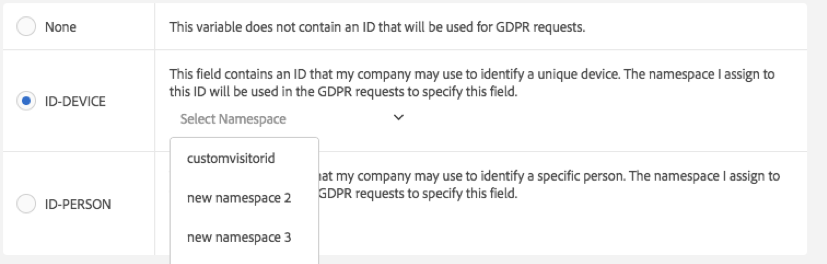

# Data Privacy-labels voor Analytics-variabelen

## Waarom labels toewijzen aan uw gegevens? {#why-label}

De klanten van de Adobe, als gegevensverwerkingsverantwoordelijken, zijn verantwoordelijk voor het naleven van de toepasselijke wetten van de Privacy van Gegevens zoals GDPR en CCPA. Klanten dienen hun eigen juridische teams te raadplegen om te bepalen hoe hun gegevens moeten worden verwerkt om te voldoen aan de privacywetten voor gegevens. Adobe begrijpt dat elk van haar klanten unieke behoeften heeft met betrekking tot privacy. Daarom stelt Adobe haar klanten in staat om hun gewenste instellingen aan te passen voor gegevensverwerking in verband met privacy van gegevens. Hierdoor kan elke afzonderlijke klant Data Privacy-aanvragen verwerken op de manier door voor het merk en de unieke dataset van deze klant het meest zinnig is.

Adobe Analytics biedt tools voor het labelen van data op basis van de gevoeligheid en contractuele beperkingen ervan. Labels zijn een belangrijke stap voor: (1) identificatie van betrokkenen, (2) bepaling van welke gegevens als onderdeel van een toegangsverzoek moeten worden geretourneerd, en (3) identificatie van gegevensvelden die als onderdeel van een verwijderingsverzoek moeten worden verwijderd.

Voordat u kunt achterhalen welke labels op welke variabelen/velden moeten worden toegepast, moet u [de id&#39;s begrijpen](/help/admin/admin/c-data-governance/data-labeling/gdpr-analytics-ids.md) die u in de Analytics-data vastlegt, en beslissen welke u gebruikt voor Data Privacy-aanvragen.

De implementatie van Adobe Analytics Data Privacy ondersteunt de volgende labels voor identiteitsdata, gevoelige data en data-governance.

## Identiteitsgegevenslabels {#identity-data-labels}

“I”-labels voor identiteitsdata worden gebruikt om data te categoriseren waarmee een specifieke persoon kan worden geïdentificeerd of gecontacteerd.

| Label | Definitie | Overige vereisten |
| --- | --- | --- |
| I1 | Direct identificeerbaar: gegevens die rechtstreeks contact met een individu kunnen identificeren of inschakelen, zoals een naam of een e-mailadres. | <ul><li>Kan niet worden ingesteld voor gebeurtenissen</li><li>Kan niet worden ingesteld voor merchandising-eVars</li></ul> |
| I2 | Indirect identificeerbaar: gegevens die in combinatie met andere gegevens kunnen worden gebruikt om direct contact met een individu of apparaat te identificeren of mogelijk te maken.  Met zulke data kan een individu op zichzelf niet worden geïdentificeerd, maar ze kunnen wel worden gecombineerd met andere informatie (die al dan niet in uw bezit is) om iemand te identificeren. Voorbeelden zijn een klantloyaliteitsnummer of een id die door het CRM-systeem van een bedrijf wordt gebruikt en die voor elke klant uniek is. | <ul><li>Kan niet worden ingesteld voor gebeurtenissen</li><li>Kan niet worden ingesteld voor merchandising-eVars</li></ul> |

{style="table-layout:auto"}

## Gevoelige gegevenslabels {#sensitive-data-labels}

“S”-labels voor gevoelige data worden gebruikt om gevoelige data zoals geografische data te categoriseren. In de toekomst zullen extra labels voor gevoelige data worden geïntroduceerd om andere soorten gevoelige informatie te identificeren.

| Label | Definitie |
| --- | --- |
| S1 | Nauwkeurige geolocatiedata van breedte- en lengtegraden die kunnen worden gebruikt om de exacte locatie van een apparaat te bepalen (binnen 100 meter of minder). |
| S2 | Geolocatiedata die kunnen worden gebruikt om een breed gedefinieerd geo-fencegebied te bepalen. |

{style="table-layout:auto"}

## Labels voor gegevensbeheer (Data Privacy) {#data-governance-labels}

Met labels voor gegevensbeheer kunnen gebruikers gegevens classificeren die privacygerelateerde overwegingen en contractuele voorwaarden weerspiegelen, zodat de klanten van de Adobe aan de voorschriften en het bedrijfsbeleid kunnen blijven voldoen.

### Toegangslabels voor gegevenPrivacy

| Label | Definitie | Overige vereisten |
| --- | --- | --- |
| Geen | Selecteer deze optie als deze variabele geen gegevens bevat die moeten worden opgenomen in gegevens die als onderdeel van een verzoek om toegang tot gegevensprivacy aan de betrokkene worden geretourneerd. | |
| ACC-ALL | Waarden in dit veld moeten worden opgenomen in alle verzoeken om toegang tot gegevensprivacy. Als deze treffer afkomstig is van een apparaat dat door meerdere personen wordt gedeeld, geeft u als datacontroller door de toepassing van dit label aan dat het acceptabel is om de data in dit veld te delen met ieder individu dat toegang heeft tot het gedeelde apparaat. | Velden met dit label worden geretourneerd voor alle Data Privacy-aanvragen. |
| ACC-PERSON | Waarden in dit veld moeten alleen worden opgenomen voor verzoeken om toegang tot gegevensprivacy als u er redelijk zeker van bent dat de treffer afkomstig is van de betrokkene, zoals bepaald door een aanvraag-id voor gegevensprivacy die overeenkomt met de waarde van een ID-PERSON-veld. | Er moet ook een ID-PERSON-label zijn ingesteld op een variabele in deze rapportsuite, en aanvragen verzenden met gebruikmaking van deze id verzenden, anders is dit label nooit van toepassing. |

{style="table-layout:auto"}

Weinig variabelen zullen een van de andere labels krijgen, maar de verwachting is dat de toegangslabels op veel van uw variabelen zullen worden toegepast. Het is echter aan u, in overleg met uw Juridische team, om te beslissen welke gegevens u hebt verzameld, met de Onderwerpen van Gegevens moeten worden gedeeld.

### Gegevensprivacy labels verwijderen

In tegenstelling tot de andere labels sluiten deze verwijderingslabels elkaar niet uit. U kunt een van beide, beide of geen van beide selecteren. Een afzonderlijk [!UICONTROL None] label is niet nodig, omdat [!UICONTROL None] wordt aangegeven door een van de verwijderopties niet te controleren.

Een label Verwijderen is alleen vereist voor velden die een waarde bevatten waarmee een treffer aan het gegevensonderwerp kan worden gekoppeld (zodat het gegevensonderwerp kan worden geïdentificeerd). Overige persoonlijke gegevens (favorieten, browsergeschiedenis/aankoopgeschiedenis, gezondheidstoestand, enz.) hoeft niet te worden verwijderd omdat de koppeling met de betrokkene wordt verbroken.

| Label | Definitie | Overige vereisten |
| --- | --- | --- |
| DEL-DEVICE | Voor verzoeken om gegevensprivacy te verwijderen, mogen waarden in dit veld alleen geanonimiseerd worden voor aanvragen waarbij een opgegeven ID-DEVICE aanwezig is in de hit.  Als dezelfde waarde voorkomt bij andere resultaten die niet worden verwijderd, worden die andere instanties niet gewijzigd. Daardoor zullen de tellingen wijzigen voor rapporten die unieke tellingen met dit veld berekenen. Op gedeelde apparaten, kan dit herkenningstekens voor andere individuen, voorbij enkel het Onderwerp van Gegevens verwijderen.  Tellingen veranderen niet als dit veld ook een ID-DEVICE-label heeft en de waarde in dit veld is gebruikt als een id voor de Data Privacy-aanvraag. | <ul><li>Vereist ook label I1 of I2 of S1</li><li>Kan niet worden ingesteld voor gebeurtenissen</li><li>Kan niet worden ingesteld voor merchandising-eVars</li></li><li>Kan worden ingesteld voor classificaties</li><li>U moet aanvragen verzenden met gebruikmaking van een ID-DEVICE of expandID&#39;s instellen op true, anders is dit label nooit van toepassing.</li></ul> |
| DEL-PERSON | Voor verzoeken om gegevensprivacy te verwijderen, mogen waarden in dit veld alleen geanonimiseerd worden voor aanvragen waarbij een opgegeven ID-PERSON aanwezig is in de treffer.  Als dezelfde waarde voorkomt bij andere resultaten die niet worden verwijderd, worden die andere waarden niet gewijzigd. Dit zal in de tellingen resulteren die voor rapporten veranderen die unieke tellingen op dit gebied berekenen. Tellingen veranderen niet als dit veld ook een ID-PERSON-label heeft en de waarde in dit veld is gebruikt als een id voor de Data Privacy-aanvraag. | <ul><li>Vereist ook label I1 of I2 of S1</li><li>Kan niet worden ingesteld voor gebeurtenissen</li><li>Kan niet worden ingesteld voor merchandising-eVars</li></li><li>Kan worden ingesteld voor classificaties</li><li>U moet verzoeken indienen gebruikend een ID-PERSON etiket dat op één of andere variabele binnen deze rapportreeks wordt geplaatst en verzoeken indient gebruikend die identiteitskaart, anders zal dit etiket nooit van toepassing zijn.</li></ul> |

{style="table-layout:auto"}

### Identiteitslabels gegevensprivacy

| Label | Definitie | Overige vereisten |
| --- | --- | --- |
| Geen | Deze variabele bevat geen id die wordt gebruikt voor Data Privacy-aanvragen. | U hoeft alleen een van deze andere labels in te stellen als dit veld een id bevat die u gebruikt bij het verzenden van toegangs- of verwijderingsverzoeken via het dialoogvenster [Privacy Service-API](https://experienceleague.adobe.com/docs/experience-platform/privacy/api/overview.html) of UI. |
| ID-DEVICE | Dit veld bevat een id die kan worden gebruikt om een apparaat te identificeren voor een privacyaanvraag voor gegevens, maar die geen onderscheid kan maken tussen verschillende gebruikers van een gedeeld apparaat.  U hoeft dit label niet te specificeren voor alle variabelen die id&#39;s bevatten (daar zijn de I1/I2-labels voor). Gebruik dit label als u Data Privacy-aanvragen verzendt met id&#39;s die in deze variabele zijn opgeslagen, en u deze variabele wilt doorzoeken naar de opgegeven id. | Vereist ook I1 of I2 etiket.<ul><li>Kan niet worden ingesteld voor gebeurtenissen</li><li>Kan niet worden ingesteld voor merchandising-eVars</li><li>Kan worden ingesteld voor classificaties</li></ul> |
| ID-PERSON | Dit veld bevat een id die kan worden gebruikt om een geverifieerde gebruiker (een specifieke persoon) te identificeren voor een privacyverzoek.  U hoeft dit label niet te specificeren voor alle variabelen die id&#39;s bevatten (daar zijn de I1/I2-labels voor). Gebruik dit label als u Data Privacy-aanvragen gaat verzenden met id&#39;s die in deze variabele zijn opgeslagen, en u deze variabele wilt doorzoeken naar de opgegeven id. | <ul><li>Vereist ook I1 of I2 etiket.</li><li>Kan niet worden ingesteld voor gebeurtenissen</li><li>Kan niet worden ingesteld voor merchandising-eVars</li><li>Kan worden ingesteld voor classificaties</li></ul> |

{style="table-layout:auto"}

## Geef een naamruimte op wanneer u een variabele labelt als ID-DEVICE of ID-PERSON {#provide-namespace}

Wanneer u een variabele als ID-DEVICE of ID-PERSON labelt, wordt u gevraagd om een naamruimte op te geven. U kunt een eerder gedefinieerde naamruimte gebruiken of een nieuwe naamruimte definiëren.

### Een eerder gedefinieerde naamruimte gebruiken

Als u eerder een id-label hebt toegewezen aan andere variabelen in een van de rapportsuites in uw aanmeldingsbedrijf, kunt u één van deze bestaande naamruimten selecteren. U moet de naamruimte opnieuw gebruiken als deze variabele hetzelfde soort id&#39;s bevat als andere variabelen die al zijn gelabeld met deze naamruimte, en als u alle variabelen wilt doorzoeken bij het verzenden van een aanvraag.

1. Klik op **[!UICONTROL Select Namespace]** en selecteer een van de bestaande naamruimten.
   
1. Klik op **[!UICONTROL Apply]**.


### Een nieuwe naamruimte definiëren

U kunt ook een nieuwe naamruimte definiëren. We raden u aan naamruimtetekenreeksen te beperken tot alfanumerieke tekens, plus onderstrepingstekens, streepjes en spaties. Deze worden geconverteerd naar kleine letters.

1. Klik op **[!UICONTROL Select Namespace]** en typ de naamruimtetitel.

   

1. Druk op **[!UICONTROL Enter]** om deze naamruimte toe te voegen. Nu wordt de knop Toepassen pas geactiveerd.
1. Klik op **[!UICONTROL Apply]**.

De tekenreeks die u opgeeft als naamruimte, is dezelfde tekenreeks die u moet gebruiken bij het verzenden van aanvragen via de Data Privacy-API als de waarde van de parameter “namespace”. Het verzoek veroorzaakt dan Adobe Analytics om alle variabelen in al uw rapportreeksen te zoeken die dit namespace voor identiteitskaart delen u met het verzoek specificeerde.

U hoeft de labels ID-DEVICE of ID-PERSON niet te specificeren op alle variabelen die id&#39;s bevatten (daar zijn de I1/I2-labels voor). Gebruik dit label als u Data Privacy-aanvragen gaat verzenden met id&#39;s die in deze variabele zijn opgeslagen, en u deze variabele wilt doorzoeken naar de opgegeven id. Bijvoorbeeld: als eVar1 een e-mailadres kan bevatten, en eVar2 een gebruikersaanmeldingsnaam kan bevatten, maar u altijd alleen aanvragen gaat verzenden met gebruikmaking van de gebruikersnaam, dan kunt u eVar1 labelen als I1, ACC-PERSON, DEL-PERSON, maar eVar2 als I2, ACC-PERSON, DEL-PERSON, ID-PERSON met de naamruimte “user name”. Vervolgens kunt u een aanvraag verzenden met een JSON-blok als gebruikerssectie, zoals:

```
{
     "namespace": "user name",
     "type": "analytics",
     "value": "rocketman123"
}
```

Het is aanvaardbaar om dezelfde naamruimte te gebruiken voor verschillende variabelen binnen dezelfde rapportsuite. Zo slaan sommige aangepaste implementaties een CRM-ID op in zowel een prop als een eVar. Als CRM-ID altijd in één van hen (zoals de eVar) voorkomt, en slechts af en toe in andere (de herinnering) voorkomt, en nooit in prop wanneer niet ook in de eVar, dan vereist slechts de eVar een etiket van identiteitskaart en een namespace omdat de Adobe slechts in die eVar voor identiteitskaart kan zoeken. Als de CRM-ID echter soms voorkomt in de ene variabele en soms in de andere, moeten beide dezelfde naamruimte hebben en zal Adobe beide variabelen doorzoeken op instanties van de id die is opgegeven als onderdeel van een Data Privacy-aanvraag met deze naamruimte. U hebt nog steeds een DEL-label nodig op al deze variabelen, zodat de waarde anoniem blijft, ongeacht waar deze voorkomt.

Een ander voorbeeld: u hebt misschien een CRM-id die soms wordt ingezonden via eVar1 en soms via prop7. Vervolgens hebt u een verwerkingsregel die de waarde van eVar1, indien aanwezig, naar eVar3 kopieert. Anders, kopieert het de waarde van prop7 in eVar3. In dit scenario bevat eVar3 altijd de CRM-id als deze bekend is, zodat alleen eVar3 een ID-PERSON-label nodig heeft.

>[!CAUTION]
>
>De naamruimten &quot;bezoekerId&quot; en &quot;customVisitorId&quot; zijn gereserveerd voor het identificeren van het verouderde cookie voor bijhouden van analysemogelijkheden en de bezoeker-id van de Analytics-klant. Gebruik deze naamruimten niet voor variabelen voor aangepaste traffic of conversie.

## Typen variabelen en de labels voor gegevensprivacy die ze ondersteunen {#variable-types}

De etiketten van de Privacy van gegevens beïnvloeden vier brede klassen van variabelen van de Analyse. Niet alle variabelen ondersteunen alle labels. In deze tabel wordt aangegeven met welke variabelen de labels worden ondersteund of niet.

| Type variabele | Ondersteunde labels | Niet-ondersteunde labels |
|--- |--- |--- |
| <ul><li>Aangepaste succesgebeurtenissen</li><li>Merchandising-eVars</li><li>Variabelen met meer waarden (mvVars)</li><li>Hiërarchievariabelen</li></ul> | <ul><li>S1/S2</li><li>ACC-ALL, ACC-PERSON</li></ul> | <ul><li>I1/I2</li>  <li>ID-DEVICE, ID-PERSON</li><li>DEL-DEVICE, DEL-PERSON</li></ul> |
| Classificaties | <ul><li>I1/I2, S1/S2</li><li>ACC-ALL, ACC-PERSON</li></ul> | <ul><li>ID-DEVICE, ID-PERSON</li><li>DEL-DEVICE, DEL-PERSON</li></ul> |
| <ul><li>Traffic variables (props)</li><li>Commerce-variabelen (non-merchandising-eVars)</li></ul> | Alle labels | - |
| De meeste andere variabelen (*Zie onderstaande tabel voor uitzonderingen*) | ACC-ALL, ACC-PERSON | <ul><li>I1/I2, S1/S2</li><li>ID-DEVICE, ID-PERSON</li><li>DEL-APPARAAT, DEL-PERSON)</li></ul> |

{style="table-layout:auto"}

## Variabelen waaraan andere labels dan ACC-ALL/ACC-PERSON kunnen worden toegewezen/gewijzigd {#variables}

<table id="table_0972910DB2D7473588F23EA47988381D"> 
 <thead> 
  <tr> 
   <th colname="col1" class="entry"> Groep </th> 
   <th colname="col2" class="entry"> Variabelen </th> 
   <th colname="col3" class="entry"> Aanpasbare labels </th> 
   <th colname="col4" class="entry"> Opmerking </th> 
  </tr>
 </thead>
 <tbody> 
  <tr> 
   <td colname="col1" morerows="1"> 
    <ul id="ul_62FA1BAA3B9245909509566D8C03F900"> 
     <li id="li_38F7C4E18ECB42C292370713F502B8EB">Conversiedimensies </li> 
     <li id="li_41CB61F927CB4402AAB4A62E219CD153">Aangepaste traffic-dimensies </li> 
    </ul> </td> 
   <td colname="col2"> <p>Alle, behalve classificaties </p> </td> 
   <td colname="col3"> <p>Alle </p> </td> 
   <td colname="col4"> </td> 
  </tr>
  <tr> 
   <td colname="col1"> <p>verkeersvariabelen </p> </td> 
   <td colname="col2"> <p>Props weergeven </p> </td> 
   <td colname="col3"> <p>Geen/S1/S2 </p> </td> 
   <td colname="col4"> <p>Keuzerondjes kunnen meerdere waarden bevatten en zijn niet toegestaan als privacy-id's.</p> </td> 
  </tr> 
  <tr> 
   <td colname="col2"> <p>Classificaties </p> </td> 
   <td colname="col3"> <p>Geen/I1/I2 </p> <p>Geen/S1/S2 </p> </td> 
   <td colname="col4"> </td> 
  </tr> 
  <tr> 
   <td colname="col1"> <p>Conversiegebeurtenissen </p> </td> 
   <td colname="col2"> <p>Alle </p> </td> 
   <td colname="col3"> <p>Geen/S1/S2 </p> </td> 
   <td colname="col4"> </td> 
  </tr> 
  <tr> 
   <td colname="col1"> <p>Dimensies en gebeurtenissen van oplossingen </p> </td> 
   <td colname="col2"> <p>Activity Map-koppeling, </p> <p>Activity Map-pagina </p> </td> 
   <td colname="col3"> <p>Geen/I1/I2 </p> <p>Geen/DEL-DEVICE/DEL-PERSON </p> </td> 
   <td colname="col4"> <p>Variabelen kunnen URL-parameters bevatten, die direct of indirect identificeerbare data kunnen bevatten. Als uw implementatie direct of indirect identificeerbare gegevens in deze variabelen niet verzamelt, hebben ze geen id- of verwijderingslabels nodig. </p> <p>Als u de URL-parameters verwijdert, blijft de basis-URL behouden. </p> </td> 
  </tr> 
  <tr> 
   <td colname="col1"> <p>Dataverwerkingsdimensies </p> </td> 
   <td colname="col2"> <p>Aangepaste bezoekers-id </p> </td> 
   <td colname="col3"> <p>ID-DEVICE/ID-PERSON </p> <p>DEL-DEVICE/DEL-PERSON </p> </td> 
   <td colname="col4"> <p>U kunt de labels ID of DEL niet verwijderen (ingesteld op Geen), maar u kunt ze wijzigen in de varianten DEVICE of PERSON, afhankelijk van uw aangepaste id-implementatie. </p> <p>Als u de aangepaste bezoeker-id niet gebruikt, is deze instelling niet van belang. </p> </td> 
  </tr> 
  <tr> 
   <td colname="col1" morerows="1"> 
    <ul id="ul_5EB0193732D44A20AEA08CE9DFE01DBD"> 
     <li id="li_F70D969F83314A94BD8567449968EE2F">Standaarddimensies </li> 
     <li id="li_6046764B19FF4679B51E55671C2C0ADB">Dataverwerkingsdimensies </li> 
    </ul> </td> 
   <td colname="col2"> <p>IP-adres </p> <p>IP-adres 2 </p> </td> 
   <td colname="col3"> <p>DEL-DEVICE/DEL-PERSON </p> </td> 
   <td colname="col4"> <p>U kunt het label DEL niet verwijderen, maar u kunt het wijzigen in DEL-DEVICE, DEL-PERSON of beide. </p> </td> 
  </tr> 
  <tr> 
   <td colname="col2"> <p>ClickMap-actie (verouderd), </p> <p>ClickMap-context (verouderd), </p> <p>Pagina, </p> <p>Pagina-URL, </p> <p>URL van oorspronkelijke hoofdpagina, </p> <p>Referrer, </p> <p>URL-startpagina bezoeken </p> </td> 
   <td colname="col3"> <p>Geen/I1/I2 </p> <p>Geen/DEL-DEVICE/DEL-PERSON </p> </td> 
   <td colname="col4"> <p>Variabelen kunnen URL-parameters bevatten, die direct of indirect identificeerbare data kunnen bevatten. Als uw implementatie direct of indirect identificeerbare gegevens in deze variabelen niet verzamelt, hebben ze geen id- of verwijderingslabels nodig. </p> <p>Als u de URL-parameters verwijdert, blijft de basis-URL behouden. </p> </td> 
  </tr> 
 </tbody> 
</table>

## Verwijderverwerking {#deletion}

De ondersteuning van Adobe Analytics voor Data Privacy-verwijderingsaanvragen is ontworpen om de gevolgen voor rapportage zo klein mogelijk te houden. In de meeste gevallen zouden de cijfers die in rapporten worden weergegeven, niet moeten veranderen. Een historisch rapport dat is uitgevoerd vóór de Data Privacy-verwijdering, zou overeen moeten komen met dezelfde rapportrun van na de verwijdering. Dit wordt bereikt door de verwijderde gegevens volledig los te koppelen van de betrokkene, terwijl niet-identificeerbare gegevens op hun plaats blijven zodat de gerapporteerde waarden consistent blijven.

In de volgende tabel wordt beschreven hoe verschillende variabelen worden “verwijderd”. Dit is geen volledige lijst.

| Variabelen | Verwijderingsmethode |
| --- | --- |
| <ul><li>Verkeersvariabelen (profielen)</li><li>Commerce-variabelen (eVars)</li></ul> | Bestaande waarde wordt vervangen door een nieuwe waarde in de vorm &quot;Data Privacy-356396D55C4F9C7AB3FBB2F2FA223482&quot;, waarbij de hexadecimale waarde van 32 cijfers na het voorvoegsel &quot;Data Privacy-&quot; een cryptografisch sterk 128-bits pseudorandom getal is.<p>Omdat het in wezen door een willekeurig koord wordt vervangen, is er geen manier om de originele waarde van deze nieuwe waarde te bepalen, en geen manier om de nieuwe waarde af te leiden wetend de originele waarde.  Als voor een bepaalde variabele de identieke waarde als de vervangen waarde optreedt in andere treffers die eveneens worden verwijderd als deel van dezelfde Data Privacy-aanvraag, worden alle instanties van deze waarde vervangen door dezelfde nieuwe waarde.<p>Als sommige instanties van een waarde worden vervangen door één verwijderingsaanvraag, en een latere aanvraag andere (nieuwe) instanties van de oorspronkelijke waarde verwijdert, is de nieuwe vervangende waarde anders dan de oorspronkelijke vervangende waarde. |
| Aankoop-id | De bestaande waarde wordt vervangen door een nieuwe waarde met de vorm “G-7588FCD8642718EC50”, waarbij de hexadecimale waarde van 18 cijfers na het voorvoegsel “G-” de eerste 18 cijfers zijn van een cryptografisch sterk 128-bits pseudorandomgetal. Alle opmerkingen die gelden voor verwijdering van traffic- en commerce-variabelen, gelden hier ook.<p>De aankoop-id is een transactie-id die als belangrijkste doel heeft ervoor te zorgen dat een aankoop niet tweemaal in rekening wordt gebracht, bijvoorbeeld wanneer iemand de pagina met de aankoopbevestiging vernieuwt. De id zelf kan de aankoop koppelen aan een rij in uw eigen database waarin de aankoop is vastgelegd. In de meeste gevallen is het niet nodig deze id te verwijderen, zodat deze niet standaard wordt verwijderd.<p>Als u de aankoop na de Data Provacy-verwijderingsaanvraag van uw eigen data nog steeds aan een gebruiker kunt koppelen, moet u dit veld mogelijk verwijderen, zodat de Analytics-data voor deze bezoeker niet aan de koper kunnen worden gekoppeld. |
| Bezoekers-id | Waarde is een 128-bits geheel getal en wordt vervangen door een cryptografisch sterke pseudorandomwaarde van 128 bits. |
| <ul><li>MCID</li><li>Aangepaste bezoekers-id</li><li>IP-adres</li><li>IP-adres 2 | Waarde wordt gewist (ingesteld op de lege tekenreeks of op 0, afhankelijk van het type variabele). |
| <ul><li>ClickMap (verouderd)</li><li>Context ClickMap (verouderd)</li><li>Pagina</li><li>Pagina-URL</li><li>URL van oorspronkelijke invoerpagina</li><li>Referenter</li><li>URL-startpagina bezoeken</li></ul> | URL-parameters worden gewist/verwijderd. Als de waarde er niet uitziet als een URL, wordt de waarde gewist (ingesteld op de lege tekenreeks). |
| <ul><li>Breedte</li><li>Lengtegraad</li></ul> | Precisie wordt beperkt tot maximaal 1 km. |

{style="table-layout:auto"}

## Variabelen die de verwachte labels voor verwijderen mogelijk niet ondersteunen {#no-delete-support}

Deze sectie is bedoeld om informatie te verduidelijken over variabelen van de Analyse die schrapping niet kunnen steunen. Soms worden deze variabelen verwijderd door niet-analytische gebruikers (zoals het juridische team) die het type gegevens in de variabele niet begrijpen en veronderstellingen maken op basis van de naam van de variabele.

Het is belangrijk te begrijpen welk type gegevens in elke variabele is opgenomen voordat een beslissing wordt genomen over etikettering of verwijdering, en niet alleen te vertrouwen op de naam van een variabele. Hier volgt een lijst met enkele van deze variabelen en waarom deze mogelijk niet hoeven te worden verwijderd, of waarom hiervoor geen specifiek verwijderingslabel nodig is:

| Variabele | Opmerkingen |
| --- | --- |
| [!UICONTROL New Visitor ID] | De nieuwe Bezoeker-id is een Booleaanse waarde die de eerste keer dat een bepaalde bezoeker-id wordt weergegeven, waar is. Deze hoeft niet te worden verwijderd nadat de bezoekers-id is geanonimiseerd. Na anonimisering komt de waarde overeen met de eerste maal dat we deze geanonimiseerde id hebben gezien. |
| [!UICONTROL Zip Code]<p>[!UICONTROL Geo Zip Code] | Postcodes worden alleen ingesteld voor treffers die afkomstig zijn uit de VS. Ze zijn niet ingesteld voor treffers uit de EU. Zelfs als ze zijn ingesteld, bieden ze slechts een breed geografisch gebied dat het moeilijk maakt om het onderwerp opnieuw te identificeren. |
| [!UICONTROL Geo Latitude]<p>[!UICONTROL Geo Longitude] | Deze bieden een ruime locatie die van het IP-adres wordt afgeleid. De nauwkeurigheid is over het algemeen vergelijkbaar met die van een postcode, binnen tientallen kilometers van de werkelijke locatie. |
| [!UICONTROL User Agent] | De User Agent identificeert de versie van de gebruikte browser. |
| [!UICONTROL User ID] | Specificeert de Analytics-rapportsuite (als getal) die de data bevat. |
| [!UICONTROL Report Suite ID] | Hier geeft u de naam op van de Analytics-rapportsuite die de data bevat. |
| [!UICONTROL Visitor ID]<p>[!UICONTROL MCID] / [!UICONTROL ECID] | Deze id&#39;s hebben een DEL-DEVICE-label, maar het DEL-PERSON-label kan niet worden toegevoegd. Als u [!UICONTROL ID Expansion] bij elke aanvraag worden deze id&#39;s automatisch verwijderd voor alle verwijderingsaanvragen, ook voor aanvragen met een ID-PERSON.<p>Als u geen id-uitbreiding gebruikt, maar deze cookie-id&#39;s wilt anonimiseren bij treffers die een overeenkomende id in een prop of eVar bevatten, kunt u deze labelbeperking omzeilen door de prop of eVar te labelen met een ID-DEVICE-label, zelfs als deze werkelijk een persoon identificeert (alle DEL-PERSON-labels moeten ook worden gewijzigd in DEL-DEVICE-labels). In dit geval zal het aantal unieke bezoekers in de historische rapportage veranderen, omdat slechts enkele exemplaren van de bezoeker-id of de ECID worden geanonimiseerd. |
| [!UICONTROL AMO ID] | De Adobe Advertising Cloud-id is een oplossingsvariabele die niet kan worden gewijzigd [!UICONTROL DEL-DEVICE] label. Deze wordt net als de bezoekers-id en de MCID ingevuld op basis van een cookie. Deze moet uit treffers worden verwijderd wanneer de andere id&#39;s worden verwijderd. Zie de beschrijving van deze variabelen voor meer informatie. |

{style="table-layout:auto"}

## Datumvelden voor verzoeken om toegang {#access-requests}

Er zijn vijf standaardvariabelen die tijdstempels bevatten:

| Tijdstempel | Definitie |
| --- | --- |
| Tijdstip treffer in UTC | Tijdstip waarop Adobe Analytics de treffer heeft ontvangen. |
| Aangepaste tijdstip treffer in UTC | Het tijdstip waarop de treffer plaatsvond, wat voor sommige mobiele apps en andere implementaties eerder kan zijn dan het tijdstip van ontvangst. Als er bijvoorbeeld geen netwerkverbinding beschikbaar was toen de treffer plaatsvond, kan de app de treffer vasthouden en deze verzenden zodra er een verbinding beschikbaar komt. |
| Datum Tijd | Dezelfde waarde als Aangepaste tijdstip treffer in UTC, maar in de tijdzone van de rapportsuite in plaats van GMT. |
| Tijdstip eerste treffer in GMT | De waarde voor Aangepaste tijdstip treffer in UTC voor de eerste treffer die is ontvangen voor de bezoekers-id-waarde voor deze treffer. |
| Begintijdstip bezoek in UTC | De waarde voor Aangepaste tijdstip treffer in UTC voor de eerste treffer die is ontvangen voor het huidige bezoek van deze bezoekers-id. |

{style="table-layout:auto"}

Voor de code voor het genereren van de bestanden die voor Data Privacy-toegangsaanvragen worden geretourneerd, moet minstens één van de eerste drie tijdstempelvariabelen in de toegangsaanvraag zijn opgenomen (een ACC-label hebben dat van toepassing is op het type aanvraag). Als geen van deze zijn opgenomen, wordt Aangepaste tijdstip treffer in UTC worden behandeld alsof het een ACC-ALL-label heeft.

Het CSV-bestand op raakniveau dat wordt geretourneerd voor verzoeken om toegang tot gegevensprivacy converteert de waarden in deze velden van unieke tijdstempels naar datum-/tijdvelden in de indeling `YYYY-MM-DD HH:MM:SS` (bijvoorbeeld `2018-05-01 13:49:22`). In het summiere dossier van de HTML, zullen deze timestamp waarden worden beknot om slechts de datum te omvatten, `YYYY-MM-DD`om het aantal unieke waarden te verminderen dat voor deze velden optreedt.
