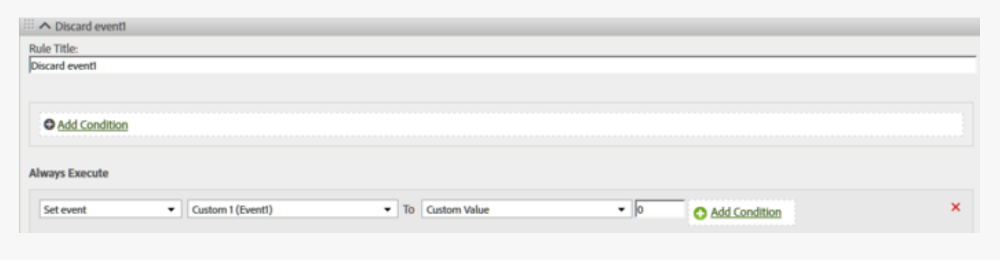

# Een gebeurtenis verwijderen uit een hit

Toont hoe te om een gebeurtenis te verwijderen/te verwerpen uit een klap gebruikend de Regel van de Verwerking, zonder een verandering op de pagina uit te voeren.

## Een gebeurtenis verwijderen uit een hit {#topic_9548385BFE344FC08CA99718A24FC093}

Toont hoe te om een gebeurtenis te verwijderen/te verwerpen uit een klap gebruikend de Regel van de Verwerking, zonder een verandering op de pagina uit te voeren.

Configureer een verwerkingsregel om de gebeurtenis in te stellen op aangepaste waarde = 0, zoals in de onderstaande afbeelding wordt getoond:

