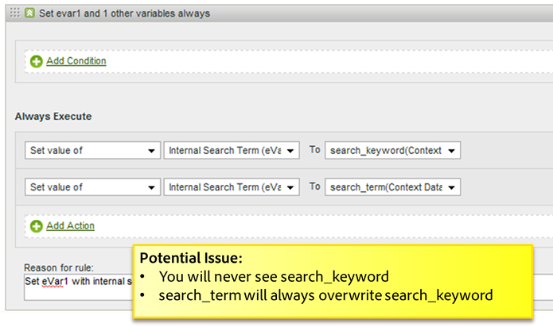

# Tips en trucs voor verwerkingsregels

Deze sectie bevat richtlijnen voor het testen van verwerkingsregels en een lijst met veelvoorkomende fouten die moeten worden vermeden.

## Testverwerkingsregels {#section_F092D2FECDE24082AE9FC6F8BE87F29F}

Deze sectie bevat sommige richtlijnen om testverwerkingsregels te helpen alvorens zij aan productie worden opgesteld.

**Testregels voor het lezen van zoektermen**

Voor om het even welke criteria die op een onderzoek worden gebaseerd, zoals als prop1 &quot;nieuws&quot;bevat, ga naar prop 1 rapport en onderzoek naar &quot;nieuws&quot;en controleer of zijn er om het even welke gelijken u niet verwachtte.

**Testregels voor het lezen van variabelen**

Maak een lege pagina met HTML op uw bureaublad, neem de s_code van uw site op en stel de `s.account` variabele aan een dev- rapportreeks. Als uw regels zijn gebaseerd op referentie, verwijzend domein, etc., neem sommige steekproef URLs van het levende verwijzersrapport, plaats `s.referrer` met een van deze waarden en laad de pagina. Als de regel is gebaseerd op de waarde van de pagina-URL, kunt u ook instellen `s.pageURL`. Dit proces kan voor om het even welke variabelen worden gebruikt.

**Een Dev Report Suite gebruiken**

Wij adviseren vormend verwerkingsregels op een dev- rapportreeks om ervoor te zorgen zij correct werken. Indien mogelijk, adviseren wij het kopiëren van de regels aan een kleine reeks van het productierapport vóór brede plaatsing.

## Controleren op lege waarden {#section_EE84A5525E26415787930723B0CAAE0F}

Wanneer u een regel maakt, moet u rekening houden met het geval wanneer een waarde leeg is. Als u geen voorwaarde toevoegt die op een lege waarde controleert, kunt u per ongeluk variabelen met lege waarden overschrijven.

Het is ook belangrijk om de verwerkingsvolgorde in overweging te nemen. In het volgende voorbeeld wordt weergegeven dat de aangepaste eVar Vorige paginanaam wordt ingesteld op de URL als de paginanaam niet aanwezig is. De URL wordt echter in de paginanaam geplaatst nadat de verwerkingsregels zijn toegepast. In dit geval is de paginanaam dus leeg als deze niet op de pagina is ingesteld.

## Overschrijven van waarden voorkomen {#section_49FCCA31E31A433EA2EF5EAF91443DAF}

In het volgende voorbeeld worden op de site twee variabelen met contextgegevens gebruikt om zoektermen vast te leggen: search_keyword en search_term. Nochtans, gebaseerd op de configuratie, wordt de search_keyword waarde altijd beschreven, zelfs als search_term leeg is.

Deze regel zou moeten worden aangepast om elke variabele van contextgegevens voor een waarde te testen alvorens de Interne Term van het Onderzoek te bevolken, en naar keuze, aaneenschakelend de twee waarden als er een gebruiksgeval voor het houden van hen allebei is.

## Zoektermen coderen naar UTF-8 of Unicode {#section_3BBBE1FB8FEA48589362452DE51DB575}

Zoektermen die u uit een queryreeks hebt opgehaald, moeten correct zijn gecodeerd of worden niet door verwerkingsregels aangepast.

## Begint met, bevat en eindigt met {#section_80CE853244FC435B844A09EA51868D8D}

Selecteer de correcte aanpassingsvoorwaarde om de meest beperkende voorwaarde te vinden die correct aanpast. U kunt naar waarden in een rapport zoeken alvorens een regel te creëren om ervoor te zorgen er geen onbedoelde gelijken zijn. Bijvoorbeeld, zou u het Prop2 rapport moeten zoeken om alle plaatsen te vinden waar deze voorwaarde alvorens deze regel toe te laten aanpast.

