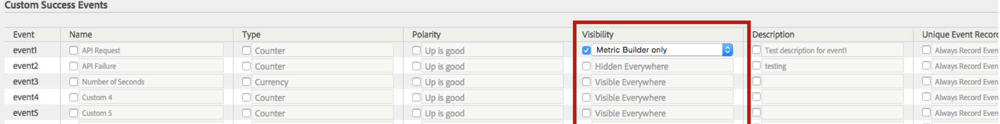

# Succesgebeurtenissen configureren

Stappen die beschrijven hoe te om succesgebeurtenissen te vormen.

1. Klik op **[!UICONTROL Analytics]** > **[!UICONTROL Admin]** > **[!UICONTROL Report Suites]**.
1. Een rapportsuite selecteren.
1. Klik op **[!UICONTROL Edit Settings]** > **[!UICONTROL Conversion]** > **[!UICONTROL Success Events]**.

   

1. Selecteer in de kolom **[!UICONTROL Name]** het selectievakje naast elk item om bewerken in te schakelen en geef vervolgens de gewenste naam op.
1. Selecteer in de kolom **[!UICONTROL Type]** het selectievakje naast elk item om de vervolgkeuzelijst in te schakelen en selecteer vervolgens het gewenste type.

   >[!NOTE]
   >
   >Voordat u een gebeurtenistype wijzigt, raadpleegt u [Gebeurtenistype wijzigen](/help/admin/admin/c-success-events/event-type.md).

   Zie [Pagina Gebeurtenissen met succes - Beschrijvingen](/help/admin/admin/c-success-events/success-event.md) voor informatie over deze elementen.

1. Geef in de kolom **[!UICONTROL Polarity]** op of een opwaartse trend voor deze metrische waarde goed of slecht is.
1. In de **[!UICONTROL Visibility]** kolom, kunt u standaard (ingebouwde) metriek, douanegebeurtenissen, en ingebouwde gebeurtenissen in het Menu, Metrische Kiezers, Berekende Bouwer van Metriek, en de Bouwer van het Segment verbergen.

   Deze instelling heeft geen invloed op de gegevensverzameling voor die metrische waarde of gebeurtenis; het beïnvloedt slechts zijn zichtbaarheid in het gebruikersinterface. [Meer...](/help/admin/admin/metric-visibility.md)
1. Geef een beschrijving op.
1. Controleer of u de gebeurtenis altijd wilt opnemen.
1. Deelnemingsmetriek in- of uitschakelen.

   >[!NOTE]
   >
   >U kunt deelname inschakelen voor maximaal 100 aangepaste gebeurtenissen. Buiten dat, kunt u deelnemingsmetriek in [Berekende Metrics](/help/components/c-calcmetrics/c-workflow/cm-workflow/c-build-metrics/participation-metric.md) bouwer tot stand brengen.

1. Klik op **[!UICONTROL Save]**.
