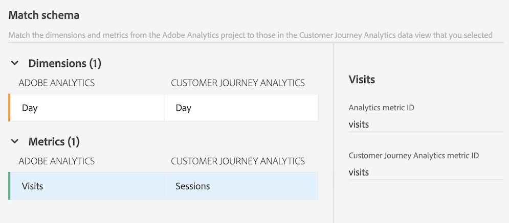

# Componenten en projecten migreren van Adobe Analytics naar Customer Journey Analytics

Adobe Analytics-beheerders kunnen Adobe Analytics-projecten en de bijbehorende onderdelen migreren naar Customer Journey Analytics.

Het migratieproces omvat:

* Adobe Analytics-projecten opnieuw maken in Customer Journey Analytics.

* De dimensies en metriek van de afbeelding van Adobe Analytics melden reeksen aan dimensies en metriek in de mening van de gegevens van de Customer Journey Analytics.

  Sommige dimensies en metriek worden automatisch toegewezen; andere moet u handmatig toewijzen als onderdeel van het migratieproces. Segmenten worden ook gemigreerd, maar hoeven niet in kaart te worden gebracht als onderdeel van het migratieproces.

  Alle gemigreerde componenten worden in het migratiesamenvatting weergegeven wanneer de migratie is voltooid.

>[!NOTE]
>
>De informatie op deze pagina beschrijft hoe te om projecten en hun bijbehorende componenten met het gebruikersinterface te migreren.
>
>U kunt de migratie ook uitvoeren met de API&#39;s. Voor meer informatie, zie [ Adobe Analytics APIs ](https://adobedocs.github.io/analytics-2.0-apis/?urls.primaryName=Analytics%202.0%20APIs). Alle API-definities zijn beschikbaar in de vervolgkeuzelijst **[!UICONTROL Select a definition]** .

## Een migratie voorbereiden

Alvorens u om het even welke projecten aan Customer Journey Analytics migreert, leer meer over het migreren van projecten in [ voorbereidingen om componenten en projecten van Adobe Analytics aan Customer Journey Analytics ](/help/admin/admin/component-migration/prepare-component-migration.md) te migreren.

## Adobe Analytics-projecten migreren naar Customer Journey Analytics

>[!IMPORTANT]
>
>Alvorens u om het even welke projecten aan Customer Journey Analytics migreert zoals die in deze sectie worden beschreven, leer meer over het migreren van projecten in [ voorbereidingen om componenten en projecten van Adobe Analytics aan Customer Journey Analytics ](/help/admin/admin/component-migration/prepare-component-migration.md) te migreren.
>
>**om het even welke afmetingen of metriek die u in kaart brengt zijn permanent, zowel voor dit project als voor alle toekomstige projecten die door uw volledige org worden gemigreerd IMS, ongeacht welke gebruiker de migratie uitvoert. Deze toewijzingen kunnen niet worden gewijzigd of ongedaan gemaakt behalve door de Zorg van de Klant te contacteren.**

1. In Adobe Analytics, selecteer het [!UICONTROL **Admin**] lusje, dan selecteren [!UICONTROL **Alle admin**].

1. Onder [!UICONTROL **configuratie en inzameling van Gegevens**], uitgezochte [!UICONTROL **migratie van de Component**].

1. Zoek het project dat u wilt migreren. U kunt de projectlijst filteren, sorteren of doorzoeken.

   Door gebrek, slechts worden de projecten die met u worden gedeeld getoond. Om alle projecten in uw organisatie te bekijken, selecteer het **pictogram van de Filter**, dan breid [!UICONTROL **Andere filters**] uit en selecteer [!UICONTROL **tonen allen**]. (Voor meer informatie over het filtreren, het sorteren, en het zoeken van de projectlijst, zie [ Filter, soort, en onderzoek de lijst van projecten ](#filter-sort-and-search-the-list-of-projects).)

1. De muis over het project dat u wilt migreren, dan selecteren **pictogram van de Migrate  project migreren.**

   of

   Selecteer het project dat u wilt migreren, dan selecteren [!UICONTROL **migreren aan Customer Journey Analytics**].

   U kunt slechts één project tegelijk selecteren voor migratie.

   [!UICONTROL **Migreer project_name aan Customer Journey Analytics**] dialoogdoos wordt getoond.

   <!-- add screenshot -->

1. Op het [!UICONTROL **bezit van het Project**] gebied, begin typend de naam van de gebruiker die u als eigenaar van het project in Customer Journey Analytics wilt plaatsen, dan hun naam in het drop-down menu selecteren.

   De eigenaar die u specificeert heeft volledige beheersrechten aan het project. De eigenaar moet een beheerder in Customer Journey Analytics zijn. U kunt de eigendom van het project in een latere stap wijzigen.

1. In het [!UICONTROL **schema van de Kaart voor rapportreeksen**] sectie, selecteer een rapportreeks.

1. In het [!UICONTROL **drop-down menu van de mening van Gegevens**], selecteer de de gegevensmening van de Customer Journey Analytics waar u het project en de componenten wilt worden gemigreerd.

1. Selecteer [!UICONTROL **schema van de Kaart**].

1. In het [!UICONTROL **schema van de Kaart**] sectie, breid de [!UICONTROL **Dimensionen**] en [!UICONTROL **Metriek**] secties uit.

   Sommige dimensies en metriek in Adobe Analytics worden automatisch toegewezen aan een dimensie of metrisch in Customer Journey Analytics. Andere moeten handmatig worden toegewezen.

   **kaart automatisch dimensies en metriek**

   >[!NOTE]
   >
   >   Als u WebSDK gebruikte om gegevens in Adobe Experience Platform in te voeren, kunnen de afmetingen en de metriek niet automatisch in kaart worden gebracht. Voor meer informatie, zie [ Eerste vereisten ](/help/admin/admin/component-migration/prepare-component-migration.md#prerequisites) in [ voorbereidingen treffen om componenten en projecten van Adobe Analytics aan Customer Journey Analytics ](/help/admin/admin/component-migration/prepare-component-migration.md) te migreren.

   Sommige dimensies en metriek in Adobe Analytics worden automatisch toegewezen aan een dimensie of metrisch in Customer Journey Analytics. U kunt geen toewijzingsbeslissingen maken voor deze dimensies en metriek.

   Bijvoorbeeld, **viseert** metrisch in Adobe Analytics wordt automatisch in kaart gebracht met **Sessies** metrisch in Customer Journey Analytics.

   U kunt om het even welke afmeting of metrisch selecteren om hun bijbehorende IDs te bekijken.

   <!-- update screenshot after I can see the Status column -->

   

   **kaart manueel dimensies en metriek**

   Sommige dimensies en metriek in Adobe Analytics kunnen niet automatisch worden toegewezen aan een dimensie of metrisch in Customer Journey Analytics.

   Wanneer een afmeting of metrisch niet automatisch in kaart kan worden gebracht, toont een oranje teller naast de [!UICONTROL **Dimensionen**] of [!UICONTROL **Metriek**] sectiekop, die op het aantal dimensies of metriek wijzen die manueel in kaart moeten worden gebracht. In de lijst, toont een waarschuwingspictogram  naast elke afmeting of metrisch die manueel in kaart moet worden gebracht.

   Bovendien zegt de **]kolom van de Status[!UICONTROL ** [!UICONTROL **niet in kaart gebracht**].

   <!-- update screenshot after I can see the Status column -->

   

1. Om dimensies en metriek manueel in kaart te brengen, selecteer een afmeting of metrisch die een waarschuwingspictogram  bevat, dan in het [!UICONTROL **In kaart gebrachte metrische**] gebied van de Customer Journey Analytics (of het [!UICONTROL **In kaart gebrachte afmeting van de Customer Journey Analytics**] als u een afmeting in kaart brengt), selecteer de afmeting of metrisch in Customer Journey Analytics die u aan de afmeting wilt in kaart brengen.

   

   Nadat een afmeting of metrisch in kaart wordt gebracht, verdwijnt het waarschuwingspictogram en de **]kolomveranderingen van de Status[!UICONTROL ** {in kaart gebracht [!UICONTROL ****] met een groene punt. (Een status van [!UICONTROL **In kaart gebrachte**] met een grijze punt wijst erop dat de afmeting of metrisch tijdens een vorige migratie in kaart werd gebracht; om het even welke vorige afbeeldingen kunnen niet worden bijgewerkt.)

   Herhaal dit proces voor elke afmeting of metrisch die het waarschuwingspictogram bevat.

   Nadat alle dimensies en metriek in de het rapportreeks van Adobe Analytics aan een afmeting of metrisch in de reeks van het het rapportrapport van de Customer Journey Analytics in kaart worden gebracht, verschijnt een groen vinkje ](assets/report-suite-check.png) naast de naam van de rapportreeks in het [!UICONTROL **schema van de Kaart voor de sectie van de rapportsuites**].![

1. (Voorwaardelijk) als het project u migreert meer dan één rapportreeks bevat, selecteer een andere rapportreeks in het [!UICONTROL **schema van de Kaart voor rapportreeksen**] sectie, dan herhaal stap 6 door Stap 10. <!-- double-check that the step numbers are still correct -->

1. Selecteer [!UICONTROL **migreren**].

   >[!WARNING]
   >
   >   Een het waarschuwingsbericht toont op scherm nadat u [!UICONTROL **selecteert Migreer**]. Alvorens u verkiest om verder te gaan, begrijp dat om het even welke dimensies of metriek u in kaart brengt, zowel voor dit project als voor alle toekomstige projecten die door uw volledige organisatie worden gemigreerd. Als u doorgaat, kunnen de toewijzingen die u maakt, niet worden gewijzigd.

   Nadat een migratie voltooit, verstrekt de [!UICONTROL **status van de Migratie**] pagina een samenvatting van wat werd gemigreerd.

   Als de migratie ontbreekt, zie [ opnieuw een ontbroken migratie ](#retry-a-failed-migration) sectie hieronder voor meer informatie.

1. (Optioneel) Nadat een project is gemigreerd, kunt u de eigendom van het project overdragen aan elke gebruiker in de Customer Journey Analytics. Voor meer informatie, zie [ activa van de Overdracht ](https://experienceleague.adobe.com/en/docs/analytics-platform/using/tools/asset-transfer/transfer-assets) in de Gids van de Customer Journey Analytics.

## Een mislukte migratie opnieuw proberen

Als een migratie mislukt, kunt u de migratie opnieuw proberen.

Alvorens een ontbroken migratie opnieuw te proberen, zorg ervoor u om het even welke [ niet gestaafde elementen ](https://experienceleague.adobe.com/docs/analytics/admin/admin-tools/component-migration/prepare-component-migration.html#understand-unsupported-elements-that-cause-errors) uit het project verwijdert.

>[!NOTE]
>
>Als de migratie na het opnieuw proberen blijft mislukken, neemt u contact op met de klantenservice met de project-id. U kunt projectidentiteitskaart op de de statuspagina van de Migratie vinden. <!-- when does this page display? How can they get there -->

Een mislukte migratie opnieuw proberen:

1. In Adobe Analytics, selecteer het [!UICONTROL **Admin**] lusje, dan selecteren [!UICONTROL **Alle admin**].

1. Onder [!UICONTROL **configuratie en inzameling van Gegevens**], uitgezochte [!UICONTROL **migratie van de Component**].

1. Selecteer [!UICONTROL **Ontbroken**] in de [!UICONTROL **statuskolom van de Migratie**] naast het project dat u wilt opnieuw proberen.

   

   De [!UICONTROL **statusvertoningen van de Migratie**] pagina.

   Deze pagina toont ook onmiddellijk na de voltooiing van de migratiestappen die in de sectie [ worden beschreven de projecten van Adobe Analytics aan Customer Journey Analytics ](#migrate-adobe-analytics-projects-to-customer-journey-analytics) hierboven migreren.

1. Selecteer [!UICONTROL **opnieuw migratie**].

## De lijst met projecten filteren, sorteren en doorzoeken

U kunt filteren, sorteren, en de lijst van projecten op de de migratiepagina van de Component zoeken.

### De lijst met projecten filteren

U kunt filteren op de volgende criteria:

| Filter | Beschrijving |
|---------|----------|
| [!UICONTROL **Status**] | De status van de migratie: <ul><li>[!UICONTROL **niet begonnen**]</li><li>[!UICONTROL **Begonnen**]</li><li>[!UICONTROL **Voltooid**]</li><li>[!UICONTROL **Ontbroken**]</li></ul>. |
| [!UICONTROL **Markeringen**] | Selecteer tags in de lijst met tags. Alleen projecten waarop de geselecteerde labels zijn toegepast, worden weergegeven. |
| [!UICONTROL **Reeks van het Rapport**] | Selecteer om het even welke rapportreeks in de lijst van rapportreeksen. Slechts worden de projecten die de geselecteerde rapportreeksen gebruiken getoond. |
| [!UICONTROL **Eigenaars**] | Selecteer een eigenaar in de lijst met eigenaars. Alleen projecten die eigendom zijn van de gebruikers die u selecteert, worden weergegeven. |
| [!UICONTROL **Andere filters**] | De volgende aanvullende filters zijn beschikbaar: <ul><li>[!UICONTROL **Mine**]: Toont slechts projecten waar u als eigenaar wordt geplaatst.</li><li>[!UICONTROL **die met me**] wordt gedeeld: Toont slechts projecten die met u zijn gedeeld.</li><li>[!UICONTROL **Favorieten**]: Toont slechts projecten die als favoriet duidelijk zijn. (U kunt een project als favoriet van het [ project merken landend pagina ](/help/analyze/landing.md).)</li><li>[!UICONTROL **Maandelijks**]</li><li>[!UICONTROL **jaarlijks**]</li></ul> |

{style="table-layout:auto"}

### De lijst met projecten sorteren

U kunt de lijst met projecten op om het even welke kolom sorteren.

De lijst met projecten sorteren:

1. Selecteer de kolomkop van de kolom waarop u wilt sorteren.

1. (Optioneel) Selecteer nogmaals dezelfde kolomkop om de sorteervolgorde om te keren.

### Een project zoeken

U kunt de lijst van projecten op de de migratiepagina van de Component zoeken om het project te vinden dat u wilt migreren.

1. In het onderzoeksgebied bij de bovenkant van de de migratiepagina van de Component, begin de naam van het project te typen dat u wilt migreren.

1. Selecteer het project wanneer het in het drop-down menu verschijnt.

<!-- is there going to be a way to customize the columns that are displayed? -->
