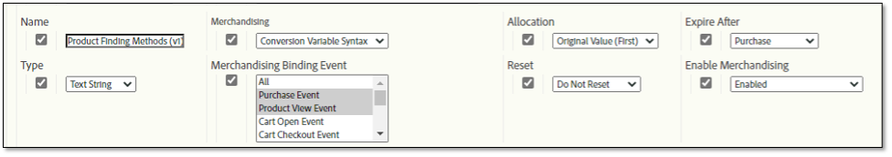
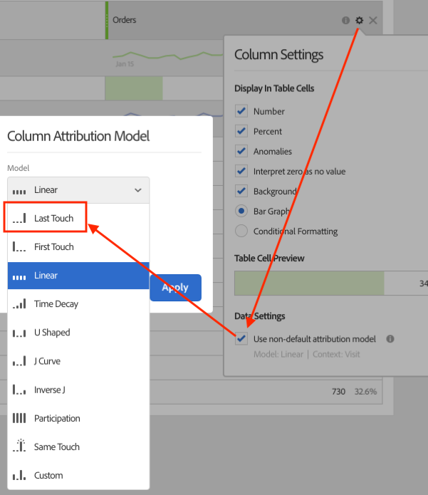

# Verkoop- en productzoekmethoden

In dit zeer gedetailleerde document worden de concepten achter het verhandelen van eVars uitgelegd, die gegevens anders verwerken en toewijzen dan standaard eVars. Het legt ook uit hoe merchandising eVars verband houdt met productzoekmethoden.

## Overzicht

Door het gebruik van merchandising kunt u elke succesvolle activiteit toewijzen aan de waarden die door de eVars op een *per product* niveau in plaats van een *per bezoek/per bestelling* niveau.

Hoewel de meeste websites voor de detailhandel veel manieren hebben om producten te vinden, beschouwt Adobe het volgende als de fundamentele methoden om producten te vinden die elke retailklant in Adobe Analytics moet volgen:

* Trefwoorden voor intern zoeken
* Interne codes voor bijhouden van campagnes
* Categorieën voor wijzigen/bladeren
* Crossselling links

In het kader van dit document, laten wij een paar eVars aan de oplossingen als volgt in kaart brengen:

* eVar2: Trefwoorden voor intern zoeken
* eVar3: Interne codes voor bijhouden van campagnes
* eVar4: Categorieën voor wijzigen/bladeren
* eVar5: Links voor crossverkopen

We kunnen een extra eVar gebruiken om de prestaties van alle productzoekmethoden ten opzichte van elkaar te meten. Naast de hierboven beschreven zoekmethoden bevat de eVar andere zoekmethoden in de vergelijking, zoals koppelingen naar productdetailpagina&#39;s van externe websites.

* eVar1: Methoden voor het zoeken van producten

In plaats van het vormen van om het even welk van deze variabelen om standaard eVars te zijn, vorm hen om handelswaar te zijn Vars.

Hier ziet u een voorbeeld waarin een bezoeker besluit om de interne trefwoordzoekopdracht ‘sandalen’ te gebruiken om een product op de site te zoeken. Zo kunt u zien hoe u deze variabelen instelt. Op de pagina met zoekresultaten met trefwoorden moet u gegevens vastleggen in ten minste twee eVars:

* `eVar2` is gelijk aan het trefwoord dat is gebruikt in de zoekopdracht (&quot;sandalen&quot;)
* `eVar1` is gelijk aan de gebruikte productzoekmethode (&quot;intern trefwoordzoekopdracht&quot;).

Wanneer u deze twee variabelen gelijk instelt aan deze specifieke waarden, weet u dat de bezoeker de interne zoekterm voor trefwoorden &quot;sandalen&quot; gebruikt om een product te zoeken. Tegelijkertijd weet u dat de bezoeker de andere productzoekmethoden niet gebruikt om producten te zoeken (de bezoeker bladert bijvoorbeeld niet door productcategorieën op het moment dat ze een trefwoordzoekopdracht uitvoeren). Om ervoor te zorgen dat een correcte toewijzing per product plaatsvindt, zouden deze ongebruikte methodes geen krediet moeten krijgen voor het vinden van een product dat door een interne sleutelwoordonderzoek werd gevonden. Vandaar, moet u logica in de code (zoals AppMeasurement, het Web SDK van AEP, etc.) opnemen die automatisch eVars verbonden aan deze andere het vinden methodes aan een &quot;het niet vinden methode&quot;waarde plaatst.

Wanneer een gebruiker bijvoorbeeld naar producten zoekt die het trefwoord &quot;sandalen&quot; gebruiken, moet de logica van de Analytics-code de variabelen op de interne pagina met zoekresultaten voor trefwoorden als volgt instellen:

* eVar2=&quot;sandalen&quot;: het trefwoord &quot;sandalen&quot; is gebruikt in de interne zoekopdracht met trefwoorden
* eVar1=&quot;intern sleutelwoordonderzoek&quot;: de zoekmethode &quot;intern zoeken naar trefwoorden&quot; is gebruikt
* eVar3=&quot;niet-interne campagne&quot;: een interne campagne is niet gebruikt om de pagina met zoekresultaten te openen
* eVar4=&quot;niet-browse&quot;: een bladercategorie is niet toegankelijk op de pagina met zoekresultaten
* eVar5=&quot;niet-cross-sell&quot;: Er is niet op een cross-sell-koppeling op de pagina met zoekresultaten geklikt

## Verwisselende eVars-instellingen

Hier zijn de verschillende instellingen die u kunt gebruiken voor uw favoriete eVars. De volgende schermafbeelding is afkomstig uit Report Suite Manager. Ga naar [!UICONTROL Analytics] > [!UICONTROL Admin] > [!UICONTROL Report Suites] > [!UICONTROL Edit Settings] > [!UICONTROL Conversion] > [!UICONTROL Conversion Variables] > [!UICONTROL Add new] > [!UICONTROL Enable Merchandising].



Meer informatie over deze instellingen vindt u in de secties onder de tabel.

| Instelling | Beschrijving |
|--- | --- |
| Naam | De naam, of de rapporteringsdimensie die de variabele moet worden geassocieerd met. Indien `eVar1` is bedoeld om Product het Vinden Methoden, dan het gebied van de Naam voor te vangen `eVar1` moet worden ingesteld op &quot;Product Finding Methods&quot;. |
| Merchandising | Het type syntaxis dat wordt gebruikt om de waarden van de eVar voor handelsdoeleinden vast te leggen |
| Toewijzing | De hulp bepaalt de waarde van de koopvaardigende eVar die krediet zou moeten ontvangen wanneer een succesvolle gebeurtenis plaatsvindt. |
| Verlopen na | Hiermee wordt bepaald wanneer bestaande bindingen van producten en eVar niet langer van kracht moeten zijn. |
| Type | Het type gegevens dat wordt verzameld in de eVar voor handelsdoeleinden |
| Merchandising Binding-gebeurtenis | De gebeurtenis(sen) die bepalen wanneer een product moet worden gebonden aan een waarde van een eVar voor handelsdoeleinden |
| Herstellen | Een trigger die alle back-endgegevens voor de eVar op dat punt opnieuw instelt |
| Merchandising inschakelen | Een vlag die aan &quot;Toegelaten&quot;moet worden geplaatst om de eVar van een standaardeVar in een eVar van de Verkoop te draaien |

### Merchandising inschakelen

Wanneer de instelling &#39;Enable Merchandising&#39; is ingesteld op &#39;Enabled&#39;, worden alle hieronder beschreven instellingen weergegeven in Report Suite Manager. Wanneer de instelling &quot;Verwisselingen inschakelen&quot; is ingesteld op &quot;Uitgeschakeld&quot;, zijn alleen de standaardinstellingen voor eVar beschikbaar.

### Merchandising

Deze optie is niet beschikbaar voor standaard eVars. De [!UICONTROL Merchandising] met deze instelling kunt u kiezen [!UICONTROL Conversion Variable Syntax] of [!UICONTROL Product Syntax] als de methode voor het vastleggen van de waarde van de eVar.

**[!UICONTROL Conversion Variable Syntax]** betekent dat u de waarde van de eVar in een eigen variabele instelt. Met de syntaxis van omzetvariabele kunt u bijvoorbeeld de opdracht `eVar1` De waarde van &quot;intern sleutelwoordonderzoek&quot;wordt geplaatst als volgt binnen de paginacode (of de code AppMeasurement, de code van SDK van het Web AEP, etc.):

`s.eVar1="internal keyword search";`

Met **[!UICONTROL Product Syntax]** De eVar wordt echter alleen binnen de productvariabele Adobe Analytics geplaatst. De variabele Analytics products bestaat uit zes verschillende porties per product:

`s.products="[category];[productID];[quantity];[revenue];[events];[eVars]"`

* [!UICONTROL Category] wordt niet langer aanbevolen als een haalbare optie om de prestaties van de productcategorie bij te houden.  Zijn enkel bestaan toont aan waarom in de meeste implementaties van de productvariabele, één enkele puntkomma het productID gedeelte van de veranderlijke waarde voorafgaat.
* [!UICONTROL Quantity] en [!UICONTROL Revenue] zijn nuttig wanneer een productaankoop wordt gevolgd.
* [!UICONTROL Events] is nuttig voor het opnemen van aangepaste incrementele of valutawaarden die niet als inkomsten hoeven te worden geteld (zoals verzendkosten, kortingen, enz.)

Merchandising eVars die worden gevormd om de Syntaxis van het Product te gebruiken worden geplaatst binnen het definitieve gedeelte van de productvariabele. Stel bijvoorbeeld dat een bezoeker een interne trefwoordzoekopdracht heeft gebruikt om de product-id &quot;12345&quot; te zoeken. De op productsyntaxis gebaseerde manier voor het instellen van eVar1 in dit voorbeeld ziet er als volgt uit:

`s.products=";12345;;;;eVar1=internal keyword search";`

U ziet dat er nog door puntkomma&#39;s gescheiden plaatsaanduidingen zijn voor de hoeveelheid, inkomsten en gebeurtenisgedeelten van de productvariabele.  Zonder deze plaatsaanduidingen `eVar1` het instellen van interne trefwoordzoekopdrachten wordt volledig genegeerd.

### Toewijzing

De term &quot;Toewijzing&quot; voor handelswaar is misleidend, vooral voor handelswaar die Vars gebruikt die de Syntaxis van de Variabele van de Omzetting gebruiken. Alle standaard eVars kunnen hun eigen individuele toewijzingsinstelling hebben. Nochtans, gebruiken de het verhandelen eVars met de Veranderlijke Syntaxis van de Omzetting slechts de &quot;Recentste (Laatste)&quot;toewijzingsinstelling, ongeacht wat de toewijzingsmontages in de Manager van de Reeks van het Rapport tonen.

Begrijpen wat dit het plaatsen betekent begrip van het verschil tussen de toewijzing van de eVar en het eVar binden van de handel. Voor het verhandelen van eVars, is de &quot;Verkoop eVar Binding&quot;een geschiktere naam voor deze &quot;plaats van de Toewijzing&quot;plaatsen.

**Standaardinstelling voor eVar-toewijzing**

Wanneer om het even welke eVar met standaardsyntaxis uit een beeldverzoek wordt verzameld, voegen de de verwerkingsservers van Adobe Analytics gegevens in een andere gegevensbestandkolom in, genoemd `post_evar` kolom. Aangezien eVars blijvend moeten zijn - ze verlopen in de meeste gevallen op een bepaald punt na de huidige hit - stellen de servers deze vervolgens in `post_evar` op elke volgende afbeeldingsaanvraag. Deze wordt ingesteld op de laatste waarde die wordt doorgegeven aan het corresponderende eVar. Voor standaard eVars gebruikt Adobe Analytics de instelling `post_evar` kolom in plaats van de gewone kolom eVar om de waarde te bepalen van de eVar die krediet voor de gebeurtenis zou moeten worden verleend.

Voor standaard eVars bepaalt de toewijzingsinstelling of de eerste of laatste eVar-waarde die gedurende een bepaalde periode is verzameld, wordt ingevoegd in het `post_evar` kolom. Als de Allocation-instelling voor een standaard eVar gelijk is aan &quot;Oorspronkelijke waarde (eerst)&quot;, wordt de eerste eVar die van de bezoeker is verzameld, ingevoegd in het dialoogvenster `post_evar` voor alle volgende afbeeldingsaanvragen. Dit gaat door voor alle toekomstige verzoeken die van browser van deze bezoeker worden verzonden tot de eVar volgens zijn &quot;Verloopt na&quot;het plaatsen verloopt.

Als de toewijzingsinstelling van een standaard eVar gelijk is aan &quot;Recentste (laatste)&quot;, wordt de meest recente eVar die van de bezoeker is opgehaald, in het dialoogvenster `post_evar` voor alle volgende afbeeldingsaanvragen. &quot;Recentste (laatste)&quot; toewijzing houdt in dat de `post_evar` De waarde verandert telkens wanneer de corresponderende eVar wordt ingesteld op een nieuwe waarde in een afbeeldingsaanvraag. De toewijzing &quot;Oorspronkelijke waarde (eerste)&quot; houdt in dat de `post_evar` de kolom verandert niet over klappen alhoewel zijn overeenkomstige eVar aan een verschillende waarde in een toekomstig beeldverzoek zou kunnen worden geplaatst.

**Instelling voor de toewijzing van eVar (binding) wijzigen**

Zoals eerder vermeld, hebben alle handelsversies van eVars met conversievariabele syntaxis alleen de toewijzing &quot;Meest recente (laatste)&quot;. De Allocation-instelling voor het verhandelen van eVars bepaalt dus niet welke waarden in de post_evar-kolom worden ingevoegd omdat een bezoeker de site blijft gebruiken. In plaats daarvan, bepaalt dit het plaatsen welke waarde van eVar aan een product bindt en hoe dergelijke producten hun succesgebeurtenissen terug naar de waarden van de eVar toewijzen zij aan zijn gebonden.

Het volgende gebeurt wanneer de toewijzingsinstelling van een eVar die de transactie aanbrengt (dat wil zeggen binding) gelijk is aan &quot;Oorspronkelijke waarde (eerst)&quot;: Alle producten die naast de kolom post_evar zijn ingesteld en die niet eerder zijn gebonden aan de corresponderende &quot;voorbewerkte&quot; eVar van de kolom post_evar, worden gebonden aan de waarde in de kolom post_evar.  Deze binding tussen eVar en product verandert nooit totdat de eVar verloopt volgens de instelling &quot;Na verlopen&quot; in de rapportsuite-instellingen.

Telkens wanneer een afbeeldingsaanvraag voldoet aan de criteria die een al gebonden product anders zouden binden aan de laatst ingestelde waarde voor eVar, dwingt de instelling &quot;Oorspronkelijke waarde (eerst)&quot; de servers van de Adobe Analytics-gegevensverzameling dergelijke verdere pogingen te negeren. Het tegenovergestelde gebeurt bij het verhandelen van eVars met de instelling Toewijzing (binding) gelijk aan &quot;Recentste (laatste)&quot;. Elke keer dat een afbeeldingsaanvraag voldoet aan de criteria die een product aan een eVar voor handelsdoeleinden binden, bindt het product zichzelf aan de meest recente waarde die in de eVar is doorgegeven, of aan de waarde die (altijd) in de `post_evar` kolom.

Zoals eerder vermeld, staat de handelVars u toe om succesgebeurtenissen aan eVar waarden per-productbasis in plaats van per-bezoek/per-ordebasis toe te wijzen. Dus telkens als een gebonden product een succesgebeurtenis (zoals een winkelwagentje toevoegen of kopen) aan het product heeft gekoppeld, geeft de succesgebeurtenis zijn krediet aan zowel het product als de waarde van de eVar waar het product op dat moment aan gebonden is.

### Verlopen na

Met de instelling voor verlopen van een eVar voor wijzigen van handelswaarden kunt u kiezen

* Wanneer zowel het product/de eVar bindingen zouden moeten verlopen, en

* Wanneer de kolom post_evar niet meer automatisch zou moeten worden ingevuld nadat een eVar in een beeldverzoek is overgegaan.

De vervaldatum voor een eVar kan plaatsvinden wanneer een succesgebeurtenis wordt geregistreerd of een bepaalde periode voorbijgaat. Adobe Analytics staat voor slechts één die Beëindiging toe tegelijkertijd, per eVar wordt geplaatst.

Voor de Methode van het Vinden van het Product, zou de beste praktijken voor het plaatsen van een het verhandelen eVar het moeten plaatsen gelijk aan

* Of de hoeveelheid tijd die een product in het winkelwagentje van een plaats wordt gehouden alvorens de plaats automatisch het uit het karretje verwijdert (b.v. 14 dagen, 30 dagen, enz.)
* OF wanneer de aankoopgebeurtenis plaatsvindt.

In beide gevallen worden producten die een bezoeker koopt, in aanmerking genomen als bestelling/eenheid/inkomstenkrediet voor de handelswaarde van de eVar waaraan de producten op dat moment gebonden waren.

### Type

Het type van eVar bepaalt welk type van gegevens in de eVar wordt opgenomen. In de meeste gevallen moet deze waarde gelijk zijn aan &quot;Tekst&quot;. Het gebruik van &quot;Counter&quot; voor een eVar die bij de koophandel wordt gebruikt, komt zelden voor. De &quot;Teller&quot; zou echter kunnen worden gebruikt om succes toe te wijzen aan de waarden van de eVar van de Teller op een per-productbasis.  Het bespreken van oplossingen met een type van &quot;Teller&quot;is buiten het werkingsgebied van dit document.

### Merchandising Binding-gebeurtenis

Met de instelling Verwisselende bindingsgebeurtenis kunt u opgeven onder welke voorwaarden een product aan de waarde van een eVar voor handelsdoeleinden moet worden gebonden. Deze voorwaarden zijn beperkt tot het vuren van specifieke succesgebeurtenissen of alleen eVars. Variabelen van het afvuurverkeer (bv. profielen) hebben geen invloed op handelsbanden.

Merchandising Binding Event die een product aan een waarde van de eVar door meer dan één gebeurtenis plaatst kan binden. Voorbeelden:

* Via een productweergave-gebeurtenis
* Via een winkelwagentje
* Via een aankoopgebeurtenis

Door gebrek, bindt het plaatsen een product aan een het verhandelen eVar waarde wanneer om het even welke andere gebeurtenis/eVar (koophandel of norm) in het zelfde beeldverzoek zoals het product bevat.

### Herstellen

Met de instelling Opnieuw instellen kunt u alle waarden van eVar onmiddellijk ‘verlopen’ voor alle bezoekers die momenteel een `post_evar` in de Adobe Analytics-back-enddatabase. Het elimineert ook alle huidige product/eVar banden.

>[!IMPORTANT]
>Adobe raadt u niet aan de instelling Opnieuw instellen te gebruiken, tenzij u van plan bent de eVar opnieuw te beginnen met een volledig &#39;schone lei&#39; aan gegevens vanaf het moment dat de resetten worden uitgevoerd.

## Welke instellingen moet u gebruiken?

Onder de vele beschikbare plaatsende combinaties zou u zich kunnen afvragen: Welke montages zijn beste praktijken?

Als u &quot;interne sleutelwoordonderzoek&quot;aan product ID 12345 wilt binden, zou de productvariabele als volgt worden geplaatst:

`s.products=";12345;;;;eVar1=internal keyword search";`

Eventuele succesgebeurtenissen (winkelwagentjes, aankopen) die tegelijkertijd met productID 12345 worden vastgelegd, worden zowel aan product-id 12345 als aan de eVar1-waarde van &quot;interne trefwoordzoekactie&quot; toegevoegd. De enige manier waarop een andere eVar1-waarde krediet ontvangt voor succesgebeurtenissen in verband met product-id 12345 is als eVar1 later op een andere waarde binnen de productvariabele werd ingesteld (naast product-id 12345).

Bijvoorbeeld:

```
s.products=";12345;;;;eVar1=internal campaign";
```

Met deze variabele wordt de binding van product-id 12345 gewijzigd van de eVar1-waarde van &quot;interne trefwoordzoekopdracht&quot; in de eVar1-waarde van &quot;interne campagne&quot;. Deze wijziging van de binding vindt ook plaats wanneer de eVar is geconfigureerd voor het gebruik van productsyntaxis en de instelling Toewijzing (binding) van &quot;Recentste (laatste)&quot;. Als de instelling voor Toewijzing (binding) in plaats daarvan zou worden ingesteld op &quot;Oorspronkelijke waarde (Eerste)&quot;, zou het instellen van eVar1 gelijk aan &quot;interne campagne&quot; naast product-id 12345 de product-id 12345 niet opnieuw binden aan de eVar1-waarde van &quot;interne campagne&quot;. In plaats daarvan, zou de band met de oorspronkelijk verbindende waarde blijven - &quot;interne sleutelwoordonderzoek&quot;.


### Uitdagingen van productsyntaxis

Zonder zorgvuldige planning, kunnen verscheidene kwesties uit het gebruiken van de Syntaxis van het Product voortvloeien. Laten we het hebben over het gebruik van meerdere eVars om productzoekmethoden op de website bij te houden. In dit geval moet elke methode voor het vinden van het product op hetzelfde tijdstip worden vastgesteld om een bepaalde methode voor het vinden van een eVar te verkrijgen (en de andere methode voor het vaststellen van de resultaten &quot;Vars no credit&quot;). De Syntaxis van het product kan in dergelijke scenario&#39;s worden gebruikt maar de resulterende code om op te stellen is ingewikkelder.

Als we ons oorspronkelijke &quot;sandalen&quot;-voorbeeld gebruiken en dit aanpassen aan de productsyntaxis (ervan uitgaande dat de bezoeker een product heeft gevonden met de id &quot;sandal123&quot; met de trefwoordterm &quot;sandalen&quot;), moet de resulterende productvariabele als volgt worden ingesteld:

`s.products=";sandal123;;;;eVar2=sandals|eVar1=internal search|eVar3=non-internal campaign|eVar4=non-browse|eVar5=non-cross-sell";`

Terwijl de syntaxis van de productvariabele in dit voorbeeld lang is, bindt het elk van de eVar-waarden die aan de product-id van &quot;sandal123&quot; worden gezien. Vanaf dat moment worden eventuele succesgebeurtenissen (bijv. winkelwagentjes, aankopen) die tegelijkertijd met het product &quot;sandal123&quot; worden vastgelegd, gecrediteerd op de waarden van de eVar die het laatst aan het product waren gekoppeld.  Dit codevoorbeeld laat zien of een aankoop van 1 eenheid van het product &quot;sandal123&quot; (voor $79,95) plaatsvindt nadat de bovenstaande eVars aan het product &quot;sandal123&quot; waren gebonden:

```
s.products=";sandal123;1;79.95";
s.events="purchase";
```

De volgende waarden zouden allen 1 orde, 1 eenheid, en $79.95 van opbrengst hebben die aan hen wordt toegewezen:

* eVar2-waarde van &quot;sandalen&quot;
* eVar1-waarde van &quot;interne trefwoordzoekopdracht&quot;
* eVar3 waarde van &quot;niet-interne campagne&quot;
* eVar4 van &quot;niet-browse&quot;
* eVar5 waarde van &quot;niet-cross-sell&quot;

Dit is een correcte toewijzing, wat geen kwestie is. Het belangrijkste dilemma met deze aanpak is het bepalen hoe en wanneer de Vars van de Methode voor het vinden van producten moeten worden geplaatst.

In de meeste gevallen met de Syntaxis van het Product, zou de het Vinden Methode eVars van het Product op een pagina van het productdetail eerder dan op de pagina moeten worden geplaatst dat de het vinden methode eigenlijk werd gebruikt (b.v. op de pagina van het sleutelwoordonderzoek, browse pagina, de interne campagne landende pagina, enz.). Het is redelijk om aan te nemen dat een product pas echt is &quot;gevonden&quot; als een bezoeker enige interactie heeft met een product. Daarom moeten deze eVars (met productsyntaxis) niet op de pagina van de zoekmethode worden ingesteld omdat meerdere producten (gewoonlijk) op deze pagina&#39;s worden weergegeven. We willen de waarde van de zoekmethode alleen binden aan die producten waarmee de bezoeker heeft gereageerd.

Bovendien kunnen bezoekers tijdens het bekijken van een pagina met zoekmethoden klikken op een koppeling die hen naar een afzonderlijke pagina met productdetails brengt of een afzonderlijk product rechtstreeks vanaf de pagina met zoekmethoden aan het winkelwagentje toevoegen. Als een bezoeker met behulp van ons zoektrefwoordvoorbeeld &quot;sandalen&quot; het product &quot;sandal123&quot; rechtstreeks vanuit een pagina met zoekresultaten met trefwoorden aan de winkelwagentje toevoegt, voegt de code voor het vastleggen van de winkelwagentje toe (via de onClick-gebeurtenis van de knop Toevoegen aan winkelwagentje, enz.) moet dynamisch worden gegenereerd op het moment dat de winkelwagentje wordt toegevoegd of moet &quot;hard-coded&quot; rechtstreeks via de paginacode of een tagbeheersysteem worden gegenereerd.  De code die in dergelijke gevallen moet worden afgevuurd, ziet er echter ongeveer als volgt uit:

```
s.linkTrackVars="products,events";
s.linkTrackEvents=s.events="scAdd";
s.products=";sandal123;;;;eVar2=sandals|eVar1=internal keyword search|eVar3=non-internal campaign|eVar4=non-browse|eVar5=non-cross-sell";
s.tl(true,"o","Cart Add")
```

Deze code bindt de bovenstaande eVar-waarden correct aan het product &quot;sandal123&quot;. Als u deze waarden echter op de juiste wijze wilt instellen wanneer de gebeurtenis click plaatsvindt, moet de ontwikkelaar:

* Voeg serverlogica aan de pagina van onderzoeksresultaten toe die de waarden bepaalt die in de product het vinden methode eVars moeten worden opgenomen, en
* U kunt de volledige productvariabele samenstellen zonder syntaxisfouten.

Als een bezoeker besluit het product te &quot;vinden&quot; door op een koppeling naar de productdetailpagina te klikken, moet de ontwikkelaar ook:

* Geef de details van de productzoekmethode (zoals hierboven is weergegeven) door van de pagina met zoekmethoden naar de pagina met productdetails, en
* Maak dezelfde variabelewaarde van de productvariabele opnieuw van de items die net zijn doorgegeven vanaf de vorige pagina.

### Waar productsyntaxis nuttig is

Productsyntaxis is nog steeds handig wanneer

* Meerdere producten met dezelfde product-id&#39;s hebben tegelijkertijd te maken met en
* De eVars die aan dergelijke producten worden gebonden, moeten verschillende waarden per product-id hebben.

Veel kledingproducten hebben bijvoorbeeld &#39;Onderliggende SKU&#39;s&#39;, die de grootte, kleur, stijl en andere kenmerken aangeven. Deze kenmerken scheiden één onderliggend product van andere producten die tot hetzelfde bovenliggende product behoren. Stel dat u besluit een gemiddeld blauw t-shirt en een groot rood t-shirt te kopen. Stel dat beide overhemden de oorspronkelijke product-id &quot;tshirt123&quot; hebben en `eVar10` is gevormd om kind SKUs te vangen. De variabelen op de pagina voor aankoopbevestiging worden als volgt ingesteld:

```
s.events='purchase';
s.products=';tshirt123;1;20;;eVar10=tshirt123-m-blue,;tshirt123;1;20;;eVar10=tshirt123-l-red"
```

In dit geval zijn beide `eVar10` (childSKU) waarden van &quot;tshirt123-m-blue&quot; en &quot;tshirt123-l-red&quot; krijgen krediet voor de aankoop van hun respectieve exemplaren van product-id &quot;tshirt123&quot;.

### Uitdagingen met &quot;Recentste&quot; toewijzing

U kunt extra problemen ondervinden door de instelling Toewijzing (binding) van &quot;Meest recente (laatste)&quot; te gebruiken. In veel webbrowservaringen &quot;zoeken&quot; bezoekers een product dat ze al hebben bekeken en/of aan het winkelwagentje hebben toegevoegd. Dit gebeurt gewoonlijk tijdens een volgende bezoek of vlak voordat ze besluiten een aankoop te voltooien. Stel dat een bezoeker tijdens een bezoek aan de site het product &quot;sandal123&quot; vindt via de trefwoordzoekopdracht &quot;sandalen&quot;. Zij voegen het onmiddellijk aan het karretje van de pagina van de sleutelwoordonderzoeksresultaten toe. De code die de winkelwagentje toevoegt, wordt als volgt ingesteld:

```
s.linkTrackVars="products,events";
s.linkTrackEvents=s.events="scAdd";
s.products=";sandal123;;;;eVar2=sandals|eVar1=internal keyword search|eVar3=non-internal campaign|eVar4=non-browse|eVar5=non-cross
```

Als gevolg hiervan zijn alle eVar-waarden in deze afbeeldingsaanvraag gebonden aan het product &quot;sandal123&quot;.

Stel nu dat de bezoeker het product niet koopt tijdens dit bezoek, maar drie dagen later terugkeert naar de site met het &quot;sandals123&quot;-product nog steeds in de winkelwagen. De bezoeker wil meer over het product leren alvorens de aankoop te maken. Maar in plaats van het gebruiken van een sleutelwoordonderzoek om het product te vinden, doorbladert de bezoeker door de plaats. Ze eindigen in de sectie &quot;Womens > schoenen > sandalen&quot; waarin de winkels bladeren vlak voordat ze het product &quot;opnieuw vinden&quot;. Wanneer ze uiteindelijk de productdetailpagina voor het product &quot;sandal123&quot; vinden, worden de variabelen als volgt ingesteld (bij het laden van de pagina):

```
s.events="prodView";
s.products=";sandal123;;;;eVar4=womens > shoes > sandals|eVar1=browse|eVar3=non-internal campaign|eVar2=non-search|eVar5=non-cross-sell";
```

Met een instelling voor Toewijzing (binding) van &quot;Recentste (laatste)&quot; bindt het product &quot;sandal123&quot; zich aan totaal andere eVar dan waar het oorspronkelijk aan was gekoppeld. Als de bezoeker vervolgens de aankoop van &quot;sandal123&quot; voltooit, wordt bovendien al het koopkrediet aan deze nieuw gebonden waarden gegeven in plaats van aan de oorspronkelijk gebonden waarden!

De vraag is: Welke waarden van de eVar zouden krediet voor de aankoop moeten krijgen&quot;? Vergeet niet dat de bezoeker het product &quot;sandal123&quot; in eerste instantie heeft gevonden via een interne trefwoordzoekopdracht. Vervolgens hebben ze het rechtstreeks vanuit de pagina met zoekresultaten aan het winkelwagentje toegevoegd. Daarom zou de eVar1 waarde van &quot;interne sleutelwoordonderzoek&quot;(en de eVar2 waarde van &quot;zandalen&quot;) krediet voor de aankoop moeten krijgen. De instellingen voor Toewijzing (binding) zijn echter ingesteld op Laatst (Laatst). Daarom krijgt de eVar1-waarde van &quot;browse&quot; (en de eVar van &quot;womens > schoenen > sandalen&quot;) het aankoopkrediet. De reden hiervoor is dat het de laatste waarden waren die gebonden waren aan &quot;sandal123&quot; voordat de bezoeker de aankoop voltooide.

Een oplossing voor dit probleem is het wijzigen van de instelling Toewijzing (binding) van de eVar voor handelsdoeleinden van &quot;Recentste (laatste)&quot; in &quot;Oorspronkelijke waarde (eerste)&quot;. Op deze manier krijgen de oorspronkelijke eVar waarden die aan het product &quot;sandal123&quot; zijn gebonden, krediet wanneer de aankoop plaatsvindt, ongeacht hoe vaak de bezoeker het product &quot;hervindt&quot;.

Als de bezoeker een product aan het winkelwagentje toevoegt maar het nooit koopt, staat de eVar vervaldatum toe dat een nieuwe waarde van de zoekmethode aan het product wordt gebonden. De vervaldatum van de eVar moet gelijk zijn aan de tijd dat een product op een website in het winkelwagentje kan blijven voordat het automatisch wordt verwijderd.

### Conversievariabele-syntaxis gebruiken

Laten we terugkeren naar de &quot;productsyntaxis&quot; vs. Vraag met de naam &quot;Conversion Variable Syntax&quot;. Adobe heeft een gemakkelijkere methode ontdekt voor zowel het verzamelen van de product het vinden methode koopt eVars en het binden van hun waarden aan producten die bezoekers hebben gevonden: Het gebruik van de Syntaxis van de Variabele van de Omzetting vermindert het implementatiewerk dat de ontwikkelaars van de cliënt voor verantwoordelijk zijn. Het biedt nog steeds dezelfde - of betere - informatie dan de methode van de Syntaxis van het Product. De ontwikkelaars moeten eenvoudig de plaatsingsinstructies volgen die zij werden gegeven, en de rest code kan in het dossier van SDK van het Web Adobe AppMeasurement/AEP worden geplaatst.

Kijk bijvoorbeeld naar de aanbevolen oplossing voor het bijhouden van de interne zoekprestaties voor trefwoorden. Er wordt aangegeven dat op de pagina met zoekresultaten met trefwoorden het trefwoord waarnaar wordt gezocht met een proxy (bijvoorbeeld prop4) en een andere proxy (bijvoorbeeld prop5) door de code wordt vastgelegd. Deze profielen volgen het aantal resultaten die van het onderzoek worden getoond. Telkens wanneer een Adobe Analytics-verzoek om een afbeelding wordt gegenereerd op de pagina met zoekresultaten, werd gebruikgemaakt van de gegevenslaagobjecten (of paginacode) die door de ontwikkelaars zijn geïmplementeerd om de bovenstaande variabelen (de props) in te vullen.

De extra logica in het dossier van SDK van het Web AppMeasurement/AEP kan de rest variabelen (de handelaars eVars/afmetingen) invullen die tezelfdertijd moeten worden geplaatst.\
Als een nieuwe bezoeker bijvoorbeeld een trefwoordzoekopdracht zou uitvoeren naar &quot;sandalen&quot;, die 25 resultaten heeft opgeleverd op de pagina met zoekresultaten, zou de af te vuren code (via de paginacode OF gegevenslaagvastlegging) er als volgt uitzien:

```
s.prop4="sandals";
s.prop5="25";
```

De logica in het SDK-bestand AppMeturement/Analytics kan dit codefragment dan automatisch omzetten in het volgende:

```
s.prop4="sandals";
s.prop5="25";
s.eVar2="sandals";
s.eVar1="internal keyword search";
s.eVar3="non-internal campaign";
s.eVar4="non-browse";
s.eVar5="non-cross sell";
```

U hoeft zich geen zorgen te maken over het doorgeven van gegevens van pagina naar pagina en over het maken van een tamelijk grote, onhandige tekenreeks die in de productvariabele moet worden ingevoegd. In plaats daarvan, kunnen de ontwikkelaars hun gedeelte van de volgende oplossingen uitvoeren - wat in de steunen wordt opgenomen - en de rest van implementatie aan de douanecode verlaten die door Adobe Consulting wordt verstrekt.

Zoals eerder is uitgelegd, hebben alle handelsversies die gebruikmaken van de syntaxis van de conversievariabele de toewijzingsinstelling &quot;Meest recent (Laatste)&quot;. Wanneer een eVar gelijk is aan een waarde, blijft die waarde bij alle volgende treffers (via de kolom post_evar) bestaan. Het blijft bestaan tot het aan een verschillende waarde wordt geplaatst of tot de eVar verloopt. Daarom binden alle producten waarmee iemand communiceert nadat de eVars zijn ingesteld, als deze nog niet aan deze eVars zijn gebonden, aan de waarden &#39;Meest recente (laatste)&#39; die in de eVar zijn doorgegeven.

Aan de hand van ons bovenstaande voorbeeld `eVar2` de waarde van &quot;sandalen&quot; en de eVar1-waarde van &quot;intern zoeken naar trefwoorden&quot;, enz. blijven staan op alle pagina&#39;s die worden gezien nadat de sleutelwoordzoekopdracht plaatsvond. Ze blijven bestaan totdat de eVars met andere waarden worden overschreven. Een bezoeker klikt op een koppeling naar de productdetailpagina voor de product-id &quot;sandal123&quot; op de pagina met zoekresultaten met trefwoorden.  Vervolgens bindt de product-id &quot;sandal123&quot; (als deze nog niet is gebonden) zich aan elk van de waarden in de kolommen post_evar, of aan de eVar-waarden die zijn verzameld op de vorige pagina (zoekresultaten).

Er is nog één ding om met de Veranderlijke Syntaxis van de Omzetting te heroverwegen. Het is dat de bindende gebeurtenissen opstelling moeten zijn om een waarde van de eVar aan een product te binden. Als u een eVar voor handelsdoeleinden (in de eigen variabele) naast een product (in de productvariabele) in een Adobe Analytics-afbeeldingsaanvraag instelt, hoeft de eVar-waarde niet noodzakelijkerwijs aan het product te worden gebonden.  In plaats daarvan, bepaalt de Merchandising Bindende instelling van de Gebeurtenis, die in de Manager van de Reeks van het Rapport wordt geplaatst, de criteria die een waarde van de eVar aan een product binden

Omdat we de waarden van de eVar van de Product Finding Methode aan producten willen binden wanneer een productinteractie plaatsvindt - die impliceert dat een product &quot;gevonden&quot;is - is het veilig om te veronderstellen dat de gemeenschappelijkste &quot;product gevonden&quot;interactie die kan plaatsvinden hetzij een productmening (wanneer de bezoekers naar een productdetailpagina gaan) of een karretje toevoegen (wanneer de bezoekers een product aan het karretje direct van een producthet vinden methodepagina toevoegen) zijn.

Daarom kunnen wij deze twee gebeurtenissen (prodView, scAdd) als &quot;fundamentele&quot;handel kiezen bindende gebeurtenissen.
Dit is wat er gebeurt wanneer een van deze bindingsgebeurtenissen zich in een afbeeldingsaanvraag bevindt. Om het even welke product IDs die in het zelfde verzoek (binnen de productvariabele) bevat zijn en die niet aan een eVar van de koophandel gebonden zijn zal aan de meest recente waarden binden die in de eVar (post_evar kolommen) worden overgegaan. Elke poging om deze producten opnieuw te binden nadat deze oorspronkelijke binding heeft plaatsgevonden, wordt genegeerd wanneer de instelling Toewijzing (binding) gelijk is aan &quot;Oorspronkelijke waarde (eerste)&quot;.

### Instellingen voor best practices

Hier volgt een overzicht van de aanbevolen procedures. Met de beste resultaten kunnen ze de productzoekmethode eenvoudig implementeren. Adobe raadt aan dat clients elk van hun productzoekmethoden (in het algemeen) als volgt configureren:

* Merchandising Enabled: Ingeschakeld
* Merchandising [syntaxis]: Conversievariabele syntaxis
* Toewijzing [binding]: Oorspronkelijke waarde (eerste)
* Verlopen na: De hoeveelheid tijd die een product in een winkelwagentje blijft voordat het automatisch wordt verwijderd (bijvoorbeeld 14 dagen, 30 dagen, enz.).  Als dit niet het geval is, loopt u af na de gebeurtenis &quot;purchase&quot;
* Type: Tekst
* Verwisselende bindingsgebeurtenissen: Productweergave, winkelwagentje toevoegen en aanschaffen

## Wat doen Bindende Gebeurtenissen eigenlijk?

Wanneer een bindende gebeurtenis in de zelfde servervraag zoals de productvariabele bevat, binden de waarden van de eVar die van de Verkoop (de Veranderlijke Syntaxis van de Omzetting gebruiken) in hun postkolom aan de productvariabele. Gebaseerd op het vroegere voorbeeld, veronderstel dat één servervraag de volgende waarden van de eVar van het Merchandising bevat:

```
s.eVar2="sandals";
s.eVar1="internal keyword search";
s.eVar3="non-internal campaign";
s.eVar4="non-browse";
s.eVar5="non-cross sell";
```

Zoals eerder uitgelegd, blijven de bovenstaande eVars na de huidige hit via hun respectievelijke post_evar kolom bestaan. Daarom transformeren Adobe hierboven in het volgende:

```
post_eVar2="sandals";
post_eVar1="internal keyword search";
post_eVar3="non-internal campaign";
post_eVar4="non-browse";
post_eVar5="non-cross sell";
```

Deze postkolommen worden opgeslagen in het gegevensbestand van Adobe en blijven voorbij de huidige klap waar zij aanvankelijk werden geplaatst. Hierbij wordt ervan uitgegaan dat er geen vervaldatum of instelling van variabele plaatsvindt.  Adobe hebben deze post_evar waarden &quot;beschikbaar&quot;in de tijd dat zij om het even welke toekomstige servervraag verwerken die zowel de bindende gebeurtenis als de productvariabele bevatten.

De binding die plaatsvindt, is uitsluitend tussen deze post_evar waarden en de inhoud van de productvariabele. De bindende gebeurtenis &quot;bindt&quot;niet noodzakelijk aan of eVars of de productvariabele. Het is de &quot;katalysator&quot;die de servers van Adobe vertelt om de post_evar waarden aan de producten te binden.

Stel dat bij een toekomstige hit de volgende variabelen worden ingesteld:

```
s.products=";sandals123"
s.events="prodView";
```

In de kolommen post_evar zien de Adobe-verwerkingsservers deze hit als volgt:

```
s.products=";sandals123"
s.events="prodView";
post_eVar2="sandals";
post_eVar1="internal keyword search";
post_eVar3="non-internal campaign";
post_eVar4="non-browse";
post_eVar5="non-cross sell";
```

Veronderstel eVar1, eVar2, eVar3, eVar4, en eVar5 zijn gevormd om te gebruiken `prodView` als een bindingsgebeurtenis. Als om het even welk van deze eVars niet wordt gevormd om prodView als bindende gebeurtenis te gebruiken, dan zal het binden tussen dat (misconfigured) eVar en de productvariabele niet plaatsvinden.

Binding produceert enkele zeer interessante resultaten, die in de waarde van de post_products kolom kunnen worden gezien. De binding transformeert de bovenstaande code en stelt nog een paar postkolommen in, als volgt:

```
post_events="prodView"
post_products=";sandals123;;;;eVar2=sandals|eVar1=internal keyword search|eVar3=non-internal campaign|eVar4=non-browse|eVar5=non-cross-sell"
```

De waarde in de post_products kolom zou aan u vertrouwd kunnen zijn. Schuif omhoog in dit document en vergelijk deze post_products-waarde met de s.products-waarde zoals hieronder weergegeven.  De kolom post_products is ingesteld met de syntaxis van de variabele Product.

Dit betekent dat met Binding &quot;de waarden van de Syntaxis van de Variabele van de Omzetting in de productvariabele via de Syntaxis van het Product worden gekopieerd. Deze het kopiëren actie vindt slechts plaats wanneer de productvariabele en een bindende gebeurtenis (die via de configuratie van de eVar wordt geplaatst) in het zelfde verzoek bevat zijn. Op dat punt zijn de waarden in de kolom(men) post_eVar aan het product gebonden. This Binding is represented via Product Syntax as stored in the post_products column.

## Merchandising Vars, de metrische Instanties, en Attribution IQ

Wanneer een standaard eVar wordt verzonden in een de servervraag van Analytics, krijgt de waarde in zijn post_evar kolom altijd een Instantie die aan het wordt toegewezen. Instanties geven het aantal keren aan dat een eVar is ingesteld op een bepaalde waarde in een afbeeldingsaanvraag.

Stel bijvoorbeeld dat `eVar10` is een standaard eVar met [!UICONTROL Last Touch] attributie. Als u `s.eVar10="hello world"` op om het even welke pagina, wordt de waarde van &quot;hello wereld&quot;overgegaan tot post_evar10 kolom wanneer Adobe de slag verwerkt. De metrische instanties zijn gelijk aan &quot;1&quot; voor elk individu `eVar10` instellen van `hello world`. Onthoud dat een instantie niet altijd wordt opgenomen wanneer de kolom post_evar een waarde heeft. In plaats daarvan bepaalt de kolom post_evar welke waarde de instantie krijgt wanneer een instantie wordt geregistreerd.

Instanties voor een eVar geven toewijzing aan de waarden die de eVar verzamelt. Maar dit gebeurt alleen wanneer een product dat aan de waarde van de eVar-waarde gebonden was, tegelijkertijd &quot;interactie&quot; had.

Stel bijvoorbeeld `s.eVar1="Internal Keyword Search"` op zich geeft geen metrische creditering van de Instantie aan de waarde eVar1 van &quot;Interne Onderzoek van het Sleutelwoord&quot;. Een instantie WORDT op dat punt geregistreerd. Nochtans, tenzij een product aan die &quot;Interne waarde van het Onderzoek van het Sleutelwoord&quot;tezelfdertijd gebonden is `eVar1` is ingesteld, wordt de instantie toegewezen aan het niet-opgegeven emmertje. Met andere woorden: `eVar1` De waarde van &quot;Intern Sleutelwoord Onderzoek&quot; kan een Instantie krijgen. Maar dit gebeurt alleen wanneer een product dat is gebonden aan de waarde van &quot;Intern trefwoord zoeken&quot; wordt weergegeven in de productvariabele in dezelfde afbeeldingsaanvraag.

Samengevat, zonder extra configuratie, is metrisch uit-van-de-doos Instanties voor een koopvaardigende eVar minder dan nuttig. Gelukkig kwam Adobe vrij [Attribution IQ](https://experienceleague.adobe.com/docs/analytics/analyze/analysis-workspace/attribution/overview.html?lang=en). Hiermee kunt u meerdere attributiemodellen toepassen op elke aangepaste metrische waarde die Adobe Analytics verzamelt. Metriek die deze attributiemodellen toepassen gebruikt niet de waarden in de post_evar kolommen of de waarden die aan om het even welk bepaald product worden gebonden. In plaats daarvan gebruiken deze meetgegevens alleen de waarden die via de afbeeldingsaanvragen zelf worden doorgegeven (of waarden die via de verwerkingsregels van Adobe Analytics worden vastgelegd). U kunt de eigenschappen in Attribution IQ gebruiken om een correct toegewezen instanties metrisch voor alle koopwaar te krijgen die de Veranderlijke Syntaxis van de Omzetting gebruiken.



Wanneer het toevoegen van een instantie metrisch voor een koophandel-eVar aan een rapport, zou het juiste model van de Attribution IQ het &quot;Laatste aanraakmodel&quot;model zijn. De instelling voor Venster opzoeken voor het model is in dit geval niet van belang. De reden is dat een &#39;gedwongen&#39; laatste aanraakattributiemodel altijd exemplaarkredieten geeft aan elke individuele waarde die via een aanvraag wordt doorgegeven. Dit ongeacht of de eigenlijke attributie-/bindingsinstellingen van de eVar zijn ingesteld op &#39;Meest recente (laatste)&#39; als &#39;Oorspronkelijke waarde (eerste)&#39;.
