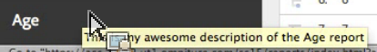

# Aangepaste rapportbeschrijvingen

U kunt aangepaste rapportbeschrijvingen opgeven voor eVars, profielen, classificaties en gebeurtenissen. De beschrijvingen zijn zichtbaar voor al uw eindgebruikers.

**[!UICONTROL Analytics]** > **[!UICONTROL Admin]** > **[!UICONTROL Report Suites]** > **[!UICONTROL Edit Settings]** > **[!UICONTROL *variabele *]**

>[!NOTE] Voor de meeste traditionele classificaties zijn beschrijvingen beschikbaar, maar momenteel niet voor mobiele classificaties.

1. Geef een beschrijving voor het rapport op. Het maximumaantal tekens is 255.
1. Klik op **[!UICONTROL Save]**.

De beschrijving is op twee plaatsen zichtbaar:

* In de titelbalk van dat rapport:

   

* Als tooltip wanneer u over het rapport in de linkernavigatie beweegt:

   

