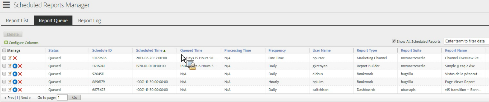

# Wachtrij voor geplande rapporten

Laat Admin-vlakke gebruikers geplande rapporten over de organisatie zien en beheren.

**[!UICONTROL Analytics]** > **[!UICONTROL Components]** > **[!UICONTROL All components]** > **[!UICONTROL Scheduled Reports]**

De functies op beheerniveau in het Geplande Manager van Rapporten omvatten:

* De optie [Alle geplande rapporten weergeven](/help/admin/admin/scheduled-reports-admin.md#section_3F167CAAEEC24140B476CF95B7402690) in uw organisatie.
* [Geavanceerde filtermogelijkheden](/help/admin/admin/scheduled-reports-admin.md#section_206A52A85DE84947AAB3AD082FBF6275) in uw organisatie.
* De nieuwe [Wachtrij rapporteren](/help/admin/admin/scheduled-reports-admin.md#section_03C866115D354BB182E90BF4D52F1E0B) tabblad waarin alle rapporten worden weergegeven die in de wachtrij worden geplaatst voor uitvoering op rapportservers.
* De [Plan-id](/help/admin/admin/scheduled-reports-admin.md#section_568B70F4228C4229977CB85D2DCD53A1) in de interface van de Rij van het Rapport.

## Alle geplande rapporten weergeven {#section_3F167CAAEEC24140B476CF95B7402690}

Op de **[!UICONTROL Report List]** tabblad, kunt u **[!UICONTROL Show All Scheduled Reports]** in uw organisatie, naast degene die u persoonlijk hebt gepland.

>[!NOTE]
>
>De **[!UICONTROL Report Name]** de kolom toont de naam van het rapport dat en wordt gepland **[!UICONTROL File Name]** in de kolom worden aangepaste bestandsnamen weergegeven die u hebt ingesteld in Geavanceerde leveringsopties. Dientengevolge, als u veelvoudige rapporten van het zelfde rapporttype plant en u aangepaste namen voor elk specificeert, zou de Geplande Manager van Rapporten veelvoudige ingangen met de zelfde Naam van het Rapport maar met verschillende dossiernamen tonen. Dit is omdat het achterste eindrapport dat wordt gepland het zelfde is, zodat zou de kolom van de Naam van het Rapport de zelfde rapportnamen voor alle behalve aangepaste dossiernamen (zoals reeks) hebben.

## Geavanceerde filtermogelijkheden {#section_206A52A85DE84947AAB3AD082FBF6275}

Als u bijvoorbeeld wilt filteren op alle rapporten die per uur zijn gepland, geeft u **[!UICONTROL Frequency equals Hourly]** in de **[!UICONTROL Advanced]** filter en klik **[!UICONTROL Apply]**:

## Wachtrij rapporteren {#section_03C866115D354BB182E90BF4D52F1E0B}

Deze rij laat u om het even welke geplande rapporten beheren en potentieel schrappen die de rij &quot;registreren&quot;zijn. (Geeft doorgaans een time-out na 4 uur aan.)

De Rij van het Rapport geeft u ook de capaciteit om &quot;een gepland rapport eens over te slaan&quot;. Klik op het blauwe pictogram in het dialoogvenster **[!UICONTROL Manage]** kolom.

## Plan-id {#section_568B70F4228C4229977CB85D2DCD53A1}

De **[!UICONTROL Schedule ID]** blootgesteld in de interface van de Rij van het Rapport helpt wanneer u de Zorg van de Cliënt van Adobe voor de resolutie van een geplande rapportkwestie moet contacteren.

