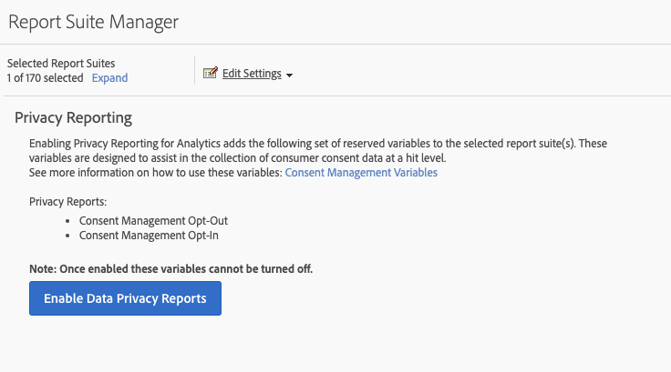
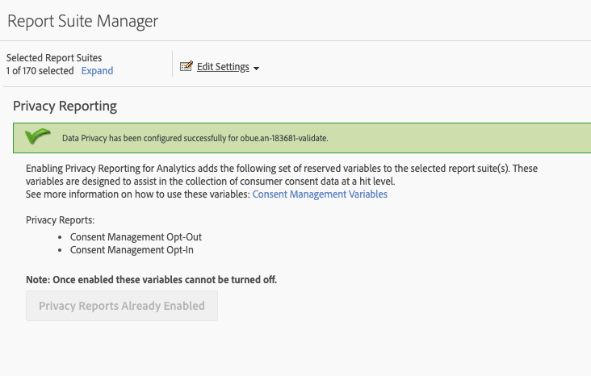

# Variabelen voor privacyrapportage

Voor extra hulp bij het beheren van privacydata is een reeks gereserveerde variabelen beschikbaar om samen met specifieke contextdatavariabelen te gebruiken.
Deze variabelen voor privacyrapportage bieden een gebruiksvriendelijk kader voor het vastleggen van de privacystatus bij elke treffer voor analysemogelijkheden.

## Variabelen

* Afmelden voor toestemmingsbeheer
   * Gereserveerde variabele: lijst
   * Type: door komma&#39;s gescheiden tekenreeks
   * Bevat:
      * `contextData.['cm.ssf']=1` weergegeven als SSF
      * `contextData.['opt.dmp']=N` weergegeven als DMP
      * `contextData.['opt.sell']=N` weergegeven als SELL

* Aanmelden voor toestemmingsbeheer
   * Gereserveerde variabele: lijst
   * Type: door komma&#39;s gescheiden tekenreeks
   * Bevat:
      * `contextData.['opt.dmp']=Y` weergegeven als DMP
      * `contextData.['opt.sell']=Y` weergegeven als SELL

## Rapportage

U kunt de variabelen voor privacyrapportage inschakelen via een nieuwe privacyinstelling die beschikbaar is in de Analytics Admin Console.

Elke rapportsuite kan als volgt worden geconfigureerd:
1. Klik in Reports &amp; Analytics op **[!UICONTROL Admin > Report Suites]**.
1. Selecteer de rapportsuite(s) waar u mediadata verzamelt en klik op **[!UICONTROL Edit Settings > Privacy Management]**.

   

1. Klik op de knop **[!UICONTROL Enable Data Privacy Reports]**.

   >[!NOTE]
   >
   >Als deze variabelen eenmaal zijn ingeschakeld, kunnen ze niet meer worden uitgeschakeld.

   

1. Zodra ze zijn ingeschakeld, ziet u een bevestigingsbericht.

   

1. De gereserveerde variabelen zijn nu beschikbaar voor analyse in Reports &amp; Analytics en Workspace. Zie Afmelden voor toestemmingsbeheer en Aanmelden voor toestemmingsbeheer.

   

## Implementatie

Er zijn drie contextdatavariabelen vooraf gedefinieerd om te werken met de voor privacyrapportagebeheer gereserveerde variabelen.  Elke implementatie-engineer moet zelf bepalen de instelling van deze variabelen moet worden beheerd en gehandhaafd.

Zie [Contextdatavariabelen](/help/implement/vars/page-vars/contextdata.md) voor algemene richtlijnen voor het implementeren van contextdatavariabelen.

### SSF

* Contextdata: `contextData.['cm.ssf']`
* Geaccepteerde waarden:
   * 1 - Wanneer u de waarde 1 verzendt, geeft dit aan dat Server Side Forwarding zich in de status “opt-out” bevindt. De waarde 1 in combinatie met deze variabele blokkeert het delen van deze treffer met Adobe Audience Manager. Zie [AAM ePrivacy Compliance](https://experienceleague.adobe.com/docs/audience-manager/user-guide/overview/data-privacy/data-privacy.html?lang=en).
   * 0 - Optioneel. Gebruik de waarde 0 voor klanten die hebben ingestemd met gerichte marketing. Als u de variabele niet instelt, krijgt u dezelfde resultaten.

### DMP

* Contextdata: `contextData.['opt.dmp']`
* Geaccepteerde waarden:
   * N - Wanneer de waarde N wordt verzonden, geeft dit aan dat de consument zich afmeldt voor het delen van data naar data management-platforms.  **Opmerking**: Als u vanaf 15 januari 2020 deze variabele instelt op N, wordt server-side delen van deze treffer met AAM geblokkeerd.
   * Y - Wanneer de waarde Y wordt verzonden, geeft dit aan dat de consument ervoor kiest om data te delen met data management-platforms.

### SELL

* Contextdata: `contextData.['opt.sell']`
* Geaccepteerde waarden:
   * N - Wanneer de waarde N wordt verzonden, geeft dit aan dat de consument zich afmeldt voor het delen of verkopen van data aan derden.
   * Y - Wanneer de waarde Y wordt verzonden, geeft dit aan dat de consument ervoor kiest om data te delen met of te verkopen aan derden.
