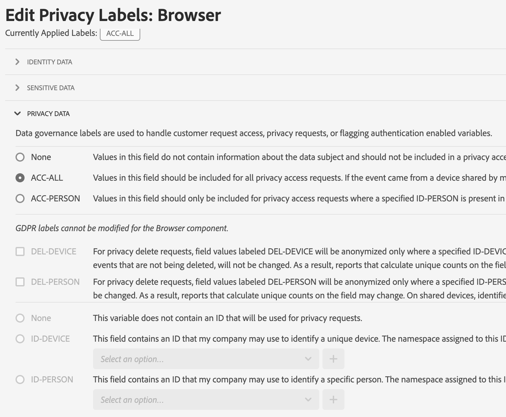

# Rapportsuitedata labelen

>[!NOTE]
>
>Deze bijgewerkte interface wordt momenteel beperkt getest.

Het labelen van rapportsuitedata betekent dat u labels voor identiteit, gevoeligheid en data-governance toevoegt aan elke variabele in een bepaalde rapportsuite. Zorg ervoor dat u zich eerst vertrouwd maakt met de [etiketten en de bijbehorende definities](/help/admin/c-data-governance/data-labeling/gdpr-labels.md).

>[!NOTE]
>
>Bedenk dat de labels steeds moeten worden gecontroleerd wanneer een nieuwe rapportsuite wordt gemaakt of wanneer een nieuwe variabele in een bestaande rapportsuite wordt ingeschakeld. U dient de labeling mogelijk ook te herzien wanneer integraties van nieuwe oplossingen worden ingeschakeld, omdat deze nieuwe variabelen kunnen laten zien waarvoor een label nodig is. Een herimplementatie van uw mobiele apps of websites kan de manier veranderen waarop bestaande variabelen worden gebruikt, waardoor eveneens updates van labels nodig kunnen zijn.

## Privacylabels voor rapportsuite toewijzen of bewerken {#assign-edit}

**Voorbeeld**: Als datacontroller wilt u e-mailadressen en cookie-id&#39;s verzamelen geregistreerde personen om hun Data Privacy-aanvragen te verwerken. Deze cookie-id&#39;s worden opgeslagen in een rapportsuite in Adobe Analytics.

1. Navigeer in Adobe Analytics naar **[!UICONTROL Admin]** > **[!UICONTROL All admin]** > **[!UICONTROL Data configuration and collection]** > **[!UICONTROL Data governance]**.

   

1. Selecteer een rapportsuite in het menu **[!UICONTROL Report Suites]** bovenaan.

1. Selecteer in de filtersectie aan de linkerkant welke groepen variabelen u wilt labelen. U kunt slechts één groep variabelen tegelijk labelen.

   * **Standaardcomponenten** - Standaardcomponenten zijn out-of-the-box Analytics-afmetingen en -meetgegevens die standaard worden verzameld in een analytische implementatie.
   * **Conversievariabelen** - De Custom Insight-conversievariabele (of -eVar) wordt in de Adobe-code op geselecteerde webpagina&#39;s van uw site geplaatst. Zijn belangrijkste doel is omzettingssuccesmetriek in douane marketing rapporten te segmenteren. Een eVar kan op bezoek zijn gebaseerd en functioneren gelijkaardig aan koekjes. De waarden die in eVar-variabelen worden doorgegeven, volgen de gebruiker gedurende een vooraf bepaalde periode.
   * **Variabelen weergeven** - De variabelen van de Lijst zijn douanevariabelen die u kunt gebruiken hoe u zou willen. Ze werken op dezelfde manier als Vars, maar ze kunnen meerdere waarden in dezelfde hit bevatten. Lijstvariabelen hebben geen tekenlimiet.
   * **Verkeersvariabelen** - Met Custom Insight Traffic Variables (of props) kunt u aangepaste gegevens koppelen aan specifieke gebeurtenissen die betrekking hebben op het verkeer. De propvariabelen worden ingesloten in de implementatiecode op elke pagina van uw website.
   * **Gebeurtenissen geslaagd** - Gebeurtenissen met succes (ook wel conversiegebeurtenissen of aangepaste gebeurtenissen genoemd) zijn handelingen die kunnen worden bijgehouden. U bepaalt wat een succesgebeurtenis is. Als een bezoeker bijvoorbeeld een item aanschaft, kan de aankoopgebeurtenis als de succesgebeurtenis worden beschouwd.
   * **Classificaties** - Indelingen voor de indeling worden gebruikt om analytische rapportagegegevens aan gerelateerde eigenschappen toe te wijzen. Classificaties kunnen voor verschillende doeleinden worden gebruikt, maar worden meestal gebruikt voor de classificatie van codes voor het bijhouden van campagnes (zowel interne als externe) en product-id&#39;s.

1. Selecteer een variabele door op het selectievakje te klikken en klik vervolgens op **[!UICONTROL Edit Privacy Labels]** op de blauwe balk die onder aan het scherm wordt weergegeven.

   

   In dit scherm ziet u de labels die op dat moment zijn toegepast en kunt u aanvullende labels toepassen. Afhankelijk van de component kunt u mogelijk niet alle labels toepassen of wijzigen.

   

1. Klik op **[!UICONTROL Apply]** zodra u alle labeling hebt voltooid.

