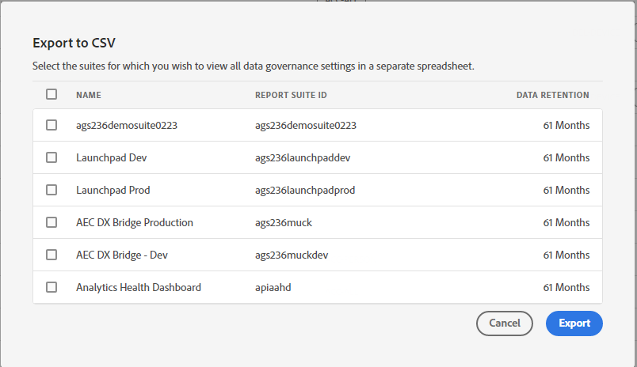

# Privacy-labels voor gegevensbeheer weergeven/beheren

>[!NOTE]
>
>Deze bijgewerkte interface wordt momenteel beperkt getest.

De **[!UICONTROL Privacy Labeling for Data Governance]** biedt een overzicht van de privacylabels en naamruimten van een rapportsuite. U kunt de instellingen vanaf hier ook exporteren naar een CSV-bestand.

## Privacy-labels weergeven {#view-privacy}

1. Meld u aan bij Adobe Experience Cloud.
1. Ga naar  **[!UICONTROL Analytics]** > **[!UICONTROL Admin]** > **[!UICONTROL All admin]** > **[!UICONTROL Data configuration & collection]** > **[!UICONTROL Data Governance]**.

   >[!NOTE]
   >
   >Als dit menu-item niet zichtbaar is, moet u deze toevoegen aan een [productprofiel in Admin Console](https://experienceleague.adobe.com/docs/analytics/admin/admin-console/permissions/product-profile.html) met machtigingen voor deze functionaliteit.

1. Selecteer rechtsboven een rapportsuite waarvan u de privacylabels wilt weergeven of beheren.

   

| Instelling | Beschrijving |
| --- | --- |
| **[!UICONTROL Component Name]** | Deze kolom maakt een lijst van alle componenten (afmetingen, metriek) die deel van deze rapportreeks uitmaken. |
| **[!UICONTROL Identity]** | “I”-labels voor identiteitsdata worden gebruikt om data te categoriseren waarmee een specifieke persoon kan worden geïdentificeerd of gecontacteerd. [Meer informatie](https://experienceleague.adobe.com/docs/analytics/admin/data-governance/gdpr-labels.html?lang=en#identity-data-labels) |
| **[!UICONTROL Sensitivity]** | “S”-labels voor gevoelige data worden gebruikt om gevoelige data zoals geografische data te categoriseren. In de toekomst zullen extra labels voor gevoelige data worden geïntroduceerd om andere soorten gevoelige informatie te identificeren. [Meer informatie](https://experienceleague.adobe.com/docs/analytics/admin/data-governance/gdpr-labels.html?lang=en#sensitive-data-labels) |
| **[!UICONTROL GDPR Access]** | Met Data Governance-labels kunnen gebruikers data classificeren die privacygerelateerde overwegingen en contractuele voorwaarden vertegenwoordigen waardoor deze voldoen aan regelgeving en bedrijfsbeleid. [Meer informatie](https://experienceleague.adobe.com/docs/analytics/admin/data-governance/gdpr-labels.html?lang=en#data-privacy-access-labels) |
| **[!UICONTROL GDPR Delete]** | Een verwijderingslabel is alleen vereist voor velden met een waarde waarmee een treffer aan geregistreerde persoon kan worden gekoppeld (d.w.z. waarmee identificatie van de geregistreerde persoon mogelijk is). Overige persoonlijke gegevens (favorieten, browsergeschiedenis/aankoopgeschiedenis, gezondheidstoestand, enz.) hoeven niet te worden verwijderd omdat de koppeling met de geregistreerde persoon wordt verbroken. [Meer informatie](https://experienceleague.adobe.com/docs/analytics/admin/data-governance/gdpr-labels.html?lang=en#data-privacy-delete-labels) |
| **[!UICONTROL Namespace]** | Wanneer u een variabele als ID-DEVICE of ID-PERSON labelt, wordt u gevraagd om een naamruimte op te geven. U kunt een eerder gedefinieerde naamruimte gebruiken of een nieuwe naamruimte definiëren. [Meer informatie](https://experienceleague.adobe.com/docs/analytics/admin/data-governance/gdpr-labels.html?lang=en#section_F0A47AF8DA384A26BD56032D0ABFD2D7) |
| **[!UICONTROL Category]** | Verwijst naar type component, zoals standaardcomponent, conversievariabele, enz. |

{style=&quot;table-layout:auto&quot;}

## Privacy-labels kopiëren naar een rapportsuite  {#copy-to-rs}

Voer de volgende stappen uit als u dezelfde DULE/Data Privacy-instellingen wilt toepassen op meerdere rapportsuite:

1. Selecteer de variabele die u wilt kopiëren. Let erop dat u de labels voor één variabele tegelijk kunt kopiëren.
1. Klikken **[!UICONTROL Copy to Report Suite(s)]** onder aan de dialoog over gegevensbeheer.

   

1. Het resulterende scherm toont de variabelenaam, de momenteel toegepaste labels die u wilt kopiëren, de rapportsuites en hun id&#39;s en of de instellingen in de doelrapportsuites overeenkomen.

   

   >[!IMPORTANT]
   >
   >Houd er rekening mee dat alle geselecteerde rapportsuites moeten zijn toegewezen aan uw Experience Cloud-organisatie.

   Wanneer u de labels voor een variabele of een reeks variabelen naar een andere rapportsuite kopieert, gaat de kopie naar de variabele in de overeenkomstige positie doelrapportsuite. Voor Standaardcomponenten, de Variabelen van de Lijst, en de Gebeurtenissen van het Succes, zullen de etiketten aan de variabele met worden gekopieerd **dezelfde naam** in de reeks van het bestemmingsrapport.

   Voor Conversion Variables (eVars) en Traffic Dimension (props) moet de kopie echter met de **zelfde nummer** in de reeks van het bestemmingsrapport. eVar12 wordt bijvoorbeeld gekopieerd naar eVar12 in alle doelrapportsuites. De namen van deze variabelen worden genegeerd bij het bepalen van het doel van de kopie. Als de overeenkomstige variabele niet is ingeschakeld in de doelrapportsuite, zal het kopiëren van die variabele mislukken.

   Wanneer het kopiëren van de etiketten voor Classificaties die voor een variabele worden bepaald, zullen de etiketten aan een classificatie op de overeenkomstige variabele in de reeks van het bestemmingsrapport (dergelijke eVar7 tot eVar7) worden gekopieerd die een naam heeft die aan de classificatie identiek is die wordt gekopieerd. Anders zal het kopiëren voor de labels van die classificatie mislukken.

1. Schakel het vakje naast een of meer rapportsuites in waar de instellingen overeenkomen.
1. Klik op **[!UICONTROL Apply]**.

   Er wordt een statusbericht weergegeven nadat een label is toegepast. Het statusbericht bevat de namen van bestemmingsvariabelen of classificaties en hun rapportsuites waarvoor het kopiëren is mislukt.

   >[!IMPORTANT]
   >
   >Controleer altijd de doelrapportsuites om te zien of de labels goed zijn gekopieerd. Dit is vooral belangrijk voor variabelen met ID- of DEL-labels.

## Exporteren naar een CSV-bestand

U kunt een CSV-bestand downloaden met alle huidige labeldefinities voor alle variabelen voor de geselecteerde rapportsuite(s). We raden u aan dat uw juridische team uw labelopties beoordeelt en deze optie vergemakkelijkt deze revisie. U kunt het CSV-bestand met het team delen, zodat ze de controle niet hoeven uit te voeren terwijl ze zijn aangemeld bij de Data Governance-gebruikersinterface.

1. Klikken **[!UICONTROL Export CSV]** rechtsboven in het dialoogvenster wordt het volgende weergegeven:

   

1. Selecteer één of meerdere rapportreeksen waarvoor u alle montages van het gegevensbeheer wilt uitvoeren.

## Privacy-labels bewerken

Zie [Privacylabels voor rapportsuite toewijzen of bewerken](/help/admin/c-data-governance/gdpr-setup-reportsuite.md).
