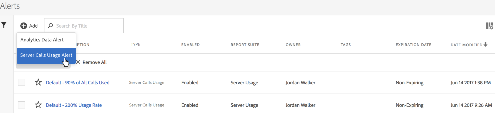

# Gebruikswaarschuwingen voor serveroproep

Wanneer u opstelling een alarm, het op alle rapportsuites in alle login bedrijven van een het facturerings bedrijf van toepassing is.

## Overzicht

Een nieuwe waakzame geroepen categorie **[!UICONTROL Server Calls Usage Alert]** is een deel van het bestaande [Waakzame Beheer](https://marketing.adobe.com/resources/help/en_US/analytics/analysis-workspace/intellligent_alerts.html) gebruikersinterface.

Het is pre-bevolkt met **1 standaardalarm** dat binnen om het even welk login bedrijf verschijnt dat toegang tot de eigenschap van het Gebruik van de Vraag van de Server heeft. Dit alarm brengt een bericht teweeg dat aan alle beheerders van het login bedrijf wordt gericht als één van de volgende criteria wordt voldaan:

* &quot;Om het even welk&quot;gebruik van de servervraag dat &quot;boven of gelijk aan&quot;100% voor om het even welk server-vraagtype is u gerechtigd aan, OF
* &quot;Om het even welk&quot;gebruik van de servervraag dat &quot;boven of gelijk aan&quot;90% voor om het even welk server-vraagtype is u gerechtigd aan, OF
* &quot;Om het even welk&quot;gebruik van de servervraag dat &quot;boven of gelijk aan&quot;75% voor om het even welk server-vraagtype is u gerechtigd aan, EN de &quot;bestede periode van het Gebruik&quot;is onder of evenaart&quot;75% van de periode van het Gebruik.

U kunt tot het gebruiksalarm van de servervraag op twee manieren toegang hebben:

* Klik **[!UICONTROL Manage Alerts]** in de hogere juiste hoek op het Huidige lusje van het Gebruik of het Gebruik van de Reeks van het Rapport tabel, of
* Ga naar **[!UICONTROL Components]** > **[!UICONTROL Alerts]** in Adobe Analytics.

## Waarschuwingen voor serveroproepgebruik maken {#section_2A2882C6D48D47C1944D52FB7C766BEC}

Als u aanvullende waarschuwingen wilt maken,

1. Klik op **[!UICONTROL + Add]** en selecteer **[!UICONTROL Server Call Usage Alert]**.

   

1. Definieer de waarschuwing.

   

   * **Titel**: Geef een beschrijvende naam op. U kunt de waarschuwing niet opslaan zonder een naam.
   * **Tijdgranulariteit**: Verwijst naar hoe vaak de alarm zal worden gecontroleerd. *We steunen op dit moment slechts wekengranulariteit.* Dit betekent dat de waarschuwing wekelijks wordt gecontroleerd en zal terugkijken naar de gegevens van de huidige gebruiksperiode.
   * **Ontvangers**: Geef iedereen in de organisatie op die een e-mailbericht moet ontvangen wanneer de waarschuwing de opgegeven drempelwaarde activeert.
   * **Vervaldatum**: De vervaldatum is standaard één jaar vanaf de aanmaakdatum van de waarschuwing.
   * **Een waarschuwing verzenden wanneer**:

      * Om het even welk van deze Metriek TriggerAdd het type van servervraag/s als metrisch en specificeer de waakzame drempel door de bepaling en de drempel te selecteren:
         * is boven of gelijk aan
         * lager is dan of gelijk is
      * MetGeef de drempel en voorwaarde op (boven of gelijk aan of onder of gelijk aan) voor de verbruiksperiode.

1. Klik op **[!UICONTROL Save]**.

## Gebruikswaarschuwingen voor serveraanroepen beheren {#section_8FF98170763C4B5CBEC6DD43F893177A}

Waarschuwingen beheren:

1. Schakel het selectievakje naast een of meer waarschuwingen in. De acties van het waakzame beheer tonen bij de bovenkant.
1. Voer een of meer van de volgende handelingen uit:

   | Handeling | Definitie |
   |--- |--- |
   | + Toevoegen | U opent de [waarschuwingsfunctie](/help/admin/c-server-call-usage/scu-alerts.md) door te klikken [!UICONTROL + Add]. |
   | Tag | Label waarschuwingen om deze voor gebruiksgemak in te delen. |
   | Verwijderen | U kunt alle waarschuwingen verwijderen, behalve standaardwaarschuwingen. |
   | Naam wijzigen | U kunt de naam van alle waarschuwingen wijzigen, behalve standaardwaarschuwingen. |
   | Goedkeuren | Waarschuwingen goedkeuren om ze &quot;officieel&quot; te maken. |
   | In-/uitschakelen | U kunt alle waarschuwingen in- of uitschakelen, ook de standaardwaarschuwingen. |
   | Vernieuwen | Wanneer een of meer waarschuwingen zijn geselecteerd, kunnen deze worden vernieuwd. Hierdoor worden de vervaldatums verlengd tot één jaar vanaf de dag waarop [!UICONTROL Renew] is geklikt, ongeacht de oorspronkelijke vervaldatum. |
   | Exporteren naar CSV | Zie Rapport [downloadverbruik](/help/admin/c-server-call-usage/report-suite-usage.md) |

