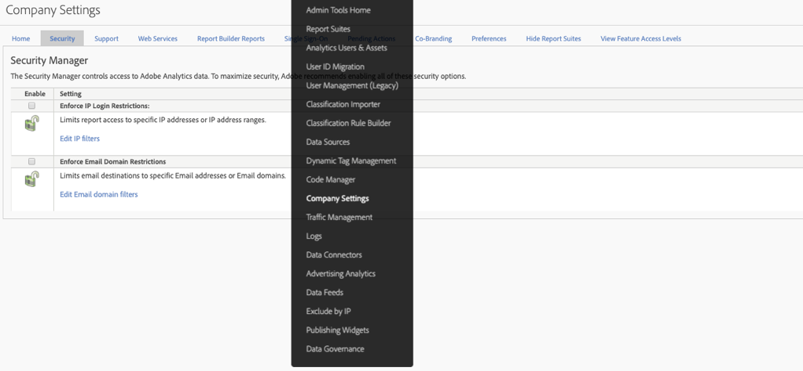

# Einde van de levensduur voor [!UICONTROL Enforce IP login restrictions]

Met de functie **[Inlogbeperkingen](/help/admin/company/security-manager.md)**voor IP-aanmelding afdwingen in Adobe Analytics kunt u specifieke IP-adressen (die veilig worden geacht) whitelist, zodat u zich met succes kunt aanmelden en toegang hebt tot uw Adobe Analytics-omgeving. In veel gevallen, wordt deze eigenschap gebruikt aan opstelling een collectief IP adres als enig veilig IP adres dat de gebruikers kunnen login van. Om Adobe Analytics te kunnen gebruiken, moeten gebruikers zich daarom op een kantoor bevinden of zich via VPN aanmelden bij het netwerk.

We zijn van plan om deze functie te beëindigen in oktober 2020.

## Waarom zijn we aan het einde van deze functie?

Deze functie is in sommige gevallen beschadigd door de migratie van aanmeldingsgegevens voor de Experience Cloud en/of de aanmeldingsgegevens voor de Experience Cloud. Het is gekend om voor klanten te breken die **[!UICONTROL Customer Attributes]** of **[!UICONTROL Audience Library]**.

Als u meerdere Experience Cloud Solutions hebt, kunt u deze vereiste omzeilen door u met een van de andere oplossingen aan te melden bij de Experience Cloud, omdat deze functie niet bestaat of niet wordt ondersteund buiten Analytics zelf. Gebruikers konden dit ook omzeilen via IP-spoofing.

Tot slot beschikt Adobe over een functionerende en veel superieure alternatieve oplossing via Single Sign-On en Federated ID&#39;s. Met deze functie hebt u meer controle en beveiliging over de aanmeldervaring van uw gebruikers. Zie hieronder voor meer informatie.

## Hoe beïnvloedt het verwijderen van deze functie u?

Deze functie wordt in oktober 2020 verwijderd voor alle klanten die deze functie hebben **[!UICONTROL Enforce IP login restrictions]** ingesteld. Op dat ogenblik, zullen om het even welke IP login beperkingen nog op zijn plaats niet meer worden afgedwongen. Als u login door IP adres nog moet beperken, zou u de geadviseerde oplossing van Single-Sign-On en Federated IDs (meer info en middelen hieronder) moeten herzien en uitvoeren.

Bovendien wordt de **[!UICONTROL Enforce IP login restrictions]** instelling verwijderd uit **[!UICONTROLAdmin > Bedrijfsinstellingen > Beveiligingsbeheer]** in de gebruikersinterface Analytics (zoals hieronder wordt weergegeven).

## Wat zijn uw andere opties?

Zoals hierboven vermeld, wordt deze functie Analytics opgeheven. Om u tijd te geven om SSO en Federated IDs uit te voeren, hebben wij de datum EOL tot Oktober 2020 vertraagd.

Zowel SSO als Federated IDs zijn superieure oplossingen aan de IP eigenschap van de Beperking van de Aanmelding die wij vandaag op zijn plaats hebben en u van meer controle, veiligheid en eigenschappen voorzien. Voor informatie over hoe te opstelling SSO/Federated IDs, hebben wij de volgende hulpdocumentatie beschikbaar. Wij adviseren dat u hen grondig leest en met uw afdeling van IT werkt om hen te krijgen uitgevoerd:

* [Single Sign On en de Experience Cloud](https://spark.adobe.com/page/JeSB8EPEQIvjD/)
* [Admin Console - Identiteitsinstellingen - documentatie](https://helpx.adobe.com/enterprise/using/set-up-identity.html)
* [Admin Console - Zelfstudie Identiteitsinstellingen (video)](https://helpx.adobe.com/enterprise/how-to/identity-directories-domains.html?playlist=/ccx/v1/collection/product/enterprise/topics/enterprise-identity/collection.ccx.js&ref=helpx.adobe.com)
* [Zelfstudie Federatieve id configureren (video)](https://helpx.adobe.com/enterprise/how-to/identity-configure-ids.html?playlist=/ccx/v1/collection/product/enterprise/topics/enterprise-identity/collection.ccx.js&ref=helpx.adobe.com)
* [Single Sign On - veelvoorkomende vragen](https://helpx.adobe.com/enterprise/using/sso-faq.html)
* [Door Adobe ondersteunde identiteitstypen](https://helpx.adobe.com/enterprise/using/identity.html)

Als u uw steun voor IP Login Beperkingen wilt blijven uitdrukken en het verzoek om het door de Wolk van de Ervaring wordt verstrekt, kunt u voor deze eigenschap op onze pagina [van het](https://forums.adobe.com/ideas/11648)Forum stemmen.