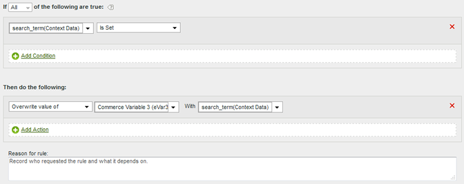

# Gebruiksgevallen voor verwerkingsregels

De toepassingen van hoe u verwerkingsregels in uw organisatie kunt gebruiken zijn uitgebreid. In de volgende secties worden enkele algemene manieren beschreven waarop u deze in het voordeel kunt gebruiken.

+++Een contextgegevensvariabele naar een eVar kopiëren

De regels van de verwerking worden gebruikt om waarden van [ variabelen van de Contextgegevens ](/help/implement/vars/page-vars/contextdata.md) aan [ Props ](/help/components/dimensions/prop.md) en [ eVars ](/help/components/dimensions/evar.md) te bewegen. Zonder verwerkingsregels hebben contextgegevensvariabelen geen betekenis en vullen ze geen rapporten in Analytics.

De lijst [!UICONTROL Context Variables] bevat alle variabelen die de afgelopen 30 dagen naar de rapportsuite zijn verzonden. Als u de naam van de variabele van contextgegevens kent maar niet het in de huidige rapportreeks hebt verzonden, kunt u het manueel toevoegen:

In het volgende voorbeeld wordt de variabele `search_term` context data geplaatst en wordt de waarde ervan in eVar3 geplaatst:

| Regelset | Waarde |
| --- | --- |
| Voorwaarde | `search_term` (Contextgegevens) is ingesteld |
| Handeling | [!UICONTROL Overwrite value of] eVar3 met `search_term` (contextgegevens) |

Het bovenstaande voorbeeld werkt prima als er slechts een paar eVars zijn om te vullen. Als uw organisatie honderden variabelen van contextgegevens heeft die elk hun eigen eVar nodig hebben, kunt u voorwaardelijke verklaringen gebruiken. Tientallen voorwaardelijke instructies passen binnen één verwerkingsregel, zodat uw organisatie alle eVars in een rapportsuite kan vullen zonder dat de verwerkingsregellimiet van 150 regels wordt overschreden.

In het volgende voorbeeld worden meerdere variabelen gevuld met variabele contextgegevensvariabelen. Eén handeling bevat ook een voorwaardelijke instructie:

| Regelset | Waarde |
| --- | --- |
| Handeling | [!UICONTROL Overwrite value of] eVar55 met `spa.billing_customer_name` (contextgegevens) |
| Handeling | [!UICONTROL Overwrite value of] Prop7 met `testhierarchy` (Context Data), als `testhierarchy` (Context Data) is ingesteld |
| Handeling | [!UICONTROL Overwrite value of] eVar8 met `spa.ims_org` (contextgegevens) |

+++

+++Een gebeurtenis instellen met een variabele van een contextgegevens

De regels van de verwerking kunnen gebeurtenissen teweegbrengen die op [ worden gebaseerd de gegevensvariabelen van de Context ](/help/implement/vars/page-vars/contextdata.md).

De lijst [!UICONTROL Context Variables] bevat alle variabelen die de afgelopen 30 dagen naar de rapportsuite zijn verzonden. Als u de naam van de variabele van contextgegevens kent maar niet het in de huidige rapportreeks hebt verzonden, kunt u het manueel toevoegen:

De volgende regeldefinitie plaatst een gebeurtenis op elke slag die een specifieke variabele van contextgegevens bevat:

| Regelset | Waarde |
| --- | --- |
| Voorwaarde | `search_term` (Contextgegevens) is ingesteld |
| Handeling | [!UICONTROL Set event] Event1 tot [!UICONTROL Custom Value] `1` |

 te plaatsen

+++

+++Een variabele vullen met een parameter voor een queryreeks

U kunt een variabele vullen met een parameter van een queryreeks. In de meeste gevallen, zou u typisch uw implementatie aanpassen om de gewenste waarden van het vraagkoord te verkrijgen. Als u uw implementatie echter niet eenvoudig kunt aanpassen om deze gegevens te verzamelen, zijn verwerkingsregels een geschikt alternatief. Als een typefout of een vergelijkbare uitgave voorkomt dat de waarde wordt gevuld, kunt u de variabele vullen met verwerkingsregels.

Controleer altijd of een waarde leeg is of de verwachte waarde bevat voordat u deze overschrijft.

| Regelset | Waarde |
| --- | --- |
| Voorwaarde | Campagne is niet ingesteld |
| Handeling | [!UICONTROL Overwrite value of] Campagne voeren met [!UICONTROL Query String Parameter] `cpid` |

| Regelset | Waarde |
| --- | --- |
| Voorwaarde | [!UICONTROL Query String Parameter] `q` [!UICONTROL Is Set] |
| Handeling | [!UICONTROL Overwrite value of] Interne zoektermen met [!UICONTROL Query String Parameter] `q` |

+++

+++Voorwaardelijk elke gebeurtenis instellen

Gebeurtenissen kunnen worden ingesteld op basis van elke voorwaarde die beschikbaar is in de verwerkingsregels. U kunt bijvoorbeeld een gebeurtenis activeren wanneer de paginanaam gelijk is aan &quot;Productoverzicht&quot;.

| Regelset | Waarde |
| --- | --- |
| Voorwaarde | Als [!UICONTROL Page Name] gelijk is aan &quot;Product overview&quot; |
| Handeling | [!UICONTROL Set event] [!UICONTROL Product Views] t/m [!UICONTROL Custom Value] `1` |

+++

+++Een subcategorie toevoegen door de categorie- en paginanaam samen te voegen

Met de optie Samenvoegen kunt u waarden vullen door andere waarden te combineren.

| Regelset | Waarde |
| --- | --- |
| Voorwaarde | Geen (altijd uitvoeren) |
| Handeling | [!UICONTROL Overwrite value of] eVar1 met [!UICONTROL Concatenated Value] Categorie + Paginanaam |

+++

+++Waarden in een rapport opruimen

U kunt waarden vergelijken met verzamelde spelfouten en deze bijwerken zodat ze correct worden weergegeven in rapporten.

Adobe raadt aan de meest beperkende optie te gebruiken om ongewenste overschrijvingen te voorkomen. U kunt een rapport over de variabele in werking stellen en naar potentiële regelvoorwaarden zoeken die u wilt gebruiken. Tekenreeksvergelijkingen zijn niet hoofdlettergevoelig.

| Regelset | Waarde |
| --- | --- |
| Voorwaarde | Als prop1 [!UICONTROL Starts With] &quot;[!DNL Shoping]&quot; |
| Handeling | [!UICONTROL Overwrite value of] Prop1 met [!UICONTROL Custom Value] &quot;[!DNL Shopping]&quot; |

 te bevestigen

+++

+++Een gebeurtenis verwijderen uit een hit

U kunt een specifieke gebeurtenis verwijderen uit of verwijderen uit een hit met behulp van verwerkingsregels zonder de implementatie te wijzigen. Als u de gebeurtenis instelt op een aangepaste waarde `0` , telt de gebeurtenis niet.

| Regelset | Waarde |
| Voorwaarde | Geen (altijd uitvoeren) |
| Handeling | [!UICONTROL Set event] Event1 tot [!UICONTROL Custom value] `0` |

+++
