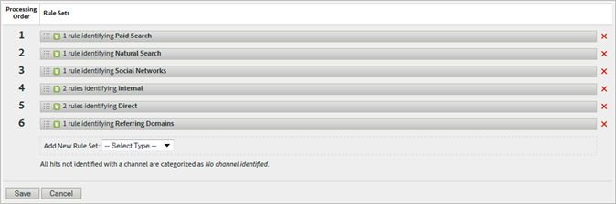

# Verwerkingsregels voor distributiekanalen

_Deze pagina verwijst naar verwerkingsregels die een marketing kanaal aan een klap toewijzen. Zie [ Regels van de Verwerking ](../general/processing-rules/pr-overview.md) voor de eigenschap die u toestaat om aan te passen hoe het gegeven wordt verzameld._

De de verwerkingsregels van het Kanaal van de marketing staan u logica toe die de waarde voor het [ Marketing Kanaal ](/help/components/dimensions/marketing-channel.md) en [ het Detail van het Kanaal van de Marketing ](/help/components/dimensions/marketing-detail.md) dimensies bepaalt. Gebruik de [ manager van het Kanaal van de Marketing ](c-channels.md) om te bepalen welke marketing kanalen u gebruikt, dan gebruiks verwerkingsregels om te bepalen hoe elk kanaal wordt geplaatst.

**[!UICONTROL Analytics]** > **[!UICONTROL Admin]** > **[!UICONTROL Report Suites]** > **[!UICONTROL Edit Settings]** > **[!UICONTROL Marketing Channels]** > **[!UICONTROL Marketing Channel Processing Rules]**

Zodra de [ Automatische opstelling ](/help/components/c-marketing-channels/c-getting-started-mchannel.md) looppas, leidt het tot een regel voor elk die kanaal tijdens opstelling wordt geproduceerd.

U kunt veelvoudige regels gebruiken om één enkel marketing kanaal te bepalen. Het gebruiken van veelvoudige regels voor één enkel kanaal kan nuttig zijn als u het kanaaldetail afhankelijk van regelvoorwaarden verschillend wilt plaatsen. U kunt ook meerdere voorwaarden gebruiken om één regel te definiëren.

## Regeldefinities

Elke regel bevat een voorwaarde en een toewijzing:

* **[!UICONTROL If any/all of the following are true]**: Als u meerdere voorwaarden aan één regel toevoegt, kunt u bepalen of aan alle voorwaarden moet worden voldaan of aan een van de voorwaarden moet worden voldaan om het kanaal en de bijbehorende waarde in te stellen.
* **de voorwaarden van de Regel**: Specificeer één of meerdere regelvoorwaarden die moeten worden voldaan aan. Gewoonlijk geeft u een dimensie op die een hit moet hebben om in aanmerking te komen voor het marketingkanaal.
* **[!UICONTROL Then do the following]**: Wanneer de regelvoorwaarden aanpassen, plaats [ het Kanaal van de Marketing ](/help/components/dimensions/marketing-channel.md) ([!UICONTROL Identify the channel as]) en [ het Detail van het Kanaal van de Marketing ](/help/components/dimensions/marketing-detail.md) ([!UICONTROL Set the channel's value]).

## Regelvoorwaarden

De volgende opties zijn beschikbaar wanneer het plaatsen van regelvoorwaarden.

>[!NOTE]
>
>Alle tekstgebieden worden geëvalueerd als **case-insensitive**. Als u bijvoorbeeld een regelvoorwaarde gebruikt waarbij de parameter voor de querytekenreeks `cmp` gelijk is aan `abc123` , kunnen zowel de parameter voor de querytekenreeks als de waarde elke combinatie van hoofdletters en kleine letters gebruiken.

**Adobe-ontdekte voorwaarden** bevatten geen opties of gebieden om tekst in te gaan.

| Door Adobe gedetecteerde voorwaarde | Beschrijving |
|---|---|
| **[!UICONTROL Matches Paid Search Detection Rules]** | De klap kwam uit een erkende onderzoeksmotor voort en ging [ Betaalde regels van de onderzoeksopsporing ](../general/paid-search-detection/paid-search-detection.md) bij. |
| **[!UICONTROL Matches Natural Search Detection Rules]** | De treffer is afkomstig van een erkend zoekprogramma en komt niet overeen met de regels voor betaalde zoekopdrachten. |
| **[!UICONTROL Referrer Matches Internal URL Filters]** | De slag bevatte a [ Referrer ](/help/components/dimensions/referrer.md) die [ Interne filters URL ](../general/internal-url-filter-admin.md) overstemde. |
| **[!UICONTROL Referrer Does Not Match Internal URL Filters]** | De hit bevatte een referentie die niet overeenkwam met interne URL-filters. |
| **[!UICONTROL Is First Hit of Visit]** | De hit was de eerste in een bezoek. |
| **[!UICONTROL Referrer Is Social Network]** | Het [ type van Referateur ](/help/components/dimensions/referrer-type.md) is &quot;Sociale netwerken&quot;. |
| **[!UICONTROL Referrer Is Not Social Network]** | Het verwijzingstype is niet &quot;Sociale netwerken&quot;. |
| **[!UICONTROL Referrer Is Conversational AI]** | Het referentietype is &quot;Conversational AI&quot;. |
| **[!UICONTROL Referrer Is Not Conversational AI]** | Het referentietype is niet &quot;Conversational AI&quot;. |

**de attributen van het Actief** staan u toe om een afmeting, een passende exploitant, en een waarde te specificeren om te zoeken.

| Toestand aanpassen kenmerk | Beschrijving |
|---|---|
| **[!UICONTROL Page]** | De [ dimensie van de Pagina ](/help/components/dimensions/page.md). |
| **[!UICONTROL Page Domain]** | Het domein van de URL. Bijvoorbeeld `products.example.com` . |
| **[!UICONTROL Page Domain And Path]** | Het domein en pad van de URL. Bijvoorbeeld `products.example.com/mens/pants/overview.html` . |
| **[!UICONTROL Page Root Domain]** | Het hoofddomein van de URL. Bijvoorbeeld `example.co.uk` . |
| **[!UICONTROL Page URL]** | De URL van de volledige pagina. |
| **[!UICONTROL Query String Parameter]** | Een individuele parameter van het vraagkoord in de pagina URL. Gebruik één parameter van het vraagkoord per regelvoorwaarde. Als u veelvoudige parameters van het vraagkoord in een regel wilt omvatten, gebruik veelvoudige regelvoorwaarden. |
| **[!UICONTROL Referrer]** | De [ dimensie van de Verwijzer ](/help/components/dimensions/referrer.md). |
| **[!UICONTROL Referring Domain]** | De [ Verwijzende dimensie van het Domein ](/help/components/dimensions/referring-domain.md). |
| **[!UICONTROL Referring Domain And Path]** | Een aaneenschakeling van het verwijzende domein en de weg van URL van de verwijzende. Bijvoorbeeld `www.example.com/products/id/12345` of `ad.example.com/foo` . |
| **[!UICONTROL Referring Parameter]** | Een parameter van het vraagkoord binnen de verwijzende. |
| **[!UICONTROL Referring Root Domain]** | Het verwijzende hoofddomein. |
| **[!UICONTROL Search Engine]** | De [ motor van het Onderzoek ](/help/components/dimensions/search-engine.md) dimensie. |
| **[!UICONTROL Search Keyword(s)]** | De [ dimensie van het sleutelwoord van het Onderzoek ](/help/components/dimensions/search-keyword.md). |
| **[!UICONTROL Search Engine + Search Keyword(s)]** | Een samenvoeging van zoekprogramma&#39;s en zoektrefwoorden. |
| **[!UICONTROL AMO ID]** | De primaire volgcode die wordt gebruikt door de Adobe Advertising- en Advertising Analytics-integratie. Wanneer een van deze integraties is ingeschakeld, kunt u het voorvoegsel van de trackingcode gebruiken om specifieke Advertising-kanalen te identificeren. Waarden die beginnen met &#39;AL&#39; zijn voor Zoeken en Sociaal. Waarden die beginnen met &#39;AC&#39; zijn voor weergave. Wanneer de AMO-id in marketingkanalen wordt gebruikt, kunnen maatstaven voor klikken/kosten/indruk worden toegewezen aan het juiste kanaal. |
| **[!UICONTROL AMO EF ID]** | De code voor secundaire tracering die door Adobe Advertising wordt gebruikt. Deze rol fungeert als sleutel voor het terugsturen van gegevens naar Advertising. Het kan worden gebruikt om vertoning te identificeren klikt doorheen en mening door als twee afzonderlijke marketing kanalen te tonen. Hiervoor stelt u de logica voor het marketingkanaal in voor &quot;AMO EF ID&quot; eindigt met `:d` voor weergave, klikt u doorheen, of &quot;AMO EF ID&quot; eindigt met `:i` voor doorhalingen van de weergaveweergave. Als u de weergave niet in twee kanalen wilt splitsen, gebruikt u in plaats daarvan de dimensie AMO-id. |

**de variabelen van de Omzetting** staan u toe om een douane eVar, een passende exploitant, en een waarde te specificeren om te zoeken.

| Toestand conversievariabele | Beschrijving |
|---|---|
| **eVar 1-250** | De bijbehorende [ dimensie van eVar ](/help/components/dimensions/evar.md). |
