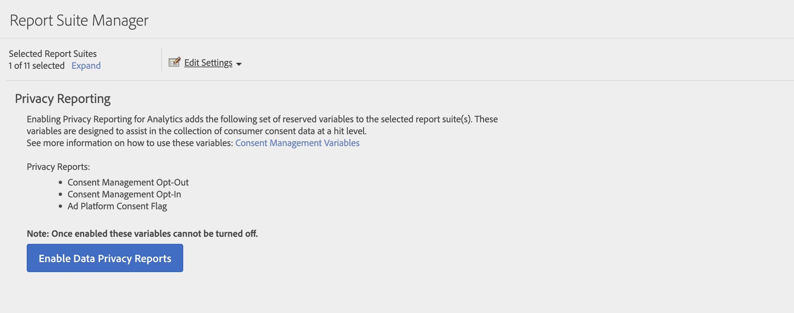

# Privacy-rapportage

De rapportering van de privacy laat u het [&#x200B; Beheer van de Toestemming toe open-binnen &#x200B;](/help/components/dimensions/cm-opt-in.md), [&#x200B; het Beheer van de Toestemming van de Opt-uit &#x200B;](/help/components/dimensions/cm-opt-out.md) en [&#x200B; Advertentie van de Toestemming van het Platform &#x200B;](/help/components//dimensions/ad-consent.md) dimensies voor gebruik in het melden.

>[!NOTE]
>
>We hebben een nieuwe markering voor goedkeuring van advertentieplatform toegevoegd. U moet de Rapporten van de Privacy van Gegevens re-toelaten als u deze nieuwe variabele wilt van kracht worden.

Deze pagina openen:

1. Meld u aan bij Adobe Analytics en navigeer naar **[!UICONTROL Admin]** > **[!UICONTROL Report suites]** .
1. Selecteer een of meer gewenste rapportsuites en selecteer vervolgens **[!UICONTROL Edit settings]** > **[!UICONTROL Privacy management]** > **[!UICONTROL Privacy reporting]** .

    uit

1. Klik op **[!UICONTROL Enable Data Privacy Reports]**.

   >[!NOTE]
   >
   >Deze variabelen kunnen niet worden uitgeschakeld als ze eenmaal zijn ingeschakeld.

   

1. Als deze optie is ingeschakeld, wordt een bevestigingsbericht weergegeven. De afmetingen zijn beschikbaar in rapporten.

   
