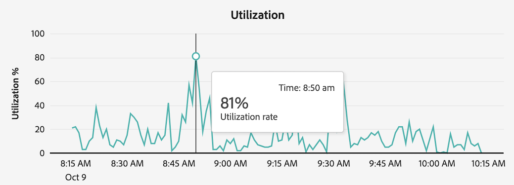

# Rapportactiviteiten weergeven in de rapportagManager

Met [!UICONTROL Reporting Activity Manager] kunnen beheerders snel problemen met de rapportcapaciteit tijdens piekrapportagetijden opsporen en verhelpen.

Voor meer informatie over het Melden van de Manager van de Activiteit, met inbegrip van zeer belangrijke voordelen en toestemmingsvereisten, zie [ het Overzicht van de Manager van de Activiteit ](/help/admin/tools/reporting-activity-manager/reporting-activity-overview.md) melden.

## Rapportactiviteiten voor alle rapportsuites weergeven {#view-all-report-suites}

<!-- markdownlint-disable MD034 -->

>[!CONTEXTUALHELP]
>id="cja_tools_reportingactivitymanager_connections"
>title="Verbindingen"
>abstract="Deze lijst toont de verbindingen waarvoor u rechten hebt om rapporteringsactiviteit te beheren. Informatie over elke verbinding is beschikbaar in elke kolom van de lijst."

<!-- markdownlint-enable MD034 -->

<!-- markdownlint-disable MD034 -->

>[!CONTEXTUALHELP]
>id="tools_reportingactivitymanager_connections"
>title="Verbindingen"
>abstract="Deze lijst toont de verbindingen waarvoor u rechten hebt om rapporteringsactiviteit te beheren. Informatie over elke verbinding is beschikbaar in elke kolom van de lijst."

<!-- markdownlint-enable MD034 -->

1. Ga in Adobe Analytics naar **[!UICONTROL Admin]** > **[!UICONTROL Reporting Activity Manager]** .

   Een lijst van uw toegelaten reeksen van het basisrapport wordt getoond.

   

1. (Optioneel) U kunt de lijst met rapportsuites opzoeken of filteren:

   * Gebruik het onderzoeksgebied aan onderzoek naar een specifieke rapportreeks. Typ de naam of id van de rapportsuite en de lijst met updates van rapportsuites terwijl u typt.

   * Selecteer het [!UICONTROL **pictogram van de Filter**] pictogram  om de lijst van filteropties uit te breiden. U kunt door [!UICONTROL **Favorieten**] of [!UICONTROL **Status**] filtreren.

     Als u een rapportsuite als favoriet wilt markeren, selecteert u het sterpictogram links van de naam van de rapportsuite.

     <!-- (does this option still exist?) 1. (Optional) Select **[!UICONTROL Refresh]** at the top-right to refresh the data. -->

1. De gebruiksinformatie van de mening over elke rapportreeks. De gegevens die in de lijst worden getoond vertegenwoordigen de rapporteringsactiviteit voor de rapportreeks op het tijdstip dat de pagina het laatst werd geladen.

   De volgende kolommen zijn beschikbaar:

   | UI-element | Beschrijving |
   | --- | --- |
   | **[!UICONTROL Report Suite]** | De set met basisrapporten waarvan u de rapportactiviteiten controleert. |
   | **[!UICONTROL Virtual report suites]** | Toont alle virtuele rapportsuites die in deze reeks van het basisrapport van toepassing zijn. De virtuele rapportsuites voegen ingewikkeldheid aan rapporteringsverzoeken toe toe toe te schrijven aan extra niveaus van toegepaste filtratie en segmentatie. Alle verzoeken die uit de virtuele rapportreeksen komen worden gecombineerd in de reeks van het basisrapport. |
   | **[!UICONTROL Capacity utilization]** | Het percentage van de rapporteringscapaciteit van de rapportreeks die, in echt - tijd wordt gebruikt. 
**Nota** de gebruikscapaciteit van A die bij 100% is stelt niet noodzakelijk voor dat u onmiddellijk zou moeten beginnen meldend verzoeken te annuleren. De gebruikscapaciteit van 100% kan gezond zijn als de gemiddelde wachttijd redelijk is. Anderzijds zou 100% van de gebruikscapaciteit een probleem kunnen suggereren als het aantal verzoeken in de wachtrij ook toeneemt.
 |
   | **[!UICONTROL Queued requests]** | Het aantal verzoeken dat moet worden verwerkt. <!-- ??? --> |
   | **[!UICONTROL Queue wait time]** | De gemiddelde wachttijd alvorens de verzoeken beginnen te verwerken. <!-- ???? --> |
   | **[!UICONTROL Status]** | De mogelijke statussen zijn: <ul><li>[!UICONTROL **Actief**] (blauw): De rapporten zijn in werking gesteld op de rapportreeks in de laatste 2 uren. De gegevens die in de tabel worden weergegeven, vertegenwoordigen de rapportcapaciteit voor de rapportsuite op het moment dat de pagina voor het laatst werd geladen.</li><li>[!UICONTROL **Inactief**] (grijs): Geen rapporten zijn in werking gesteld op de rapportreeks in de laatste 2 uren, zodat worden geen gegevens getoond voor de rapportreeks.</li></ul> |

   {style="table-layout:auto"}

## Rapportactiviteiten weergeven voor één rapportsuite

1. In Adobe Analytics, uitgezochte [!UICONTROL **Admin**] > [!UICONTROL **Rapporterende Manager van de Activiteit**].

1. Selecteer de gekoppelde titel van de rapportsuite waarvan u de details wilt weergeven.

   De gegevens van de rapportactiviteit worden getoond voor de rapportreeks die u selecteerde.

   <!-- Need to update this screenshot:  -->

1. (Optioneel) Wanneer een verbinding voor het eerst wordt geladen in Rapportagentenbeheer, vertegenwoordigen de weergegeven gegevens de huidige gebruiksmaatstaven. Om bijgewerkte metriek na de aanvankelijke lading te zien, selecteer [!UICONTROL **verfrissen**] knoop om de pagina manueel te verfrissen.

1. Gebruik de beschikbare grafieken en de lijst om rapporteringsactiviteit in de rapportreeks te begrijpen.

   * [Grafieken weergeven](#view-graphs)

   * [Tabel weergeven](#view-table)

### Grafieken weergeven

De volgende grafieken zijn beschikbaar om u te helpen de activiteit begrijpen die in de rapportreeks gebeurt.

Als de grafieken niet zichtbaar zijn, selecteer [!UICONTROL **tonen grafieken**] knoop.

#### Gebruiksgrafiek {#utilization}

De grafiek van het Gebruik toont rapporteringsgebruik voor de geselecteerde rapportreeks over de laatste 2 uren.

Houd de cursor boven het diagram om punten in de tijd te bekijken waar het percentage van de gebruikscapaciteit het hoogst was gedurende die minuut.

* **x-as**: De rapporteringsgebruikscapaciteit over de laatste 2 uren.
* **y-as**: Het percentage van het rapportgebruikscapaciteit, door minuut.

  

#### Afzonderlijke gebruikersgrafiek

In de grafiek Afzonderlijke gebruikers wordt de rapportactiviteit voor de geselecteerde rapportsuite gedurende de laatste twee uur weergegeven.

Houd de cursor boven het diagram om punten in de tijd te bekijken waar het maximumaantal gebruikers het hoogst was gedurende die minuut.

* **x-as**: De rapporteringsactiviteit over het laatste 2 uur tijdkader.
* **y-as**: Het aantal gebruikers die rapportageverzoeken, door minuut hebben gemaakt.

  

#### Verzoeken om grafiek

De grafiek van Verzoeken toont het aantal verwerkte en een rij gevormde verzoeken voor de geselecteerde rapportreeks over de laatste 2 uren.

Houd de cursor boven het diagram om punten in de tijd weer te geven waar het maximale aantal aanvragen het hoogst was voor die minuut.

* **x-as**: Het aantal verwerkte en voltooide verzoeken over het laatste 2 uur tijdkader.
* **y-as**: Het aantal verwerkte verzoeken (in groen) en een rij gevormde verzoeken (in paars), door minuut.

  

#### Grafiek in wachtrij

De het Een rij vormen grafiek toont de gemiddelde rij wachttijd (in seconden) voor het melden van verzoeken voor de geselecteerde rapportreeks over de laatste 2 uren.

Houd de cursor boven het diagram om punten in de tijd te bekijken waar de maximale gemiddelde wachttijd het hoogst was voor die minuut.

* **x-as**: De gemiddelde rij wacht tijd voor het melden van verzoeken over het laatste een tijdkader van 2 uur.
* **y-as**: Het gemiddelde wacht tijd (in seconden).

  

### Tabel weergeven {#view-table}

Houd rekening met het volgende wanneer u de tabel weergeeft:

* U kunt verkiezen om gegevens te bekijken door om het even welke volgende lusjes bij de bovenkant van de gegevenslijst te kiezen: [!UICONTROL **Verzoek**], [!UICONTROL **Gebruiker**], [!UICONTROL **Project**], of [!UICONTROL **Toepassing**].

* U kunt de lijst met verbindingen zoeken of filteren:

   * Gebruik het zoekveld om te zoeken naar een specifieke verbinding. Typ de naam of de id van de verbinding en de lijst met updates van verbindingen terwijl u typt.

   * Selecteer het [!UICONTROL **pictogram van de Filter**] pictogram  om de lijst van filteropties uit te breiden. U kunt door [!UICONTROL **Status**] filtreren, [!UICONTROL **Complexiteit**], [!UICONTROL **Toepassing**], [!UICONTROL **Gebruiker**], of [!UICONTROL **Project**].

   * U kunt [!UICONTROL **grafieken van de Verbergen**] selecteren om slechts de lijst te tonen.

#### Gegevens op verzoek weergeven

Wanneer u het [!UICONTROL **Verzoek**] lusje selecteert, zijn de volgende kolommen beschikbaar in de lijst:

| Kolom | Beschrijving |
| --- | --- |
| [!UICONTROL **identiteitskaart van het Verzoek**] | Een unieke id die kan worden gebruikt voor probleemoplossingsdoeleinden. Om identiteitskaart te kopiëren, selecteer het verzoek, dan de optie, [!UICONTROL **verzoek IDs van het Exemplaar**]. |
| [!UICONTROL **looppas van de Tijd**] | Hoe lang de aanvraag is uitgevoerd. |
| [!UICONTROL **tijd van het Begin**] | Wanneer de aanvraag is begonnen met de verwerking (op basis van de lokale tijd van de beheerder). |
| [!UICONTROL **wacht tijd**] | Hoe lang het verzoek heeft gewacht alvorens wordt verwerkt. Deze waarde staat doorgaans op &quot;0&quot; wanneer er voldoende capaciteit is. |
| [!UICONTROL **Toepassing**] | De toepassingen die worden ondersteund door [!UICONTROL Reporting Activity Manager] zijn: <ul><li>ANALYSIS WORKSPACE UI</li><li>Workspace-projecten</li><li>Report Builder</li><li>Builder-gebruikersinterface: Segment, Berekende afmetingen, Annotaties, Soorten publiek, enzovoort.</li><li>API-aanroepen van 1.4 of 2.0 API</li><li>Waarschuwingen</li><li>Delen met koppelingen van anderen</li><li>Een andere toepassing die de Analyse meldend motor vraagt</li></ul> |
| [!UICONTROL **Gebruiker**] | De gebruiker die de aanvraag heeft gestart. 
**Nota:** als de waarde van deze kolom [!UICONTROL **niet erkend**] is, betekent dit dat de gebruiker in een login bedrijf is waar u geen administratieve toestemmingen hebt.
 |
| [!UICONTROL **Project**] | Opgeslagen Workspace-projectnamen, API-rapport-id&#39;s enz. (Metagegevens kunnen per toepassing verschillen.) |
| [!UICONTROL **Status**] | Statusindicatoren: <ul><li>**Lopend**: Het verzoek wordt momenteel verwerkt.</li><li>**Hangende**: Het verzoek wacht om te worden verwerkt.</li></ul> |
| [!UICONTROL **Complexiteit**] | Niet alle verzoeken vereisen de zelfde hoeveelheid tijd om te verwerken. De complexiteit van aanvragen kan u helpen een algemeen idee te geven van de tijd die nodig is om de aanvraag te verwerken. 
Mogelijke waarden zijn:
 <ul><li>[!UICONTROL **Laag**]</li><li>[!UICONTROL **Medium**]</li><li>[!UICONTROL **Hoog**]</li></ul>Deze waarde wordt beïnvloed door de waarden in de volgende kolommen:<ul><li>[!UICONTROL **grenzen van de Maand**]</li><li>[!UICONTROL **Kolommen**]</li><li>[!UICONTROL **Segmenten**]</li></ul> |
| [!UICONTROL **grenzen van de Maand**] | Het aantal maanden dat in een verzoek is opgenomen. Meer maandgrenzen vergroot de complexiteit van het verzoek. |
| [!UICONTROL **Kolommen**] | Het aantal metriek en onderverdelingen in het verzoek. Meer kolommen maken de aanvraag complexer. |
| [!UICONTROL **Segmenten**] | Het aantal segmenten dat op de aanvraag wordt toegepast. Meer segmenten maken de aanvraag complexer. |

{style="table-layout:auto"}

#### Gegevens weergeven per gebruiker

Wanneer u het [!UICONTROL **lusje van de Gebruiker**] selecteert, zijn de volgende kolommen beschikbaar in de lijst:

| Kolom | Beschrijving |
| --- | --- |
| [!UICONTROL **Gebruiker**] | De gebruiker die de aanvraag heeft gestart. Als de waarde van deze kolom [!UICONTROL **Onerkend**] is, betekent dit dat de gebruiker in een login bedrijf is waar u geen administratieve toestemmingen hebt. |
| [!UICONTROL **Aantal verzoeken**] | Het aantal aanvragen dat door de gebruiker wordt geïnitieerd. |
| [!UICONTROL **Aantal projecten**] | Het aantal projecten verbonden aan de gebruiker. <!-- ??? --> |
| [!UICONTROL **Toepassing**] | De toepassingen die worden ondersteund door [!UICONTROL Reporting Activity Manager] zijn: <ul><li>ANALYSIS WORKSPACE UI</li><li>Workspace-projecten</li><li>Report Builder</li><li>Builder-gebruikersinterface: Segment, Berekende afmetingen, Annotaties, Soorten publiek, enzovoort.</li><li>API-aanroepen van 1.4 of 2.0 API</li><li>Waarschuwingen</li><li>Delen met koppelingen van anderen</li><li>Een andere toepassing die de Analyse meldend motor vraagt</li></ul> |
| [!UICONTROL **Avg ingewikkeldheid**] | De gemiddelde ingewikkeldheid van verzoeken die door de gebruiker in werking worden gesteld. 
Niet alle verzoeken vereisen de zelfde hoeveelheid tijd om te verwerken. De complexiteit van aanvragen kan u helpen een algemeen idee te geven van de tijd die nodig is om de aanvraag te verwerken.

De waarde in deze kolom is gebaseerd op een score die wordt bepaald door de waarden in de volgende kolommen:
<ul><li>[!UICONTROL **Gem de grenzen van de Maand**]</li><li>[!UICONTROL **Avg Kolommen**]</li><li>[!UICONTROL **Avg Segmenten**]</li></ul> |
| [!UICONTROL **Gem de grenzen van de Maand**] | Het gemiddelde aantal maanden dat in de verzoeken is opgenomen. Meer maandgrenzen vergroot de complexiteit van het verzoek. |
| [!UICONTROL **Avg Kolommen**] | Het gemiddelde aantal metriek en onderverdelingen in de inbegrepen verzoeken. Meer kolommen maken de aanvraag complexer. |
| [!UICONTROL **Avg Segmenten**] | Het gemiddelde aantal segmenten dat wordt toegepast op de opgenomen aanvragen. Meer segmenten maken de aanvraag complexer. |

{style="table-layout:auto"}

#### Gegevens weergeven per project

Wanneer u het [!UICONTROL **lusje van het Project**] selecteert, zijn de volgende kolommen beschikbaar in de lijst:

| Kolom | Beschrijving |
| --- | --- |
| [!UICONTROL **Project**] | Het project waar de verzoeken werden ingediend. |
| [!UICONTROL **Aantal verzoeken**] | Het aantal verzoeken verbonden aan het project. |
| [!UICONTROL **Aantal gebruikers**] | Het aantal gebruikers dat aan het project is gekoppeld. <!-- ??? --> |
| [!UICONTROL **Toepassing**] | De toepassingen die worden ondersteund door [!UICONTROL Reporting Activity Manager] zijn: <ul><li>ANALYSIS WORKSPACE UI</li><li>Workspace-projecten</li><li>Report Builder</li><li>Builder-gebruikersinterface: Segment, Berekende afmetingen, Annotaties, Soorten publiek, enzovoort.</li><li>API-aanroepen van 1.4 of 2.0 API</li><li>Waarschuwingen</li><li>Delen met koppelingen van anderen</li><li>Een andere toepassing die de Analyse meldend motor vraagt</li></ul> |
| [!UICONTROL **Avg ingewikkeldheid**] | De gemiddelde complexiteit van aanvragen die in het project zijn opgenomen. 
Niet alle verzoeken vereisen de zelfde hoeveelheid tijd om te verwerken. De complexiteit van aanvragen kan u helpen een algemeen idee te geven van de tijd die nodig is om de aanvraag te verwerken.

De waarde in deze kolom is gebaseerd op een score die wordt bepaald door de waarden in de volgende kolommen:
<ul><li>[!UICONTROL **Gem de grenzen van de Maand**]</li><li>[!UICONTROL **Avg Kolommen**]</li><li>[!UICONTROL **Avg Segmenten**]</li></ul> |
| [!UICONTROL **Gem de grenzen van de Maand**] | Het gemiddelde aantal maanden dat in de verzoeken is opgenomen. Meer maandgrenzen vergroot de complexiteit van het verzoek. |
| [!UICONTROL **Avg Kolommen**] | Het gemiddelde aantal metriek en onderverdelingen in de inbegrepen verzoeken. Meer kolommen maken de aanvraag complexer. |
| [!UICONTROL **Avg Segmenten**] | Het gemiddelde aantal segmenten dat wordt toegepast op de opgenomen aanvragen. Meer segmenten maken de aanvraag complexer. |

{style="table-layout:auto"}

#### Gegevens weergeven per toepassing

Wanneer u het [!UICONTROL **lusje van de Toepassing**] selecteert, zijn de volgende kolommen beschikbaar in de lijst:

| Kolom | Beschrijving |
| --- | --- |
| [!UICONTROL **Toepassing**] | De aanvraag waar de verzoeken zijn ingediend. |
| [!UICONTROL **Aantal verzoeken**] | Het aantal aanvragen dat aan de toepassing is gekoppeld. |
| [!UICONTROL **Aantal gebruikers**] | Het aantal gebruikers dat aan de toepassing is gekoppeld. <!--???--> |
| [!UICONTROL **Aantal projecten**] | Het aantal projecten verbonden aan de toepassing. <!--???--> |
| [!UICONTROL **Avg ingewikkeldheid**] | De gemiddelde ingewikkeldheid van verzoeken verbonden aan de toepassing. 
Niet alle verzoeken vereisen de zelfde hoeveelheid tijd om te verwerken. De complexiteit van aanvragen kan u helpen een algemeen idee te geven van de tijd die nodig is om de aanvraag te verwerken.

De waarde in deze kolom is gebaseerd op een score die wordt bepaald door de waarden in de volgende kolommen:
De waarde in deze kolom is gebaseerd op een score die wordt bepaald door de waarden in de volgende kolommen:<ul><li>[!UICONTROL **Gem Maandgrenzen**]</li><li>[!UICONTROL **Avg Kolommen**]</li><li>[!UICONTROL **Avg Segmenten**]</li></ul> |
| [!UICONTROL **Gem de grenzen van de Maand**] | Het gemiddelde aantal maanden dat in de verzoeken is opgenomen. Meer maandgrenzen vergroot de complexiteit van het verzoek. |
| [!UICONTROL **Avg Kolommen**] | Het gemiddelde aantal metriek en onderverdelingen in de inbegrepen verzoeken. Meer kolommen maken de aanvraag complexer. |
| [!UICONTROL **Avg Segmenten**] | Het gemiddelde aantal segmenten dat wordt toegepast op de opgenomen aanvragen. Meer segmenten maken de aanvraag complexer. |

{style="table-layout:auto"}

<!--

## Frequently asked questions {#faq}

| Question | Answer |
| --- | --- |
|  |  |

{style="table-layout:auto"}

-->