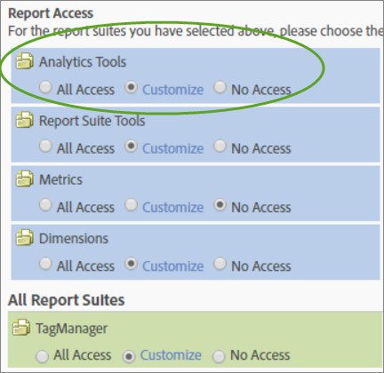

# Machtigingen voor Analytics Tools aanpassen

>[!IMPORTANT]
>
>Gebruiker- en productbeheer is verplaatst naar de [beheerconsole](https://helpx.adobe.com/nl/enterprise/using/admin-console.html). Adobe geeft een melding wanneer het uw tijd is om gebruikers te migreren. Nadat alle klanten zijn gemigreerd, wordt de Help-inhoud voor **[!UICONTROL Analytics]** > **[!UICONTROL Admin]** > **[!UICONTROL User Management]** ingetrokken.

Laat gebruikerstoestemmingen voor Algemene punten (het factureren, logboeken, enz.), het Beheer van het Bedrijf, Hulpmiddelen, de Toegang van de Dienst van het Web, de Bouwer van het Rapport, en de integratie van de Verbindingen van Gegevens toe.

**[!UICONTROL User Management]** > **[!UICONTROL Groups]** > **[!UICONTROL All Report Access]** > **[!UICONTROL Analytics Tools]** > **[!UICONTROL Customize]**

>[!NOTE] De release van 2016 (20 oktober) bracht wijzigingen in groepsbeheer. Zie [Administratieve Veranderingen - Herfst 2016](/help/admin/user-management2/c-user-management/permissions-changes.md) voor een samenvatting van veranderingen.

## Rapporttoegang - Analysefuncties

Klik **[!UICONTROL Customize]** om items te selecteren waartoe deze groep toegang heeft.

## Veldbeschrijvingen

De instellingen op deze pagina hebben betrekking op de rapportsuites die op de [!UICONTROL Define User Groups] pagina zijn geselecteerd.

| Element | Beschrijving |
|--- |--- |
| **Algemeen** |  |
| [Codebeheer](/help/admin/admin/code-manager-admin.md) | Hiermee wordt machtiging ingeschakeld om code voor gegevensverzameling te downloaden voor web en mobiele platforms. |
| Codebeheer - Webservices | Staat een niet administratieve gebruiker toe om tot de Manager van de Code door de Diensten van het Web toegang te hebben. |
| [Logboeken](/help/admin/admin/logs.md) | Hiermee schakelt u machtigingen in voor het aanmelden van bestanden, zodat u kunt zien wanneer gebruikers zich aanmelden, hoe hun gebruik, toegang, rapportsuites en Admin-wijzigingen zijn. |
| Logboeken - Webservices | Staat een niet-administratieve gebruiker toe om tot de logboeken van Hulpmiddelen Admin door de Diensten van het Web toegang te hebben. |
| [Verkeersbeheer](/help/admin/c-traffic-management/traffic-management.md) | De pagina van het Beheer van het verkeer laat u verwachte veranderingen van het verkeersvolume specificeren. |
| Machtigingsbeheer | Hiermee geeft u gebruikers die geen beheerder zijn toegang tot de pagina&#39;s voor gebruikersbeheer in de beheerprogramma&#39;s. Deze gebruikers beschikken over Leesmachtigingen, maar hebben geen schrijfmachtigingen. |
| Machtigingen (schrijven) - Webservices | Verleent niet-administratieve gebruikers lees en schrijf toestemmingsmontages onder het Beheer van de Gebruiker in de Diensten van het Web. Deze instelling verwijst specifiek naar de aangegeven handelingen voor machtigingen in de Admin API. |
| Machtigingen (lezen) - Webservices | Staat een niet-administratieve gebruiker toe om toestemmingsmontages onder Beheer van de Gebruiker in de Diensten van het Web te bekijken. Deze instelling verwijst specifiek naar de aangegeven handelingen voor machtigingen in de Admin API. |
| **Bedrijfsbeheer** |  |
| [Beveiliging](/help/admin/company/security-manager.md) | Verleent toestemming aan de pagina van de Manager van de Veiligheid om toegang tot het melden van gegevens te controleren. De opties omvatten sterke wachtwoorden, wachtwoordafloop, IP login beperkingen, en e-maildomeinbeperkingen. |
| Ondersteuningsinformatie | Verleent toestemming aan de Informatie van de Steun in de Montages van het Bedrijf. |
| [Webservices](/help/admin/company/web-services-admin.md) | Hiermee krijgt u toegang tot de pagina Webservices in de interface Admin Tools ([!UICONTROL Company Settings] > [!UICONTROL Web Services]). De API van de Diensten van het Web verleent programmatic toegang tot de diensten van de Analytics van Adobe die u dubbel en verhogingsfunctionaliteit beschikbaar door het gebruikersinterface laten. |
| Single Sign-On (verouderd) | Hiermee krijgt u toegang tot de eenmalige aanmeldingspagina in Admin Tools. **Opmerking:**Single Sign-On in de Adobe Experience Cloud wordt geïmplementeerd met behulp van een[account die een koppeling](https://marketing.adobe.com/resources/help/en_US/mcloud/organizations.html)maakt tussen de Experience Cloud en oplossingen. |
| [Handelingen in behandeling](/help/admin/company/pending-actions-admin.md) | Hiermee geeft u toestemming voor het beheren van lopende handelingen in [!UICONTROL Company Settings]. |
| [Co-branding](/help/admin/company/co-branding-admin.md) | Hiermee geeft u toestemming voor co-brand Analytics. |
| [Voorkeuren](/help/admin/admin/preferences-manager.md) | Hiermee geeft u de gebruiker toestemming [!UICONTROL Preference Manager]. |
| [Rapportageopties verbergen](/help/admin/company/c-hide-report-suites.md) | Hiermee geeft u toestemming om rapportsuites te verbergen in de gebruikersinterface van Adobe Analytics. |
| **Gereedschappen** | Deze montages verlenen toegang tot de hulpmiddelen van de Analyse (interfaces en toepassingen) en geavanceerde mogelijkheden zoals segmentatie en berekende metriek. |
| [Huidige gegevens](https://marketing.adobe.com/resources/help/en_US/reference/data_latency.html) | Hiermee geeft u toestemming om de functie Huidige gegevens te gebruiken bij rapportage. |
| [Ad-hocanalyse](https://marketing.adobe.com/resources/help/en_US/dsc/) van licentieconstanten | Hiermee krijgt u toegang [!UICONTROL Ad Hoc Analysis]. |
| Webservicetoegang | Laat de toegang van de Diensten van het Web voor niet-beheerders toe. Genereert de geloofsbrieven van de Dienst van het Web. |
| [Report Builder](https://marketing.adobe.com/resources/help/en_US/arb/setup.html) | Leden van deze groep krijgen toegang tot [!UICONTROL Report Builder] licenties. |
| [Toegang tot](https://marketing.adobe.com/resources/help/en_US/analytics/analysis-workspace/) analysewerkruimte | Biedt gebruikers toegang tot de Werkruimte van de Analyse, de geadviseerde rapporteringsinterface voor [!DNL Adobe Analytics]. |
| [Rapporten en analyses](https://marketing.adobe.com/resources/help/en_US/sc/user/) | Hiermee geeft u gebruikers toegang tot rapporten en analyses. |
| [Berekend metrisch ontwerp](https://marketing.adobe.com/resources/help/en_US/analytics/calcmetrics/) | Hiermee geeft u gebruikers toestemming om berekende metriek te maken. |
| [Segment maken](https://marketing.adobe.com/resources/help/en_US/analytics/segment/) | Hiermee geeft u gebruikers toestemming om segmenten te maken. |
| **Gegevensconnectors** |  |
| Integraties (maken, bijwerken of verwijderen) | Verleent toestemming om, de integratie van de Verbinding van Gegevens tot stand te brengen bij te werken en te schrappen. |
