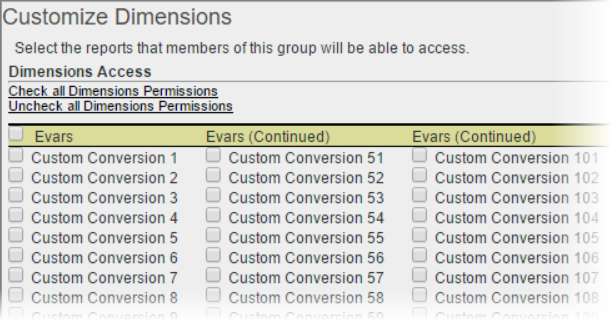

# Dimensie-machtigingen aanpassen

>[!IMPORTANT] Gebruiker- en productbeheer gaat naar de [beheerconsole](https://helpx.adobe.com/nl/enterprise/using/admin-console.html). Adobe geeft een melding wanneer het uw tijd is om gebruikers te migreren. Nadat alle klanten zijn gemigreerd, wordt de Help-inhoud voor **[!UICONTROL Analytics]** > **[!UICONTROL Admin Tools]** > **[!UICONTROL User Management]** ingetrokken.

Pas gebruikerstoegang op een korrelig niveau, met inbegrip van eVars, verkeersrapporten, oplossingsrapporten, en het kleven rapporten aan.

**[!UICONTROL User Management]** > **[!UICONTROL Groups]** > **[!UICONTROL Report Access]** > **[!UICONTROL Dimensions]** > **[!UICONTROL Customize]**

>[!IMPORTANT] Sommige dimensies zijn momenteel niet toegestaan. Deze afmetingen zijn: Lengte mobiele bladwijzer; nummer mobiele apparatuur; mobiele DRM; Mobiele informatiediensten; Mobile Java VM; Decoratie van mobiele post; Mobiele netprotocollen; mobiel besturingssysteem; Mobiele druk om te praten.
>
>Deze afmetingen zijn beschikbaar voor alle gebruikers, ongeacht andere toestemmingen.

De instellingen op deze pagina hebben betrekking op de rapportsuites die op de [!UICONTROL Define User Groups] pagina zijn geselecteerd.

Lees de volgende informatie over de categorie Dimensie voor machtigingen.

* eVars 1-250 zijn afzonderlijk toegestaan.
* Alle verkeersrapporten zijn dimensies.
* Video- en mobiele rapporten zijn dimensies en andere rapporten over analysemogelijkheden (Experience Manager, Advertising Cloud, Social, enzovoort.)
* Er zijn plakrapporten beschikbaar als een gebruiker toegang heeft tot de bovenliggende dimensie.
* Alle huidige afmetingen en metriek binnen aangepaste groepen zijn automatisch gemigreerd naar de nieuwe categorieën. Als metriek is ingeschakeld voor een bestaande groep, krijgt deze standaard alle nieuw toegestane afmetingen (eVars en inhoud behouden) en maatstaven.
* Machtigingen van de importmodule voor classificaties (voorheen SAINT): De toegang tot classificaties wordt bepaald door toegang tot de [variabele](https://marketing.adobe.com/resources/help/en_US/reference/c_classifications.html) waarop de classificatie is gebaseerd.

Voor meer informatie, zie [Veelgestelde Vragen over de Veranderingen](https://marketing.adobe.com/resources/help/en_US/reference/permissions_faq.html)van de Toestemming.

**Afmetingen aanpassen**

De volgende items zijn dimensies die u kunt toestaan.

<table id="table_F37D74A1619A4560A5F5651E855DAF1C"> 
 <thead> 
  <tr> 
   <th colname="col1" class="entry"> Element </th> 
   <th colname="col2" class="entry"> Beschrijvingen </th> 
  </tr> 
 </thead>
 <tbody> 
  <tr> 
   <td colname="col1"> 
 <a href="/help/admin/admin/conversion-var-admin/conversion-var-admin.md"> eVars </a> 
 </td> 
   <td colname="col2"> 
eVars 1-250 zijn afzonderlijk toegestaan. Vars zijn aangepaste conversievariabelen die u gebruikt om de succeswaarden van de segmentconversie in aangepaste rapporten te segmenteren. 
 </td> 
  </tr> 
  <tr> 
   <td colname="col1"> 
 <a href="https://marketing.adobe.com/resources/help/en_US/sc/implement/props_eVars.html"> Props </a> 
 </td> 
   <td colname="col2"> 
Props zijn variabelen voor aangepast verkeer. 
 
Zie <a href="https://marketing.adobe.com/resources/help/en_US/sc/implement/props_eVars.html"> Verkeersprofielen en conversie-eVars </a> in Analytics Implementation. 
 </td> 
  </tr> 
  <tr> 
   <td colname="col1"> 
 <a href="https://marketing.adobe.com/resources/help/en_US/sc/implement/hierN.html"> Hiërarchie </a> 
 </td> 
   <td colname="col2"> 
 De hiërarchische variabele (hierN) bepaalt de locatie van een pagina in de hiërarchie of de paginastructuur van uw site. 
 </td> 
  </tr> 
  <tr> 
   <td colname="col1"> 
 <a href="https://marketing.adobe.com/resources/help/en_US/sc/implement/listN.html"> Listvar </a> 
 </td> 
   <td colname="col2"> 
 Net als bij de werking van List Props staan lijstvariabelen meerdere waarden binnen dezelfde afbeeldingsaanvraag toe. 
 </td> 
  </tr> 
  <tr> 
   <td colname="col1"> 
Standaard 
 </td> 
   <td colname="col2"> 
Verwijst naar standaardafmetingen (out-of-the-box) in Analytics. 
 </td> 
  </tr> 
  <tr> 
   <td colname="col1"> 
 <a href="https://marketing.adobe.com/resources/help/en_US/em/"> AEM </a> 
 </td> 
   <td colname="col2"> 
Adobe Experience Manager 
 </td> 
  </tr> 
  <tr> 
   <td colname="col1"> 
 <a href="https://marketing.adobe.com/resources/help/en_US/media-optimizer/"> AMO </a> 
 </td> 
   <td colname="col2"> 
Adobe Advertising Cloud 
 </td> 
  </tr> 
  <tr> 
   <td colname="col1"> 
 <a href="https://marketing.adobe.com/resources/help/en_US/analytics/activitymap/"> Activiteitenkaart </a> 
 </td> 
   <td colname="col2"> 
 Rapportageafmetingen activiteitenoverzicht: Pagina Activiteitenkaart; Koppeling naar activiteitenoverzicht; Activiteitenkaartgebied; Koppeling activiteitenoverzicht per regio; Activiteitenkaart XY 
 </td> 
  </tr> 
  <tr> 
   <td colname="col1"> 
 <a href="https://marketing.adobe.com/resources/help/en_US/mobile/"> Mobiel </a> 
 </td> 
   <td colname="col2"> 
Adobe Mobile Services 
 </td> 
  </tr> 
  <tr> 
   <td colname="col1"> 
 Comscore 
 </td> 
   <td colname="col2"> 
Deze partnerintegratie is niet meer actief. 
 </td> 
  </tr> 
  <tr> 
   <td colname="col1"> 
 <a href="https://marketing.adobe.com/resources/help/en_US/sc/appmeasurement/hbvideo/nielsen-partnership.html"> Nielsen </a> 
 </td> 
   <td colname="col2"> 
Deze partnerintegratie is niet meer actief. 
 </td> 
  </tr> 
  <tr> 
   <td colname="col1"> 
 Sociaal 
 </td> 
   <td colname="col2"> 
Niet gebruikt. 
 </td> 
  </tr> 
 </tbody> 
</table>
