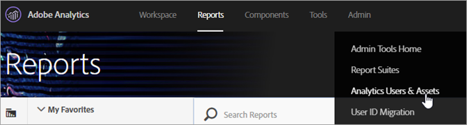
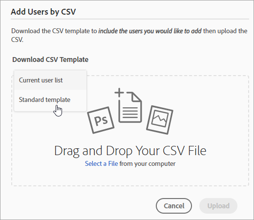

# Analytics-gebruikersaccounts voor Enterprise en Federated ID’s migreren{#migrate-analytics-user-accounts-for-enterprise-and-federated-ids}

Analytics-gebruikersaccounts migreren als Enterprise- of federatieve id&#39;s naar de Admin Console.

## Vereisten {#prereqs}

Vereisten voor het beheren van gebruikers in de Admin Console.

Voer de volgende stappen uit voor nieuwe domeinen en mappen:

* Een map instellen
* Domeinen instellen
* Domeinen koppelen aan mappen

Zie [Een identiteitssysteem](https://helpx.adobe.com/enterprise/using/set-up-identity.html) instellen voor hulp.

Als een folder reeds in een andere organisatie door een andere bedrijfseenheid of een team werd gecreeerd, volg de stappen in [folder het vertrouwen](https://helpx.adobe.com/enterprise/using/set-up-identity.html#Directorytrusting) om de folder in de organisatie te vestigen die u voor Analytics gebruikt.

## Migrate user accounts for Enterprise and Federated IDs {#task-0cfb3e4400fd4ab58e4d9704528b05fa}

In deze procedure zult u:

* Download een gebruikerslogin lijst van **[!UICONTROL Analytics]** > **[!UICONTROL Analytics Users & Assets]**.

* Download een lijst met huidige gebruikers via **[!UICONTROL Admin Console]** > **[!UICONTROL Users]**.

* Vergelijk de lijsten (er wordt gezocht naar duplicaten zodat u geen overschrijvingen van accountgegevens in de Admin Console voorkomt).
* Upload een voltooide versie [!DNL .csv] (van **[!UICONTROL Admin Console]** > **[!UICONTROL Users]**) met gebruikers van Enterprise ID of Federated ID naar de Admin Console.

Als u bestaande Adobe ID-gebruikersaccounts moet migreren naar een Enterprise ID of Federated ID, neemt u contact op met de klantenservice van de Adobe en vraagt u een [bulkidentiteitsschakelaar](https://helpx.adobe.com/enterprise/using/bulk-operations.html)aan.

**Gebruikersaccounts migreren**

1. Download het Analytics-gebruikersaanmeldingsbestand ( [!DNL User Logins List.tab]) via Analytics User Management met een van de volgende methoden (afhankelijk van of u al migreerde gebruikers).
   1. *Navigeer vóór de migratie* naar **[!UICONTROL Admin]** > **[!UICONTROL User Management (Legacy)]** > **[!UICONTROL Edit Users]** en klik op **[!UICONTROL Download Report]**.

      

      De koppeling Rapport downloaden wordt alleen weergegeven voor klanten die geen migrerende gebruikers hebben.

   1. *Als u al gemigreerde gebruikers hebt,* navigeert u naar **[!UICONTROL Analytics]** > **[!UICONTROL Analytics users and Assets]**.

      

   1. Selecteer gebruikers op de [!DNL Users] pagina en klik op **[!UICONTROL Export to CSV]**.

      

   1. Open het gedownloade [!DNL User List.csv] bestand in Excel.

      Ben bereid om de *`Email`*, *`First Name`*, en de *`Last Name`* waarden aan een [!DNL sample.csv] dossier (die in de volgende stap wordt beschreven) te kopiëren.

      >[!IMPORTANT] De waarden in het CSV-bestand moeten door komma&#39;s worden gescheiden.

      >[!TIP] Tijdens deze stap raadt Adobe aan uw gebruikerslijst te stroomlijnen om ervoor te zorgen dat alleen gebruikers met een geldige e-mailid worden opgenomen in de migratie naar Enterprise of Federated ID.

1. Download in het [!UICONTROL Admin Console]deelvenster een lijst met gebruikers van Admin Consoles:

   1. Navigeer naar [!UICONTROL Admin Console] > **[!UICONTROL Users]** en klik vervolgens op Lijst met gebruikers [exporteren naar CSV](https://helpx.adobe.com/enterprise/using/users.html).

      

   1. Vergelijk de twee bestanden: de bestaande Admin Console-gebruikers in het geëxporteerde [!DNL .csv] bestand ( [!DNL sample.csv]in dit voorbeeld) met de gebruikers in het Analytics- [!DNL User Logins List.csv] bestand.

      >[!IMPORTANT] Als u duplicaten zoekt, verwijdert u deze uit het Analytics- [!DNL User Logins List.csv] bestand. Met deze stap kunt u voorkomen dat bestaande Experience Cloud-gebruikersmachtigingen in de Admin Console worden overschreven. U krijgt dan een lijst met accounts die u wilt migreren.

1. Download het malplaatje CSV van de Admin Console:
   1. Klik op het tabblad Gebruikers **[!UICONTROL Add users by CSV]** en klik vervolgens **[!UICONTROL Download CSV Template]**.

      

   1. Kies **[!UICONTROL Standard Template]**.

      Deze stap downloadt een [!DNL sample.csv] sjabloonbestand.

      

1. Kopieer de *`Email`*, *`First Name`*, en *`Last Name`* kolomwaarden van [!DNL User Logins List.tab] aan de overeenkomstige kolommen in het [!DNL sample.csv] malplaatje.

   **Voorbeeld van sjabloonbestand**

   

1. Vul in de sjabloon ( [!DNL sample.csv]) de volgende vereiste velden in:

<table id="table_1B5EEFDB5BD8436EB760BE5FFAB1CF02"> 
 <thead> 
  <tr> 
   <th colname="col1" class="entry"> Veld </th> 
   <th colname="col2" class="entry"> Beschrijving </th> 
  </tr>
 </thead>
 <tbody> 
  <tr> 
   <td colname="col1"> 
E-mail 
 </td> 
   <td colname="col2"> 
Gekopieerd van de Logins List.tab  van deGebruiker. 
 </td> 
  </tr> 
  <tr> 
   <td colname="col1"> 
Voornaam 
 </td> 
   <td colname="col2"> 
Gekopieerd van de Logins List.tab  van deGebruiker. 
 </td> 
  </tr> 
  <tr> 
   <td colname="col1"> 
Achternaam 
 </td> 
   <td colname="col2"> 
Gekopieerd van de Logins List.tab  van deGebruiker. 
 </td> 
  </tr> 
  <tr> 
   <td colname="col1"> 
Identiteitstype 
 </td> 
   <td colname="col2"> 
 Federated ID of  Enterprise ID. 
 </td> 
  </tr> 
  <tr> 
   <td colname="col1"> 
Domein 
 </td> 
   <td colname="col2"> 
Zorg ervoor dat domeinen in de kolom  Domein en  E-mail overeenkomen met de domeinen die in de eerste vereisten</a>zijn vastgelegd. 
 </td> 
  </tr> 
  <tr> 
   <td colname="col1"> 
Landcode 
 </td> 
   <td colname="col2"> </td> 
  </tr> 
 </tbody> 
</table>

Zie [!DNL .csv] CSV-bestandsindeling [voor meer informatie over de velden in het](https://helpx.adobe.com/enterprise/using/users.html)bestand.

>[!NOTE] Andere kolommen, zoals [!UICONTROL Product Configurations] en [!UICONTROL Admin Roles] kunnen leeg zijn.

1. Voor het lusje van Gebruikers in de Admin Console, upload het malplaatjedossier door te klikken **[!UICONTROL Add users by CSV]** (zoals aangetoond in Stap 3.).
1. Voer in Analytics het migratiehulpprogramma uit (zoals beschreven in [Analytics-gebruikersaccounts](/help/admin/user-management2/user-migration/t-migrate-users.md)migreren).
1. Klik op **[!UICONTROL Migrate]** > **[!UICONTROL Migrate as Enterprise IDs]**.

   

   Wanneer u klikt **[!UICONTROL Migrate]**, wordt de gebruiker gekoppeld aan de Enterprise ID/Federated ID-account in de Admin Console. De machtigingen van de verouderde gebruikersaccount in Analytics komen overeen met de machtigingen die zijn toegekend aan de Enterprise/Federated ID-aanmelding in **[!UICONTROL Admin Console]** > **[!UICONTROL Analytics]** > **[!UICONTROL Product Profiles]**. De gebruikers-id wordt weergegeven in het emmertje voor migratie voltooid. U kunt de [!DNL my.omniture.com] toegang tot deze systemen uitschakelen.

   Na het migreren van gebruikers, verandert de status onder de kolom van de Status van de Migratie van **[!UICONTROL Not Initiated]** aan **[!UICONTROL Migrated]**.

   Adobe ID-gebruikers die in het migratieprogramma worden weergegeven, kunnen ook in dit proces worden gemigreerd. Zij moeten nog met hun Adobe ID aanmelden tot een identiteitsschakelaar wordt uitgevoerd. Neem contact op met de klantenservice van Adobe voor hulp bij een identiteitsschakelaar.
