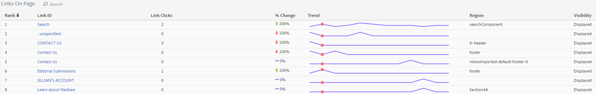

# Rapport Koppelingen

Het koppelingenrapport rapporteert over de koppelingen die op de huidige pagina zijn gevonden. Er wordt geen melding gemaakt van alle koppelingen die voor die pagina zijn verzameld.

Het rapport Koppelingen op pagina biedt een tabelweergave van de koppelingen. Soms wilt u dat koppelingsklikken (of andere metriek) in één weergave worden gerangschikt. Hierdoor kunt u de ene koppeling beter met de andere vergelijken. Maak het rapport Koppelingen op pagina inclusief een gerangschikte lijst met alle koppelingen op de pagina (op koppeling-id), de klikgegevens (# en %) en het gebied op de pagina. Klik op de knop Koppelingen in paginarapport op de werkbalk Activity Map.

De **[!UICONTROL Links On Page]** Het rapport wordt onder het browserframe in het dashboard Activity Map geopend.

## Standaardmodus {#section_C8D2A1C07A2A4E3A8F84AC9240603FA7}

In de standaardmodus worden in het rapport &quot;Koppelingen op pagina&quot; koppelingsgegevens weergegeven die variëren van één dag tot meerdere dagen en die over het volledige datumbereik zijn geaggregeerd. De volgende informatie zal voor elke verbinding worden getoond:

<table id="table_3DE41B2CFA644B70AF802A3123CE51D9"> 
 <thead> 
  <tr> 
   <th colname="col1" class="entry"> Kolom </th> 
   <th colname="col2" class="entry"> Beschrijving </th> 
  </tr> 
 </thead>
 <tbody> 
  <tr> 
   <td colname="col1"> Rang </td> 
   <td colname="col2"> Rang op pagina. In de Standaardmodus blijft de randewaarde ongewijzigd, ongeacht de kolom waarop u klikt. </td> 
  </tr> 
  <tr> 
   <td colname="col1"> Koppelings-id </td> 
   <td colname="col2">De primaire id van de koppeling (voor meer informatie over hoe de primaire id door de <a href="/help/analyze/activity-map/activitymap-link-tracking/activitymap-link-tracking-methodology.md">Nieuwe methode voor het bijhouden van koppelingen</a>) </td> 
  </tr> 
  <tr> 
   <td colname="col1"> Klikken </td> 
   <td colname="col2"> Het aantal onbewerkte klikken voor een opgegeven koppeling en het percentage van het totale aantal klikken op de pagina. Als de gebruiker verschillende metrisch in de toolbar kiest, zal het rapport van de Verbinding over die metrisch in plaats daarvan rapporteren. </td> 
  </tr> 
  <tr> 
   <td colname="col1"> Regio </td> 
   <td colname="col2"> Vertegenwoordigt het gebied op de pagina waar de verbinding wordt gevestigd. </td> 
  </tr> 
  <tr> 
   <td colname="col1"> Zichtbaarheid </td> 
   <td colname="col2">Heeft betrekking op de zichtbaarheidsstatus van de koppeling. Er zijn twee waarden mogelijk: 
    <ul id="ul_BABCC0F64145407C9D439150A6898E6D">
     <li id="li_9AF0479BDCEB4A44A37292FAABFA83A5"><b>Verborgen</b>: De koppeling staat momenteel op de pagina maar is niet zichtbaar voor de eindgebruiker (zoals een submenu in een navigatiemenu dat alleen zichtbaar wordt als de gebruiker boven op het bovenliggende menu zweeft) </li>
     <li id="li_C6FA4EC27EDD4341AB9821E2B4BC9E60"><b>Weergegeven</b>: de koppeling wordt momenteel weergegeven op de pagina. Het kan echter onder de vouw worden weergegeven: de gebruiker zou de pagina moeten scrollen om het te zien. </li>
    </ul>
Opmerking: Als een koppeling is ingesteld op "Hidden", worden er geen overlays voor weergegeven. 
</td> 
  </tr> 
 </tbody> 
</table>

**Gegevens filteren**

Als u nul wilt gebruiken voor een specifieke koppeling, kunt u zoeken naar een verwante term in het dialoogvenster **[!UICONTROL Filter Data]** veld. Alleen de koppelingen die overeenkomen met de zoekopdracht hebben bedekkingen. Zonder filter worden de in het dialoogvenster [Activity Map-instellingen](/help/analyze/activity-map/activitymap-overlay-settings.md) wordt weergegeven.

## Live-modus {#section_AC1967217B5A4532ACB01D33636F6770}

In Live modus worden in het rapport Koppelingen op pagina trendgegevens weergegeven die enkele minuten beslaan.

<table id="table_61D1FB0F02894055A1AB394DE4FE4742"> 
 <thead> 
  <tr> 
   <th colname="col1" class="entry"> Kolom </th> 
   <th colname="col2" class="entry"> Beschrijving </th> 
  </tr> 
 </thead>
 <tbody> 
  <tr> 
   <td colname="col1"> Rang </td> 
   <td colname="col2"> Rang op pagina. In het geval van een verloop- of bubbelbedekking blijft de rank waarde gelijk, ongeacht de kolom waarop u klikt. In het geval van een bedekking voor bedekkingsmakers/verliezers verandert die rangswaarde op basis waarvan koppelingen het meest werden of verloren. </td> 
  </tr> 
  <tr> 
   <td colname="col1"> Koppelings-id </td> 
   <td colname="col2">De primaire id van de koppeling. Voor meer informatie over hoe de primaire id wordt gedefinieerd door de nieuwe <a href="/help/analyze/activity-map/activitymap-link-tracking/activitymap-link-tracking-methodology.md"> Methodologie voor het bijhouden van koppelingen</a>. </td>
  </tr> 
  <tr> 
   <td colname="col1"> Koppelingsklikken </td> 
   <td colname="col2"> De totale kliks voor de geselecteerde tijdspanne. </td> 
  </tr> 
  <tr> 
   <td colname="col1"> % wijzigen </td> 
   <td colname="col2"> % verandering tussen de maatstaven voor de koppeling aan de huidige periode en de maatstaven voor de koppeling aan de vorige periode. Negatieve procentuele wijziging wordt weergegeven in rood, positief in groen. </td> 
  </tr> 
  <tr> 
   <td colname="col1"> Trend </td> 
   <td colname="col2"> Een lijndiagram voor alle verzamelde perioden. De momenteel geselecteerde periode wordt aangegeven met een groene markering. De huidige aanhoudperiode wordt aangegeven met een rode markering. </td> 
  </tr> 
  <tr> 
   <td colname="col1"> Regio </td> 
   <td colname="col2"> Vertegenwoordigt het gebied op de pagina waar de verbinding wordt gevestigd. </td> 
  </tr> 
  <tr> 
   <td colname="col1"> Zichtbaarheid </td> 
   <td colname="col2">Heeft betrekking op de zichtbaarheidsstatus van de koppeling. Er zijn twee waarden mogelijk: 
    <ul id="ul_B10C55ED4D3C4CF99506DC467E2E7CFB">
     <li id="li_EA646722A51041CC9E62C56DEF92C81F">Verborgen: De koppeling staat momenteel op de pagina maar is voor u niet zichtbaar (bijvoorbeeld een koppeling die wordt weergegeven nadat de pagina is geladen). </li>
     <li id="li_F9543614C2894003AC9984A7404E2785">Weergegeven: de koppeling wordt momenteel weergegeven op de pagina. Het kan echter onder de vouw worden weergegeven: u moet de pagina schuiven om deze te kunnen zien. </li>
    </ul></td> 
  </tr> 
 </tbody> 
</table>

## Sorteren en filteren {#section_4B8E8233C21247CAA70DAEC2156548AD}

Soms moet u alleen de resultaten van een bepaald paginagebied (bijvoorbeeld het linkervenster) analyseren om te bepalen hoe u de inhoud van dat specifieke gebied van de webpagina wilt ordenen.

Hiertoe hebben we een sorteer- en filterfunctie voor koppelingen gemaakt in het rapport Koppelingen op pagina. Filteren is beschikbaar door het filtergebied en de onderzoekstermijn zal op de kolom van identiteitskaart van de Verbinding en de kolom van het Gebied van de Verbinding worden toegepast. Sorteren is beschikbaar door op vraag-ons (Rang, identiteitskaart van de Verbinding, Klikken, Verandering in tijd, Gebied, Zichtbaarheid) te klikken en het kan zowel oplopend als dalend zijn. Bedekkingen verdwijnen van de website wanneer koppelingen worden uitgefilterd uit het rapport Koppelingen op pagina.
