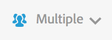

# Klantsegmentering

Hiermee kunt u een filter met meerdere segmenten toepassen binnen Activiteitenkaart.

> [!NOTE] Het besturingselement Segment is alleen beschikbaar in de standaardmodus, omdat het Adobe Analytics-platform geen ondersteuning biedt voor het segmenteren van realtime-gegevens.

U kunt een of meerdere segmenten selecteren in het onderstaande **[!UICONTROL Segments]** keuzemenu. De vermelde segmenten zijn gelijk aan de segmenten die u hebt of die met u via Rapporten &amp; Analytics zijn gedeeld, voor de geselecteerde rapportsuite.

Wanneer de selectie van het segment of de segmenten is gewijzigd en nadat de segmentkiezer is gesloten, wordt een nieuw proces gestart voor het ophalen van gegevens van Analytics voor alle metriek die in de toepassing worden weergegeven. Het geselecteerde segment of de geselecteerde segmenten worden onthouden wanneer u van pagina naar pagina navigeert.

Wanneer meer dan één segment wordt geselecteerd, zal het Etiket van de Selectie van het Segment (in een doen ineenstorten staat) &quot;Veelvoud&quot;tonen. De volledige lijst van geselecteerde segmenten zal worden getoond wanneer u de controle klikt.

De geselecteerde segmenten worden toegepast op alle analyserapporten die worden gepresenteerd in de activiteitenoverzicht, d.w.z. overlays en de **[!UICONTROL Links on Page]** en **[!UICONTROL Page Details]** rapporten.
