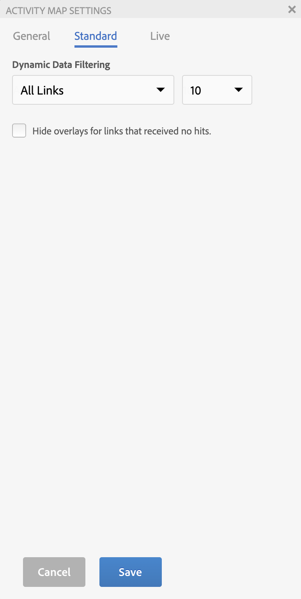

# Instellingen Activity Map configureren

In het deelvenster Activity Map-instelling kunt u de instellingen en eigenschappen voor alle typen overlayvisualisaties wijzigen.

Open het deelvenster Instellingen Activity Map dat u wilt openen door op het tandwielpictogram op de werkbalk Activity Map te klikken.

## Algemene instellingen {#section_697A12F099494D699A4BF498598178C5}

| Instelling | Beschrijving |
| --- | --- |
| **[!UICONTROL Companies]** | Selecteer het toepasselijke login bedrijf. |
| **[!UICONTROL Report Suite]** | De lijst met rapportsuites die voor u toegankelijk zijn, is niet meer beperkt tot de rapportsuites die zijn gedefinieerd in de webpaginatag. U kunt de geselecteerde rapportsuite (die overeenkomt met een van de tags op de pagina) nu vervangen door een andere rapportsuite. Deze nieuwe rapportsuite hoeft niet te worden gekoppeld aan een tag op de pagina. Als u de geselecteerde rapportsuite wijzigt in de Activity Map-instellingen, worden alle desbetreffende analyserapporten vernieuwd tijdens het opslagproces. **Belangrijk**: [!UICONTROL Virtual Report Suites] niet verenigbaar zijn met [!UICONTROL Live Mode], alleen met [!UICONTROL Standard Mode]. Als u binnen [!UICONTROL Live Mode] voor een Standard Report Suite, maar selecteer een [!UICONTROL Virtual Report Suite] in dit dialoogvenster klikt u op **[!UICONTROL OK]** Hier wordt de Standaardmodus weergegeven. Bovendien wordt de controle van de Kalender opnieuw geïnitialiseerd om het de kalendertype van de rapportreeks (Gregorian, kleinhandel, douane...) aan te passen. |
| **[!UICONTROL Page Name]** | De pagina waarop deze instellingen van toepassing zijn. |
| **[!UICONTROL Language]** | De selectie komt overeen met de talen die voor Adobe Analytics worden aangeboden. |
| **[!UICONTROL Label Overlays With]** | <ul><li>**[!UICONTROL No Label]**: alleen van toepassing op de verloopbedekking. In dit geval geeft de kleur van de overlay een idee voor de rangschikking van de koppeling</li><li>**[!UICONTROL Value]**: het onbewerkte metrische totaal voor die koppeling</li><li>**[!UICONTROL Percent]**: percentage van metrisch voor deze verbinding op totale metrisch voor de pagina.</li><li>**[!UICONTROL Rank]**: rang van deze koppeling voor alle koppelingen die zich op de weergegeven pagina bevinden</li></ul> |
| **[!UICONTROL Label Font Size]** | Hiermee kunt u de tekengrootte van het bedekkingslabel met een schuifregelaar vergroten/verkleinen voor betere leesbaarheid. |
| **[!UICONTROL Gradient/Bubble Color]** | Als u overlaykoppelingsclassificaties voor de visualisaties van verloop- of bubbelbedekkingen wilt weergeven, selecteert u een van de kleuren. |
| **[!UICONTROL Color Gradient Based On]** | <ul><li>**[!UICONTROL Top 30 Rankings]**: De kleurintensiteit wordt genormaliseerd voor de bovenste 30 waarden.</li><li>**[!UICONTROL Absolute Metric Value]**: De kleurintensiteit is een functie van de absolute metrische waarde.</li></ul> |
| **[!UICONTROL Gradient Transparency]** | Selecteer het transparantieniveau voor de verloopbedekkingen. Deze instelling heeft geen invloed op de [!UICONTROL Bubble] bedekkingen. |

## Standaardinstellingen {#section_24DB95376E1A448494ECF3F57743FC19}

Deze instellingen zijn van toepassing op de standaardmodusbedekking.

| Instelling | Beschrijving |
| --- | --- |
| **[!UICONTROL Dynamic Data Filtering]** | In deze vervolgkeuzelijst kunt u overlays weergeven voor<ul><li>(standaard) Alle koppelingen op de pagina</li><li>Het hoogste (hoogste) of laagste (laagste) aantal gerangschikte koppelingen op de pagina, waarbij # een keuze kan zijn uit 1, 10, 50 of 100.</li></ul> |
| **[!UICONTROL Hide overlays for links that received no hits]**. | Een selectievakje waarmee de zichtbaarheid van overlays voor koppelingen zonder gegevens wordt geschakeld.<ul><li>(gebrek) als checkbox wordt gecontroleerd, dan wordt geen bedekking getoond wanneer een verbinding geen ActivityMap verbindingsgegevens heeft.</li><li>Als het selectievakje is uitgeschakeld, wordt een overlay weergegeven als een koppeling geen ActivityMap-koppelingsgegevens heeft en een label &quot;-&quot;, wat betekent: N.v.t. (niet van toepassing). |

## Live-instellingen {#section_D30F6E62FB5D404090B588F396A460AF}

Deze instellingen zijn van toepassing op de overlay van de live modus.

| Instelling | Beschrijving |
|---|---|
| **[!UICONTROL Display Top]** | Als u het dialoogvenster **[!UICONTROL Gainers]** of **[!UICONTROL Losers]** (of beide) als bedekkingen selecteert u het aantal koppelingen. |
| **[!UICONTROL Exclude bottom (%)]** | Schakel deze optie in om te voorkomen dat er koppelingen zijn naar Gainers-Losers met dunne gegevens. Filter het onderste percentage van koppelingswijzigingen uit om alleen de koppelingen weer te geven met voldoende gegevens om relevante winsten of verliezen weer te geven. Het percentage wordt berekend op basis van het aantal koppelingen op die pagina. Als u bijvoorbeeld de onderste 10% van een lijst met 200 koppelingen verwijdert, worden de onderste 20 koppelingen verwijderd. |
| **[!UICONTROL Auto Update Data]** | Hiermee kunt u bepalen of de analysegegevens die in de interface worden weergegeven, automatisch worden bijgewerkt wanneer een nieuwe periode wordt berekend. |
| **[!UICONTROL Auto Update Period]** | Als deze optie is ingeschakeld, wordt de webpagina vernieuwd met elke nieuwe gegevensophaling, zodat de koppelingen op de pagina nauwer kunnen worden gesynchroniseerd met de verzamelde gegevens. |
