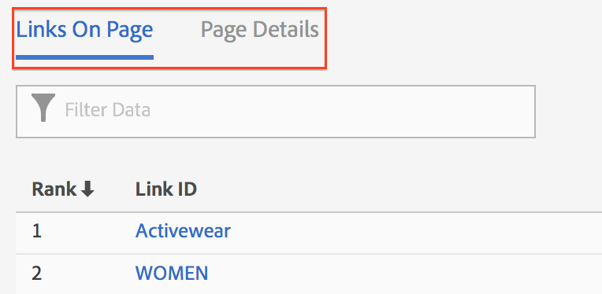

# Activity Map-gebruikersinterface

De interface van de Activity Map bestaat uit twee delen:

* Het bovenste venster met de webpagina en de geïnjecteerde overlays en werkbalk.
* Een onderste venster voor rapporten.

## Deelvenster Boven {#section_2DA8ACD35D4C4ACBA32C13EFB5317E7C}

Bovenaan ziet u de webpagina met de [geïnjecteerde werkbalk](/help/analyze/activity-map/activitymap-standard-live.md) en [koppelingsoverlays](/help/analyze/activity-map/activitymap-gainerslosers.md). Bubble-classificaties worden weergegeven over koppelingen, zodat u het totale aantal klikken kunt identificeren.

Aanvullende koppelingsdetails zijn toegankelijk door de muisaanwijzer op elke koppelingsoverlay te plaatsen:

## Deelvenster Onderste rapporten {#section_21B129D69B7A4F918E975E8E66DB02EE}

Onder aan de pagina ziet u de [Koppelingen op pagina](/help/analyze/activity-map/activitymap-links-report.md) Verslag en de [Paginagegevens](/help/analyze/activity-map/activitymap-page-flow.md) Rapport waarin u een overzicht kunt weergeven van uw huidige webpaginatiestatistieken en informatie over de paginastroom.

In het rapport Koppelingen op pagina ziet u een spreadsheetweergave van de koppelingen op de huidige pagina, inclusief aanvullende klikgegevens. Het rapport Paginadetails bevat analysegegevens met betrekking tot de pagina&#39;s die vóór en na het navigeren naar de momenteel weergegeven pagina zijn bezocht.

