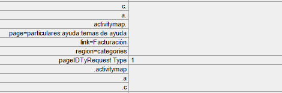

# Los de gegevensinzameling van de Activity Map problemen op

Als u geen gegevens voor Activity Map afmetingen ziet, gebruik deze pagina helpen bepalen waarom.

## Bevestig gegevensinzameling gebruikend debugger

Eerst, zorg ervoor dat AppMeasurement correct de gegevens van de Activity Map verzamelt.

1. Download en installeer de [Adobe Experience Cloud Debugger Chrome-extensie](https://experienceleague.adobe.com/docs/debugger/using/experience-cloud-debugger.html).
2. Navigeer naar uw webpagina en klik op een koppeling.
3. Open foutopsporing wanneer de volgende pagina wordt geladen. Valideren of er tussen de Activity Map-contextgegevensvariabelen wordt gezocht `activitymap.` en `.activitymap`:

## Mogelijke redenen waarom er geen Activity Map-gegevens aanwezig zijn

Controleer elk van de volgende opties om te controleren of er Activity Map-componenten aanwezig zijn:

* **AppMeasurement-versie**: Activity Map wordt ondersteund op versie 1.6 en hoger. Veel problemen met randhoofdletters en kleine letters worden opgelost wanneer u een upgrade uitvoert naar de nieuwste stabiele versie van AppMeasurement.
* **Activity Map, module**: Controleer of de `AppMeasurement_Module_Activity_Map` is aanwezig in uw `AppMeasurement.js` bestand. Als uw implementatie Adobe Experience Platform gebruikt om gegevens te verzamelen, moet u ervoor zorgen dat **[!UICONTROL Enable ClickMap]** is ingeschakeld wanneer u de extensie Analytics configureert onder **[!UICONTROL Link tracking]**.
* **De `s_sq` koekje**: Activity Map hangt af van de `s_sq` cookie voor gegevensverzameling.
   * Zorg ervoor dat de `cookieDomainPeriods` variabele wordt correct ingesteld, vooral voor regionale domeinen zoals `*.co.uk` of `*.co.jp`.
   * Zorg ervoor dat de `linkInternalFilters` variabele wordt ingesteld op de gewenste waarden. Als een aangeklikte koppeling niet overeenkomt met interne filters, beschouwt de Activity Map deze als een exit-koppeling en worden er geen gegevens verzameld.
* **Activity Map-overlay wordt uitgevoerd**: AppMeasurement houdt geen klikgegevens voor uw Web-pagina bij wanneer de Activity Map bekleding wordt toegelaten.
