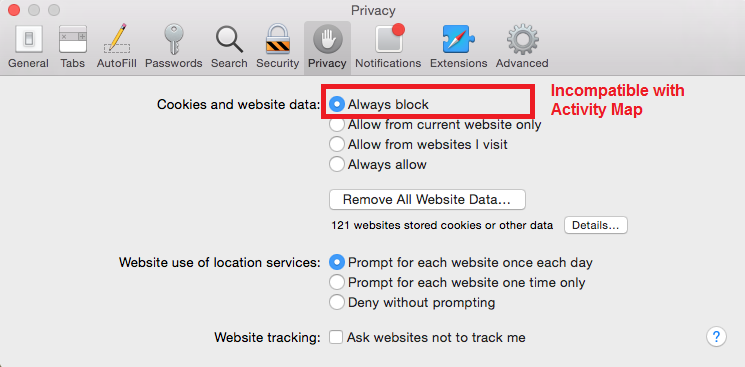

# Browserextensies oplossen

Toont de browser parameters die niet compatibel met het gebruik van de Kaart van de Activiteit zijn. U moet deze instellingen uitschakelen.

## Chroom

## Firefox

## Safari

## Internet Explorer

