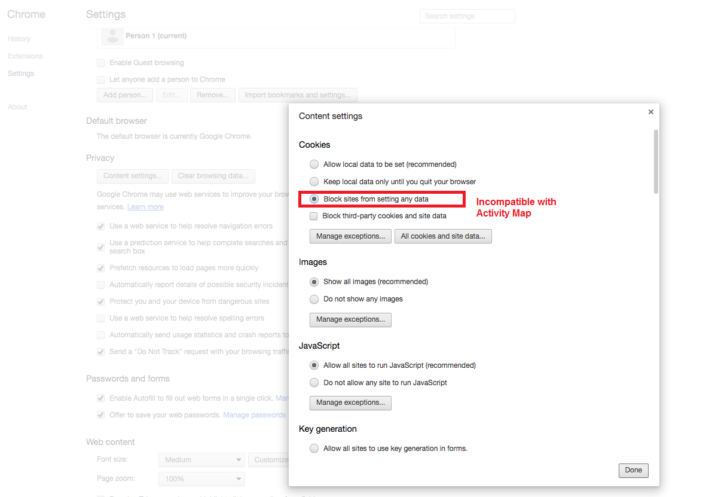
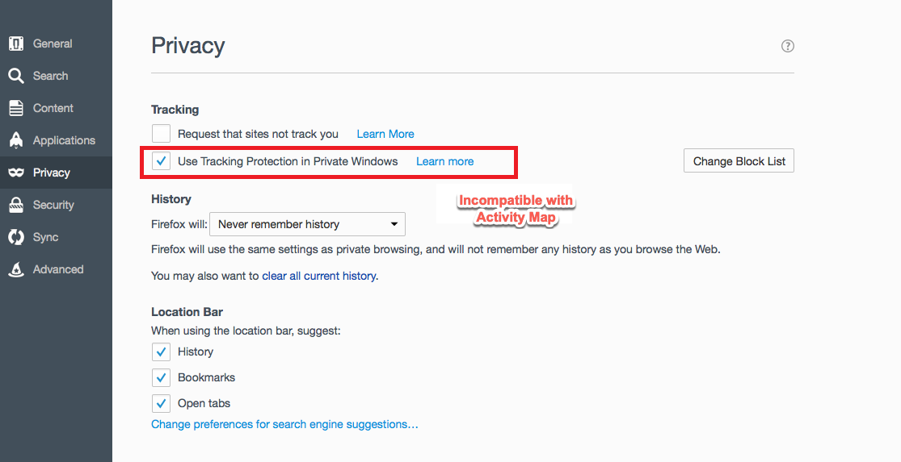

# Los de gegevensinzameling van de Activity Map problemen op

Als u geen gegevens voor Activity Map afmetingen ziet, gebruik deze pagina helpen bepalen waarom.

## Bevestig gegevensinzameling gebruikend debugger

Eerst, zorg ervoor dat het AppMeasurement correct de gegevens van de Activity Map verzamelt.

1. Download en installeer de [ Debugger Chrome Uitbreiding ](https://experienceleague.adobe.com/en/docs/experience-platform/debugger/home) van Adobe Experience Cloud.
2. Navigeer naar uw webpagina en klik op een koppeling.
3. Open foutopsporing wanneer de volgende pagina wordt geladen. Valideer dat er tussen `activitymap.` en `.activitymap` sandwichgegevensvariabelen voor de Activity Map worden weergegeven:

## Mogelijke redenen waarom er geen Activity Map-gegevens aanwezig zijn

Controleer elk van de volgende opties om te controleren of er Activity Map-componenten aanwezig zijn:

* **versie van het AppMeasurement**: de Activity Map wordt gesteund op v1.6 en hierboven. Veel problemen met randproblemen worden opgelost wanneer u een upgrade uitvoert naar de nieuwste stabiele versie van het AppMeasurement.
* **module van de Activity Map**: Controle als de `AppMeasurement_Module_Activity_Map` module in uw `AppMeasurement.js` dossier aanwezig is. Als in uw implementatie Adobe Experience Platform wordt gebruikt om gegevens te verzamelen, controleert u of **[!UICONTROL Enable ClickMap]** is ingeschakeld bij het configureren van de extensie Analytics onder **[!UICONTROL Link tracking]** .
* **het `s_sq` koekje**: de Activity Map hangt van het `s_sq` koekje voor gegevensinzameling af.
   * Controleer of de variabele `cookieDomainPeriods` correct is ingesteld, vooral voor regionale domeinen zoals `*.co.uk` of `*.co.jp` .
   * Controleer of de variabele `linkInternalFilters` op de gewenste waarden is ingesteld. Als een aangeklikte koppeling niet overeenkomt met interne filters, beschouwt de Activity Map deze als een exit-koppeling en worden er geen gegevens verzameld.
* **Activity Map overlay die** loopt: AppMeasurement volgt klikgegevens voor uw Web-pagina niet wanneer de Activity Map overlay wordt toegelaten.

Hiermee worden de browserparameters weergegeven die niet compatibel zijn met het gebruik van Activity Map. Adobe raadt u aan deze instellingen uit te schakelen.

## Chrome

## Firefox

## Safari

## Internet Explorer

**Bevestiging**

Interactieve aanroepen met het tabblad Developer Console Network:

1. Laad het manuscript van de Lancering van de Ontwikkeling op de plaats.
1. Bij klikken op elementen zoekt u naar &#39;/ee&#39; op het tabblad Netwerk

Adobe Experience Platform Debugger:

1. Download en installeer [ debugger van Adobe Experience Platform ](https://chromewebstore.google.com/detail/adobe-experience-platform/bfnnokhpnncpkdmbokanobigaccjkpob).
1. Ga naar [!UICONTROL Logs] > [!UICONTROL Edge] > [!UICONTROL Connect to Edge] .

* **de interactie vraag vuurt niet in het lusje van het Netwerk**: De klik gegevensinzameling in een verzamelen vraag, filter met of `"/ee"` of `"collect?"`.
* **er is geen Vertoning van de Lading voor de verzamel vraag**: De inzamel vraag wordt ontworpen op een dergelijke manier dat het volgen navigatie aan andere plaatsen niet beïnvloedt, zodat is de document unload eigenschap van toepassing voor de verzamel vraag. Deze functie heeft geen invloed op de gegevensverzameling, maar als u de validatie op de pagina moet uitvoeren, voegt u `target="_blank"` toe aan het desbetreffende element. De koppeling wordt geopend op een nieuw tabblad.
