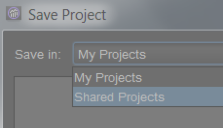

# Aan de slag met ad-hocanalyse{#concept_48936BA28FAE42DB81F1B2CD4726EB17}

>[!Ibelangrijk]
>Op 6 augustus 2018 kondigde Adobe aan dat het de bedoeling was om ad-hocanalyse te beëindigen. Een einddatum wordt gedeeld zodra deze beschikbaar is. Ga voor meer informatie, waaronder de versies van Java die tijdens deze periode compatibel zijn, naar [https://adobe.ly/discoverworkspace](https://adobe.ly/discoverworkspace).

U kunt ogenblikkelijke, geavanceerde analyse op websiteactiviteit uitvoeren. U kunt veelvoudige rapporten gelijktijdig bekijken en segmenten over veelvoudige afmetingen toepassen. U kunt de gegevens vanuit zowel micro- als macroperspectieven analyseren om hun effect op uw belangrijke bedrijfsmetriek te bekijken.

Met deze functies kunt u vragen beantwoorden over siteverkeer, demografie van bezoekers, omzet en productbeweging. Vervolgens kunt u uw gegevens filteren, sorteren en segmenteren om de antwoorden op precieze vragen te vinden. De resultaten worden bijna onmiddellijk geretourneerd, zodat u snel de effecten van een combinatie van factoren kunt analyseren.

<table id="table_C9C0444687FC418580F996E1D2ADB61A"> 
 <thead> 
  <tr> 
   <th colname="col1" class="entry"> Aan de slag met taken </th> 
   <th colname="col2" class="entry"> Beschrijving </th> 
  </tr> 
 </thead>
 <tbody> 
  <tr> 
   <td colname="col1"> 
1. Meld u aan bij Adobe  Analytics. 
 </td> 
   <td colname="col2"> 
Ga naar <a href="https://marketing.adobe.com"  > marketing.adobe.com </a>en meld u aan met de gegevens voor Adobe Analytics. 
 </td> 
  </tr> 
  <tr> 
   <td colname="col1"> 
2. Ad hoc analyse starten. 
 </td> 
   <td colname="col2">Klik op  Adobe Analytics &gt;  Tools &gt; Ad hoc Analysis  en klik vervolgens op de knop Ad hoc-analyse starten. 
 
Opmerking: Als u de knoop van de Analyse <b>Ad hoc van de</b> Lancering niet op deze pagina ziet, zorg ervoor de beheerder u aan de <i>Ad hoc groep van de Gebruiker</i> van de Vergunning van de Analyse in de Hulpmiddelen Admin toevoegde. 
 
 </td> 
  </tr> 
  <tr> 
   <td colname="col1"> 
3. Maak een project. 
 </td> 
   <td colname="col2"> 
Selecteer op de startpagina een rapportsuite en klik op Project maken. 
 
Zie <a href="/help/analyze/ad-hoc-analysis/c-getting-started.md"   > Projecten en Werkruimten</a>. 
 </td> 
  </tr> 
  <tr> 
   <td colname="col1"> 
4. Open een rapport. 
 </td> 
   <td colname="col2"> 
Zoek naar een rapport gebruikend het standaard het rapportmenu van de Wolk. U kunt ook een sjabloon kiezen. 
 
Zie <a href="/help/analyze/ad-hoc-analysis/c-getting-started.md"   > Rapportsjablonen</a>. 
 </td> 
  </tr> 
  <tr> 
   <td colname="col1"> 
5. Vorm het rapport. 
 </td> 
   <td colname="col2"> 
Configureer rapporten door taken uit te voeren, zoals: 
 
    <ul id="ul_0D2E8C614F2A4899A376BCEECEA374C6"> 
     <li id="li_FA925D52A8FD4DFAB0C88B797B24E72B"> Segmenten maken om dieper in gegevens te graven </li> 
     <li id="li_5E91632551D2473BA8BD0637CDC1A9F6"> Metriek, afmetingen, en segmenten aan de Bouwer van de <a href="/help/analyze/ad-hoc-analysis/c-tablebuilder.md"   > Lijst toevoegen</a> </li> 
     <li id="li_019316C9A94B4A8C8A77D07C04E50278">Datumbereiken configureren  </li> 
     <li id="li_2B33B325D5EE420AB412B73AD1D231C5"> <a href="/help/analyze/ad-hoc-analysis/c-schedule.md"   > De geplande</a> rapportlevering </li> 
    </ul> 
Zoek in dit Help-systeem naar de hulp die u nodig hebt. 
 </td> 
  </tr> 
 </tbody> 
</table>

## Systeemaanbevelingen {#concept_6691331B45174290BD9B839806A9B52D}

Hoewel de rapporten geschikt met de populairste browsers van het Web zouden moeten functioneren, kijken de rapporten en functioneren best op systemen die aan bepaalde aanbevelingen voldoen.

<!-- 

c_sys_reqs.xml

 -->

>[!NOTE] Vanaf juli 2018 ondersteunt de ad-hocanalyse alleen Java 8 of hoger. Als u ervoor kiest om Ad hoc Analyse uit te voeren op Java 7 na de onderhoudsrelease van juli 2018, biedt Adobe geen ondersteuning meer voor de implementatie van Ad hoc Analyse.

* Videokaart die OpenGL 2.0 steunt
* Cookies: Vereist
* Besturingssysteem: Windows en Mac OS.
* Macromedia Flash Player: versie 6 of hoger
* Monitorresolutie: 800x600 (1024x768 aanbevolen)
* Kleurdiepte: 16 bits of hoger
* JavaScript: Ingeschakeld
* Java-versie: Java 1.7 of hoger (Zie Opmerking hierboven)

   Als u niet de juiste versie van Java hebt geïnstalleerd, wordt deze voor u geïnstalleerd. Als u een niet-compatibele versie van Java hebt geïnstalleerd, wordt Ad hoc Analyse gedownload en wordt u gevraagd om de updates te installeren.

## Java-upgradeinstructies {#section_E4C0C6492FF24636A0FF71A59331111D}

Vanaf juli 2018 ondersteunt de ad-hocanalyse alleen Java 8 of hoger. Als u ervoor kiest om Ad hoc Analyse uit te voeren op Java 7 na de onderhoudsrelease van juli 2018, biedt Adobe geen ondersteuning meer voor de implementatie van Ad hoc Analyse.

Onze .jar-bestanden zijn ondertekend met een veilige 256-bits codering die niet wordt ondersteund door Java-versies lager dan 1.7.0_76. Met dit 256-bits certificaat kunnen we u uitgebreide beveiliging bieden.

Als u nog steeds Java 7 hebt geïnstalleerd, moet u een upgrade uitvoeren vóór de onderhoudsversie van juli 2018. Hieronder wordt beschreven hoe:

* Als u programma&#39;s op uw computer mag installeren:

   1. Ga naar https://www.java.com.
   1. Klik op **[!UICONTROL Free Java Download]**.
   1. Klik op **[!UICONTROL Agree and Start Free Download]**.
   1. Installeer de nieuwste Java-versie die specifiek is voor uw besturingssysteem.

* Als u **geen** programma&#39;s op uw computer mag installeren:

   1. Werk samen met uw IT-afdeling om de nieuwste versie van Java te installeren.

## Ad hoc-analyse starten {#concept_B1CE3C1E6D1A4311B9835BEB69812E55}

<!-- 

c_login.xml

 -->

U kunt zich aanmelden via de URL [!DNL Experience Cloud] of via een URL. Als u zich aanmeldt bij Rapporten en Analytics, wordt u automatisch aangemeld. U hoeft zich alleen aan te melden met een URL als u de URL van de ad-hocanalyse opent vanuit een andere locatie, zoals een koppeling of via een menu Favorieten.

## Aanmelden via de Experience Cloud {#task_128ED319F3AE49ED886EA3DFA8D0987F}

Stappen die beschrijven hoe u zich bij de [!DNL Experience Cloud]toepassing aanmeldt.

<!-- 

t_login_suite.xml

 -->

1. Navigeer in een browser naar [!DNL marketing.adobe.com].
1. Typ uw bedrijfsnaam, uw gebruikersnaam en wachtwoord. Klik vervolgens **[!UICONTROL Sign In]**.
1. Klik op **[!UICONTROL Adobe Analytics]** > **[!UICONTROL Tools]** > **[!UICONTROL Ad Hoc Analysis]**.

   Als u de knoop van de Analyse **Ad hoc van de** Lancering niet op deze pagina ziet, zorg ervoor de beheerder u aan de *Ad hoc groep van de Gebruiker* van de Vergunning van de Analyse in de Hulpmiddelen Admin toevoegde.
1. Klik op **[!UICONTROL Launch Ad Hoc Analysis]**.
1. Sla het [!DNL discover.jnlp] bestand lokaal op.

   U kunt dit opgeslagen bestand altijd uitvoeren wanneer u Ad hoc-analyse wilt starten.

## Projecten en werkruimten {#concept_FAE346335B0347A192C6C806C775D72B}

Een project bepaalt de reeks gegevens die, met inbegrip van een rapportreeks en een datumwaaier wordt ingevoerd. Een project bestaat uit om het even welk aantal rapporten met elk van hun metriek, montages, dimensies, en segmenten. U kunt met een nieuw project beginnen, een bewaard project laden, of het project laden dat automatisch bewaart.

<!-- 

c_projects.xml

 -->

U groepeert rapporten in een *werkruimte*. Een project kan veelvoudige werkruimten bevatten, en een werkruimte kan veelvoudige rapporten bevatten. De relatie tussen deze items kan het best worden opgevat als een geneste:

U kunt slechts één project tegelijk openen. U kunt echter meerdere werkruimten in een project openen. In elke werkruimte kunt u verschillende rapporten openen.

Het standaarddatumbereik voor een nieuw project is [!UICONTROL Last 90 Days].

## Een project starten {#task_918A4539134E4E62B00486DCB8D3D403}

Stappen die beschrijven hoe te om een project te beginnen.

<!-- 

t_project_start.xml

 -->

1. Meld u aan.
1. Open een opgeslagen project of klik **[!UICONTROL Create Project]**.
1. Zoek naar een rapport, of kies een malplaatje.

## Een onlangs opgeslagen werkruimte openen {#task_DE4A54180BC24E9DAEC98E2171DC6B40}

Stappen die beschrijven hoe recent opgeslagen werkruimten moeten worden geopend.

<!-- 

t_recent_workspace.xml

 -->

1. Klik op **[!UICONTROL File]** > **[!UICONTROL Recent Workspace]**.

   U kunt maximaal vijf recente werkruimten openen. Recente werkruimten zijn niet beschikbaar nadat u de sessie hebt afgesloten.

## Projecten delen {#task_5911780D90164F3A8A677C8BC719750D}

De gedeelde projecten zullen aan alle gebruikers van de Analyse Ad hoc in het bedrijf beschikbaar zijn.

<!-- 

t_share_projects.xml

 -->

1. Ga naar **[!UICONTROL File]** > **[!UICONTROL Save As]**.
1. Selecteer **[!UICONTROL Shared Projects]** in de **[!UICONTROL Save in:]** vervolgkeuzelijst.

   

1. Klik **[!UICONTROL Save]** om het project op te slaan.

   Gedeelde projecten kunnen worden geopend via **[!UICONTROL File]** > **[!UICONTROL Open]** > **[!UICONTROL Shared Projects]**.

   >[!NOTE]
   >
   >U kunt uw eigen gedeelde projecten in het zelfde dialoogvakje schrappen voor het delen van projecten door één of meerdere projecten te selecteren.

## De naam van een werkruimte wijzigen {#task_0DB177DD6DB54B7F9FE60A0B3FC7CFC3}

Stappen die beschrijven hoe u de naam van een werkruimte wijzigt.

<!-- 

t_rename_workspace.xml

 -->

1. Klik met de rechtermuisknop op de naam van de werkruimte.
1. Kies **[!UICONTROL Rename Workspace]**.
1. Typ een naam en klik op **[!UICONTROL OK]**.

## Lokaal project openen {#task_1B3EF63A80C74776B24B99D80EAC74AC}

Stappen die beschrijven hoe te om een lokaal exemplaar van een project te openen.

<!-- 

t_open_local_project.xml

 -->

1. Klik op **[!UICONTROL File]** > **[!UICONTROL Open Local Copy]**.
1. Navigeer naar het lokale [!DNL .dproj] bestand en klik op **[!UICONTROL Open]**.

## Rapportsjablonen {#concept_370F674C5B4C45368731AA801C5A45F8}

Sjablonen zijn de beginpunten voor het type analyse dat u wilt uitvoeren. Een sjabloon kan een leeg canvas zijn, zoals een rapport met Rangschikking of Fallout. Of, is het malplaatje een rapport dat met standaardmetriek en dimensies begint.

<!-- 

c_templates.xml

 -->

U kunt tot malplaatjes toegang hebben wanneer het creëren van een project ( **[!UICONTROL File]** > **[!UICONTROL New Project]**), of door een werkruimte of een rapport toe te voegen.

| Sjabloon | Beschrijving |
|--- |--- |
| Gerangschikt | Dit vak bevat een leeg canvas waar u een tabel kunt maken. Bijvoorbeeld, rangschikt een rapport van Pagina&#39;s de pagina&#39;s op uw plaats die op verkeer wordt gebaseerd. In de detailtabel staan percentages en getallen voor metriek zoals Paginaweergaven en Opbrengst. |
| Trended | Laat u onderzoeken hoe omzettingen en gebeurtenissen over een geselecteerde tijdgranulariteit (Uur, Dag, Week, Maand, Kwart, of Jaar) tijdens een rapporteringsperiode trenderen. |
| Totalen | Een verslag op uitvoeringsniveau met cijfers van onderaf. Deze bevat gegevens voor Totale inkomsten, Paginaweergaven en Bestellingen. |
| Fallout | Hiermee kunt u een trechter maken die de conversie- en uitvalsnelheden tussen controlepunten weergeeft. U kunt bijvoorbeeld de uitvalpunten van een bezoeker bijhouden tijdens een aankoopproces. |
| Stroom | Hiermee geeft u de meest gangbare paden weer die gebruikers gebruiken voor pagina&#39;s, sitesecties en servers. |
| Conversietrechter | Hiermee geeft u conversiepercentages weer tussen specifieke metrische gebeurtenissen. U kunt dit rapport gebruiken om het aantal klikcontroles te begrijpen die verkoop, en het aantal verkochte eenheden produceren. |
| Site-analyse | Een driedimensionaal gereedschap voor het plakken van sites waarmee wordt weergegeven hoe bezoekers door opgegeven pagina&#39;s en gebeurtenissen bladeren. |
| Virtuele focusgroep | Neemt willekeurig een bezoek van uw bezoeken en toont u een grote hoeveelheid gegevens over het bezoek. U kunt het rapport gebruiken om focusgroepen te maken van uw bezoekerspopulatie. |

## Een rapport openen {#task_0AC455CDA198497AA546622FB05F300D}

U kunt een rapport of een malplaatje openen wanneer u een project, of van binnen een bestaand project creeert. Gebruik een malplaatje om een rapport van kras te vormen.

<!-- 

t_reports_opening.xml

 -->

Er zijn verschillende manieren om een rapport te openen:

* Zoek op de [!UICONTROL New Report] pagina naar een rapport of kies een sjabloon.
* Klik **[!UICONTROL Reports]** van het menu, dan selecteer een rapport of rapportmalplaatje.
* Een rapport vanuit een dimensie starten: Klik met de rechtermuisknop op de naam van een dimensie en selecteer vervolgens **[!UICONTROL Run Report]** > **`report name`**.
