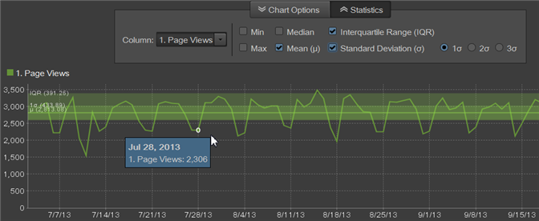

# Overzicht van rapporten

In standaardrapporten worden gegevens weergegeven voor website- en bezoekersactiviteiten, verkeerspatronen, verwijzingsgegevens, reclamecampagnes, het bewaren van bezoekers, productgegevens enzovoort. U kunt rapporten in werking stellen en dan tot hulpmiddelen toegang hebben om segmenten, metriek, en rapportvergelijkingen te vormen.

## Overzicht van rapporten {#concept_41459A705F2048EEA4EFA80F6BD9FFAB}

In standaardrapporten worden gegevens weergegeven voor website- en bezoekersactiviteiten, verkeerspatronen, verwijzingsgegevens, reclamecampagnes, het bewaren van bezoekers, productgegevens enzovoort. U kunt rapporten in werking stellen en dan tot hulpmiddelen toegang hebben om segmenten, metriek, en rapportvergelijkingen te vormen.

U kunt aangepaste gegevens verzamelen om specifieke rapporten voor uw website te maken. Als u bijvoorbeeld een zoekfunctie op uw website hebt, kunt u de verzonden zoektermen bijhouden en een rapport maken met deze termen en de resultaten van de zoekopdrachten.

De standaardrapportset behandelt onderwerpen die voor elke website gelden. Rapporten omvatten (maar zijn niet beperkt tot):

* Websitegegevens
* Bezoekersgegevens
* Verkeerspatronen
* Referentiegegevens
* Reclamecampagnes
* Bezoekersbewaring
* Productinformatie

Als u marketingrapporten en analyses gebruikt, zijn de rapporttypen en menu&#39;s bekend. Bij een ad-hocanalyse worden rapporten ingedeeld op basis van de volgende typen:

**Samenvattingsrapporten**

Deze groep bevat rapporten, zoals de [!UICONTROL Totals Report]sjabloon, waarin gegevens worden weergegeven die zijn ontworpen voor snelle overzichten. Deze zijn bedoeld voor managers die een algemeen overzicht van de gegevens willen.

**Conversierapporten**

Conversierapporten bieden een uitgebreide, nauwkeurige en gedetailleerde analyse van de activiteiten van de klant. Met meetgegevens zoals campagnebeheer, verkoopcyclus, uitval van klanten en omzetting van klanten kunt u e-commercetransacties, verkoopbronnen, reclamesnelheid, klantenloyaliteit en nog veel meer meten.

**Verkeersrapporten**

Verkeersrapporten geven u diepgaand inzicht in hoe bezoekers met uw website werken.

* Analyseer kritieke aspecten van het gedrag van de bezoeker.
* Bewaak en begrijp verkeerspatronen.
* Veelgebruikte site-inhoud bepalen.
* Segmenteer bezoekers aan de hand van meetbare criteria.

## Campagnes {#concept_A407CDF1D4AA49BAB396A1666E67FC87}

Hier wordt informatie weergegeven over de doeltreffendheid van uw advertentieactiviteiten. U kunt zien welke soorten reclame-inspanningen u het meeste verkeer geven en welke van uw werknemers verantwoordelijk is voor het aansturen van deze inspanningen.

<!-- 

c_reports_campaigns.xml

 -->

Deze rapporten zijn gewoonlijk aangepast en dus verschillend voor elke analist. Raadpleeg de Help bij [de](https://helpx.adobe.com/nl/enterprise/using/admin-console.html) beheerconsole voor meer informatie.

## Statistische berekeningen {#concept_83FF70DB7895435E985699FE9012D585}

U kunt de standaardstatistieken aanpassen om in een gerangschikt rapport te verschijnen.

<!-- 

c_Statistical_Calculation_ad_hoc.xml

 -->

Er kunnen aanvullende statistische standaardberekeningen worden toegevoegd aan gerangschikte rapporten die worden weergegeven wanneer u het rapport uitvoert, zoals gemiddelde waarden, mediaan, standaardafwijking en andere wiskundige berekeningen die op basis van uw specifieke rapportagebehoeften worden berekend.

**Om de statistische berekeningen voor Rangschikte Rapporten te openen:**

1. Selecteer **[!UICONTROL Tools]** > in het **[!UICONTROL Ranked]** menu.

1. Selecteer **[!UICONTROL Settings]**.
1. Selecteer **[!UICONTROL Default Statistics]**.

**[!UICONTROL Ignore zeros in statistical calculations]**. Selecteer deze optie om nullen te negeren en ervoor te zorgen dat het toevoegen van een andere metrische waarde niet de reeds berekende gemiddelden zal veranderen. Alle statistieken worden beïnvloed door dit het plaatsen (hoewel het voor Som geen effect heeft).

| Berekening | Beschrijving |
|--- |--- |
| Max | Identificeert de maximumwaarde over alle rijen voor een gespecificeerde dataset. |
| Min | Identificeert de minimumwaarde over alle rijen voor een gespecificeerde dataset. |
| Som | Een berekening van alle waarden voor elke rij in de dataset.  De som omvat bijvoorbeeld alle bezoeken van een bezoeker in plaats van de bezoeker slechts eenmaal te tellen (ongeacht het aantal bezoeken). Het is een uitgebreid totaal van verzamelde gegevenspunten. |
| Gemiddeld | Het gemiddelde is het rekenkundig gemiddelde van de waarden van rijen in een dataset, berekend door de som gedeeld door de telling (som/telling). Het gemiddelde wordt beïnvloed door perifere gegevens, in tegenstelling tot de mediaan die over het algemeen wordt gebruikt voor scheefgetrokken distributies. |
| Standaardafwijking | De standaardafwijking geeft aan hoeveel variatie er ten opzichte van het verwachte gemiddelde bestaat. Bij een lagere standaardafwijking worden de gegevenspunten dicht bij het gemiddelde weergegeven. Een hogere standaardafwijking laat zien dat de gegevenspunten over een groot waardebereik worden verspreid. |
| Mediaan | De mediaan is de numerieke waarde die de hogere helft van een gegevens scheidt van de onderste helft voor de rijen in een dataset. In tegenstelling tot het gemiddelde, wordt het over het algemeen gebruikt om afgelegen waarden te vermijden. |
| Kwartels | Een kwartiel is de reeks waarden in de gegevensset die wordt geïdentificeerd door drie punten die de gegevensset verdelen in vier gelijke groepen, elk bestaande uit een kwart van de gegevensset. Het eerste kwartiel is het 25e percentiel, en het derde kwartiel is het 75e percentiel. (Het tweede kwartiel is de Mediaan en het vierde kwartiel is de Sum.) |
| Aantal | Retourneert het aantal rijen in een gegevensset. |

## Voorbeeld van gemiddelde versus metrische totale berekeningen {#section_7C49196503964FB0A429FA347BC92D09}

De functie Gemiddeld wordt berekend op dezelfde manier als kolommen met gegevens in Microsoft Excel. Dit betekent met name dat het **gemiddelde** van een ratio (zoals het bepalen van de gemiddelde stuitkoers) het gemiddelde van de verhoudingen zou zijn, niet de verhouding van de gemiddelden. De verhouding van de gemiddelden omvat het **Totaal** van de metrische stuiteringssnelheid.

<table id="table_9EC56B15C6A340DA8917CB0DBCAC2355"> 
 <thead> 
  <tr> 
   <th colname="col1" align="center" class="entry"> Datum </th> 
   <th colname="col2" align="center" class="entry"> Enkelvoudige bezoeken </th> 
   <th colname="col3" align="center" class="entry"> Berichten </th> 
   <th colname="col4" align="center" class="entry"> Stuitsnelheid </th> 
   <th colname="col5" align="center" class="entry"> </th> 
  </tr>
 </thead>
 <tbody> 
  <tr valign="top"> 
   <td colname="col1"> 
Juni 2013 
 
Juli 2013 
 
augustus 2013 
 </td> 
   <td colname="col2" align="center"> 
344 
 
297 
 
41 
 </td> 
   <td colname="col3" align="center"> 
1000 
 
1000 
 
1000 
 </td> 
   <td colname="col4" align="center"> 
34.4% 
 
29.7% 
 
41.0% 
 </td> 
   <td colname="col5"> </td> 
  </tr> 
  <tr valign="top"> 
   <td colname="col1" align="center" valign="middle"><b>Gemiddeld</b> </td> 
   <td colname="col2" valign="middle"> (344+297+41)/3 </td> 
   <td colname="col3" valign="middle"> (1000+1000+100)/3 </td> 
   <td colname="col4" valign="middle" align="right"> (34.4 + 29.7 + 41.0) / 3 = <b>35.0</b>% </td> 
   <td colname="col5" valign="middle"><b>Verhouding</b> </td> 
  </tr> 
  <tr valign="top"> 
   <td colname="col1" align="center" valign="middle"><b>Metrisch totaal</b> </td> 
   <td colname="col2" valign="middle"> 682 </td> 
   <td colname="col3" valign="middle"> 2100 </td> 
   <td colname="col4" valign="middle" align="right"> 682 / 2100 = <b>32.0</b>% </td> 
   <td colname="col5" valign="middle"><b>Verhouding van middelen</b> </td> 
  </tr> 
 </tbody> 
</table>

## Statistische berekeningsbedekkingen {#concept_97E1B32DAC734C7B9F8899717283CEEC}

Ad-hocanalyse biedt nu overlayvisualisaties van statistische berekeningen voor rapporten die gegevens in de loop van de tijd weergeven (minuten, uren, dagen, weken).

<!-- 

c_overlay_calculations.xml

 -->

In een rapport dat gegevens over een periode identificeert, laat de **[!UICONTROL Statistics]** knoop u berekeningen selecteren die als bekledingen over de lijn van de rapporttijd zullen tonen.

Naast de standaard [statistische berekeningen](/help/analyze/ad-hoc-analysis/c-overview-standard-reports.md#concept_83FF70DB7895435E985699FE9012D585)kunt u ook de eerste, tweede en derde standaardafwijking in de overlays selecteren.

## Groepsbeheer {#concept_E1433974A61144858E87334C006982B2}

In plaats van één pagina in een rapport te gebruiken, kunt u veelvoudige pagina&#39;s groeperen en hen gebruiken als categorieën voor aanvang, tussenpersoon, of bestemmingsplaats in [!UICONTROL Fallout] en [!UICONTROL Site Analysis] - rapporten. U kunt groepen bewerken vanuit het hoofdmenu of vanuit het rapport. Categorieën die u hebt gemaakt in marketingrapporten en analyses, worden ook weergegeven in de [!UICONTROL Checkpoint Selector] lijst.

<!-- 

c_groups.xml

 -->

Klik op **[!UICONTROL Tools]** > **[!UICONTROL Group Manager]**.
