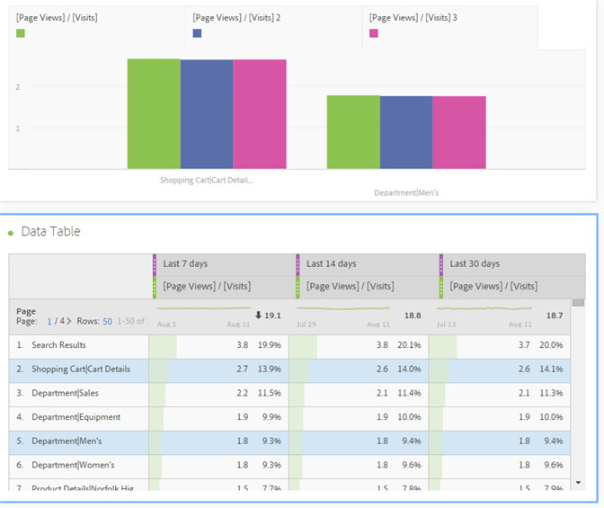
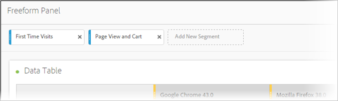

# Overzicht van de analysewerkruimte

De Werkruimte van de analyse verwijdert alle typische beperkingen van één enkel rapport Analytics. Het verstrekt een robuust, flexibel canvas voor de bouw van projecten van de douaneanalyse. Sleep een willekeurig aantal gegevenstabellen, visualisaties en componenten (afmetingen, metriek, segmenten en tijdgranulariteit) naar een project. Creëer meteen onderverdelingen en segmenten, creeer cohorts voor analyse, creeer alarm, vergelijk segmenten, stroom en reserveanalyse, en curate en planningsrapporten voor het delen met iedereen in uw zaken.

**[!UICONTROL Analytics]** > **[!UICONTROL Workspace]**

## Video overzicht

>[!VIDEO](https://video.tv.adobe.com/v/26266?quality=12)

Volledige YouTube-afspeellijst beschikbaar [hier](https://www.youtube.com/playlist?list=PL2tCx83mn7GuNnQdYGOtlyCu0V5mEZ8sS).

>[!NOTE]
>
>Zie [Nieuw in de Werkruimte](/help/analyze/analysis-workspace/new-features-in-analysis-workspace.md) Analyse voor updates over functies.

## Volledige controle over projectelementen en componenten

De analysewerkruimte biedt vrijheid en flexibiliteit:

* Componenten slepen en neerzetten (afmetingen, metriek, segmenten en tijdkorreligheid)
* Meerdere visualisaties naar het project slepen en neerzetten
* Visualisaties verplaatsen, vergroten, verkleinen en stapelen waar u wilt in een project

Zie [Creeer een project](/help/analyze/analysis-workspace/build-workspace-project/t-freeform-project.md) van de Werkruimte van de Analyse voor meer informatie.

## Meerdere visualisaties in een project

Sleep zoveel visualisaties naar een project als u wilt.

Creeer een project dat het percentage van verandering toont, met veelvoudige visualisaties die aan cellen in een vrije lijst van gegevensgegevens beantwoorden.

Zie [Creeer een project](/help/analyze/analysis-workspace/build-workspace-project/t-freeform-project.md) van de Werkruimte van de Analyse voor meer informatie.

## Intra-linking to panels and visualizations

In combinatie met de [rijke mogelijkheden voor tekstbewerking](/help/analyze/analysis-workspace/visualizations/text.md) van de Werkruimte van de Analyse, kunt u aan specifieke panelen en visualisaties binnen een project van een tekstvakje, zoals neer verbinden om de inhoudstafel van een project tot stand te brengen. U kunt deze koppelingen delen, zoals u een projectkoppeling deelt, om iemand naar een specifieke visualisatie of een bepaald deelvenster binnen een project te sturen. De nieuwe met de rechtermuisknop aangeklikte opties genoemd &quot;krijgen de Verbinding van het Comité&quot;en &quot;krijgen Visualisatiekoppeling&quot;zijn toegevoegd. Om intra-linking aan uw project toe te voegen:

1. Sleep een tekstvisualisatie in een project, misschien naast een visualisatie of een lijst die één of andere context vereist.
1. Vul het tekstvak met bijvoorbeeld een inhoudsopgave en markeer een item dat u wilt koppelen aan een deelvenster of visualisatie, bijvoorbeeld Metrische gegevens succes.

   

1. Blader naar dat deelvenster of naar de visualisatie en klik met de rechtermuisknop op de koptekst van het deelvenster.
1. Omlaag schuiven en selecteren **[!UICONTROL Get Panel Link]** of **[!UICONTROL Get Visualization Link]**:

   

1. Kopieer die koppeling en voeg deze toe aan de hyperlink Metrische gegevens succes in de tekstvisualisatie. Klik op het vinkje om de tekst op te slaan.

Als u deelvensters of visualisaties hebt samengevouwen in uw project, kunt u door op een koppeling te klikken het deelvenster/de visualisatie uitvouwen, zodat gebruikers het kunnen zien.

>[!NOTE] U kunt deze functie ook gebruiken met de **[!UICONTROL Edit Description]** rechtermuisknop.

## Koppeling naar andere projecten

U kunt gebruikers aan andere projecten verbinden die voor hen van belang kunnen zijn door naar **[!UICONTROL Share]** > te gaan **[!UICONTROL Get Project Link]** en deze verbinding in projectbeschrijvingen in te bedden, bijvoorbeeld.

## Dynamische visualisatie van geselecteerde cellen

Selecteer individuele cellen en zie de visualisaties dynamisch veranderen. [Synchroniseer en vergrendel](/help/analyze/analysis-workspace/analysis-workspace-features.md#section_9D66A001586F49CEB0C565581E44957C) een visualisatie met geselecteerde cellen.

## Geselecteerde items of posities vergrendelen

Door visualisaties te vergrendelen, kunt u bepalen welke bronnen van de vrije-vormgegevens overeenkomen met visualisaties.

Zie [Gegevensbronnen](/help/analyze/analysis-workspace/visualizations/t-sync-visualization.md)beheren.

## Trend visualizations from selected cells

Maak een visualisatie van geselecteerde cellen. (Klik met de rechtermuisknop > **[!UICONTROL Trend Selection]**.)

De selecties van de trend worden nu **verbonden** aan de lijst hieronder, zodat als u een verschillende rij in de lijst selecteert, zal de trendgrafiek op die rij wijzen.

## Afmetingen en uitsplitsingen naar dimensie-items

Als detailhandelaar, kunt u dieper dan ooit in uw campagnes duiken om te begrijpen hoe te om uw klanten beter in dienst te nemen. U kunt uw gegevens op onbeperkte wijze onderverdelen voor uw specifieke behoeften; bouwt vragen gebruikend relevante metriek, dimensies, segmenten, tijdlijnen, en andere waarden van de analyseonderbreking.

Zie [Afmetingen](/help/analyze/analysis-workspace/components/dimensions/t-breakdown-fa.md)onderbreken.

## Segmenten uit tabelselecties

Selecteer cellen in de vrije-vormlijst en creeer een segment van de selectie.

Vergelijk meerdere segmenten en maak en pas direct segmenten toe. U kunt veelvoudige segmenten toepassen om zich op specifieke klanten te concentreren die op gedrag en interactie worden gebaseerd en dan vergelijken en contrast.

Zet een segment neer in het deelvenster Vrije vorm op projectniveau en het segment wordt toegepast op het gehele project.

Zie [Segmenten](/help/analyze/analysis-workspace/components/t-freeform-project-segment.md).

## Labels voor project en component

U kunt markeringen op projecten en componenten in de Werkruimte van de Analyse toepassen:

* U kunt labels op projectniveau toepassen of maken in het deelvenster Informatie. ( 

* Klik met de rechtermuisknop op componenten om tags aan te brengen (of tags te maken) in het deelvenster Componenten.
* Gebruik # in het veld Zoeken om tags te zoeken.

## Componenthandelingen

Voer componentenvlakke acties van het menu van Acties bij de bovenkant van de component linker spoorstaaf uit. Selecteer een component en klik **[!UICONTROL Actions]** om de handelingen weer te geven.

| Componentactie | Beschrijving |
|--- |--- |
| Tag | U kunt componenten ordenen of beheren door er tags op toe te passen. Deze wordt vervolgens weergegeven in de respectievelijke componentmanager, zoals Analytics > Components > Segments, of Analytics > Components > Projecten |
| Favoriet | Voeg de component toe aan de lijst met favorieten. Deze wordt vervolgens weergegeven in de respectievelijke componentmanager, zoals Analytics > Components > Segments, of Analytics > Components > Projecten. |
| Goedkeuren | Goedkeuren van de component om deze canonicaal te maken. Deze wordt vervolgens weergegeven in de respectievelijke componentmanager, zoals Analytics > Components > Segments, of Analytics > Components > Projecten |
| Delen | Alleen van toepassing op segmenten. |
| Verwijderen | Alleen van toepassing op segmenten. |

Zie [Visualisaties](/help/analyze/analysis-workspace/visualizations/freeform-analysis-visualizations.md) voor meer informatie.

## Aanvullende functiebeschrijvingen

**Wat u kunt slepen en stapelen**

Componenten

* Afmetingen
* Segmenten
* Metrisch
* Datumbereiken
* Tijdgranulariteit (Uur, Dag, Week, enzovoort).

**Meerdere vrije-vormlijsten en meerdere visualisaties**

Er is geen technische limiet voor het aantal vrije-vormtabellen en -visualisaties dat u aan het deelvenster kunt toevoegen. Ook, kunt u een nieuwe visualisatie (of uitvoer naar CSV) in werking stellen elke vrije lijst of geselecteerde rijen van een lijst.

**Kolommen rangschikken, sorteren en kopiëren**

* Voorinstellingen voor het datumbereik sorteren (bevat geen aangepaste datumbereiken).
* Met CTRL (of Command) + klikken en slepen wordt de kolom gekopieerd. Wanneer u de kopie sleept, wordt deze op de nieuwe positie in de tabel geplakt.

Zie [Hotkeys Beschikbaar in de Werkruimte](/help/analyze/analysis-workspace/build-workspace-project/fa-shortcut-keys.md) van de Analyse voor meer informatie.

**Selecties en acties**

U kunt rijen en kolommen selecteren die vergelijkbaar zijn met de manier waarop u ze in Excel kunt selecteren. Vervolgens kunt u actie ondernemen met betrekking tot deze selecties. Bijvoorbeeld:

* Visualisaties maken van selecties
* Kopiëren naar klembord (CTRL of Command + C)
* Hiermee splitst u meerdere geselecteerde rijen. Selecteer de rijen en sleep een dimensie naar de selectie. U kunt ook met de rechtermuisknop op de selectie klikken en het menu Indeling gebruiken.

**Wijzigingen automatisch opslaan en niet-opslaan**

Als u probeert de browser te sluiten (of de knop Terug gebruikt) en het project niet is opgeslagen, wordt u gevraagd de wijzigingen op te slaan. Als uw systeem vastloopt, ontvangt u een waarschuwing om de vorige projectstatus te herstellen wanneer u het project laadt.

Bestaande (niet nieuwe) projecten worden alleen automatisch opgeslagen wanneer de browser vastloopt of onder andere omstandigheden wanneer u geen kans hebt gekregen om ze op te slaan.

**Alle bezoeken**

Een standaardsegment uniek aan de Werkruimte van de Analyse. *`All Visits`* geeft totalen weer voor de componenten die u aan de tabel toevoegt.

**Berekende cijfers**

Gebruik berekeningen op dezelfde manier als standaardmeetwaarden.

Zie [Berekende waarden](https://docs.adobe.com/content/help/en/analytics/components/calculated-metrics/cm-overview.html).
