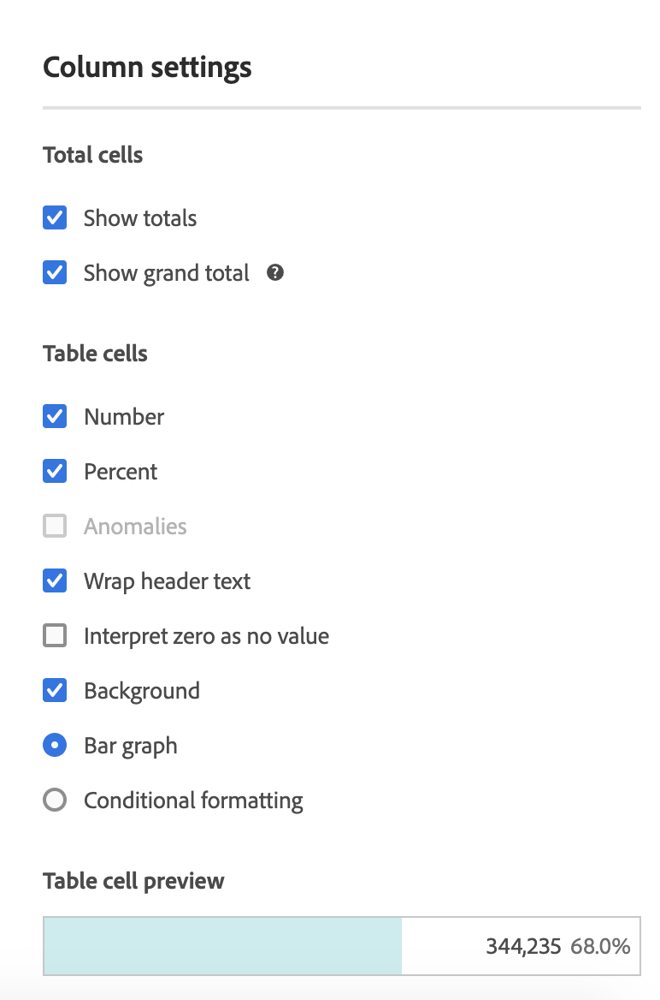

# Kolominstellingen

Met kolominstellingen kunt u kolomopmaak configureren, waarvan sommige voorwaardelijk kunnen zijn.

## Kolominstellingen {#section_C5A9C13553BF4BFDAD7FACE0139AECA3}

Als u toegang wilt krijgen [!UICONTROL Column Settings], sleept u een tabel voor vrije vorm naar het project en klikt u op het tandwielpictogram in de kolomkop.

U kunt instellingen **voor meerdere kolommen tegelijk** bewerken. Selecteer enkel veelvoudige kolommen en klik het montagespictogram van om het even welk van die kolommen. Alle wijzigingen die u aanbrengt, worden toegepast op alle kolommen met daarin geselecteerde cellen.

| Element | Beschrijving |
|--- |--- |
| Getal | Hiermee wordt bepaald of in een cel de numerieke waarde voor de metrische waarde wordt weergegeven of verborgen. Als de metrische waarde bijvoorbeeld Paginaweergaven is, is de numerieke waarde het aantal paginaweergaven voor het rij-item. |
| Percentage | Bepaalt of een cel de percentagewaarde voor metrisch toont/verbergt. Als de metrische waarde bijvoorbeeld Paginaweergaven is, is de percentagewaarde het aantal paginaweergaven voor het rijitem gedeeld door de totale paginaweergaven voor de kolom.  Opmerking:  We kunnen percentages van meer dan 100 procent laten zien, om nauwkeuriger te zijn. We verplaatsen het bovenste gebonden plafond ook naar 1000% om ervoor te zorgen dat kolommen te groot kunnen worden. |
| Anomalies | Hiermee wordt bepaald of de waarden in deze kolom een anomaliedetectie uitvoeren. |
| Tekst tekstomloop | Hiermee kunt u de koptekst laten omlopen in Freeform-tabellen om kopteksten leesbaarder te maken en tabellen beter deelbaar te maken. Dit is handig voor .pdf-rendering en voor metriek met lange namen. Standaard ingeschakeld. |
| nul interpreteren als geen waarde | Voor cellen met een waarde 0 bepaalt u of een cel van 0 of een lege cel moet worden weergegeven. Dit is handig wanneer u gegevens bekijkt voor elke dag van een maand, en sommige dagen zijn nog niet gebeurd.  In plaats van &#39;0&#39; voor toekomstige datums weer te geven, kunnen lege cellen worden weergegeven. Grafieken voldoen ook aan deze instelling (ze geven dus geen lijn of balk weer met 0 waarden als deze instelling is ingeschakeld). |
| Achtergrond | Hiermee bepaalt u of alle celopmaak, inclusief de staafgrafiek en voorwaardelijke opmaak, in een cel wordt weergegeven of verborgen. |
| Staafgrafiek | Hiermee wordt een horizontale staafgrafiek weergegeven die de waarde van de cel ten opzichte van het totaal voor de kolom vertegenwoordigt. |
| Voorwaardelijke opmaak | Zie de onderstaande paragraaf. |
| Voorvertoning tabelcel | Toont een voorproef van hoe elke cel met de momenteel geselecteerde opmaakopties wordt getoond. |

## Voorwaardelijke opmaak {#section_3DD847151DA14914888A70FC4FD7BDFB}

Met voorwaardelijke opmaak wordt opmaak toegepast op de bovenste, middelste en onderste limieten die u kunt definiëren. Het toepassen van voorwaardelijke opmaak (kleuren, enz.) in Freeform-tabellen wordt ook automatisch ingeschakeld voor onderverdelingen, tenzij &quot;Aangepaste&quot; limieten zijn geselecteerd.

| Element | Beschrijving |
|--- |--- |
| Voorwaardelijke opmaak | Past de volgende kleuren op cellen toe, die op gegevenswaarden worden gebaseerd: <ul><li>Groen: hoge waarden</li><li>Geel: middenpuntwaarden</li><li>Rood: lage waarden</li></ul> Als u een dimensie in de tabel vervangt, worden de limieten voor voorwaardelijke opmaak opnieuw ingesteld. Wanneer u een metrische waarde vervangt, worden de grenswaarden voor die kolom opnieuw berekend (wanneer een metrische waarde zich op de X-as bevindt en een dimensie zich op de Y-as bevindt). |
| Percentagelimieten gebruiken | Hiermee kunt u de bovenste, middelste en onderste limieten gebruiken op basis van percentagewaarden voor elke meting. Dit werkt voor metriek die uitsluitend op percentage-gebaseerd (zoals het Tarief van de Stuiting) evenals voor metriek zijn die een telling en een percentage (zoals de Weergaven van de Pagina. hebben) |
| Automatisch gegenereerd | Hiermee worden automatisch limieten voor voorwaardelijke opmaak gegenereerd. De bovengrens is de hoogste waarde in deze kolom. De ondergrens is de laagste en het middelpunt is het gemiddelde van de boven- en ondergrens. |
| Aangepast | U kunt de waarden voor de velden Boven, Middelpunt en Ondergrens handmatig toewijzen voor voorwaardelijke opmaak. Dit geeft u de flexibiliteit om te bepalen wanneer een kolomwaarde goed, gemiddeld, of slecht wordt. |
| Voorvertoning tabelcel | Toont een voorproef van hoe elke cel met de momenteel geselecteerde opmaakopties wordt getoond. |

>[!MORELIKETHIS]
>
>* [Gegevensbronnen beheren](/help/analyze/analysis-workspace/visualizations/t-sync-visualization.md)

