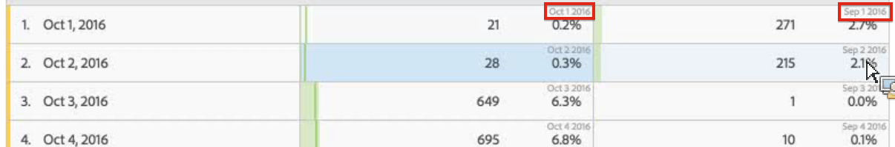

# Rijinstellingen

De rijinstellingen variëren afhankelijk van de component die u naar de tabel hebt gesleept.

U kunt ook met de [rechtermuisknop klikken op handelingen in een tabel](/help/analyze/analysis-workspace/visualizations/freeform-table.md) om geselecteerde rijen te beheren.

Als u de tabelrijinstellingen wilt openen, klikt u op het pictogram Instellingen naast een dimensie, segment, metrisch, tijdsperiode of een verdeling binnen elk van deze instellingen:

<table id="table_7ACE6413DB1F40349ED2860020F92E55"> 
 <thead> 
  <tr> 
   <th colname="col1" class="entry"> Rijinstelling </th> 
   <th colname="col2" class="entry"> Beschrijving </th> 
  </tr>
 </thead>
 <tbody> 
  <tr> 
   <td colname="col1"> 
<a href="/help/analyze/analysis-workspace/components/calendar-date-ranges/time-comparison.md"  > Datumvergelijkingen</a> 
 </td> 
   <td colname="col2"> 
<b>Datums uit elke kolom uitlijnen met alle datums die op dezelfde rij beginnen. </b> 
 
Wanneer u ervoor kiest de datums op elkaar af te stemmen, bijvoorbeeld in een vergelijking van maand na maand tussen oktober en september 2016, begint de linkerkolom met 1 oktober en begint de rechterkolom met 1 september: 
 
 
 
Standaard uitgeschakeld. 
 </td> 
  </tr> 
  <tr> 
   <td colname="col1"> 
Percentage 
 </td> 
   <td colname="col2"> 
<b>Percentage berekenen op rij</b> 
 
Dwingt de lijst van de Vrije vorm om de celpercentages over de rij in tegenstelling tot onderaan de kolom te berekenen. Dit is vooral handig voor het trenderen van percentages. Deze optie is standaard ingeschakeld wanneer u het pictogram  Visualiseren gebruikt. 
 </td> 
  </tr> 
  <tr> 
   <td colname="col1"> 
Kolomtotalen 
 </td> 
   <td colname="col2"> 
Deze instellingen worden alleen weergegeven met <a href="/help/analyze/analysis-workspace/build-workspace-project/column-row-settings/manual-vs-dynamic-rows.md"  > handmatige (statische) rijen</a> (wanneer u een eindige set items hebt geselecteerd), niet met dynamische rijen (wanneer u een afmeting gebruikt waarin alle items worden weergegeven). 
Opmerking: Voor <i>metrische</i> handrijen, wordt het plaatsen onbruikbaar gemaakt, aangezien het geen nut heeft om metriek naast de huidige rijen in een lijst samen te vatten. 
 
 
<b>Totalen berekenen door de waarden op te tellen die momenteel in elke kolom staan (standaard ingeschakeld):</b> 
 
Met deze optie worden alleen de rijen berekend die momenteel in de tabel staan. (Clientberekening) 
 
<b>De totalen berekenen op basis van alle rijen voor elke metrische waarde (standaard uitgeschakeld):</b> 
 
Deze optie omvat alle afmetingspunten voor deze afmeting, zelfs die niet vermeld in de lijst. (Server-side berekening) 
 </td> 
  </tr> 
  <tr> 
   <td colname="col1"> 
Uitsplitsingen 
 </td> 
   <td colname="col2"> 
<b>Uitsplitsing naar positie:</b> 
 
U kunt onderverdelingen uitvoeren op basis van een vaste locatie in een tabel voor vrije vorm. U kunt bijvoorbeeld opgeven dat de bovenste zeven rijen altijd moeten worden opgesplitst. 
 
(Eerder was de lijst met waarden in de uitsplitsing "vergrendeld". Dit leidde bijvoorbeeld tot een situatie waarbij u een lijst van de bovenste 50 pagina's voor het geselecteerde datumbereik had als u  Datum op  paginahad uitgebroken. Als u dat rapport hebt opgeslagen en het een maand later hebt uitgevoerd, zijn de bovenste 50 pagina's waarschijnlijk gewijzigd. Nochtans, zou de Werkruimte van de Analyse de resultaten van de originele uitsplitsing gebruiken en de zelfde pagina's terugkeren, maar met de huidige maand zoals de datumwaaier.) 
 
Uitsplitsingen uitvoeren op basis van een vaste locatie: 
 
    <ol id="ol_A396A11566AA4F52BC3ABBC373CEF477"> 
     <li id="li_BDAB1E9A48D44944A4F7C31F1182B923">Verdeel enkele rijen in uw tabel. </li> 
     <li id="li_C5610437D3714CCEB9F3C771864B4336">Klik op het pictogram Instellingen (versnelling) naast de tabelrij die u op een vaste positie wilt plaatsen. </li> 
     <li id="li_675E429DC3B94201978166F9408D30B1">Schakel het selectievakje naast  Uitsplitsing op positiein. </li> 
     <li id="li_E8A417D0D6D1438CAE825843BA0A7060">Wijzig de sorteervolgorde of het datumbereik. U ziet dat de onderverdelingen nu zijn gekoppeld aan de rijpositie, niet aan de rijen met harde codes. </li> 
    </ol> 
Standaard uitgeschakeld. 
 </td> 
  </tr> 
 </tbody> 
</table>

| Rijinstelling | Beschrijving |
|--- |--- |
| Datumvergelijkingen | Datums uit elke kolom uitlijnen met alle datums die op dezelfde rij beginnen.   Wanneer u ervoor kiest de datums op elkaar af te stemmen, bijvoorbeeld in een vergelijking van maand na maand tussen oktober en september 2016, begint de linkerkolom met 1 oktober en begint de rechterkolom met 1 september. Standaard uitgeschakeld. |
| Percentage | Bereken percentages door rijDwingt de lijst Freeform om de celpercentages over de rij in tegenstelling tot onderaan de kolom te berekenen. Dit is vooral handig voor het trenderen van percentages. Deze optie is standaard ingeschakeld wanneer u het pictogram Visualiseren gebruikt. |
| Kolomtotalen | Deze instellingen worden alleen weergegeven met [statische rijen](https://docs.adobe.com/content/help/en/analytics/analyze/analysis-workspace/build-workspace-project/column-row-settings/manual-vs-dynamic-rows.html) (wanneer u een eindige set items hebt geselecteerd) en niet met dynamische rijen (wanneer u een afmeting uitvoert waarin alle items worden weergegeven).<ul><li>**[!UICONTROL Show sum of current rows as the total]** - hier ziet u een som van de rijen aan de clientzijde van de tabel, wat betekent dat het totaal **niet** de dubbele meetgegevens zoals bezoeken of bezoekers zal dedupliceren.</li><li>**[!UICONTROL Show Grand Total]** - dit toont een bedrag aan serverzijde, wat betekent het totaal metriek zoals bezoeken of bezoekers zal dedupliceren.</li></ul> |
| Uitsplitsingen | **[!UICONTROL Breakdown by position]**:  U kunt onderverdelingen uitvoeren op basis van een vaste locatie in een tabel voor vrije vorm. U kunt bijvoorbeeld opgeven dat de bovenste zeven rijen altijd moeten worden opgesplitst. (Eerder was de lijst met waarden in de uitsplitsing &quot;vergrendeld&quot;. Dit leidde bijvoorbeeld tot een situatie waarbij u een lijst van de bovenste 50 pagina&#39;s voor het geselecteerde datumbereik had als u Datum op pagina hebt uitgebroken. Als u dat rapport hebt opgeslagen en het een maand later hebt uitgevoerd, zijn de bovenste 50 pagina&#39;s waarschijnlijk gewijzigd. Nochtans, zou de Werkruimte van de Analyse de resultaten van de originele uitsplitsing gebruiken en de zelfde pagina&#39;s terugkeren, maar met de huidige maand zoals de datumwaaier.) Uitsplitsingen uitvoeren op basis van een vaste locatie: 1. Verdeel enkele rijen in uw tabel. 2. Klik op het pictogram Instellingen (versnelling) naast de tabelrij die u op een vaste positie wilt plaatsen. 3. Schakel het selectievakje naast Uitsplitsing op positie in. 4. Wijzig de sorteervolgorde of het datumbereik. U ziet dat de onderverdelingen nu zijn gekoppeld aan de rijpositie, niet aan de rijen met harde codes. Standaard uitgeschakeld. |