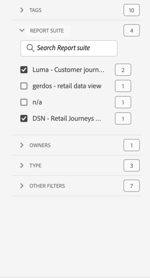
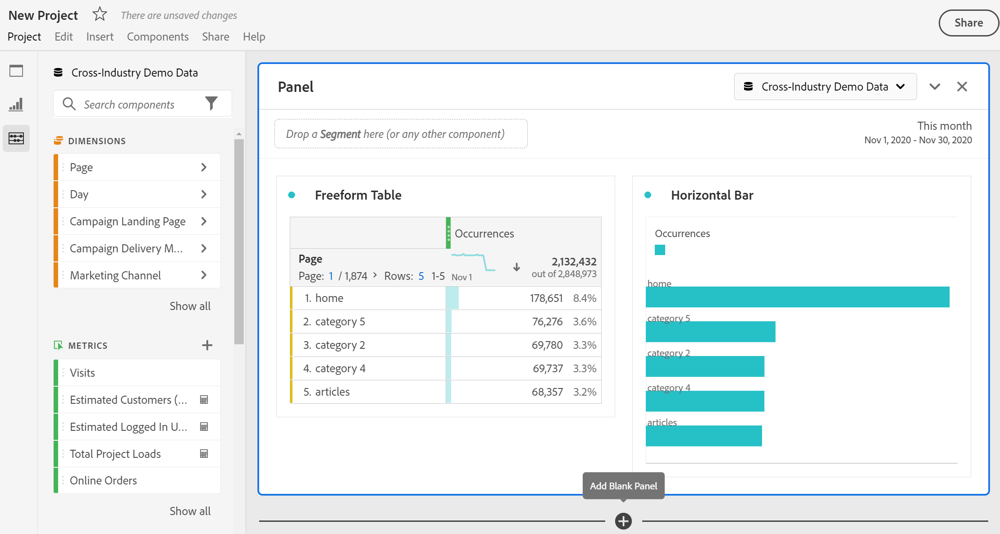

# Overzicht van projecten

Met Workspace-projecten kunt u deelvensters, visualisaties en componenten combineren om uw analyse te maken en met iedereen in uw organisatie te delen. Voordat u uw eerste project start, leert u hoe u toegang kunt krijgen tot uw projecten en hoe u deze kunt beheren.

Selecteer **[!UICONTROL Workspace]** als u projecten wilt openen in Adobe Analytics.  De manager **[!UICONTROL Projects]** maakt een lijst van alle projecten die u bezit of projecten die met u worden gedeeld. De projectmanager met de lijst van het Project is ook de standaardlandingspagina voor Adobe Analytics, tenzij u anders in Voorkeur hebt gevormd.

## Titelgebied

Vanuit het titelgebied ➊ kunt u een project maken, een map maken, uw voorkeuren bewerken en een deelvenster met extra tegels weergeven of verbergen.

* Om een linkerpaneel te tonen of te verbergen dat u toestaat om tussen **[!UICONTROL Projects]** en **[!UICONTROL Learning]** te selecteren,  selecteren.
* De titel toont Projecten, naar keuze toegevoegd met een weg aan de omslag u hebt geselecteerd. Bijvoorbeeld [!UICONTROL Projects] > **[!UICONTROL Company Folder]** . U kunt afzonderlijke submaponderdelen selecteren om rechtstreeks naar de specifieke map te gaan.
* Om tegels voor a [**[!UICONTROL Blank project]**](create-projects.md), [**[!UICONTROL Blank mobile scorecard]**](/help/analyze/mobile-app/create-scorecard.md), **[!UICONTROL Open the documentation]** en **[!UICONTROL Open release notes]** te tonen, selecteer  **[!UICONTROL Show more]**. Om het gebied met tegels te verbergen, selecteer  **[!UICONTROL Show less]**.
* Gebaseerd op wat u selecteert om te tonen, gebruikend [&#x200B; tonen selecteur &#x200B;](#show-selector), kunt u voorkeur uitgeven en acties op de huidige omslag uitvoeren zichtbaar in **[!UICONTROL Projects]**:

  | Handeling | Beschrijving |
  |---|---|
  | **[!UICONTROL Create project]** | Selecteer om [&#x200B; tot een nieuw project &#x200B;](create-projects.md) te leiden. |
  | **[!UICONTROL Create folder]** | Selecteer om [&#x200B; tot een nieuwe omslag &#x200B;](workspace-folders/create-folders.md) te leiden. |
  |  **[!UICONTROL Edit preferences]** | [&#x200B; geef voorkeur &#x200B;](/help/analyze/analysis-workspace/user-preferences.md) voor al uw projecten uit. Wanneer de broodkruimel in beperkte ruimte resulteert, maakt deze actie deel uit van  submenu. |
  | **[!UICONTROL Add projects]** | Selecteer om [&#x200B; projecten &#x200B;](workspace-folders/add-projects.md) aan de huidige omslag toe te voegen. Wanneer de broodkruimel in beperkte ruimte resulteert, maakt deze actie deel uit van  submenu. |
  | **[!UICONTROL Rename folder]** | [&#x200B; hernoemt &#x200B;](workspace-folders/manage-folders.md#rename-folders) de huidige omslag. |
  | **[!UICONTROL Move folder]** | [&#x200B; verplaatst &#x200B;](workspace-folders/manage-folders.md#move-folders) de huidige omslag. |
  | **[!UICONTROL Delete folder]** | [&#x200B; schrapt &#x200B;](workspace-folders/manage-folders.md#delete-folders) de huidige omslag. |

## Projectlijst

In de projectlijst ➋ worden alle projecten weergegeven die u hebt en die met u zijn gedeeld. De lijst heeft de volgende kolommen:

| Kolom | Beschrijving |
| --- | --- | 
|  | Wanneer één of meerdere projecten worden geselecteerd, verschijnt een blauwe actiebar bij de bodem van de interface van het Project. Zie [&#x200B; Acties &#x200B;](#actions) voor meer details. |
|  | Selecteer om  of niet-gunst  een project te begunstigen. |
| **[!UICONTROL Title and description]** | Om het project uit te geven, selecteer de titelverbinding, die het [&#x200B; project van Workspace &#x200B;](/help/analyze/analysis-workspace/home.md) opent. De projecten die met u worden gedeeld worden vermeld met . Selecteer  om een popup menu met meer details op het project te tonen. Selecteer  om een contextmenu met acties te openen. Zie [&#x200B; Acties &#x200B;](#actions) voor meer details. |
| **[!UICONTROL Type]** | Een project van Workspace, a  omslag, of a [&#x200B; Mobiele Scorecard &#x200B;](/help/analyze/mobile-app/home.md). |
| **[!UICONTROL Tags]** | De labels die op het project zijn toegepast. |
| **[!UICONTROL Scheduled]** | Of een project gepland is om aan ontvangers te worden gemaild. De opties zijn  **[!UICONTROL On]** of  **[!UICONTROL Off]**. Zie [&#x200B; projectgegevens naar anderen &#x200B;](/help/analyze/analysis-workspace/curate-share/t-schedule-report.md) verzenden. |
| **[!UICONTROL Shared link (anyone)]** | Of een project met iedereen wordt gedeeld, zelfs met mensen die geen toegang tot Analysis Workspace hebben. De opties zijn  **[!UICONTROL Active]** of  **[!UICONTROL Inactive]**. Zie [&#x200B; een project met iedereen (geen vereiste login) delen &#x200B;](/help/analyze/analysis-workspace/curate-share/share-projects.md#share-a-project-with-anyone-no-login-required) in [&#x200B; projecten van het Aandeel &#x200B;](/help/analyze/analysis-workspace/curate-share/share-projects.md) voor meer informatie. |
| **[!UICONTROL Project Role]** | Uw rol voor het project. Opties zijn: Bewerken, Dupliceren, Weergave. Zie [&#x200B; de rollen van het Project &#x200B;](/help/analyze/analysis-workspace/curate-share/curate.md) voor meer informatie. |
| **[!UICONTROL Report Suite]** | De rapportsuite waaraan het project is gekoppeld. |
| **[!UICONTROL Owner]** | De persoon die dit project heeft gemaakt (u of iemand die het project met u heeft gedeeld). |
| **[!UICONTROL Shared with]** | Gebruikers waarmee het project is gedeeld. |
| **[!UICONTROL Last Modified]** | Datum en tijdstip waarop het project voor het laatst is gewijzigd. |
| **[!UICONTROL Last Opened]** | Datum en tijdstip waarop het project voor het laatst is geopend. |
| **[!UICONTROL Component ID]** | De id van de component. |
| **[!UICONTROL Longest Date Range]** | Het langste datumbereik van de deelvensters of visualisaties in het project. |
| **[!UICONTROL Number of Queries]** | Het totale aantal vragen in het project. |
| **[!UICONTROL Location]** | De map waarin het project zich bevindt. |

Beweeg over om het even welke kolomkopbal om  en van het contextmenu te selecteren:

* **[!UICONTROL Sort Ascending]**
* **[!UICONTROL Sort Descending]**
* **[!UICONTROL Resize column]**. Er wordt een blauwe lijn weergegeven om u te helpen de grootte van de kolom te wijzigen.

### Handelingen

U kunt acties op één of meerdere projecten nemen gebruikend contextmenu  of de blauwe actiebar.

| Pictogram | Handeling | Beschrijving |
|:---:| ---|---|
|  | **[!UICONTROL *x *geselecteerd]** | Deselecteer de geselecteerde projecten en mappen en verwijder de blauwe actiebalk. |
|  | **[!UICONTROL Delete]** | Verwijder een of meer projecten of mappen. U wordt gevraagd om een bevestiging. 
Projecten die u verwijdert:
<ul><li>Kan niet worden hersteld</li><li>Verwijderd uit de projectlijst</li><li>Kan niet meer openen met hun URL</li><li>Zijn niet meer inbegrepen in geplande leveringen (in gevallen waar zij eerder voor geplande leveringen)   voor informatie over geplande leveringen werden gevormd, zie [&#x200B; Geplande projecten &#x200B;](/help/components/scheduled-projects-manager.md).  
 |
|  | **[!UICONTROL Share]** | Een project delen. Zie [&#x200B; een project &#x200B;](/help/analyze/analysis-workspace/curate-share/share-projects.md) voor meer informatie delen. |
|  uit | **[!UICONTROL Rename]** | Wijzig de naam van een project. Opent de dialoog van de a **[!UICONTROL Rename: *projectnaam *]**. Voer een nieuwe naam in en selecteer **[!UICONTROL Save]**. |
|  | **[!UICONTROL Copy]** | Kopieer een of meer projecten. Project krijgt niet dezelfde naam en hetzelfde achtervoegsel `(Copy)` . |
|  | **[!UICONTROL Pin]** of **[!UICONTROL Unpin]** | Een of meer projecten of mappen vastzetten of de speld eraf. Vastgezette projecten en omslagen verschijnen bij de bovenkant van de lijst en negeren de sorteervolgorde u specificeert. |
|  | **[!UICONTROL Move up]** | Verplaats een vastgezet project of een omslag omhoog in de projectlijst. |
|  | **[!UICONTROL Move down]** | Verplaats een vastgezet project of een omslag neer in de projectlijst. |
|  | **[!UICONTROL Tag]** | Label een of meer projecten of mappen. Het dialoogvenster **[!UICONTROL Tag Components]** wordt weergegeven om een of meer tags te selecteren. Selecteer **[!UICONTROL Save]** om de labels voor de geselecteerde projecten of mappen op te slaan. |
|  | **[!UICONTROL Approve]** of **[!UICONTROL Unapprove]** | Goedkeuren of goedkeuren van een project ongedaan maken. Alleen beheerders kunnen projecten goedkeuren. |
|  | **[!UICONTROL Export CSV]** | Exporteer de geselecteerde projecten naar een CSV-bestand met de naam `Project List.csv` . |
|  | **[!UICONTROL Add Projects]** | Voeg een of meer projecten toe aan een geselecteerde map. In **[!UICONTROL Add Projects]** kunt u een of meer projecten selecteren. Selecteer **[!UICONTROL Add]** om de projecten aan de omslag toe te voegen. Zie [&#x200B; projecten aan omslagen &#x200B;](workspace-folders/add-projects.md#from-inside-a-folder) voor meer informatie toevoegen. |
|  | **[!UICONTROL Move to]** | Verplaats een of meer geselecteerde projecten naar een map. Selecteer in **[!UICONTROL Select Folder]** de map waarnaar u het geselecteerde project wilt verplaatsen en selecteer **[!UICONTROL Move]** . Zie [&#x200B; projecten aan omslagen &#x200B;](workspace-folders/add-projects.md#from-the-project-list) voor meer informatie toevoegen. |

## Selector tonen

U kunt het uiterlijk van de interface Projecten veranderen met behulp van **[!UICONTROL Show]** kiezers ➌ . De **[!UICONTROL Show]** selecteur bepaalt welke opties op het [&#x200B; gebied van de Titel &#x200B;](#title-area) beschikbaar zijn en welke kolommen in de [&#x200B; lijst van het Project &#x200B;](#project-list) worden getoond.

* Om de opties beschikbaar voor het [&#x200B; gebied van de Titel &#x200B;](#title-area) te veranderen, selecteer **[!UICONTROL Show]** **[!UICONTROL All projects]** of **[!UICONTROL Show]** **[!UICONTROL Folders & Projects]**.

* Om te bepalen welke kolommen voor de [&#x200B; lijst van het Project &#x200B;](#project-list) te tonen, selecteer  en van de **[!UICONTROL Customize table]** dialoog of unselect kolommen. Selecteer **[!UICONTROL Apply]** om de aanpassing toe te passen. Zie [&#x200B; lijst van het Project &#x200B;](#project-list) voor meer details op de kolommen.

## Deelvenster Filter

U kunt de projecten en de omslagen in de [&#x200B; lijst van het Project &#x200B;](#project-list) filtreren gebruikend het filterpaneel ➍. Om het gebruik van het filterpaneel te tonen of te verbergen .

Het filterdeelvenster bestaat uit de volgende secties.

### Tags

| Tags | Beschrijving |
|---|---|
| {width="300"} | In de sectie **[!UICONTROL Tags]** kunt u filteren op tags. <ul><li>U gebruikt  Codes van het Onderzoek *van het 1&rbrace; Onderzoek &lbrace;aan onderzoek naar markeringen u wilt gebruiken om te filtreren.*</li><li>U kunt meerdere tags selecteren. Welke labels beschikbaar zijn, is afhankelijk van de selecties die in andere secties in het filterdeelvenster zijn gemaakt.</li><li>De getallen geven aan:<ul><li>**2︎⃣**: Het aantal markeringen beschikbaar voor de projecten die uit de huidige filter voortvloeien.</li><li>7︎⃣: Het aantal projecten dat aan de specifieke tag is gekoppeld.</li></ul></li></ul> |

### Rapportsuites

| Rapportsuites | Beschrijving |
|---|---|
| {width="300"} | In de sectie **[!UICONTROL Report Suites]** kunt u filteren op rapportsuites. <ul><li>U gebruikt  Suites van het Rapport van het Onderzoek 1&rbrace; *aan onderzoek naar rapportsuites u wilt gebruiken om te filtreren.*</li><li>U kunt meerdere rapportsuite selecteren. Welke rapportsuite beschikbaar is, is afhankelijk van de selecties die in andere secties van het filterdeelvenster zijn gemaakt.</li><li>De getallen geven aan:<ul><li>**3︎⃣**: Het aantal rapportreeksen beschikbaar voor de projecten die uit de huidige filter voortvloeien.</li><li>4︎⃣: Het aantal projecten dat is gekoppeld aan de specifieke rapportsuite.</li></ul></li></ul> |

### Eigenaars

| Eigenaar | Beschrijving |
|---|---|
| {width="300"} | In de sectie **[!UICONTROL Owner]** kunt u filteren op eigenaars. <ul><li>U gebruikt  *eigenaars van het Onderzoek* aan onderzoek naar eigenaars u wilt gebruiken om te filtreren.</li><li>U kunt meerdere eigenaars selecteren. Welke eigenaars beschikbaar zijn, is afhankelijk van de selecties die in andere secties in het filterdeelvenster zijn gemaakt.</li><li>De getallen geven aan:<ul><li>**3︎⃣**: Het aantal eigenaars beschikbaar voor de projecten die uit de huidige filter voortvloeien.</li><li>4︎⃣: het aantal projecten dat aan de specifieke eigenaar is gekoppeld.</li></ul></li></ul> |

### Type

| Type | Beschrijving |
|---|---|
| {width="300"} | In de sectie **[!UICONTROL Type]** kunt u filteren op het type projecten of mappen.<ul><li>U kunt een of meer van de volgende opties selecteren:<ul><li> **[!UICONTROL folder]**</li><li>**[!UICONTROL Workspace project]**</li><li>**[!UICONTROL Mobile scorecard]**</li></ul> <li>U kunt meerdere filters selecteren. Welke andere filters beschikbaar zijn, is afhankelijk van de selecties die in andere secties van het filterdeelvenster zijn gemaakt.</li><li>De getallen geven aan:<ul><li>**5︎⃣**: Het aantal andere filters beschikbaar voor de projecten die uit de huidige filter voortvloeien.</li><li>4︎⃣: Het aantal projecten dat is gekoppeld aan het specifieke andere filter.</li></ul></li></ul> |

### Overige filters

| Overige filters | Beschrijving |
|---|---|
| {width="300"} | Met de sectie **[!UICONTROL Other filters]** kunt u filteren op een ander vooraf gedefinieerd filter.<ul><li>U kunt een of meer van de volgende opties selecteren:<ul><li> **[!UICONTROL Show all]**</li><li>**[!UICONTROL Shared with me]**</li><li>**[!UICONTROL Mine]**</li><li>**[!UICONTROL Approved]**</li><li>**[!UICONTROL Favorites]**</li></ul> Wat u kunt selecteren hangt van uw rol en toestemmingen af.</li><li>U kunt meerdere filters selecteren. Welke andere filters beschikbaar zijn, is afhankelijk van de selecties die in andere secties van het filterdeelvenster zijn gemaakt.</li><li>De getallen geven aan:<ul><li>**5︎⃣**: Het aantal andere filters beschikbaar voor de projecten die uit de huidige filter voortvloeien.</li><li>4︎⃣: Het aantal projecten dat is gekoppeld aan het specifieke andere filter.</li></ul></li></ul> |

## Zoeken

U gebruikt het gebied van het Onderzoek ➎ om naar projecten en omslagen te zoeken gebruikend het  Begin het typen en de [&#x200B; projectlijst &#x200B;](#project-list) filters automatisch op uw onderzoeksinput.

In het gedeelte Zoeken worden ook de filters weergegeven die u vanuit het deelvenster Filter hebt toegepast.

* Om een filter te verwijderen, selecteer  in de filter.
* Selecteer Alles wissen om alle filters te verwijderen.

Als de ruimte wordt beperkt om de individuele filters te tonen, ziet u **[!UICONTROL Segmenting by *x *filters]**.

* Een filter verwijderen:

   1. Het gebruik **[!UICONTROL *x *filters]** opent een contextmenu dat van de soorten filters en de individuele filters een lijst maakt.
   1. Gebruik  om een filter te verwijderen.

<!--

# Projects overview

Workspace projects allow you to combine data components, tables and visualizations to craft your analysis and share with anyone in your organization. Before starting your first project, learn about how to access, navigate and manage your projects. 

Here is a video on how to build a Workspace project:

>[!BEGINSHADEBOX]

See  [Build a Workspace project](https://video.tv.adobe.com/v/334076?quality=12&learn=on){target="_blank"} for a demo video.

>[!ENDSHADEBOX]

## Project list {#project-list}

When you first go to **[!UICONTROL Analytics]** > **[!UICONTROL Workspace]**, the page lists all the projects you own or have been shared to you. This page is also the landing page for Adobe Analytics, unless you have previously set a custom landing page. 

The Projects page contains the following information: 

|  Element  | Description  |
|---|---|
| [Edit preferences](/help/analyze/analysis-workspace/user-preferences.md) | Manage settings for Analysis Workspace and its related components for all new projects or panels that you create.  |
| [Create folder](/help/analyze/analysis-workspace/build-workspace-project/workspace-folders/create-folders.md)  | Add a new folder or subfolder to the list of projects and folders. |
| [Create project](/help/analyze/analysis-workspace/build-workspace-project/create-projects.md)  | Start a new project from scratch or from a report.  |
|  Show more  | This selection reveals options for creating a blank project or mobile scorecard, [viewing training tutorials](https://experienceleague.adobe.com/nl/docs/analytics-learn/tutorials/analysis-workspace/analysis-workspace-basics/analysis-workspace-introduction), or [viewing release notes](/help/release-notes/latest.md).  |
|  | To show or hide filters. You can filter on tags, report suite, owners, type (project, folder, mobile scorecard), and other filters. | 
|  | Use the search field to search for folders, Workspace projects or mobile scorecards. |
| Show Folders & Projects| Choose whether to show the folder structure of projects. For more information, see [About Folders in Analytics](/help/analyze/analysis-workspace/build-workspace-project/workspace-folders/about-folders.md). |
|   | This icon allows you to customize the columns you see for each project in the projects list.  |

The list of projects can display the following columns:

|  Column  | Description  |
|---|---|
| [!UICONTROL Name]  | Name of the Workspace project. Select  to show a popup with more details on a project or folder. Select  to show actions available. See [Manage projects](#manage-projects) for more details.  | 
| [!UICONTROL Type] | Indicates whether this entry is a Workspace project, a folder, or a [Mobile scorecard](/help/analyze/mobile-app/home.md). |
| [!UICONTROL Tags]  |Tags that were applied to the project.  |
| [!UICONTROL Scheduled] | Indicates whether projects are scheduled to be emailed to recipients. See [Schedule projects](/help/analyze/analysis-workspace/curate-share/t-schedule-report.md). |
| Shared link (anyone) | Projects can be shared with anyone, even with people who don't have access to Analysis Workspace. This column shows whether projects have been shared in this way. See [Share a project with anyone (no login required)](/help/analyze/analysis-workspace/curate-share/share-projects.md#share-public-link) in [Share projects](/help/analyze/analysis-workspace/curate-share/share-projects.md) for more information. |
| [Project Role](/help/analyze/analysis-workspace/curate-share/share-projects.md) | Indicates your role for the project - owners, edit, duplicate, view. |
| [!UICONTROL Report suite] | The report suite that the project is associated with. |
| [!UICONTROL Owner]  | The person who created this project (either you or someone who shared the project with you.)  |
| [!UICONTROL Shared with]  | Users that the project has been shared with.  |
| [!UICONTROL Last Modified]  | Date and time when the project was last modified.  |
| [!UICONTROL Last Opened]  | Date and time when the project was last opened.  |
| [!UICONTROL Last Used] | Date and time when the project was last used. | 
| [!UICONTROL Project ID]  | The ID of the project.  |
| [!UICONTROL Longest Date Range]  | The longest date range of the project.  |
| [!UICONTROL Number of Queries]  | The total number of queries contained in the project.  |
| [!UICONTROL Location]  | The folder where the project resides.  |

### Manage projects

To manage projects, select one or more projects from the project list. 

From the blue action bar, you can select the following actions:

| Action | Description | 
|---|---|
|  Delete | When selected, a confirmation dialog prompts you to confirm the deletion of a Workspace project or Mobile scorecard. Select **[!UICONTROL OK]** to confirm. |
|  Share | This action allows you to share your project. See [Share projects](../curate-share/share-projects.md).|
|  Rename | Opens up a **[!UICONTROL Rename: *name*]** dialog to rename your project. Select **[!UICONTROL Save]** to save the new name for the project. |
|  Copy | Immediately copies the selected project to a new project with name *original name* (Copy).  |
|  Pin | Immediately pins the project to the top of the list. Adds the  indicator. |
|  Tag | Opens up the **[!UICONTROL Tag Project]** dialog. You can select an existing tag or add new tags. Select **[!UICONTROL Save]** to save the tags for the project. |
|  Approve or Unapprove |  Approves or unapproves the project.  |
|  Export CSV | Immediately downloads a file containing a comma-separated value list of the projects. |
|  Move to | This action allows you to move the project to a folder. In the **[!UICONTROL Select Folder]** dialog, select a folder from the **[!UICONTROL Folder]** list, and select **[!UICONTROL Move]**. | 

## Menu bar {#menu-bar}

Within a project, the menu provides options for managing your project, adding components, finding help, and more. You can also access each menu option by keyboard [shortcuts](/help/analyze/analysis-workspace/build-workspace-project/fa-shortcut-keys.md).

|  Menu item  | Description  |
|---|---|
|  Project  | This menu includes common actions for project management, including New, Open, Save, Save as, and [Save as company report](/help/analyze/analysis-workspace/build-workspace-project/starter-projects.md). You can also refresh the entire project to retrieve the most recent data and definitions by clicking Refresh Project. [Download CSV and PDF](/help/analyze/analysis-workspace/curate-share/download-send.md) options enable you to export data from Workspace. [Project Info & Settings](/help/analyze/analysis-workspace/build-workspace-project/freeform-overview.md) offers many options for managing your project.  |
|  Edit  | Undo or redo your last action. Clear All resets your project to a blank starting point. |
|  Insert  | Insert new panels or visualizations from this menu. You can also insert new panels and visualizations from the left rail.  |
|  [Components](/help/analyze/analysis-workspace/components/analysis-workspace-components.md)  | Create new segment, calculated metric, date range, or alert components from your project. You can also create new components from the left rail. If your component definitions have recently changed, Refresh Components retrieves the latest definitions. |
|  [Share](/help/analyze/analysis-workspace/curate-share/send-schedule-files.md)  | Curate, share and schedule PDF/CSV projects to recipients in your organization.  |
|  Help  | Access help documentation, videos, and the Analytics [Experience League community](https://experienceleaguecommunities.adobe.com/t5/adobe-analytics/ct-p/adobe-analytics-community). Manage the visibility of Workspace tips as well as the [debugger](https://developer.adobe.com/analytics-apis/docs/2.0/). Find details about Workspace and factors that impact project [performance](/help/analyze/analysis-workspace/workspace-faq/optimizing-performance.md).  |
|  Share button or Owner  | If you are in an Own or Edit for the project, the Share button in the top-right gives you one-click access to manage your project recipients. If you are in a Duplicate or View role for the project, you see the project owner's name. |

### Project Info & Settings {#info-settings}

>[!CONTEXTUALHELP]
>id="workspace_project_countrepeatinstances"
>title="Count repeat instances"
>abstract="Specifies whether repeat instances are counted in reports.  Note: this setting does not apply to Flow or Fallout visualizations."

>[!CONTEXTUALHELP]
>id="workspace_project_repeatinstances"
>title="Count repeat instances"
>abstract="Specifies whether repeat instances are counted in reports. Note: this setting does not apply to Flow or Fallout visualizations."

>[!CONTEXTUALHELP]
>id="workspace_project_commenting"
>title="Allow commenting"
>abstract="When enabled, a comments area is available in the right rail of the project in Analysis Workspace."

**[!UICONTROL Workspace]** > **[!UICONTROL Project]** > **[!UICONTROL Project Info & settings]** provides project-level information on the currently active project.

Settings include:

|  Setting  | Description  |
|---|---|
|  Project Name  | The name given to the project. You can double-click the name to edit it.  |
|  Owner  | Project owner name  |
|  Last Modified  | Date of last modification to the project.  |
|  Tags  |Lists any tags applied to a project for easier categorization.  |
|  Description  | A description is useful for clarifying the purpose of a project. You can double-click the description to edit it.  |
|  Count repeat instances  | Specifies whether repeat instances are counted in reports. For example, this setting (when activated) treats multiple consecutive pages views to the same page as multiple page views. With it off, they count as a single page view (this setting only affects certain metrics, such as Single Page Visits). **Note**: This setting does not apply to Flow or Fallout visualizations.  |
| [Show annotations](/help/analyze/analysis-workspace/components/annotations/overview.md) | Specify whether to show annotations in the project or not. |
|  [Project color palette](/help/analyze/analysis-workspace/build-workspace-project/color-palettes.md)  | You can change the categorical color palette used in Workspace, by choosing from out-of-the-box palettes that have been optimized for color blindness, or by specifying your custom palette. This feature affects many things in Workspace, including most visualizations.  |
| [View Density](/help/analyze/analysis-workspace/build-workspace-project/view-density.md) | Lets you see more data on the screen by reducing the vertical padding of the left rail, freeform tables and cohort tables. |

## Left rail {#left-rail}

Within a project, various icons are available in the left rail, and each represents important tools to build your project:

| Icon | Functionality |
|---|---|
|  | [Panels](/help/analyze/analysis-workspace/c-panels/panels.md) |
|  |[Visualizations](/help/analyze/analysis-workspace/visualizations/freeform-analysis-visualizations.md) |
|  | [Components](/help/analyze/analysis-workspace/components/analysis-workspace-components.md) |
|  | [Data dictionary](/help/analyze/analysis-workspace/components/data-dictionary/data-dictionary-overview.md) |
|  | [Table of contents](/help/analyze/analysis-workspace/build-workspace-project/project-table-of-contents.md) |

Components (dimensions, metrics, segments, date ranges) in the left rail relate to the active panel data view. A blue border identifies the active panel, and the active report suite is listed at the top of the component rail.

## Right-click menu

Here is a video on using the right-click menu in Analysis Workspace:

>[!BEGINSHADEBOX]

See  [Using the context menu](https://video.tv.adobe.com/v/23981?quality=12&learn=on){target="_blank"} for a demo video.

>[!ENDSHADEBOX]

## Project canvas {#canvas}

The project canvas is where you bring together panels, tables, visualizations, and components to build your analysis. A project can contain many panels, and each panel can contain many tables and visualizations.

Panels are helpful when you want to organize your projects according to time periods, report suites, or analysis use case. The active panel has a colored border around it, and determines what components are available in the left rail.

Depending on the starting point you chose for your projects, you either have a [freeform table](/help/analyze/analysis-workspace/visualizations/freeform-table/freeform-table.md) or a [blank panel](/help/analyze/analysis-workspace/c-panels/blank-panel.md) in the canvas to begin with. The quickest way to start analyzing is to select one or many components and simply drag & drop them into the project canvas. A table of data is rendered automatically for you. [Learn more](/help/analyze/analysis-workspace/visualizations/freeform-table/freeform-table.md) about the different options for building a table, or leverage the available [training tutorial](/help/analyze/analysis-workspace/home.md) for more guidance on building your first project.

-->