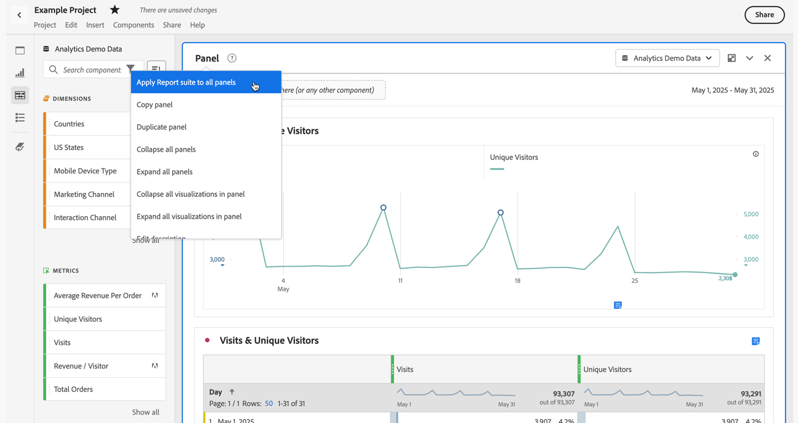
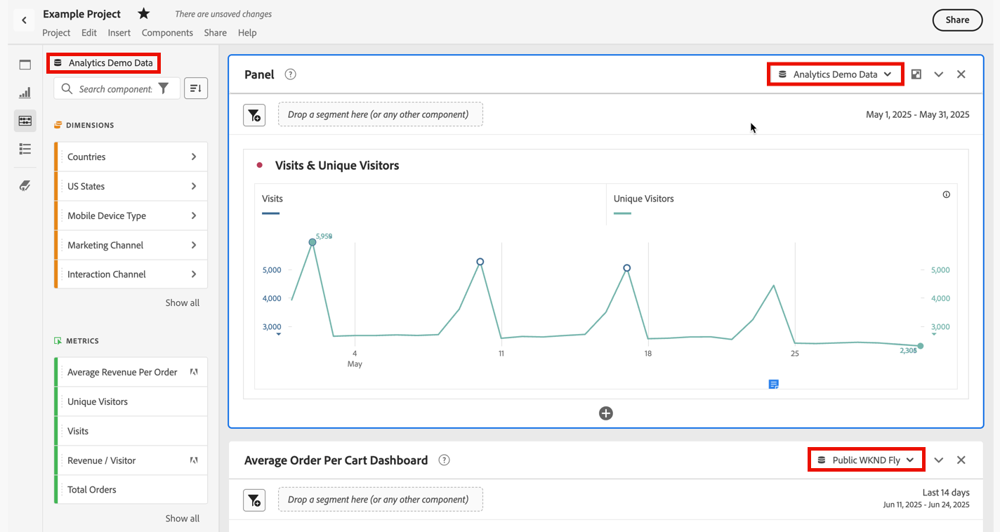
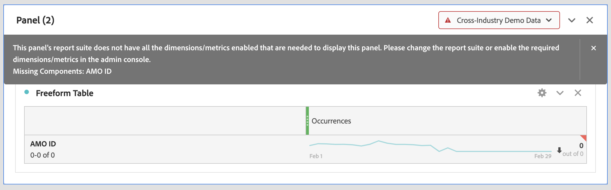

# Meerdere rapportsuites

U kunt projecten in Analysis Workspace maken met gegevens uit meerdere rapportsuite. De reeksen van het rapport worden gekozen op paneelniveau, zodat kunt u een verschillende rapportreeks voor elk paneel binnen het zelfde project van Workspace kiezen.

Deze mogelijkheid is handig als u wilt:

* Vergelijk gegevens uit twee verschillende gebieden en de gegevens bevinden zich in twee verschillende rapportsuites. U kunt tabellen en visualisaties maken om de gegevens naast elkaar te vergelijken.

* Bouw een dashboard van metriek en visualisaties om uit te melden aan andere organisaties. U kunt gegevens van diverse rapportreeksen in het zelfde project trekken.

>[!BEGINSHADEBOX]

Zie  [ Veelvoudige rapportsuites ](https://video.tv.adobe.com/v/32843?quality=12&learn=on){target="_blank"} voor een demo video.

>[!ENDSHADEBOX]

## Rapportsuite toepassen op alle deelvensters

U kunt een rapportsuite op alle deelvensters tegelijk toepassen door met de rechtermuisknop op de koptekst van een deelvenster te klikken en **[!UICONTROL Apply Report Suite to All Panels]** te selecteren.

## Actief deelvenster

U kunt het actieve deelvenster herkennen aan de lichtblauwe rand eromheen. Selecteer in een deelvenster om dat deelvenster om te zetten in het actieve deelvenster.

>[!TIP]
>
>U kunt slepen en neerzetten in elk deelvenster dat zich in dezelfde rapportsuite bevindt als het actieve deelvenster. Door naar een inactief deelvenster van dezelfde rapportsuite te slepen, wordt het deelvenster actief.
>

## Werken met meerdere rapportsuites

1. Maak een nieuw project met twee of meer deelvensters in Workspace.

1. Sleep componenten (maateenheden, afmetingen, segmenten, datumbereiken) naar het deelvenster. Zorg ervoor dat deelvensters gegevens en visualisaties hebben die specifiek zijn voor hun rapportsuite.

   >[!NOTE]
   >
   >Soms wordt een banner weergegeven tijdens het laden van een project (of het overschakelen naar een rapportsuite), waarbij niet alle componenten die in het project zijn opgenomen, in de rapportsuite zijn opgenomen. De ontbrekende componenten worden weergegeven. Volg [ deze instructies ](/help/admin/admin-console/permissions/product-profile.md) om toestemmingen aan de vereiste metriek/afmetingen te plaatsen.
   >

   

   U hebt drie opties om deze incompatibiliteit te verhelpen:
   * De vereiste afmetingen/metriek inschakelen
   * Wijzig de rapportsuite.
   * Doorgaan met enkele ontbrekende componenten. Dit resulteert in geen gegevens voor die componenten, en/of lege visualisaties.

1. Wijzig het deelvenster in een andere rapportsuite. U ziet hoe het componentlabel (momenteel actieve rapportsuite) en de weergegeven componenten worden bijgewerkt op basis van de nieuwe rapportsuite.

1. Gebruik een sneltoets (`shift` tijdens het slepen) om een inactief deelvenster om te zetten in een actief deelvenster.

1. (Optioneel) U kunt ook naar andere componentbuilders van Analytics gaan en ervoor zorgen dat deze nu een label van een rapportsuite tonen die

   * Waar een segment zal worden gecreeerd: [ de bouwer van het Segment ](https://experienceleague.adobe.com/docs/analytics/components/segmentation/segmentation-workflow/seg-build.html?lang=nl-NL).
   * Waar berekende metrisch zal worden gecreeerd: [ Berekende metrische bouwer ](https://experienceleague.adobe.com/docs/analytics/components/calculated-metrics/calcmetric-workflow/cm-build-metrics.html?lang=nl-NL).
   * Waar een alarm zal worden gebouwd: [ Alert bouwer ](https://experienceleague.adobe.com/docs/analytics/components/alerts/alert-builder.html?lang=nl-NL).
