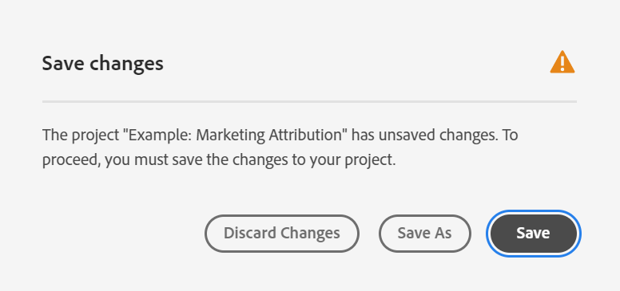

# Projecten opslaan

Projecten in Analysis Workspace worden automatisch elke 2 minuten opgeslagen.

U kunt projecten ook handmatig opslaan. Er zijn aanvullende opties beschikbaar, zoals tags of notities toevoegen, wanneer u een project handmatig opslaat.

## Projecten handmatig opslaan {#Save}

Er zijn verschillende opties beschikbaar wanneer u een project handmatig opslaat in Analysis Workspace.

Een project handmatig opslaan:

1. Open uw project in Analysis Workspace en selecteer **[!UICONTROL Project]** Kies vervolgens een van de volgende opties:

   | Handeling | Beschrijving |
   |---|---| 
   | **[!UICONTROL Save]** | Sla de wijzigingen in uw project op. Als het project wordt gedeeld, zullen de ontvangers van het project ook de veranderingen zien. Wanneer u uw project voor het eerst opslaat, wordt u gevraagd het project een naam, (optionele) beschrijving en (optionele) tags toe te voegen. |
   | **[!UICONTROL Save with notes]** | Voordat uw project wordt opgeslagen, voegt u notities toe over de wijzigingen in het project. De nota&#39;s worden opgeslagen met de projectversie en zijn beschikbaar aan alle redacteurs onder [!UICONTROL Project] > [!UICONTROL Open previous version]. |
   | **[!UICONTROL Save as]** | Maak een duplicaat van uw project. Dit heeft geen invloed op het oorspronkelijke project. |
   | **[!UICONTROL Save as template]** | Uw project opslaan als een [aangepaste sjabloon](https://experienceleague.adobe.com/docs/analytics/analyze/analysis-workspace/build-workspace-project/starter-projects.html) die beschikbaar komt voor uw organisatie onder **[!UICONTROL Project > New]** |

## Automatisch opslaan {#Autosave}

Alle projecten in Analysis Workspace worden automatisch elke 2 minuten opgeslagen op uw lokale computer. Dit geldt ook voor nieuwe projecten die nog niet handmatig zijn opgeslagen.

* **Nieuwe projecten:** Hoewel nieuwe projecten automatisch worden opgeslagen, moet u elk nieuw project de eerste keer handmatig opslaan. Analysis Workspace vraagt u om nieuwe projecten handmatig op te slaan wanneer u overschakelt naar een ander project, het browsertabblad sluit enzovoort.

   Als u om het even welke reden onverwachts toegang tot een nieuw gecreeerd project verliest alvorens het manueel op te slaan, wordt een terugwinningsversie van uw project bewaard op de Analysis Workspace landende pagina in een omslag genoemd `Recovered Projects (Last 7 Days)`. U moet het herstelde project herstellen en het handmatig op de gewenste locatie opslaan.

   Een hersteld project herstellen:

   1. Ga naar de [!UICONTROL **Herstelde projecten**] op de bestemmingspagina van Analysis Workspace.

      

   1. Open het project en sla het op de gewenste locatie op.

* **Bestaande projecten:** Als u om het even welke reden een project met veranderingen verlaat die nog niet auto-bewaarde zijn, of Analysis Workspace vraagt u om uw veranderingen te bewaren of een waarschuwingsbericht verstrekt.

   Hier volgen enkele veelvoorkomende scenario&#39;s:

### Een ander project openen

Als u een extra project opent terwijl het werken aan een project dat veranderingen bevat die nog niet auto-bewaarde zijn, vraagt Analysis Workspace u om het huidige project te bewaren alvorens weg te gaan.

De volgende opties zijn beschikbaar:

* **Opslaan:** Hiermee vervangt u de meest recente automatisch opgeslagen lokale kopie van uw project door de meest recente wijzigingen.
* **Opslaan als:** Hiermee slaat u de laatste wijzigingen op als een nieuw project. Het oorspronkelijke project wordt alleen opgeslagen met de meest recente automatisch opgeslagen wijzigingen.
* **Wijzigingen negeren:** Hiermee worden de laatste wijzigingen genegeerd. In het project blijven de meest recente automatisch opgeslagen wijzigingen behouden.

### Navigeren weg of een tabblad sluiten

Als u van de pagina weg navigeert of het browser lusje terwijl het bekijken van een project met veranderingen sluit die nog niet auto-bewaard zijn, waarschuwt browser dat uw niet bewaarde veranderingen zullen verloren worden. U kunt kiezen om te vertrekken of te annuleren.

### Browsercrashes of sessietijden uit

Als uw browser vastloopt of als uw sessietijden uit zijn, dan wordt de volgende keer dat u Analysis Workspace opent, u ertoe aangezet om het even welke veranderingen in uw project terug te krijgen die nog niet auto-bewaard zijn.

Hier volgt het dialoogvenster Projectherstel waarin de eerste keer dat u Analysis Workspace opent na een crash of een time-out, wordt weergegeven.

Selecteren **Ja** om het project van het meest recente auto-bewaarde exemplaar te herstellen.

Selecteren **Nee** om de automatisch opgeslagen kopie te verwijderen en de laatst door de gebruiker opgeslagen versie van het project te openen.

Voor **new** projecten die nooit zijn opgeslagen, niet-opgeslagen wijzigingen kunnen niet worden hersteld.

## Een vorige versie openen {#previous-version}

Een vorige versie van een project openen:

1. Ga naar **[!UICONTROL Project]** > **[!UICONTROL Open previous version]**

   

1. Controleer de lijst met eerdere beschikbare versies.
   [!UICONTROL Timestamp] en [!UICONTROL Editor] worden weergegeven naast [!UICONTROL Notes] als deze bij de [!UICONTROL Editor] opgeslagen. Versies zonder aantekeningen worden gedurende 90 dagen opgeslagen; versies met notities worden gedurende 1 jaar opgeslagen .
1. Selecteer een vorige versie en klik op **[!UICONTROL Load]**.
De vorige versie wordt vervolgens geladen met een melding. De vorige versie wordt pas de huidige opgeslagen versie van het project als u op **[!UICONTROL Save]**. Als u bij de geladen versie vandaan navigeert, ziet u bij het retourneren de laatst opgeslagen versie van het project.
