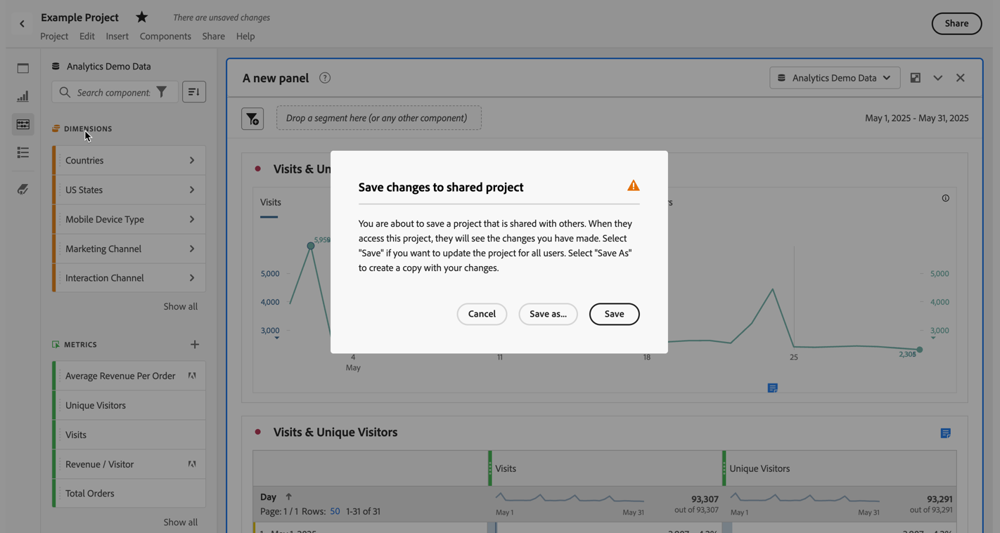
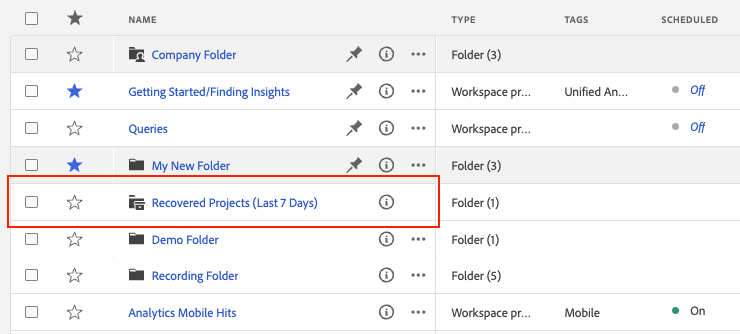

# Projecten opslaan {#save-projects}

<!-- markdownlint-disable MD034 -->

>[!CONTEXTUALHELP]
>id="workspace_project_addnotes"
>title="Notities toevoegen"
>abstract="Voeg notities toe over de projectversie die wordt opgeslagen. Deze notities worden met de versie opgeslagen en kunnen worden geopend in het menu **[!UICONTROL Project]** > **[!UICONTROL Open previous version]** ."

<!-- markdownlint-enable MD034 -->

Projecten in Analysis Workspace worden automatisch elke 2 minuten opgeslagen. U kunt projecten ook zelf opslaan, een project opslaan als een duplicaat of een project opslaan met versienotities.

## Opslaan

Als u een project handmatig wilt opslaan terwijl uw project in Analysis Workspace is geopend, selecteert u **[!UICONTROL Project]** en kiest u een van de volgende opties:

* **[!UICONTROL Save]**

  Wijzigingen in uw project opslaan. Als het project wordt gedeeld, zien de ontvangers van het project ook de veranderingen.

  Wanneer u uw project voor het eerst opslaat, wordt een dialoogvenster **[!UICONTROL Save]** weergegeven.

  

   1. Geef het volgende op:

      * **[!UICONTROL Name]** (vereist). naam van uw project.
      * **[!UICONTROL Description]**. Een beschrijving van uw project.
      * **[!UICONTROL Tags]**. Onderzoek naar markeringen in het [!UICONTROL *gebied van het Onderzoek*] of voeg nieuwe markeringen toe gebruikend **[!UICONTROL ENTER]**.
      * **[!UICONTROL Folder]**. Selecteer een omslag van [!UICONTROL *Uitgezocht een omslag*] drop-down menu. Als u geen map opgeeft, wordt het project opgeslagen in de huidige map waaruit u een nieuw project hebt gemaakt.
      * **[!UICONTROL Version notes]**. Voeg versienota&#39;s in *toe voegt nota&#39;s* tekstgebied.

   1. Selecteer **[!UICONTROL Save]** om uw project op te slaan.

  Als u uw project opslaat, slaat u in feite een versie van uw project op die 90 dagen wordt opgeslagen.

  Als u een project opslaat dat u hebt gedeeld, verschijnt er een waarschuwingsvenster van **[!UICONTROL Save changes to shared project]** waarin u om bevestiging wordt gevraagd.

  

   * Selecteer **[!UICONTROL Save]** om het project op te slaan.
   * Selecteer **[!UICONTROL Save as]** om het project op te slaan als een dubbel project met een nieuwe naam.

* **[!UICONTROL Save with notes]**

  

  Wanneer u uw project opslaat, voegt u notities toe over wat er in het project is gewijzigd. In het dialoogvenster Versienotities opslaan:

   1. Voer de **[!UICONTROL Version notes]** in het tekstgebied **[!UICONTROL Add notes]** in.
   1. Selecteer **[!UICONTROL Save]** .

  De nota&#39;s worden opgeslagen met de projectversie en zijn beschikbaar wanneer u [ een vorige versie ](open-projects.md#open-previous-version) van het project opent. Een versie die met notities wordt opgeslagen, wordt automatisch één jaar lang opgeslagen.

* **[!UICONTROL Save As]**

  

  Maak een duplicaat van uw project met een nieuwe naam. Het dialoogvenster Opslaan als wordt weergegeven.

   1. Geef het volgende op:

      * **[!UICONTROL Name]** (vereist). naam van uw project.
      * **[!UICONTROL Description]**. Een beschrijving van uw project.
      * **[!UICONTROL Tags]**. Onderzoek naar markeringen in het [!UICONTROL *gebied van het Onderzoek*] of voeg nieuwe markeringen toe gebruikend **[!UICONTROL ENTER]**.
      * **[!UICONTROL Folder]**. Selecteer een omslag van [!UICONTROL *Uitgezocht een omslag*] drop-down menu. Als u geen map opgeeft, wordt het project opgeslagen in de huidige map waaruit u een nieuw project hebt gemaakt.
      * **[!UICONTROL Version notes]**. Voeg versienota&#39;s in *toe voegt nota&#39;s* tekstgebied.

   1. Selecteer **[!UICONTROL Save]** om uw project op te slaan.

  U kunt het project opslaan in een andere map. Dit heeft geen invloed op het oorspronkelijke project.

<!-- Cannot find this option in CJA 
| **[!UICONTROL Save as template]** | Save your project as a [custom template](https://experienceleague.adobe.com/docs/analytics/analyze/analysis-workspace/build-workspace-project/starter-projects.html?lang=nl-NL) that becomes available to your organization under **[!UICONTROL Project > New]** | 
-->

## Automatisch opslaan

>[!IMPORTANT]
>
>Alhoewel de nieuwe projecten auto-bewaarde zijn, moet u elk nieuw project manueel bewaren de **eerste** tijd.
>

Alle projecten in Analysis Workspace worden automatisch elke 2 minuten opgeslagen op uw lokale computer. Deze auto-sparen omvat pas gecreëerde projecten die nog niet manueel worden bewaard.

### Nieuwe projecten

Analysis Workspace vraagt u om nieuwe projecten handmatig op te slaan wanneer u overschakelt naar een ander project, het browsertabblad sluit enzovoort.

Als u om het even welke reden onverwachts toegang tot een nieuw gecreeerd project verliest alvorens het manueel op te slaan, wordt een terugwinningsversie van uw project bewaard op de Analysis Workspace landende pagina in een omslag genoemd **[!UICONTROL Recovered Projects (Last 7 Days)]**. Herstel het herstelde project en sla het handmatig op de gewenste locatie op.

Een hersteld project herstellen:

1. Ga naar de map **[!UICONTROL Recovered Projects (Last 7 Days)]** op de bestemmingspagina van Analysis Workspace.

<!-- 
     
  -->

1. Open het project en sla het op de gewenste locatie op.

### Bestaande projecten

Als u om het even welke reden een project met veranderingen verlaat die nog niet auto-bewaarde zijn, of Analysis Workspace vraagt u om uw veranderingen te bewaren of een waarschuwingsbericht verstrekt.

Enkele gangbare scenario&#39;s:

#### Een ander project openen

Als u een ander project opent wanneer het werken aan een project dat veranderingen bevat die nog niet auto-bewaarde zijn, vraagt Analysis Workspace u om het huidige project te bewaren.

De volgende opties zijn beschikbaar:

* **[!UICONTROL Save]**: vervangt de meest recente automatisch opgeslagen lokale kopie van uw project door de meest recente wijzigingen.
* **[!UICONTROL Discard Changes]**: hiermee worden de meest recente wijzigingen genegeerd. Het project behoudt het meest recente automatisch opgeslagen lokale exemplaar.
* **[!UICONTROL Cancel]**: annuleer de actie om een ander project te openen en het bestaande project open te houden.

<!--  -->

#### Navigeren weg of een tabblad sluiten

Als u van de pagina weg navigeert of het browser lusje terwijl het bekijken van een project met veranderingen sluit die nog niet auto-bewaard zijn, waarschuwt browser u dat uw niet bewaarde veranderingen worden verloren. U kunt kiezen om te vertrekken of te annuleren. Hoe de browser u waarschuwt, is afhankelijk van de browser die u gebruikt.

### Browsercrashes of sessietijden uit

Als uw browser vastloopt of als uw sessietijden uit, dan wordt de volgende keer dat u Analysis Workspace opent, u ertoe aangezet om het even welke veranderingen in uw project terug te krijgen die nog niet automatisch worden bewaard.

* Selecteer **[!UICONTROL Yes]** om het project te herstellen op basis van de meest recente automatisch opgeslagen kopie.

* Selecteer **[!UICONTROL No]** om de automatisch opgeslagen kopie te verwijderen en de laatst door de gebruiker opgeslagen versie van het project te openen.

<!---->

Voor **nieuwe** projecten die nooit zijn bewaard, zijn niet bewaarde veranderingen niet terugwinbaar.

<!-- Shouldn't this belong to another page?  Moved it to a new open projects page

## Open previously saved version

To open a previously saved version of a project:

1. Select **[!UICONTROL Open previous version]** from the **[!UICONTROL Project]** menu.

   

1. Review the list of previous versions available. You can switch between **[!UICONTROL All versions]** and **[!UICONTROL Only versions with notes]**.

   For each version, the list shows a timestamp
   [!UICONTROL Timestamp] and [!UICONTROL Editor] are shown, in addition to [!UICONTROL Notes] if they were added when the [!UICONTROL Editor] saved. Versions without notes are stored for 90 days; versions with notes are stored for 1 year.
1. Select a previous version and click **[!UICONTROL Load]**.
   The previous version then loads with a notification. The previous version does not become the current saved version of your project until you click **[!UICONTROL Save]**. If you navigate away from the loaded version, when you return, you will see the last saved version of the project.

-->

<!--
# Save projects {#save-projects}

>[!CONTEXTUALHELP]
>id="workspace_project_addnotes"
>title="Add notes"
>abstract="Add notes about the project version being saved. These notes will be stored with the version and accessible under the **[!UICONTROL Project]** > **[!UICONTROL Open previous version]** menu."

Projects in Analysis Workspace are automatically saved every 2 minutes. 

You can also manually save projects. Additional options such as adding tags or notes are available when you manually save a project.

## Save projects manually {#Save} 

Various options are available when manually saving a project in Analysis Workspace.

To manually save a project:

1. With your project open in Analysis Workspace, select **[!UICONTROL Project]**, then choose from the following options: 

   | Action | Description | 
   |---|---| 
   | **[!UICONTROL Save]** | Save changes to your project. If the project is shared, recipients of the project will also see the changes. When you first save your project, you are prompted to give the project a name, (optional) description and add (optional) tags. | 
   | **[!UICONTROL Save with notes]** | Before your project saves, add notes about what changed in the project. Notes are stored with the project version and are available to all editors under [!UICONTROL Project] > [!UICONTROL Open previous version]. | 
   | **[!UICONTROL Save as]** | Create a duplicate of your project. The original project will not be affected. | 
   | **[!UICONTROL Save as template]** | Save your project as a [template](/help/analyze/analysis-workspace/templates/create-templates.md) that becomes available to your organization under **[!UICONTROL Project > New]** | 

## Auto-save {#Autosave} 

All projects in Analysis Workspace are automatically saved every 2 minutes to your local machine. This includes newly created projects that are not yet saved manually. 

* **New projects:** Even though new projects are auto-saved, you must save each new project manually the first time. Analysis Workspace prompts you to save new projects manually when switching to another project, closing the browser tab, and so forth. 

  If for any reason you unexpectedly lose access to a newly created project before manually saving it, a recovery version of your project is saved on the Analysis Workspace landing page in a folder called `Recovered Projects (Last 7 Days)`. You must restore the recovered project and manually save it to a desired location. 

  To restore a recovered project:
  
  1. Go to the [!UICONTROL **Recovered Projects**] folder on the Analysis Workspace landing page.

     

  1. Open your project and save it to a desired location. 

* **Existing projects:** If for any reason you leave a project with changes that are not yet auto-saved, Analysis Workspace either prompts you to save your changes or provides a warning message. 

  Following are some common scenarios:

### Open another project 

If you open an additional project while working on a project that contains changes that are not yet auto-saved, Analysis Workspace prompts you to save the current project before leaving.

The following options are available:

* **Save:** Replaces the most recent auto-saved local copy of your project with your latest changes.
* **Save As:** Saves your latest changes as a new project. The original project is saved only with the most recent auto-saved changes.
* **Discard Changes:** Discards your latest changes. The project retains the most recent auto-saved changes.

### Navigate away or close a tab 

If you navigate away from the page or close the browser tab while viewing a project with changes that are not yet auto-saved, the browser warns that your unsaved changes will be lost. You can choose to leave or cancel. 

### Browser crashes or session times out 

If your browser crashes or if your session times out, then the next time you access Analysis Workspace you're prompted to recover any changes to your project that are not yet auto-saved.

Following is the Project Recovery dialog box that displays the first time you access Analysis Workspace after a crash or a timeout.

Select **Yes** to restore the project from the most recent auto-saved copy.

Select **No** to delete the auto-saved copy and open the last user-saved version of the project.

For **new** projects that have never been saved, unsaved changes are not recoverable.

## Open a previous version {#previous-version}

To open a previous version of a project:

1. Go to **[!UICONTROL Project]** > **[!UICONTROL Open previous version]**

   
   
1. Review the list of prior versions available. 
   [!UICONTROL Timestamp] and [!UICONTROL Editor] are shown, in addition to [!UICONTROL Notes] if they were added when the [!UICONTROL Editor] saved. Versions without notes are stored for 90 days; versions with notes are stored for 1 year.
1. Select a previous version and click **[!UICONTROL Load]**.
   The previous version then loads with a notification. The previous version does not become the current saved version of your project until you click **[!UICONTROL Save]**. If you navigate away from the loaded version, when you return, you will see the last saved version of the project. 

-->