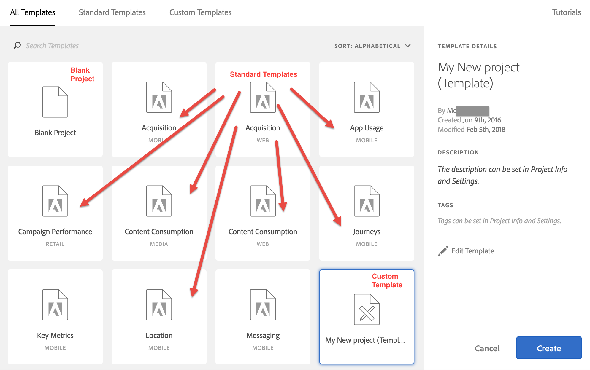

# Sjablonen

U kunt kiezen of u een project wilt maken van:

* **Leeg project (standaard)**: Zie voor instructies [Een Analysis Workspace-project maken](/help/analyze/analysis-workspace/home.md).
* **Standaardsjabloon**: Deze sjablonen worden gemaakt door Adobe en worden samen met het product verzonden.
* **Aangepaste sjabloon**: Deze sjablonen kunnen worden gemaakt, gedeeld of verwijderd door gebruikers met beheerdersrechten of door niet-beheerders, op voorwaarde dat aan hen de [!UICONTROL Analysis Workspace: Save as Template] toestemming in de Admin Console. [Meer informatie...](https://experienceleague.adobe.com/docs/analytics/admin/admin-console/permissions/product-profile.html)

## Aangepaste sjablonen maken {#create-custom-template}

Gebruikers met beheerdersrechten kunnen elk project dat ze maken, omzetten in een aangepaste sjabloon. Hieronder wordt beschreven hoe:

1. Open het project.
1. Ga naar **[!UICONTROL Project]** > **[!UICONTROL Save As Template]**.

   

   Het project wordt onder de huidige projectnaam opgeslagen, gevolgd door het woord (Sjabloon) tussen haakjes. Beheerders kunnen deze naam wijzigen door de sjabloon te bewerken.

   >[!NOTE]
   >
   >Door gebrek, zijn de projectmalplaatjes zichtbaar aan iedereen in uw organisatie. U kunt ze ordenen door labels toe te passen. (Ga naar **[!UICONTROL Project]** > **[!UICONTROL Project Info & Settings]** om tags en beschrijvingen te bewerken.)

Hier volgt een video over het maken en beheren van aangepaste sjablonen:

>[!VIDEO](https://video.tv.adobe.com/v/23231/?quality=12)

### Aangepaste sjablonen beheren {#manage-custom-template}

| Handeling | Beschrijving |
|--- |--- |
| Sjabloon bewerken | Hiermee kan een beheerder de sjabloon bewerken door de gegevensbron te wijzigen, componenten, visualisaties, datumbereiken enz. te wijzigen.  Als u een aangepaste sjabloon wilt bewerken,<ul><li>Open de lijst met aangepaste sjablonen in Analysis Workspace, selecteer een sjabloon en klik op Sjabloon bewerken, of</li><li>Navigeer in Analytics naar Componenten > Projecten en filter vervolgens op Sjablonen. Klik op de naam van de sjabloon die u wilt bewerken.</li></ul>**Opmerking:** Nadat u een sjabloon hebt bewerkt, hebt u, afhankelijk van de situatie, twee opties: Opslaan, Opslaan als. Zo verschillen ze:<ul><li>**Opslaan:** Hiermee werkt u de aangepaste sjabloon voor alle gebruikers bij. Wanneer iemand anders een project van dit douanemalplaatje creeert, zullen zij de veranderingen zien u hebt aangebracht.</li><li>**Opslaan als:** Hiermee maakt u een kopie van de aangepaste sjabloon met uw wijzigingen. (U kunt zien dat u in de bewerkingsmodus werkt wanneer het menu-item Delen > Project delen is uitgeschakeld.)</li></ul> |
| Zoeken op sjablonen | Klik in het dialoogvenster Aangepaste sjablonen op Sjablonen zoeken. |
| Sjablonen sorteren | U kunt sjablonen alfabetisch sorteren, op relevantie en op aanmaakdatum.  Klik in het dialoogvenster Aangepaste sjablonen op Sorteren: |
| Tags toepassen op een sjabloon | Open de sjabloon en ga naar Project > Projectinfo &amp; -instellingen. Klik op Codes toevoegen. |
| Sjabloonbeschrijving wijzigen | Open de sjabloon en ga naar Project > Projectinfo &amp; -instellingen. Dubbelklik op de beschrijving en bewerk deze. |

## Standaardsjablonen

Wanneer u een Workspace voor het eerst opent, zijn sjablonen beschikbaar in de linkertrack. Analysis Workspace Templates behandelt veelvoorkomende gebruiksgevallen. Zij worden gegroepeerd door verticaal zij tot behoren en met verschillende afmetingen, segmenten, metriek en visualisaties, afhankelijk van de rapportreeks bevolkt zijn u hebt geselecteerd.

U kunt deze vooraf ingevulde sjablonen ongewijzigd gebruiken of deze aan uw behoeften aanpassen (door bijvoorbeeld metriek of visualisaties toe te voegen of te vervangen) en ze onder een andere naam op te slaan.

Hier volgt een videozelfstudie [Standaardsjablonen in Analysis Workspace](https://experienceleague.adobe.com/docs/analytics-learn/tutorials/analysis-workspace/analysis-workspace-basics/standard-templates-in-analysis-workspace.html) (2:46)

Hier zijn beschikbare sjablonen en de vragen die elke sjabloon kan beantwoorden.

### Training

Dit standaardmalplaatje begeleidt u door gemeenschappelijke terminologie en stappen voor het bouwen van uw eerste analyse in Werkruimte. De sjabloon is beschikbaar als standaardsjabloon in het modale dialoogvenster voor nieuwe projecten en vervangt het huidige voorbeeldproject voor nieuwe gebruikers die geen andere projecten in hun lijst hebben.

Hier is een video over de [!UICONTROL Training Tutorial] sjabloon:

>[!VIDEO](https://video.tv.adobe.com/v/33773/?quality=12)

### Advertising

>[!IMPORTANT]
>
>Advertentiesjablonen zijn alleen beschikbaar als uw rapportsuite is ingeschakeld voor [Advertising Analytics](https://experienceleague.adobe.com/docs/analytics/integration/advertising-analytics/overview.html).

* **Betaalde zoekmachines**: In deze sjabloon worden onder andere de advertentietrends, advertentieplatoren, trefwoorden, accounts, campagnes en meer afgebroken.

### Commerce

* **Magento: Marketing en handel**: Deze sjabloon verdeelt uw e-commerceconversie door kanaalattributie op de markt te brengen en biedt inzicht door zoekwoord, landingspagina, geografische locatie en meer. Hier volgt een videodemo over de [Magento: Template voor marketing en handel](https://experienceleague.adobe.com/docs/analytics-learn/tutorials/integrations/magento/magento-analysis-workspace-template.html).

### Gegevensverzameling

* **ITP-effect**: Begrijp hoe de ITP van Apple uw gegevens beïnvloedt en hoe te om rapportering dienovereenkomstig aan te passen.

### Media

* **Inhoudsverbruik**: Wie zijn mijn loyale lezers?
* **Frequentie - Loyalty**: Welke inhoud wordt het meest verbruikt en betrekt gebruikers?
* **Streaming media-verbruik**: Biedt trends en meetwaarden voor het mediaconsumptie op alle digitale apparaten. Hier volgt een video over de sjabloon voor het streamen van mediaconsumptie:

   >[!VIDEO](https://video.tv.adobe.com/v/23901/?quality=12)

### Mobile

>[!IMPORTANT]
>
>Mobiele sjablonen zijn alleen beschikbaar als uw rapportsuite is ingeschakeld voor analytische toepassingen voor mobiele apparaten.

* **Overname:** Zie hoe mobiele verwervingskoppelingen werken.
* **Toepassingsgebruik:** Hoeveel gebruikers van apps, lanceert, en lanceert eerst app had, en wat was de gemiddelde zittingslengte?
* **Reizen:** Wat zijn de opvallende gebruikspatronen voor mijn app?
* **Belangrijkste cijfers:** Houd een impuls op de belangrijkste metriek van uw app.
* **Locatie:** Bevat een Kaart met locatiegegevens.
* **Berichten:** Richt zich op in-app en duw overseinenprestaties.
* **Prestaties:** Hoe presteert de app en waar hebben gebruikers problemen?
* **Behoud:** Wie zijn mijn loyale gebruikers en wat doen ze?

### Detailhandel

* **Campagneprestaties:** Welke campagnes drijven de meeste inkomsten?
* **Producten:** Welke producten presteren het beste?

### Web

* **Overname:** Wat zijn de hoogste verkeersbestuurders aan mijn website?
* **AEM overzicht van de siteprestaties:** Hoe presteert mijn Adobe Experience Manager-site?
* **Inhoudsverbruik:** Wat zijn de beste plaatsen waar mensen op mijn site gaan?
* **Behoud:** Welke soorten gebruikers waarschijnlijk loyale gebruikers van mijn plaats zijn?
* **Technologie:** Welke technologie gebruiken mensen om tot mijn plaats toegang te hebben?

### Mensen

Dit malplaatje is gebaseerd op metrisch van Mensen, dat een de-gedupliceerde versie van de Unieke metrische Bezoekers is. Met de sjabloon Personen wordt gemeten hoe vaak consumenten die meerdere apparaten gebruiken, met uw merk communiceren. Met de sjabloon kunt u:

* Segmenteer uw gegevens voor VS/Canada versus de rest van de wereld
* De maatstaven Personen en Unieke bezoekers naast elkaar vergelijken
* Zie de &quot;compressiesnelheid&quot;, een berekende maatstaf die berekent hoeveel kleiner de personenmeting is als een percentage van Unieke bezoekers
* Vergelijk de totalen van het apparaattype die uw klanten gebruiken
* Zie hoeveel gemiddelde apparaten per persoon worden gebruikt
* Ontdek hoe u segmenten stapelen met de personenmetrische methode kunt gebruiken
* Onderzoek hoe het gebruiken van identiteitskaart van de Experience Cloud in uw milieu de doeltreffendheid van de metrische Mensen verbetert

### Reis-IQ: Sjabloon voor apparaatanalyse

<!--This content is mirrored in the CDA doc.-->

Met deze sjabloon kunt u essentiële gegevens over de prestaties van verschillende apparaten bekijken. Het is alleen beschikbaar voor klanten die toegang hebben tot [Apparaatanalyse](https://experienceleague.adobe.com/docs/analytics/components/cda/overview.html) (CDA).

* **Identificatie van de gebruikers**: Hiermee kunt u zien hoe vaak bezoekers van uw site worden geïdentificeerd met methoden die zijn gebaseerd op Apparaatanalyse.
* **Grootte publiek meten**: Geeft een vergelijking van &#39;Unieke apparaten&#39; in vergelijking met &#39;Mensen&#39;. Het aandeel van deze twee getallen wordt &#39;apparaatcompressie&#39; genoemd, een berekende metrische waarde die zichtbaar is in dit deelvenster. Deze compressiemetrie is afhankelijk van een groot aantal factoren:
   * **Aanmeldfrequentie**: Hoe meer gebruikers zich aanmelden op uw site, hoe meer Adobe bezoekers op verschillende apparaten kan identificeren en aanhechten. Sites met een lage aanmeldingsfrequentie hebben ook een lage compressiesnelheid.
   * **Experience Cloud ID-dekking**: Alleen bezoekers met een ECID kunnen worden aangesloten. Een lager percentage bezoekers van uw site met een ECID correleert met lagere compressiesnelheden.
   * **Meervoudig apparaatgebruik**: Als bezoekers van uw site niet meerdere apparaten gebruiken, ziet u lagere compressiesnelheden.
   * **Korreligheid melden**: Compressie per dag is doorgaans kleiner dan compressie per maand of jaar. De kansen voor een individu om veelvoudige apparaten te gebruiken worden kleiner binnen één enkele dag dan over een volledige maand. Het segmenteren, het filtreren, of het gebruiken van breekdimensies kunnen een lagere compressiesnelheid ook tonen.
* **Op personen gebaseerde segmenten**: Bevat een segmentvervolgkeuzelijst waarmee u apparaatspecifieke gegevens kunt weergeven. In dit deelvenster kunt u beter experimenteren met segmenten om te zien hoe het opnemen of uitsluiten van apparaattypen van invloed is op rapporten.
* **De reis naar andere apparaten analyseren**: Verstrekt stroom en reserverapporten die op apparatentype worden gebaseerd.
* **Apparaattoewijzing**: Combineer de functies van Reis IQ en Attribution IQ.
* **Overige tips en trucs**: Nuttige onderwerpen rond CDA die u meer uit het gebruiken van het laten komen.
