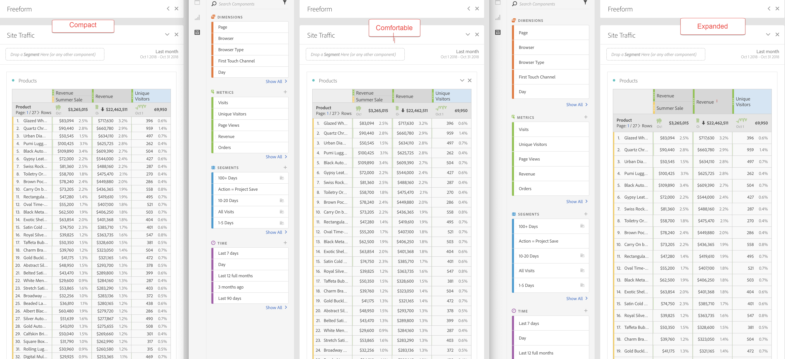

# Weergavedichtheid

Als u de weergavedichtheid aanpast, kunt u meer gegevens op het scherm zien door de verticale opvulling van het linkerdeelvenster, vrije-vormtabellen en kleurentabellen te verminderen. Er zijn drie opties beschikbaar:

>[!BEGINTABS]

>[!TAB  Compact ]

Dit is de versie met de meest versmalde weergave.

>[!TAB  Comfortable ]

Dit is de weergave die je gebruikt in Workspace.

>[!TAB  Uitgebreid ]

Dit is de versie met de meest uitgebreide weergave.

>[!ENDTABS]

De weergavedichtheid instellen:

1. Navigeer in Workspace naar **[!UICONTROL Projects]** > **[!UICONTROL Project info and settings]** .

1. Selecteer een optie **[!UICONTROL View density]** en selecteer **[!UICONTROL Save]** .

<!--
# [!UICONTROL View Density]

Adjusting the [!UICONTROL view density] lets you see more data on the screen by reducing the vertical padding of the left rail, freeform tables and cohort tables. You have 3 options when toggling the view density via radio buttons:

- **[!UICONTROL Compact]**: This is the version with the most condensed view.
- **[!UICONTROL Comfortable]**: This leaves a little more padding than the Compact version.
- **[!UICONTROL Expanded]** (default): This is the view you are used to in Workspace.

To set the view density:

1. In Workspace, navigate to **[!UICONTROL Projects]** > **[!UICONTROL Project Info and Settings]**.

1. Select among the 3 options outlined above and click **[!UICONTROL Save]**.

>[!BEGINSHADEBOX]

See  [View density](https://video.tv.adobe.com/v/25963?quality=12&learn=on){target="_blank"} for a demo video.

>[!ENDSHADEBOX]

-->
