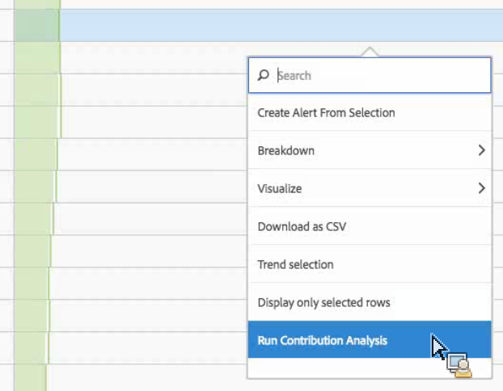
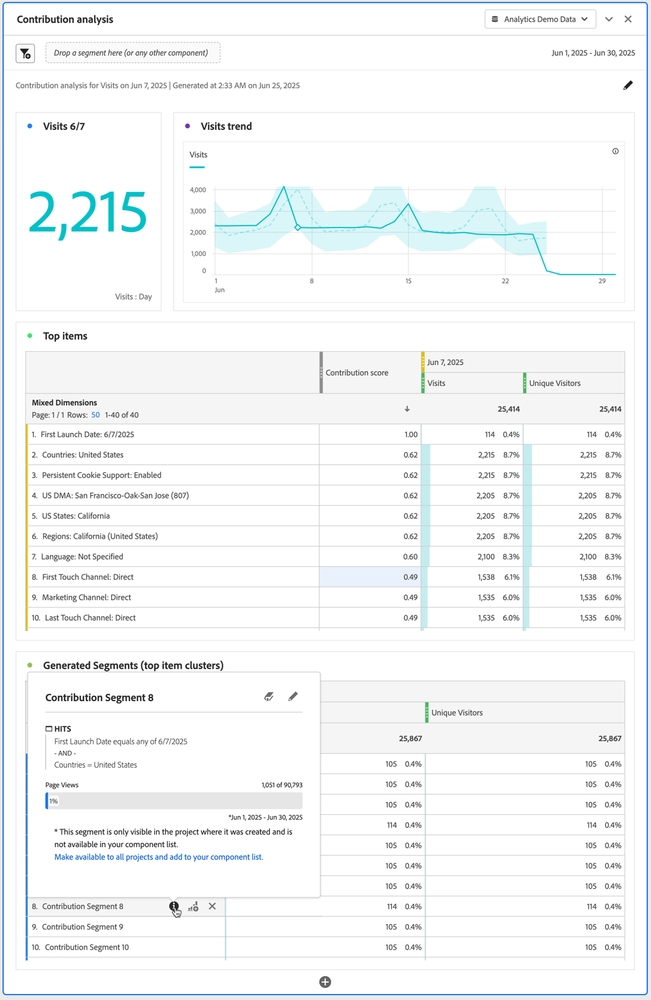

# Bijdrageanalyse uitvoeren

[Bijdrage-analyse](/help/analyze/analysis-workspace/c-anomaly-detection/anomaly-detection.md#contribution-analysis) is een intensief machinaal leerproces dat is ontworpen om contribuanten aan een waargenomen anomalie in Adobe Analytics aan het licht te brengen. De bedoeling is de gebruiker te helpen om gebieden van nadruk of mogelijkheden voor extra analyse veel sneller te vinden dan anders mogelijk zou zijn.

## Bijdrageanalyse uitvoeren {#run}

Er zijn twee manieren om een beroep te doen op de analyse van de bijdrage in een project:

* In een vrije lijst met dagelijkse granulariteit, klik om het even welke rij met de rechtermuisknop aan en selecteer **[!UICONTROL Run Contribution Analysis]**. U kunt het zelfs op rijen in werking stellen die geen anomalie tonen.

  >[!NOTE]
  >
  >Wij steunen momenteel de analyse van de bijdragen alleen met de dagelijkse granulariteit.

  

* Houd de muisaanwijzer boven een afwijkend gegevenspunt in een lijndiagram in een lijndiagram. Klik op de knop **[!UICONTROL Analyze]** koppeling die wordt weergegeven.

  

1. (Optioneel) Nadat u hebt geklikt **[!UICONTROL Run Contribution Analysis]** in of de lijngrafiek of een lijst, kunt u het werkingsgebied van (en zo versnellen) de analyse door [exclusief afmetingen](#exclude).

1. Wacht terwijl de analyse van uw bijdrage wordt geladen. Dit kan veel tijd in beslag nemen, afhankelijk van de grootte van uw rapportenpakket en het aantal dimensies. De analyse van de bijdrage voert analyse op de hoogste 50.000 punten per dimensie uit.
1. Analysis Workspace laadt vervolgens een nieuw deelvenster voor de analyse van bijdragen rechtstreeks in dit project.

   * Een visualisatie die het aantal **Bezoeken** op die dag.
   * Maandelijks **Bezoekt trendlijn** voor context.
   * **Bovenste items** die tot deze anomalie heeft bijgedragen, gesorteerd door de [bijdragescore](/help/analyze/analysis-workspace/c-anomaly-detection/anomaly-detection.md#contribution-analysis), plus de metrische waarde in kwestie, en een Unieke metrische bezoeker om metrisch in context vanuit een grootteperspectief te zetten.

   * De [Gegenereerde segmenten](https://experienceleague.adobe.com/docs/analytics/components/segmentation/segmentation-workflow/seg-build.html?lang=nl-NL) (Top Item Clusters) de lijst identificeert verenigingen van hoogste punten die op de Score van de Bijdrage, anomalievoorvallen, en algemeen percentage worden gebaseerd die tot anomalische metrisch bijdragen. Dit wordt vervolgens vastgelegd als een publiekssegment (bijdragesegment 1, bijdragesegment 2, enz.). Als u op de knop &quot;i&quot; (info) klikt, krijgt u een weergave van de definitie van elk automatisch segment, inclusief de items die er bovenaan staan:

     

1. Aangezien de analyse van de bijdrage nu deel van Analysis Workspace uitmaakt, kunt u uit een aantal van zijn eigenschappen van het de klikmenu van een lijst van een lijst voordeel halen om uw analyse nog betekenisvoller te maken, zoals:

   * [Elk afmetingsitem omlaag splitsen op een andere afmeting.](/help/analyze/analysis-workspace/components/dimensions/t-breakdown-fa.md)
   * [Een of meer rijen Trending.](/help/analyze/analysis-workspace/home.md#section_34930C967C104C2B9092BA8DCF2BF81A)
   * [Nieuwe visualisaties toevoegen.](/help/analyze/analysis-workspace/visualizations/freeform-analysis-visualizations.md)
   * [Waarschuwingen maken.](/help/components/c-alerts/intellligent-alerts.md)
   * [Segmenten maken of vergelijken.](/help/analyze/analysis-workspace/c-panels/c-segment-comparison/segment-comparison.md)

>[!NOTE]
>
>We benadrukken de anomalie die wordt geanalyseerd met een blauwe stip in de bijdrageanalyse en de projecten voor intelligente waarschuwingen die eraan gekoppeld zijn. Dit geeft een duidelijkere indicatie van hoe de anomalie wordt geanalyseerd.

## Afmetingen uitsluiten van bijdrageanalyse {#exclude}

Het kan voorkomen dat u bepaalde dimensies wilt uitsluiten van de Contribute-analyse. Het kan bijvoorbeeld zijn dat u helemaal niets aan uw browser of hardware kunt schelen en dat u de analyse wilt versnellen door deze te verwijderen.

1. Na het klikken **[!UICONTROL Run Contribution Analysis]** (of **[!UICONTROL Analyze]** in een lijngrafiek), de **[!UICONTROL Excluded Dimensions]** wordt weergegeven.

1. Sleep alleen ongewenste afmetingen naar de **[!UICONTROL Excluded Dimensions]** en sla de lijst vervolgens op door op **[!UICONTROL Set as Default]**. Of klik op **[!UICONTROL Clear All]** om opnieuw te beginnen met het selecteren van afmetingen die moeten worden uitgesloten.

   

1. Nadat u de afmetingen hebt toegevoegd om uit te sluiten (of ervoor hebt gekozen niet om te kiezen), klikt u op **[!UICONTROL Run Contribution Analysis]** opnieuw.
1. Als u ooit de lijst van uitgesloten afmetingen moet herzien, enkel dubbelklik Dimensionen, en de lijst van uitgesloten dimensies toont:

   

1. Verwijder ongewenste afmetingen door op de x naast de ongewenste afmetingen te klikken en de lijst vervolgens op te slaan door op **[!UICONTROL Set as Default]**.
