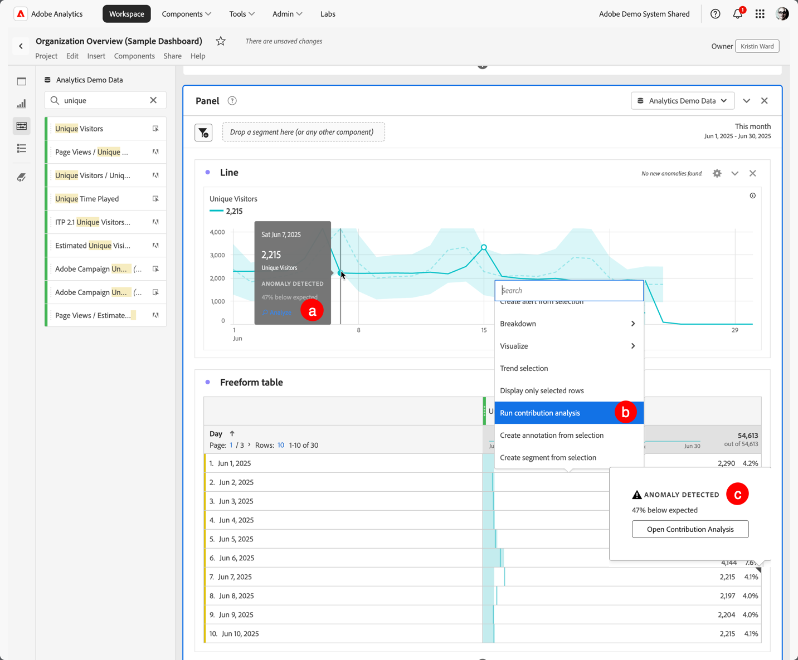

# Bijdrageanalyse uitvoeren

[&#x200B; Analyse van de Bijdrage &#x200B;](/help/analyze/analysis-workspace/c-anomaly-detection/anomaly-detection.md#contribution-analysis) is een intensief machine het leren proces dat wordt ontworpen om contribuanten aan een waargenomen anomalie in Adobe Analytics te ontdekken. De bedoeling is de gebruiker te helpen om gebieden van nadruk of mogelijkheden voor extra analyse veel sneller te vinden dan anders mogelijk zou zijn.

>[!NOTE]
>
>De Analyse van de Bijdrage wordt slechts gesteund voor gegevens met dagelijkse granulariteit.

De volgende stappen moeten worden uitgevoerd:

1. Bijdrage-analyse in een project aanroepen.

   

   1. Selecteer in een lijnvisualisatie op basis van een vrije-vormtabel met dagelijkse korreligheid een afwijkend gegevenspunt. Selecteer **[!UICONTROL Analyze]** in het pop-upmenu.
   1. Selecteer **[!UICONTROL Run contribution analysis]** in een vrije-vormtabel met dagelijkse korreligheid in het contextmenu op een willekeurige rij. U kunt de analyse zelfs uitvoeren op rijen die geen anomalie tonen.
   1. In een vrije-vormlijst met dagelijkse korreligheid, op een rij die op een anomalie wijst:
      1. Selecteer de indicator ◥ .
      1. Van de  **[!UICONTROL Anomaly detected]** dialoog, uitgezochte **[!UICONTROL Open Contribution Analysis]**.

1. (Facultatief) u kunt het werkingsgebied van (en zo versnellen) de analyse beperken door [&#x200B; exclusief dimensies &#x200B;](#exclude-dimensions).

   

1. Selecteer **[!UICONTROL Run contribution analysis]**.

1. Wacht terwijl de bijdrageanalyse wordt verwerkt. De verwerking kan een aanzienlijke hoeveelheid tijd in beslag nemen, afhankelijk van de grootte van uw rapportsuite en het aantal dimensies. De analyse van de bijdrage voert analyse op de hoogste 50.000 punten per dimensie uit. U wordt ook op de hoogte gebracht over het aantal [&#x200B; tokens van de bijdrageanalyse &#x200B;](anomaly-detection.md#contribution-analysis-tokens) resterend.

    uitvoert

1. Analysis Workspace laadt een nieuw **[!UICONTROL Contribution analysis]** -deelvenster rechtstreeks in dit project.

   

   * A [&#x200B; summiere aantal &#x200B;](/help/analyze/analysis-workspace/visualizations/summary-number-change.md) visualisatie.
   * Een maandelijkse trended [&#x200B; lijn &#x200B;](/help/analyze/analysis-workspace/visualizations/line.md) visualisatie.
   * A **[!UICONTROL Top Items]** [&#x200B; vrije lijst &#x200B;](/help/analyze/analysis-workspace/visualizations/freeform-table/freeform-table.md) die toont welke hoogste punten aan deze anomalie bijdragen, die door [&#x200B; wordt gesorteerd de score van de Bijdrage &#x200B;](/help/analyze/analysis-workspace/c-anomaly-detection/anomaly-detection.md#contribution-analysis). De extra kolommen tonen metrisch in kwestie, en **[!UICONTROL Unique Visitors]** metrisch om context te verstrekken.

   * De **[!UICONTROL Generated Segments (Top Item Clusters)]** [&#x200B; vrije lijst van de vrije vorm &#x200B;](/help/analyze/analysis-workspace/visualizations/freeform-table/freeform-table.md) identificeert verenigingen van hoogste punten die op de Score van de Bijdrage worden gebaseerd, anomalie voorkomen, en algemeen percentage bijdragend tot anomalische metrisch. Deze vereniging wordt dan gevangen als publiekssegment (Segment 1 van de Bijdrage, Segment 2 van de Bijdrage, enz.). Selecteer  om de definitie van het segment te tonen, die hoogste punten omvat de segmenten uit worden samengesteld:

1. Aangezien de bijdrageanalyse nu deel van Analysis Workspace uitmaakt, kunt u uit een aantal van zijn eigenschappen van een vrije lijstcontextmenu voordeel halen om uw analyse nog betekenisvoller te maken, zoals:

   * [&#x200B; onderbreking elk afmetingspunt door een andere afmeting &#x200B;](/help/analyze/analysis-workspace/components/dimensions/t-breakdown-fa.md)
   * [&#x200B; Trending één of meerdere rijen &#x200B;](/help/analyze/analysis-workspace/home.md#section_34930C967C104C2B9092BA8DCF2BF81A)
   * [&#x200B; voeg een nieuwe visualisaties &#x200B;](/help/analyze/analysis-workspace/visualizations/freeform-analysis-visualizations.md) toe
   * [&#x200B; creeer alarm &#x200B;](/help/components/alerts/alerts-overview.md)
   * [Maak of vergelijk segmenten.](/help/analyze/analysis-workspace/c-panels/c-segment-comparison/segment-comparison.md)

>[!NOTE]
>
>De anomalie die wordt geanalyseerd, wordt met een blauwe punt benadrukt binnen de Analyse van de Bijdrage en de projecten van de Intelligente Alarm verbonden aan het. Deze markering geeft een duidelijkere indicatie van de anomalie die wordt geanalyseerd.

## Afmetingen uitsluiten

Mogelijk wilt u bepaalde dimensies uitsluiten van de bijdrageanalyse. Het kan bijvoorbeeld zijn dat u helemaal niets aan uw browser of hardware kunt schelen en dat u de analyse wilt versnellen door deze te verwijderen.

De uitgesloten dimensie beheren:

* Sleep ongewenste afmetingen naar het deelvenster **[!UICONTROL Excluded Dimensions]** en sla de lijst op door op **[!UICONTROL Set as Default]** te klikken.

* Selecteer **[!UICONTROL Clear All]** om opnieuw te beginnen.

* Selecteer  om een contextmenu te tonen en gebruik  om het even welke geselecteerde uitgesloten afmeting uit de lijst te verwijderen.

  

Nadat u de afmetingen hebt gewijzigd om uit te sluiten, selecteert u nogmaals **[!UICONTROL Run contribution analysis]** .

