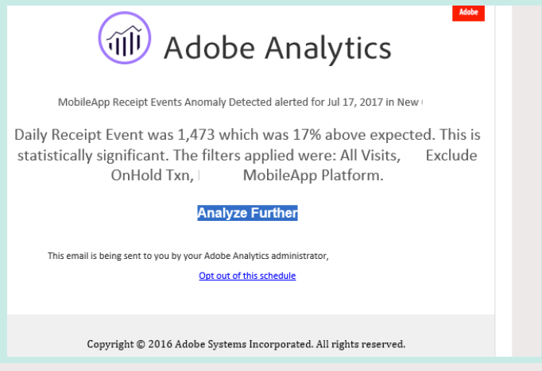

# Waarschuwingen maken

>[!NOTE]
>
>Intelligente waarschuwingen zijn alleen beschikbaar voor klanten van Adobe Analytics Prime en Adobe Analytics Ultimate.

Met intelligente waarschuwingen (of alleen &#39;waarschuwingen&#39;) in Adobe Analytics kunt u direct op de hoogte worden gesteld wanneer zich abnormale gebeurtenissen in uw gegevens voordoen. (Het alarm van het het vraaggebruik van de Server is een verschillend soort alarm dat slechts aan de beheerders van Analytics beschikbaar is. Deze waarschuwingen stellen u op de hoogte van het risico of het voorkomen van een overage in de gegevens van het servervraagverbruik en de verplichting. Zie voor meer informatie [Gebruikswaarschuwingen voor serveroproepen](/help/admin/admin/c-server-call-usage/scu-alerts.md).)

Voor meer gedetailleerde overzichtsinformatie over Intelligente Alarm, zie [Overzicht van intelligente waarschuwingen](/help/analyze/analysis-workspace/c-intelligent-alerts/intellligent-alerts.md).

Een intelligente waarschuwing maken:

1. Begin met het maken van een waarschuwing door toegang te krijgen tot de waarschuwingsbuilder. U kunt tot de waakzame bouwer op om het even welke volgende manieren toegang hebben:

   * Open een project in Analysis Workspace en selecteer **[!UICONTROL Components]** > **[!UICONTROL Create alert]**.
   * Open een project in Analysis Workspace en gebruik vervolgens de volgende sneltoets:

     `ctrl (or cmd) + shift + a`
   * Open een project in Analysis Workspace, selecteer één of meerdere lijnpunten in een vrije vormlijst, dan klik met de rechtermuisknop aan en selecteer **[!UICONTROL Create alert from selection]**.

     Dit vult onmiddellijk de waakzame bouwer vooraf in om een alarm met de correcte metriek en de filters tot stand te brengen.
   * Een waarschuwing maken [van de alarmmanager](/help/analyze/analysis-workspace/c-intelligent-alerts/alert-manager.md#create-alerts).

   De waakzame bouwer toont. Deze interface is vertrouwd aan degenen die gebouwde segmenten of berekende metriek in Analytics hebben:

   

1. Geef de volgende opties op om de waarschuwing te configureren:

   | Optie | Beschrijving |
   |---------|----------|
   | [!UICONTROL **Titel**] | Geef een naam op voor de waarschuwing. De waakzame naam zou de naam van het rapport of de metriedrempel kunnen bevatten. |
   | [!UICONTROL **Beschrijving (optioneel)**] | Geef een beschrijving voor de waarschuwing op. |
   | [!UICONTROL **Tijdkorreligheid**] | Selecteer hoe vaak u de metrische waarde wilt controleren: Dagelijks, Wekelijks of Maandelijks.
<b>Opmerking:</b>Voor gegevensweergaven met een aangepaste kalender ondersteunen we geen maandelijkse granulariteit in de waarschuwingsfunctie van Builder.<!--true?-->
 |
   | [!UICONTROL **Ontvangers**] | Geef op waar de waarschuwing kan worden verzonden. Een waarschuwing kan naar een gebruiker van de Analyse, een groep van Analytics, een onbewerkt e-mailadres, of naar een telefoonaantal worden verzonden.
<b>Belangrijk:</b>Het telefoonnummer moet worden voorafgegaan door een &quot;+&quot; en een [landcode](https://countrycode.org/).

De e-mail die een gebruiker zou ontvangen zodra een alarm is teweeggebracht kijkt gelijkaardig aan dit:

 |
   | [!UICONTROL **Vervaldatum**] | Stel de datum en tijd in waarop de waarschuwing moet verlopen. |
   | [!UICONTROL **Een waarschuwing verzenden wanneer**] | [!UICONTROL **Een van deze metrische triggers**]: Sleep metriek (inclusief berekende meetgegevens) hier naartoe om triggers voor de waarschuwing te maken.
An **&quot;incompatibele componenten&quot;** wordt weergegeven als niet alle metriek, afmetingen of segmenten in de waarschuwing compatibel zijn met de momenteel geselecteerde gegevensweergave.

Bepaal de drempel die metrisch moet overschrijden alvorens een alarm wordt geplaatst. U kunt deze waarde instellen op een drempel en vervolgens op een van de volgende voorwaarden:
<ul><li>anomalie bestaat</li><li>anomalie is groter dan verwacht</li><li>anomalie is minder dan verwacht</li><li>is boven of gelijk aan</li><li>is lager of gelijk aan</li><li>wijzigingen door</li><li>U kunt een drempel instellen van 90%, 95%, 99%, 99,75% en 99,9%.</li></ul>
[!UICONTROL **Met al deze filters**]: Sleep segmenten of dimensies om filters toe te voegen. Als u bijvoorbeeld een segment &quot;Alleen mobiele apparaten&quot; toevoegt, betekent dit dat de regel alleen voor mobiele apparaten wordt geactiveerd. U kunt extra filters toevoegen door een EN verklaring te gebruiken. U kunt EN of OF regels toevoegen door het tandwielpictogram te klikken.

Zie [Intelligente waarschuwingen - gebruiksgevallen](/help/analyze/analysis-workspace/c-intelligent-alerts/alerts-use-cases.md) gebruikt bijvoorbeeld gevallen.
 |
   | [!UICONTROL **Voorvertoning**] | De interactieve waarschuwingsvoorvertoning laat zien hoe vaak, ongeveer, een waarschuwing wordt geactiveerd op basis van eerdere ervaringen.
Als u bijvoorbeeld de tijdsgranulariteit instelt op dagelijks, kan de voorvertoning u vertellen dat de waarschuwing gedurende een bepaalde metrische x-maal in de afgelopen 30 of 31 dagen zou zijn geactiveerd.

Als u vindt dat te veel waarschuwingen zijn geactiveerd, kunt u de drempel in het dialoogvenster [Waarschuwingsbeheer](/help/analyze/analysis-workspace/c-intelligent-alerts/alert-manager.md).

 |

1. Selecteren [!UICONTROL **Opslaan**].
