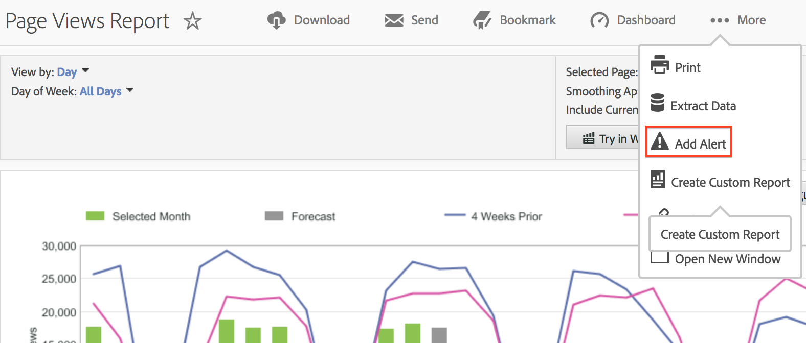

# Overzicht van intelligente waarschuwingen

Intelligente waarschuwingen zorgen voor meer korrelige controle over waarschuwingen en integreren anomaliedetectie met het waarschuwingssysteem.

Hier volgt een videozelfstudie [Intelligente waarschuwingen](https://experienceleague.adobe.com/docs/analytics-learn/tutorials/data-science/intelligent-alerts.html) (5:34)

## Overzicht

De nieuwe Alert Builder en Alert Manager in Analysis Workspace vervangen de bestaande waarschuwingsfunctionaliteit in Rapporten &amp; Analytics. Met intelligente waarschuwingen kunt u:

* Berichten opstellen op basis van anomalieën (90%, 95%, 99%, 99,75% en 99,9% drempelwaarden; % wijziging; boven/onder)
* Een voorvertoning bekijken van het aantal keren dat een melding is geactiveerd
* Een melding sturen via e-mail of sms, met koppelingen naar automatisch gegenereerde Analysis Workspace-projecten
* &quot;gestapelde&quot; waarschuwingen maken die meerdere meetgegevens vastleggen in één waarschuwing

Er zijn vier manieren om naar de Waarschuwingsbouwer te gaan:

| Methode | Details |
| --- | --- |
| Ga rechtstreeks naar de waarschuwingsfunctie | **[!UICONTROL Components]** > **[!UICONTROL Alerts]** |
| De sneltoets in Workspace gebruiken | `Ctrl + Shift + A` (Windows) of `Cmd + Shift + A` (Mac) |
| Selecteer een of meer vrije regelitems voor tabellen | Klik met de rechtermuisknop en selecteer **[!UICONTROL Create Alert from Selection]**. Hierdoor wordt het [!UICONTROL Alert Builder] en vult de juiste maateenheden en filters die uit de tabel zijn toegepast vooraf in. U kunt de waarschuwing desgewenst bewerken.  |
| Vanuit een rapport Rapporten &amp; Analyse | Ga naar  **[!UICONTROL More]** > **[!UICONTROL Add Alert]** . Dit opent de waakzame bouwer en vult vooraf de aangewezen metriek en de filters die van het rapport worden toegepast. U kunt de waarschuwing desgewenst bewerken.  |

De percentagedrempels zijn standaardafwijkingen. 95% = 2 standaardafwijkingen en 99% = 3 standaardafwijkingen. Afhankelijk van de tijdsgranulariteit die u kiest, [verschillende modellen](../virtual-analyst/c-anomaly-detection/statistics-anomaly-detection.md) worden gebruikt om te berekenen hoe ver weg (hoeveel standaardafwijkingen) elk gegevenspunt van de norm is. Als u een lagere drempel instelt (bijvoorbeeld 90%), krijgt u meer anomalieën dan wanneer u een hogere drempel instelt (99,75%).

>[!IMPORTANT]
>
>Het gebruik van tijdstempelgegevens voor het maken van waarschuwingen kan ervoor zorgen dat waarschuwingen onjuist worden afgespeeld. Adobe raadt u aan niet-tijdstempelgegevens te gebruiken voor Intelligent Alerts.

## Anomalische zoekopdracht voor waarschuwingen

Als een waarschuwing afwijkende detectie gebruikt, varieert de trainingsperiode op basis van de voor de waarschuwing geselecteerde granulariteit.

* Maandelijkse granulariteit: 15 maanden + zelfde waaier vorig jaar
* Wekelijkse korreligheid: 15 weken + zelfde marge vorig jaar
* Dagelijkse granulariteit: 35 dagen + zelfde waaier vorig jaar
* Uurgranulariteit: 336 uur

Zie [Statistische technieken voor anomalische detectie](../virtual-analyst/c-anomaly-detection/statistics-anomaly-detection.md) voor meer informatie .
