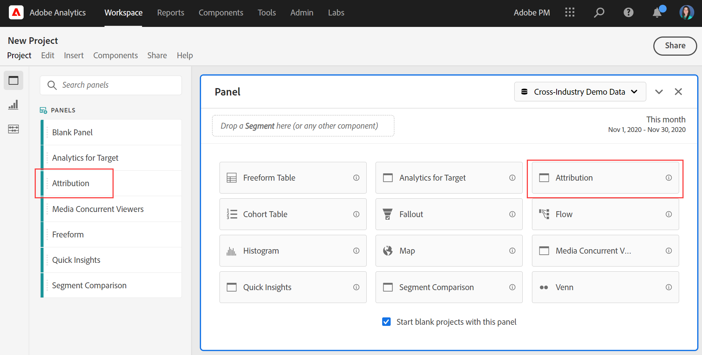

# Kenmerk, deelvenster {#attribution-panel}

<!-- markdownlint-disable MD034 -->

>[!CONTEXTUALHELP]
>id="workspace_attribution_button"
>title="Attributie"
>abstract="Vergelijk en visualiseer snel om het even welk aantal attributiemodellen gebruikend om het even welke afmeting en omzettingsmetrisch"
>additional-url="https://www.youtube.com/watch?v=Yu0hy2klzA0" text="Attribution IQ-deelvenster"

>[!CONTEXTUALHELP]
>id="workspace_attribution_panel"
>title="Kenmerk, deelvenster"
>abstract="Vergelijk en visualiseer snel om het even welk aantal attributiemodellen gebruikend om het even welke afmeting en omzettingsmetrisch.  **Parameters &#x200B;** **Kanaal**  de afmeting tegen attributen. Deze dimensie kan afzetkanalen, campagnes, of een andere dimensie zijn. **Modellen**  het model bepaalt hoe het krediet aan touchpoints wordt toegewezen. **venster van de Lookback**  Dit het plaatsen bepaalt het venster van gegevensattributie dat op elke omzetting van toepassing is."
>additional-url="https://www.youtube.com/watch?v=Yu0hy2klzA0" text="Attribution IQ-deelvenster"

<!-- markdownlint-enable MD034 -->

>[!BEGINSHADEBOX]

_Dit artikel documenteert het paneel van de Attributie in_  _&#x200B;**Adobe Analytics**._ _zie [ het paneel van de Attributie ](https://experienceleague.adobe.com/nl/docs/analytics-platform/using/cja-workspace/panels/attribution) voor_  _&#x200B;**Customer Journey Analytics** versie van dit artikel._

>[!ENDSHADEBOX]

Het deelvenster **[!UICONTROL Attribution]** is een eenvoudige manier om een analyse te maken waarin verschillende attributiemodellen worden vergeleken. In het deelvenster vindt u een speciale werkruimte voor het gebruik en vergelijken van attributiemodellen.

Adobe Analytics verbetert de attributie doordat u de volgende punten naar eigen inzicht kunt invullen:

* Bepaal attributie voorbij betaalde media: Om het even welke afmeting, metrisch, kanaal of gebeurtenis kan op modellen (bijvoorbeeld, intern onderzoek) worden toegepast, niet alleen marketing campagnes.
* Gebruik een onbeperkte vergelijkingsmodelvergelijking: vergelijk dynamisch zoveel modellen als u wilt.
* Vermijd implementatieveranderingen: Met rapport-tijd verwerking en context-bewuste zittingen, kan de context van de klantenreis binnen worden gebouwd en bij runtime worden toegepast.
* Construeer de sessie die het beste overeenkomt met uw attributiescenario.
* Verdeling naar segmenten: vergelijk eenvoudig de prestaties van uw marketingkanalen voor elk belangrijk segment (bijvoorbeeld New versus Repeat-klanten, Product X versus Product Y, Loyalty level of CLV).
* Controle dankzij &#39;channel cross-over&#39; en multi-touchanalyse: gebruik Venn-diagrammen en histogrammen en volg de trends in attributieresultaten.
* Visuele analyse van belangrijke marketingreeksen: werk met visuele methoden die leiden tot conversie, zoals flows voor meerdere knooppunten en uitvalvisualisaties.
* Stel berekende standaarden samen: gebruik een willekeurig aantal toewijzingsmethoden voor attributie.

## Gebruiken

Een deelvenster **[!UICONTROL Attribution]** gebruiken:

1. Maak een deelvenster **[!UICONTROL Attribution]** . Voor informatie over hoe te om een paneel tot stand te brengen, zie [ een paneel ](panels.md#create-a-panel) creëren.

1. Specificeer de [ input ](#panel-input) voor het paneel.

1. Neem de [ output ](#panel-output) voor het paneel waar.

### Deelvensterinvoer

U kunt het deelvenster Kenmerken configureren met de volgende invoerinstellingen:

1. Voeg een **[!UICONTROL Success metric]** en een dimensie van **[!UICONTROL Channel]** toe waarop u het kenmerk wilt toepassen. Voorbeelden zijn Marketingkanalen of aangepaste afmetingen, zoals interne promoties.

   

1. Selecteer één of meerdere [ attributiemodellen ](#attribution-models) van **[!UICONTROL Included models]** en a [ raadplegingsvenster ](#lookback-window) van **[!UICONTROL Lookback window]** dat u voor vergelijking wilt gebruiken.

1. Selecteer **[!UICONTROL Build]** om de visualisaties in het deelvenster samen te stellen.

### Deelvensteruitvoer

Het deelvenster **[!UICONTROL Attribution]** retourneert een uitgebreide set gegevens en visualisaties die de kenmerk voor de geselecteerde dimensie en de metrische waarde met elkaar vergelijken.

### Attributievisualisaties

De volgende visualisatie maakt deel uit van de paneeluitvoer.

* **Totaal metrisch**: Het totale aantal omzettingen die over het rapporteringstijdvenster voorkwamen, en aan de afmeting worden toegeschreven u selecteerde.
* **de Vergelijkingsbar van de Attributie**: Vergelijkt visueel de toegeschreven omzettingen over elk van de afmetingspunten van uw geselecteerde afmeting. Elke staafkleur vertegenwoordigt een afzonderlijk attributiemodel.
* **Lijst van de Vergelijking van de Attributie**: Toont de zelfde gegevens zoals het staafdiagram, dat als lijst wordt vertegenwoordigd. Wanneer u verschillende kolommen of rijen in deze tabel selecteert, worden het staafdiagram en diverse andere visualisaties in het deelvenster gefilterd. Deze lijst doet gelijkaardig aan een andere lijst van Freeform in Workspace - toestaand u om componenten zoals metriek, segmenten, of onderverdelingen toe te voegen.
* **Overlap Diagram**: Een beeld die van de Venn de hoogste drie afmetingspunten toont en hoe vaak zij gezamenlijk aan een omzetting deelnemen. Bijvoorbeeld, wijst de grootte van de bel overlapping erop hoe vaak omzettingen voorkwamen wanneer een persoon aan beide afmetingspunten werd blootgesteld. Als u andere rijen in de aangrenzende tabel Freeform selecteert, wordt de visualisatie bijgewerkt met uw selectie.
* **Detail van Prestaties**: Een spreidingsvisualisatie om tot drie attributiemodellen visueel te vergelijken.
* **Getweende Prestaties**: Toont de trend van toegeschreven omzettingen voor het hoogste afmetingspunt. Als u andere rijen in de aangrenzende tabel Freeform selecteert, wordt de visualisatie bijgewerkt met uw selectie.
* **Stroom**: Laat u zien welke kanalen met het meest algemeen in wisselwerking staan, en in welke orde over de reis van een persoon.

## Attributiemodellen

{{attribution-models-details}}

## Venster Opzoeken

{{attribution-lookback-window}}

>[!MORELIKETHIS]
>
> [ creeer een paneel ](/help/analyze/analysis-workspace/c-panels/panels.md#create-a-panel)
>

<!--
# Attribution panel

The [!UICONTROL Attribution] panel is an easy way to build an analysis comparing various attribution models. It is a feature in [Attribution](/help/analyze/analysis-workspace/attribution/overview.md) that gives you a dedicated workspace to use and compare attribution models.

>[!VIDEO](https://video.tv.adobe.com/v/23139/?quality=12)

## Create an attribution panel

1. Click the panel icon on the left.
1. Drag the [!UICONTROL Attribution] panel into your Analysis Workspace Project.

   

1. Add a metric that you want to attribute and add any dimension to attribute against. Examples include Marketing Channels or custom dimensions, such as internal promotions.

   

1. Select the [attribution models and lookback window](../attribution/models.md) you want to compare.

1. The Attribution panel returns a rich set of data and visualizations that compare attribution for the selected dimension and metric.

   

## Attribution visualizations

* **Total metric**: The total number of conversions that occurred over the reporting time window. These are the conversions that are attributed across the dimension that you selected.
* **Attribution Comparison Bar**: Visually compares the attributed conversions across each of the dimension items from your selected dimension. Each bar color represents a distinct attribution model.
* **Attribution Comparison Table**: Shows the same data as the bar chart, represented as a table. Selecting different columns or rows in this table filters the bar chart as well as several of the other visualizations in the panel. This table acts similar to any other Freeform Table in Workspace - allowing you to add components such as metrics, segments, or breakdowns.
* **Overlap Diagram**: A Venn Diagram showing the top three dimension items and how often they participate jointly in a conversion. For example, the size of the bubble overlap indicates how often conversions occurred when a visitor was exposed to both dimension items. Selecting other rows in the adjacent Freeform table updates the visualization to reflect your selection.
* **Performance Detail**: Lets you to compare up to three attribution models visually using a scatter plot.
* **Trended Performance**: By default, shows the conversion performance trend by attribution model for the first dimension listed in the adjacent Freeform table. You can select different dimension rows in the Freeform table to show the trend for the selected dimensions (such as Total Revenue for each attribution model for Social Campaigns and Paid Search). Alternately, you can select cells in the columns for any metric and attribution type combinations in the Freeform table to see the trended performance by dimension value for the specified attribution models (such as Total Revenue by Marketing Channel using Last Touch and First Touch attribution).
* **Flow**: Lets you see which channels are interacted with most commonly, and in what order across a visitor's journey.

-->