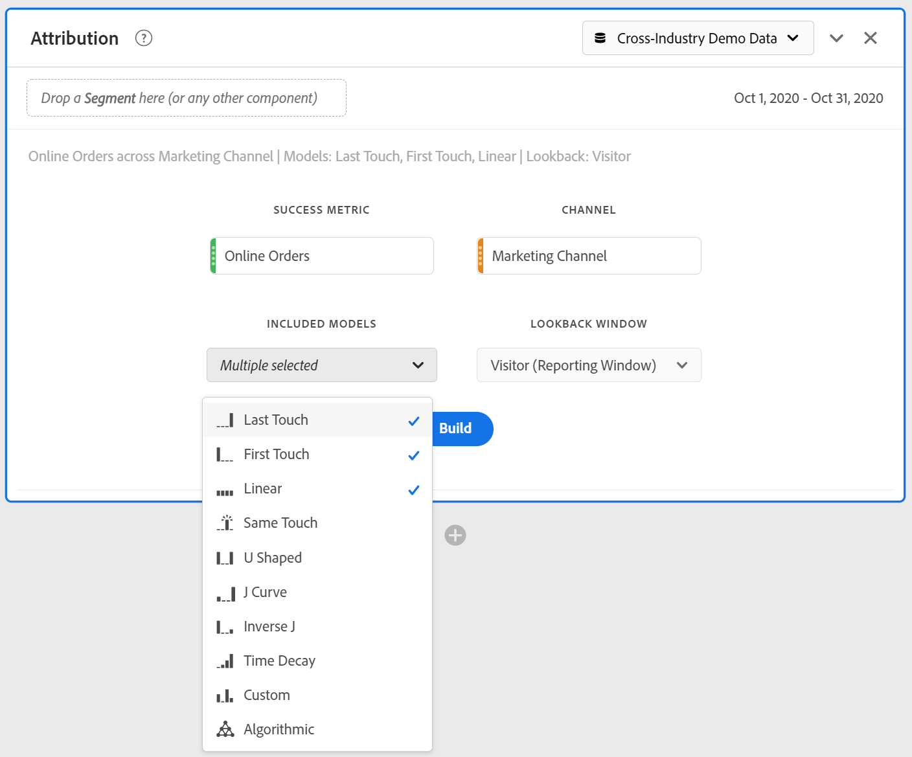

# Deelvenster voor attributie

Het toewijzingspaneel is een eenvoudige manier om een analyse te maken waarin verschillende attributiemodellen worden vergeleken. Het is een functie in [Attribution IQ](../attribution/overview.md) die u een specifieke werkruimte geeft om attributiemodellen te gebruiken en te vergelijken.

## Een deelvenster met kenmerken maken

1. Klik op het deelvensterpictogram aan de linkerkant.
1. Sleep het deelvenster Kenmerken naar uw Analysis Workspace-project.

   

1. Voeg metrisch toe dat u om het even welke afmeting aan attributen wilt kenmerken en toevoegen tegen. Voorbeelden zijn Marketingkanalen of aangepaste afmetingen, zoals interne promoties.

   

1. Selecteer de [toewijzingsmodellen en het terugzoekvenster](../attribution/models.md) dat u wilt vergelijken.

1. Het deelvenster Kenmerken retourneert een uitgebreide set gegevens en visualisaties die de kenmerk voor de geselecteerde dimensie en de metrische waarde met elkaar vergelijken.

   

## Attributievisualisaties

* **Totaal metrisch**: Het totale aantal omzettingen dat zich tijdens het rapporttijdvenster voordeed. Dit zijn de omzettingen die over de afmeting worden toegeschreven u selecteerde.
* **Metrische vergelijkingsbalkgrafiek** voor kenmerken: Vergelijkt visueel de toegeschreven omzettingen over elk van de afmetingspunten van uw geselecteerde afmeting. Elke staafkleur vertegenwoordigt een afzonderlijk attributiemodel.
* **Metrische kenmerken vrije-vormtabel**: Hiermee worden dezelfde gegevens weergegeven als het staafdiagram, dat als een tabel wordt weergegeven. Wanneer u verschillende kolommen of rijen in deze tabel selecteert, worden het staafdiagram en diverse andere visualisaties in het deelvenster gefilterd. Deze lijst doet gelijkaardig aan een andere Lijst Freeform in Werkruimte - toestaand u om componenten zoals metriek, segmenten, of onderverdelingen toe te voegen.
* **Grafiek** voor dimensioverlap: Een tekening van Venn die de hoogste drie afmetingspunten toont en hoe vaak zij gezamenlijk aan een omzetting deelnemen. De grootte van de ballonoverlapping geeft bijvoorbeeld aan hoe vaak conversies hebben plaatsgevonden wanneer een bezoeker aan beide dimensie-items werd blootgesteld. Als u andere rijen in de aangrenzende tabel Freeform selecteert, wordt de visualisatie bijgewerkt met uw selectie.
* **Aanraakpunten op de markt per reis**: Een histogram dat het aantal aanraakpunten aangeeft dat een bezoeker in het terugzoekvenster had. Dit is handig om te zien hoe belangrijk multitouch-kenmerk is voor uw gegevensset. Als bijna alle bezoekers slechts één aanraakpunt hebben, tonen verschillende attributiemodellen waarschijnlijk vergelijkbare gegevens.
* **Detail** van marketingkanaalprestaties: Hiermee kunt u maximaal drie kenmerkingsmodellen visueel vergelijken met behulp van een spreidingsgrafiek.
* **Marketing Channel Flow**: Hiermee kunt u zien welke kanalen het meest worden gebruikt en in welke volgorde de bezoeker op reis is.
