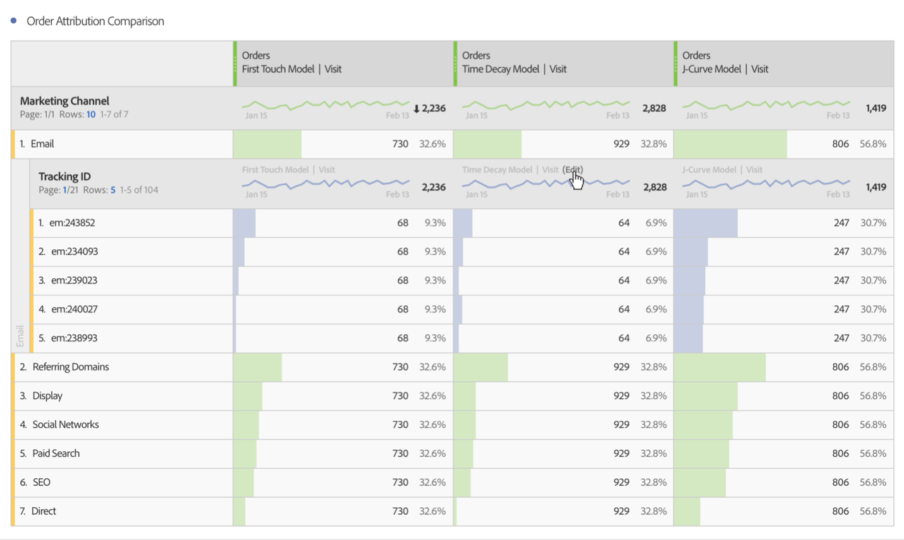
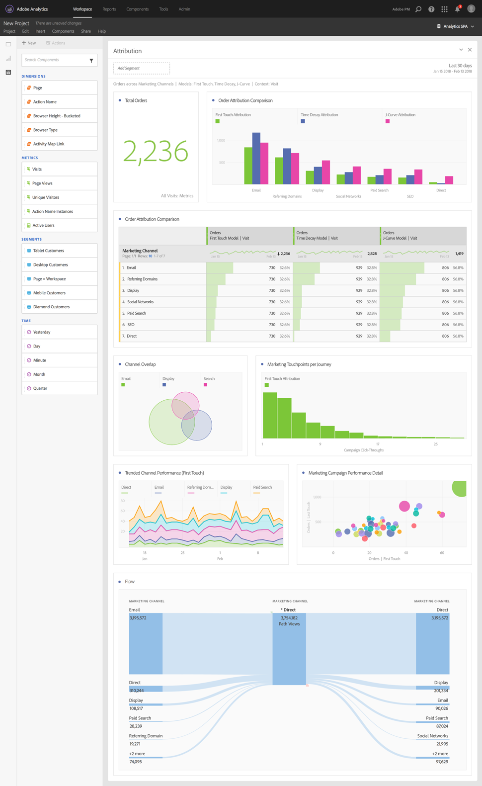

# Kenmerk gebruiken in analysewerkruimte

Met kenmerk-IQ in analysewerkruimte kunt u elk ondersteund toewijzingsmodel met elkaar vergelijken, de belangrijkste marketingreeksen die leiden tot conversie met geavanceerde fallout- en flowvisualisaties visualiseren, elk marketingkanaal of elke campagne op een gemakkelijke manier vertalen om de prestaties in de loop der tijd te kunnen zien en statistische anomalieën in de kanaal- en campagneprestaties te vinden, worden gewaarschuwd wanneer de prestaties dalen of omhoog gaan.

## Kenmerken gebruiken in vrije-vormtabellen {#section_F2F72AE840EB4EA781302A559726E6F4}

De Lijsten van de Steun van de Werkruimte van de Analyse Freeform steunen attributiemodellen die op bijna om het even welke metrisch kunnen worden gebruikt. Attributiemodellen kunnen worden ingesteld op een metrische kolom voor vrije-vormtabellen in Kolominstellingen:

1. Klik op het pictogram Instellingen (versnelling) in een kolom Tabel vrije vorm.

   

1. Onder **[!UICONTROL Data Settings]**, controleer **[!UICONTROL Use non-default attribution model]**. Voor meer informatie over de verschillende attributiemodellen, zie het Overzicht [van](attribution.md)Attributie IQ.

   

## Toewijzingsmodellen toepassen op uitsplitsingen {#section_ED1E7532CF084B5AB0942BD80B4770C9}

Voor elke uitsplitsing binnen een Freeform-tabel kan ook een willekeurig toewijzingsmodel worden toegepast dat hetzelfde of anders kan zijn dan de bovenliggende kolom. Bijvoorbeeld, kunt u lineaire Orden op uw afmeting van de Kanalen van de Marketing willen analyseren maar U-Vormde Orden op de specifieke het volgen codes binnen een Kanaal toepassen. Als u het toewijzingsmodel wilt bewerken dat is toegepast op een indeling, houdt u de muisaanwijzer boven het indelingsmodel en klikt u op &quot;Bewerken&quot;:

## Een attributiemodel vergelijken met een ander attributiemodel {#section_1D74C09549CC4EC8A952A7392C76D375}

Als u één attributiemodel aan een andere snel en gemakkelijk wilt vergelijken, klik metrisch met de rechtermuisknop aan en selecteer **[!UICONTROL Add comparative attribution model]**:

Dit laat u snel en gemakkelijk één attributiemodel aan een andere vergelijken zonder het moeten in metrisch slepen en het tweemaal vormen.

## Kenmerk, deelvenster en visualisaties {#section_6B02F28182F14ECC9FC5020F224726E6}

Het toewijzingspaneel is een eenvoudige manier om een analyse te maken waarin verschillende attributiemodellen worden vergeleken. U kunt als volgt het deelvenster Kenmerken openen:

1. Klik op het deelvensterpictogram helemaal links.
1. Sleep het deelvenster Kenmerken naar het project voor de analysewerkruimte.

   

1. Voeg succesmetrisch toe dat u om het even welke kanaaldimensie aan attributen aan (zoals de Kanalen van de Marketing of Interne Bevorderingen) wilt toeschrijven en toevoegen.

   

1. Selecteer de [attributiemodellen](attribution.md) die u wilt vergelijken en het terugzoekvenster.

   Het paneel van Attributen zal een rijke reeks gegevens en visualisaties terugkeren om u te helpen beter begrijpen hoe uw Kanalen van de Marketing (of andere dimensies) samenwerken:

   

   Hier volgt een beschrijving van elke visualisatie:

| Visualisatie | Beschrijving |
|--- |--- |
| Totaal metrisch | Het totale aantal omzettingen dat zich tijdens het rapporttijdvenster voordeed. Dit zijn de omzettingen die over de afmeting worden toegeschreven u selecteerde. |
| Metrische vergelijkingsbalkgrafiek voor kenmerken | Hiermee kunt u visueel de toegeschreven omzettingen vergelijken in elk van de dimensie-items van de geselecteerde dimensie. Elke staafkleur vertegenwoordigt een afzonderlijk attributiemodel dat is geselecteerd. |
| Metrische kenmerken vrije-vormtabel | Geeft dezelfde gegevens weer als het staafdiagram. Als u verschillende kolommen of rijen in deze tabel selecteert, worden het staafdiagram en diverse andere visualisaties in het deelvenster gefilterd. Deze tabel fungeert net als elke andere tabel voor vrije vorm in Workspace, zodat u metriek, segmenten, onderverdelingen enzovoort kunt toevoegen. |
| Grafiek voor dimensioverlap | Een diagram van Venn met de bovenste drie dimensieitems (bijvoorbeeld Kanalen) en hoe vaak ze gezamenlijk deelnemen aan een conversie. De grootte van de ballonoverlapping geeft bijvoorbeeld aan hoe vaak conversies hebben plaatsgevonden wanneer een bezoeker aan beide dimensie-items (bijvoorbeeld Kanalen) werd blootgesteld. Als u andere rijen in de tabel Freeform selecteert, wordt de visualisatie aangepast aan uw selectie. |
| Aanraakpunten op de markt per reis | Een histogram dat het aantal marketingaanraakpunten (of dimensies) aangeeft dat een bezoeker had in het bereik van de rapportagedatum. Dit is handig om te zien hoe belangrijk multitouch-kenmerk is voor uw gegevensset. Als bijna alle bezoekers slechts één aanraakpunt hebben, zullen verschillende attributiemodellen niet erg verschillend zijn in hun resultaten. |
| Detail marketingkanaalprestaties | Hiermee kunt u maximaal drie kenmerkingsmodellen visueel vergelijken met behulp van een spreidingsgrafiek. |
| Marketing Channel Flow | Hiermee kunt u zien welke kanalen het meest worden gebruikt en in welke volgorde de bezoeker op reis is. |
