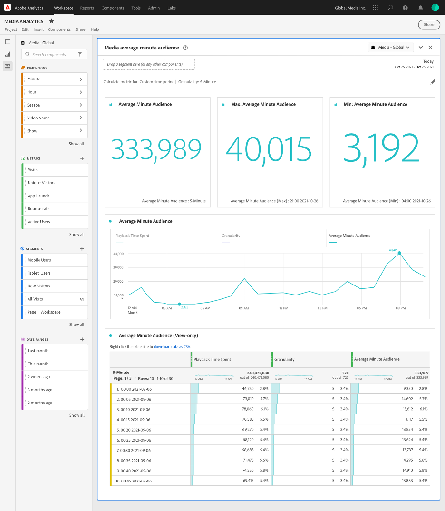

# Deelvenster Gemiddeld aantal minuten voor publiek {#media-average-minute-audience-panel}

<!-- markdownlint-disable MD034 -->

>[!CONTEXTUALHELP]
>id="workspace_mediaminuteaverageaudience_button"
>title="Gemiddeld aantal minuten voor medium"
>abstract="Maak een deelvenster om het gemiddelde aantal minuten voor specifieke inhoud of over een bepaalde periode te analyseren."

<!-- markdownlint-enable MD034 -->

<!-- markdownlint-disable MD034 -->

>[!CONTEXTUALHELP]
>id="workspace_mediaaverageminuteaudience_panel"
>title="Gemiddeld aantal minuten voor medium"
>abstract="Toont de prestaties van specifieke media inhoud of over een periode van de douanetijd.  **Algemene parameters &#x200B;** **berekenen metrisch voor**: Selecteer metrisch aan gebruik voor het paneel. Selecteer **Specifieke inhoud** om gemiddeld minieme publiek voor specifieke inhoud of gebeurtenis te analyseren die op de inhoudslengte wordt gebaseerd. **Uitgezochte de tijdperiode van de Douane** om te analyseren hoe het gemiddelde minieme publiek over een douane geselecteerde periode verandert. **Meldend afmeting**: Uitgezocht om door **VideoNaam** van **te melden identiteitskaart van de Inhoud** afmeting. Alleen beschikbaar als u Specifieke inhoud hebt geselecteerd als de metrische waarde. **Korreligheid**: Selecteer granulariteit voor het melden. Alleen beschikbaar wanneer u Aangepaste tijdsperiode hebt geselecteerd als metrisch. **inhoud van de Filter door (facultatief)**: Selecteer een specifieke show, een seizoen, een episode, of selecteer een douaneafmeting om de inhoud te filtreren.  **Geavanceerde montages &#x200B;** **de montages van de Lijst**: Selecteer of om berekeningswaarden in de lijst te tonen. **bestede tijd metrisch**: Selecteer welke tijd metrisch doorbracht u voor de specifieke inhoudsberekening zou willen gebruiken. Alleen beschikbaar als u Specifieke inhoud hebt geselecteerd als de metrische waarde."

<!-- markdownlint-enable MD034 -->

>[!BEGINSHADEBOX]

_dit artikel documenteert het gemiddelde minieme het publiek van Media paneel in_  _&#x200B;**Adobe Analytics**&#x200B;_. _zie [ het gemiddelde minieme publiek van Media paneel ](https://experienceleague.adobe.com/en/docs/analytics-platform/using/cja-workspace/panels/average-minute-audience-panel) voor_  _&#x200B;**Customer Journey Analytics** versie van dit artikel._

>[!ENDSHADEBOX]

>[!NOTE]
>
>Het deelvenster **[!UICONTROL Media average minute audience]** is alleen beschikbaar voor klanten die de streamingmedia-verzameling voor Adobe Analytics hebben aangeschaft.
>
>Neem contact op met uw Adobe Sales-vertegenwoordiger of Adobe-accountteam voor meer informatie.
>

In Analysis Workspace kan het gemiddelde minutenpubliek informatie geven over

* de tijd die is besteed aan het bekijken van een specifieke mediastream gedeeld door de duur van de inhoud, of
* De tijd die u hebt doorgebracht bij het bekijken tijdens een aangepaste tijdsperiode met de geselecteerde granulariteit.

Met het deelvenster Gemiddeld aantal minuten voor publiek in Media kunt u het gemiddelde verbruik van uw inhoud begrijpen door programma&#39;s van elke lengte of genre te vergelijken. U kunt bijvoorbeeld het gemiddelde verbruik begrijpen wanneer u een 30 minuten durende sitcom vergelijkt met een sportevenement van 3 uur.

Bovendien kunt u het deelvenster Mediagemiddelde aantal minuten publiek gebruiken om dit digitale gemiddelde minutenpubliek te vergelijken of toe te voegen aan lineaire gemiddelde tijdmetingen voor tv.

Het gemiddelde minieme deelvenster van het publiek van Media biedt de volgende voordelen ten opzichte van de metrische waarde Gemiddelde Minuut publiek:

* Ondersteunt aangepaste tijdsperioden

* Hiermee kunt u de indeling van de tijdsduur bijwerken nadat de weergaven zijn verwerkt (als de tijdclassificatie niet aanwezig was of moet worden gecorrigeerd)

  Als u deze update uitvoert wanneer u metrisch gebruikt, bestaat de duurclassificatie niet (als de classificatie niet aanwezig was). Of de indeling naar duur is verouderd (als de indeling wel aanwezig maar onjuist was).

## Gebruiken

Een deelvenster **[!UICONTROL Media average minute audience]** gebruiken:

1. Maak een deelvenster **[!UICONTROL Media average minute audience]** . Voor informatie over hoe te om een paneel tot stand te brengen, zie [ een paneel ](panels.md#create-a-panel) creëren.

1. Selecteer een gegevensweergave voor het deelvenster waarvoor componenten zijn geconfigureerd in de verzameling Streaming media.

1. Specificeer de [ input ](#panel-input) voor het paneel.

1. Neem de [ output ](#panel-output) voor het paneel waar.

### Deelvensterinvoer

Met de invoerinstellingen die in deze sectie worden beschreven, kunt u het deelvenster Medium voor een gemiddeld aantal minuten publiek configureren.

1. Configureer de volgende invoerinstellingen:

   | Instelling | Beschrijving |
   |---------|------------|
   | **waaier van de paneeldatum** | Het gebrek van de waaier van de paneeldatum is [!UICONTROL **Deze maand**]. U kunt de presentatie bewerken om één dag of meerdere maanden tegelijk weer te geven.    Deze visualisatie is beperkt tot 1440 rijen met gegevens (bijvoorbeeld 24 uur bij granulariteit op minaniveau). Als een datumbereik en de combinatie van granulariteit meer dan 1440 rijen opleveren, wordt de granulariteit automatisch bijgewerkt om het volledige datumbereik te kunnen gebruiken. |
   | [!UICONTROL **Daling een segment hier (of een andere component)**] | Net als andere deelvensters worden met deze instelling de selecties gefilterd op basis van segmenten die u hebt gemaakt. Deze instelling is een uitstekende manier om naar specifieke platforms, live streams of andere veelgebruikte mediasegmenten te kijken. |
   | [!UICONTROL **berekent metrisch voor**] | Kies of u het gemiddelde aantal minuten voor [**[!UICONTROL Specific content]**](#specific-content) wilt zien. Of als u het gemiddelde aantal minuten voor een [**[!UICONTROL Custom time period]**](#custom-time-period) wilt zien.   Uitgezochte [!UICONTROL **de tijdperiode van de Douane**]: <ul><li>Als de duur niet beschikbaar is, of </li><li>als u het gemiddelde aantal minuten voor een tijdreeks met meerdere inhoud wilt weergeven, of</li><li>voor inhoud zonder een specifieke toegewezen duur (zoals tijdens een live stream of gebeurtenis)</li></ul></li></li></ul> 
Met deze instelling wijzigt u de workflow en de rapportuitvoer.
 |

1. Ga met [ Specifieke inhoud ](#specific-content) of [ de tijdperiode van de Douane ](#custom-time-period), afhankelijk van de optie voort u in [!UICONTROL **kiest metrisch voor**] drop-down lijst berekent.

#### Specifieke inhoud

1. Als u [!UICONTROL **Specifieke inhoud**] in [!UICONTROL **selecteerde berekent metrisch voor**] drop-down menu wanneer [ vormend paneelinput ](#panel-inputs), specificeer de volgende configuratieopties:

   | Instelling | Beschrijving |
   |---------|------------|
   | [!UICONTROL **Meldend afmeting**] | Wanneer u specifieke inhoud selecteert, kunt u de rapportoutput selecteren om of de videonaam of de gebieden van identiteitskaart van de inhoud te gebruiken om de inhoud en zijn bijbehorend gemiddeld minipubliek te tonen. |
   | [!UICONTROL **inhoud van de Filter door (facultatief)**] | Kies hoe u de specifieke inhoud wilt filteren, afhankelijk van de gewenste weergave of de structuur van de gegevens. <ul>[!UICONTROL **toon, seizoen, episode**]: Toont uw beschikbare shows in drop-down, die u het gebruiken van een onderzoek kunt filtreren (of door de shownaam van de linkerkolom te slepen en te laten vallen). Je kunt je selectie daar beëindigen om alle seizoenen van je show te zien, of je kunt filteren op individuele seizoenen en dan op individuele afleveringen. Deze instelling geeft de gegevens voor deze shows, seizoenen of episodes voor de geselecteerde tijdsperiode weer.</li><li>[!UICONTROL **de afmeting van de Douane**]: Als uw shownaam onder een douaneafmeting is, kunt u het vinden of door in de afmeting (facultatieve) drop-down te zoeken of door het linkerkolomonderzoek te gebruiken. Het dimensie-item wordt automatisch gevuld op basis van die selectie en wordt behandeld als een aflevering.</li><li>[!UICONTROL **niets**]: Toont alle videonamen die gemiddelde minieme publieksgegevens voor de selectie hebben u hebt gekozen. (Deze optie is standaard geselecteerd.)</li></ul> |

1. Ga met [ Specifieke inhoud Geavanceerde montages ](#specific-content-advanced-settings) verder om geavanceerde montages te vormen.

#### Geavanceerde instellingen voor specifieke inhoud

1. Met [!UICONTROL **Specifieke inhoud**] die in [!UICONTROL **wordt geselecteerd berekent metrisch voor**] drop-down menu, uitgezocht [!UICONTROL **toon geavanceerde montages**], dan specificeer de volgende configuratieopties:

   | Opties | Beschrijving |
   |---------|------------|
   | **[!UICONTROL Table settings]** | De standaardoptie **[!UICONTROL Show calculation values in table]** toont de teller en de noemer van het gemiddelde minieme publiek als voorafgaande kolommen in de lijst. Als u deze optie uitschakelt, worden deze twee kolommen verwijderd. De gemiddelde minieme publiekskolom blijft in de tabel naast de videonaam of inhoud-id. |
   | **[!UICONTROL Time spent metric]** | U kunt de standaardoptie **[!UICONTROL Content Time Spent]** kiezen, die slechts inhoudstijd omvat. U kunt ook **[!UICONTROL Media Time Spent]** gebruiken, dat inhoud en tijd bij elkaar opneemt als de tellerberekening voor het gemiddelde aantal minuten. |

1. Selecteer [!UICONTROL **bouwen**] om het gemiddelde minieme het publiek van Media te beëindigen.

1. Ga met [ output van het Comité ](#panel-output) voor informatie over hoe te om het gemiddelde minieme het publiekspaneel van Media te gebruiken.

#### Aangepaste tijdsperiode

1. Als u [!UICONTROL **de tijdsperiode van de Douane**] in [!UICONTROL **selecteerde berekent metrisch voor**] drop-down menu wanneer [ vormend paneelinput ](#panel-inputs), specificeer de volgende configuratieopties:

   | Opties | Beschrijving |
   |---------|------------|
   | **[!UICONTROL Granularity]** | De standaardgranulariteit is [!UICONTROL **5 - Minuut**], maar u kunt om het even welke granulariteiten kiezen die als noemer voor de tijdreeks binnen uw geselecteerde tijdspanne worden gebruikt. Bijvoorbeeld, die 12 :00 pm aan 12 :30 pm met een 5 minieme granulariteit selecteren keert het gemiddelde minieme publiek over het volledige half uur evenals zes rijen met het gemiddelde minieme publiek voor elke 5 minieme periode terug. Deze rijen worden gebruikt als datapoints voor de grafiek van de tijdreeks. |
   | [!UICONTROL **inhoud van de Filter door (facultatief)**] | Kies hoe u de specifieke inhoud wilt filteren, afhankelijk van de gewenste weergave of de structuur van de gegevens. <ul>[!UICONTROL **toon, seizoen, episode**]: Toont uw beschikbare shows in drop-down, die u het gebruiken van een onderzoek kunt filtreren (of door de shownaam van de linkerkolom te slepen en te laten vallen). Je kunt je selectie daar beëindigen om alle seizoenen van je show te zien, of je kunt filteren op individuele seizoenen en dan op individuele afleveringen. Deze instelling geeft de gegevens voor deze shows, seizoenen of episodes voor de geselecteerde tijdsperiode weer.</li><li>[!UICONTROL **de afmeting van de Douane**]: Als uw shownaam onder een douaneafmeting is, kunt u het vinden of door in de afmeting (facultatieve) drop-down te zoeken of door het linkerkolomonderzoek te gebruiken. Het dimensie-item wordt automatisch gevuld op basis van die selectie en wordt behandeld als een aflevering.</li><li>[!UICONTROL **niets**]: Toont alle videonamen die gemiddelde minieme publieksgegevens voor de selectie hebben u hebt gekozen. (Deze optie is standaard geselecteerd.)</li></ul> |

1. Ga met [ Geavanceerde montages van de tijdperiode van de Douane ](#custom-time-period-advanced-settings) verder om geavanceerde montages te vormen.

#### Geavanceerde instellingen voor aangepaste tijdsperiode

1. Met [!UICONTROL **de tijdsperiode van de Douane**] die in [!UICONTROL **wordt geselecteerd berekent metrisch voor**] drop-down menu, uitgezocht [!UICONTROL **toont geavanceerde montages**], dan specificeer de volgende configuratieoptie:

   | Optie | Beschrijving |
   |---------|------------|
   | **[!UICONTROL Table settings]** | Met de standaardinstelling worden de berekeningswaarden in de tabel weergegeven. In deze tabel worden de teller en de noemer van het gemiddelde aantal minuten voor het publiek weergegeven als de voorafgaande kolommen in de tabel. Als u deze optie uitschakelt, worden deze twee kolommen verwijderd, zodat alleen het gemiddelde aantal minuten naast de tijdsperiode overblijft. |

1. Selecteer [!UICONTROL **bouwen**] om het gemiddelde minieme het publiek van Media te beëindigen.

1. Ga met [ output van het Comité ](#panel-output) voor informatie over hoe te om het gemiddelde minieme het publiekspaneel van Media te gebruiken.

### Deelvensteruitvoer

De paneeloutput verschilt afhankelijk van of u [!UICONTROL **Specifieke inhoud**] of [!UICONTROL **de tijdperiode van de Douane**] in [!UICONTROL **berekent metrisch voor**] drop-down menu wanneer [ vormend paneelinput ](#panel-inputs) koos.

#### Specifieke inhoud

In het deelvenster Gemiddelde minieme publiek voor Media wordt het volgende geretourneerd:

* Totaal gemiddeld aantal minuten voor uw volledige selectie
* Filters en een gemiddeld aantal minuten publiek voor de afzonderlijke video&#39;s, weergegeven in een tabel
* De tijd van de inhoud en videolengte (duur) als die geavanceerde het plaatsen werd geselecteerd

Om het paneel op elk ogenblik uit te geven en te herbouwen, uitgezocht  in het hoogste recht uit.

#### Specifieke inhoudsgegevensbron

In het deelvenster Gemiddelde minieme doelgroep van Media wordt alleen de gemiddelde-minieme publieksmeting gebruikt om gegevens te verzamelen. In het deelvenster kunnen geen indelingen of andere maatstaven worden gebruikt.

| Metrisch | Beschrijving |
|--------|-------------|
| **[!UICONTROL Average minute audience]** | De weergavetijd van de mediastream gedeeld door de videolengte (duur) die via Classificaties wordt aangeboden. |

#### Aangepaste tijdsperiode {#custom-time-period-output}

In het deelvenster Gemiddelde minieme publiek voor Media wordt het volgende geretourneerd:

* Het totale gemiddelde aantal minuten voor uw volledige selectie

* Het maximum en minimum gemiddelde aantal minuten

* De grafiek van de lijnreeks die het gemiddelde minieme publiek over de volledige selectie toont.

* Een tabel waarin de filters en het gemiddelde aantal minuten voor de granulariteiten worden weergegeven, evenals de tijd die de inhoud heeft doorgebracht en de granulariteit voor elke tijdsperiode

  Deze lijst toont slechts als de optie onder geavanceerde montages genoemd [!UICONTROL **berekeningswaarden in lijst**] wordt geselecteerd.

Om het paneel op elk ogenblik uit te geven en te herbouwen, uitgezocht  in het hoogste recht uit.

#### Gegevensbron aangepaste tijdperiode

In het deelvenster Gemiddelde minieme doelgroep van Media wordt alleen de gemiddelde-minieme publieksmeting gebruikt om gegevens te verzamelen. In het deelvenster kunnen geen indelingen of andere maatstaven worden gebruikt.

| Metrisch | Beschrijving |
|---|---|
| **[!UICONTROL Average Minute Audience]** | De weergavetijd van de mediastream gedeeld door de totale selectie of geselecteerde granulariteit in minuten. |

>[!MORELIKETHIS]
>
> [ creeer een paneel ](/help/analyze/analysis-workspace/c-panels/panels.md#create-a-panel)
> &#x200B;> [Deelvenster Mediagelijktijdige viewers ](media-concurrent-viewers.md)
> &#x200B;> [De playbacktijd van media bestede paneel ](media-playback-time-spent.md)
>

<!--

# Media average minute audience panel

>[!NOTE]
>
>The Media average minute audience panel is available only to customers who have purchased the Streaming Media Collection Add-on. 
>
>Contact your Adobe Sales Representative or Adobe Account Team to purchase the Streaming Media Collection Add-on. 

In Analysis Workspace, average minute audience is the time spent viewing your media stream divided by the duration of the content or the total selection of the period and selected granularity.

The Media average minute audience panel enables you to better understand average consumption of your content by comparing programs of any length or genre. For example, you can understand average consumption when comparing a 30-minute sitcom with a 3-hour sporting event.

In addition, you can use the Media average minute audience panel to compare or append this digital average minute audience to linear TV average minute metrics. 

The Media average minute audience panel provides the following benefits over the Average Minute Audience metric:

* Supports custom time periods

* Allows for updating the duration classification after views are processed (if it was not present or if it needs to be corrected)

  If you did this when using the metric, it either won't exist (if the classification wasn't present) or it will be out of date (if the classification was present but incorrect).

## Access the Media average minute audience panel

1. In Analysis Workspace, go to a report suite that has streaming media components enabled. 

1. In the left nav, select the **Panels** icon.

   

1. Drag the [!UICONTROL **Media average minute audience**] panel onto the canvas in Analysis Workspace.

1. To configure the panel, continue with [Panel inputs](#panel-inputs).

## Panel inputs {#Input}

Use the input settings described in this section to configure the Media average minute audience panel.

1. Begin creating a Media average minute audience panel, as described in [Access the Media average minute audience panel](#access-the-media-average-minute-audience-panel).

1. Configure the following input settings:

   | Setting | Description |
   |---------|------------|
   | **Panel date range** | The panel date range default is [!UICONTROL **This month**]. You can edit it to view a single day or many months at a time.    This visualization is limited to 1440 rows of data (for example, 24-hours at minute-level granularity). If a date range and granularity combination results in more than 1440 rows, the granularity is automatically updated to accommodate the full date range. |
   | [!UICONTROL **Drop a segment here (or any other component)**] | Like other panels, this setting filters your selections based on segments you've created. This is a great way to look at specific platforms, live streams, or other common media segments. |
   | [!UICONTROL **Calculate metric for**] | Choose whether you want to see the average minute audience for a specific piece of content, or if you want to see the average minute audience for a custom period of time:<ul><li>**Specific content:** This is available only if the duration has been updated using Classifications. If the duration is unavailable, or if you want to view the average minute audience for a time series with multiple pieces of content or content without a specific assigned duration (like during a live stream or event), then you should select [!UICONTROL **Custom time period**]. (Durations can be set using Classifications either before or after processing time.)</li><li>**Custom time period:** This is available regardless of whether the durations is made available using Classifications.</li></ul> 
This setting changes the workflow and report output.
  |

1. Continue with [Specific content](#specific-content) or [Custom time period](#custom-time-period), depending on the option you chose in the [!UICONTROL **Calculate metric for**] drop-down menu.

### Specific content

1. If you selected [!UICONTROL **Specific content**] in the [!UICONTROL **Calculate metric for**] drop-down menu when [configuring panel inputs](#panel-inputs), specify the following configuration options:

   | Setting | Description |
   |---------|------------|
   | [!UICONTROL **Reporting dimension**] | When you choose specific content, you can select the report output to use either the video name or content ID fields to show the content and its associated average minute audience for the time period selected. |
   | [!UICONTROL **Filter content by (optional)**] | Choose how to filter the specific content, depending on the view you want or the way your data is structured. <ul>[!UICONTROL **Show, season, episode**]: Displays your available shows in the drop-down, which you can filter using a search (or by dragging and dropping the show name from the left column). You can end your selection there to see all the seasons of your show, or you can filter by individual seasons and then by individual episodes. This setting shows the data for those shows, seasons, or episodes for the selected time period.</li><li>[!UICONTROL **Custom dimension**]: If your show name is under a custom dimension, you can find it either by searching in the dimension (optional) drop down or by using the left column search. The dimension item automatically populates based on that selection and is treated as an episode.</li><li>[!UICONTROL **None**]: Shows all the video names that have average minute audience data for the selection you've chosen. (This options is selected by default.)</li></ul>  |

1. Continue with [Specific content advanced settings](#specific-content-advanced-settings) to configure advanced settings. 

### Specific content advanced settings

1. With [!UICONTROL **Specific content**] selected in the [!UICONTROL **Calculate metric for**] drop-down menu, select [!UICONTROL **Show advanced settings**], then specify the following configuration options:

   | Setting | Description |
   |---------|------------|
   | Table settings | The default setting shows the calculation values in the table, which shows the numerator and denominator of the average minute audience as the preceding columns in the table. Deselecting this option removes those two columns, leaving only the average minute audience next to the video name or content ID. |
   | Time spent metric | You can choose the default content time spent, which includes only content time, or you can choose to use the media time spent, which includes content and ad time together as the numerator calculation for the average minute audience. |

1. Select [!UICONTROL **Build**] to finish creating the Media average minute audience panel.

1. Continue with [Panel output](#panel-output) for information about how to use the Media average minute audience panel.

### Custom time period

1. If you selected [!UICONTROL **Custom time period**] in the [!UICONTROL **Calculate metric for**] drop-down menu when [configuring panel inputs](#panel-inputs), specify the following configuration options:

   | Setting | Description |
   |---------|------------|
   | Granularity | The default granularity is [!UICONTROL **5-Minute**], but you can choose any of the granularities that are used as the denominator for the time series within your overall time period selection made in the calendar selection. For example, selecting 12:00 pm to 12:30 pm with a 5-minute granularity returns the average minute audience over the full half hour as well as six rows with the average minute audience for each 5-minute period. These rows are used as the datapoints for the time series chart. |
   | [!UICONTROL **Filter content by (optional)**] | Choose how to filter the specific content, depending on the view you want or the way your data is structured. <ul>[!UICONTROL **Show, season, episode**]: Displays your available shows in the drop-down, which you can filter using a search (or by dragging and dropping the show name from the left column). You can end your selection there to see all the seasons of your show, or you can filter by individual seasons and then by individual episodes. This setting shows the data for those shows, seasons, or episodes for the selected time period.</li><li>[!UICONTROL **Custom dimension**]: If your show name is under a custom dimension, you can find it either by searching in the dimension (optional) drop down or by using the left column search. The dimension item automatically populates based on that selection and is treated as an episode.</li><li>[!UICONTROL **None**]: Shows all the video names that have average minute audience data for the selection you've chosen. (This options is selected by default.)</li></ul>  |

1. Continue with [Custom time period advanced settings](#custom-time-period-advanced-settings) to configure advanced settings. 

### Custom time period advanced settings

1. With [!UICONTROL **Custom time period**] selected in the [!UICONTROL **Calculate metric for**] drop-down menu, select [!UICONTROL **Show advanced settings**], then specify the following configuration option:

   | Setting | Description |
   |---------|------------|
   | Table settings | The default setting displays the calculation values in the table, which displays the numerator and denominator of the average minute audience as the preceding columns in the table. Deselecting this option removes those two columns leaving only the average minute audience next to the time period. |

1. Select [!UICONTROL **Build**] to finish creating the Media average minute audience panel.

1. Continue with [Panel output](#panel-output) for information about how to use the Media average minute audience panel.

## Panel output

The panel output differs depending on whether you chose [!UICONTROL **Specific content**] or [!UICONTROL **Custom time period**] in the [!UICONTROL **Calculate metric for**] drop-down menu when [configuring panel inputs](#panel-inputs).

### Specific content

The Media average minute audience panel returns the following:

* Total average minute audience for your entire selection
* Filters and average minute audience for the individual videos displayed in a table 
* Content time spent and video length (duration) if that advanced setting was selected

To edit and rebuild the panel at any time, select the Edit (pencil) icon in the top right.

### Specific content data source

The Media average minute audience panel uses only the Average Minute Audience metric to gather data. Breakdowns or other metrics cannot be used in the panel.

| Metric | Description |
|--------|-------------|
| Average Minute Audience | The time spent viewing your media stream divided by the video length (duration) supplied via Classifications. |

### Custom time period {#custom-time-period-output}

The Media average minute audience panel returns the following:

* The total average minute audience for your entire selection

* The maximum and minimum average minute audience

* The line series graph showing the average minute audience over the entire selection.

* A table that shows the filters and average minute audience for the granularities, as well as the content time spent and granularity for each time period 

  This table displays only if the option under advanced settings called [!UICONTROL **Show calculation values in table**] is selected.

To edit and rebuild the panel at any time, select the Edit (pencil) icon in the top right.

### Custom time period data source

The Media average minute audience panel uses only the Average Minute Audience metric to gather data. Breakdowns or other metrics cannot be used in the panel.

|Metric|Description|
|---|---|
|Average Minute Audience| The time spent viewing your media stream divided by the total selection or selected granularity in minutes.|

-->