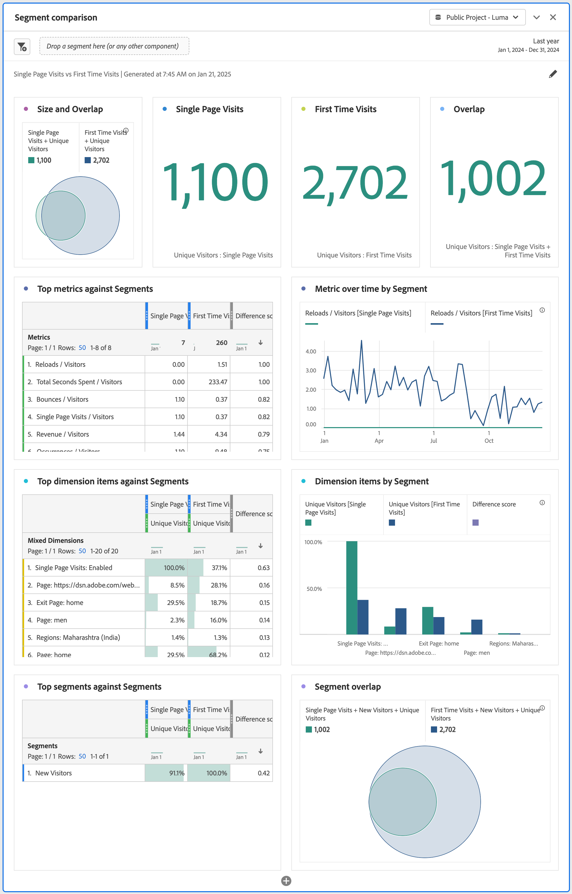
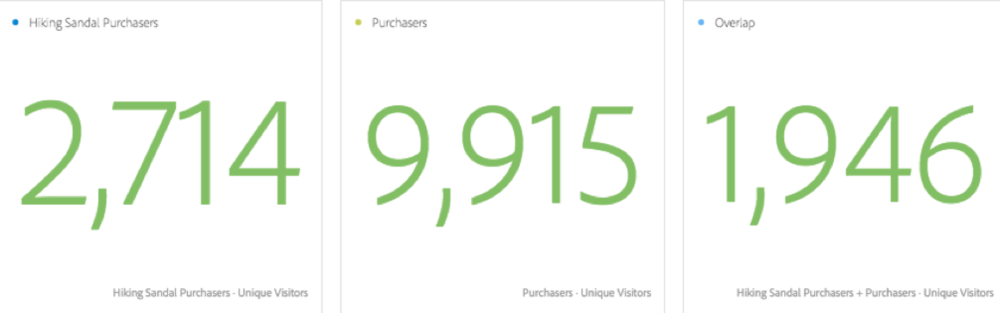
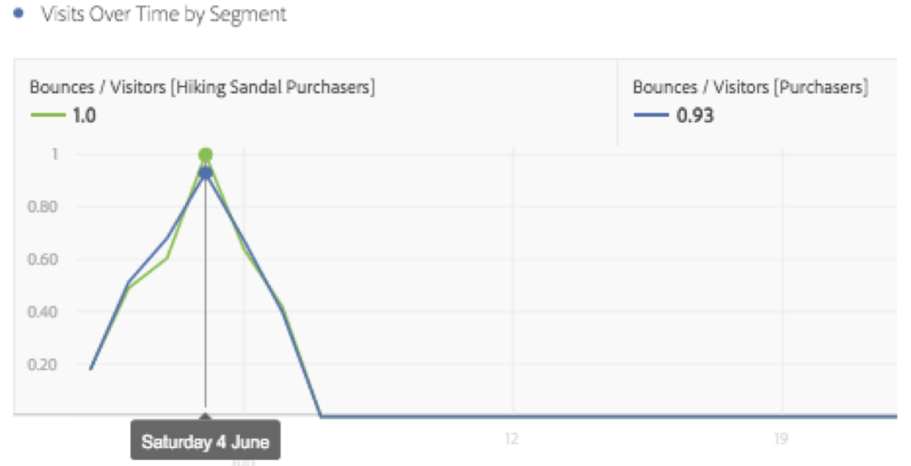

# Overzicht van het vergelijkingspaneel voor segmenten {#segment-comparison-overview}

<!-- markdownlint-disable MD034 -->

>[!CONTEXTUALHELP]
>id="workspace_segmentcomparison_button"
>title="Segmentvergelijking"
>abstract="Vergelijk snel twee segmenten over alle gegevenspunten om automatisch relevante verschillen te vinden."

<!-- markdownlint-enable MD034 -->

<!-- markdownlint-disable MD034 -->

>[!CONTEXTUALHELP]
>id="workspace_segmentcomparison_panel"
>title="Het vergelijkingspaneel Segment"
>abstract="Vergelijk snel twee segmenten over alle gegevenspunten om automatisch relevante verschillen te vinden.  **Parameters &#x200B;** **voegen een segment** toe: Het eerste segment dat u wilt analyseren. **vergelijk tegen**: Het tweede segment dat u wilt vergelijken tegen, dat automatisch met *iedereen anders* wordt bevolkt (het omgekeerde van uw eerste segment). U kunt *iedereen anders* met een verschillend segment vervangen indien gewenst. **Geavanceerde montages**: De capaciteit om componenten van worden geanalyseerd in de segmentvergelijking uit te sluiten."
<!-- markdownlint-enable MD034 -->

>[!BEGINSHADEBOX]

_dit artikel documenteert het de vergelijkingspaneel van het Segment in_  _&#x200B;**Adobe Analytics**._ _er is geen gelijkwaardig paneel in_  _&#x200B;**Customer Journey Analytics**._

>[!ENDSHADEBOX]

In het vergelijkingspaneel Segment worden de statistisch meest significante verschillen tussen een onbeperkt aantal segmenten gedetecteerd. De functie doorloopt een geautomatiseerde analyse van alle dimensies en metriek waartoe u toegang hebt. De vergelijking ontdekt automatisch zeer belangrijke kenmerken van de publiekssegmenten die KPIs van uw bedrijf drijven en laat u zien hoeveel segmenten overlappen.

>[!BEGINSHADEBOX]

Zie  [ vergelijking van het Segment ](https://video.tv.adobe.com/v/23976?quality=12&learn=on){target="_blank"} voor een demo video.

>[!ENDSHADEBOX]

## Gebruiken

Een deelvenster **[!UICONTROL Attribution]** gebruiken:

1. Maak een deelvenster **[!UICONTROL Attribution]** . Voor informatie over hoe te om een paneel tot stand te brengen, zie [ een paneel ](../panels.md#create-a-panel) creëren.

1. Specificeer de [ input ](#panel-input) voor het paneel.

1. Neem de [ output ](#panel-output) voor het paneel waar.

### Deelvensterinvoer

U kunt het deelvenster [!UICONTROL Segment comparison] configureren met de volgende invoerinstellingen:

| Invoer | Beschrijving |
| --- | --- |
| **[!UICONTROL Add a segment]** | Selecteer de dimensie die u wilt vergelijken. |
| **[!UICONTROL Compare against]** | Selecteer de dimensie die u wilt gebruiken om het eerste geselecteerde segment te vergelijken. Als u geen specifiek segment selecteert, wordt het standaardsegment **[!UICONTROL Everyone else]** gebruikt. |
| **[!UICONTROL Show / hide advanced settings]** | Selecteer **[!UICONTROL Show advanced settings]** om **[!UICONTROL Excluded components]** te configureren, selecteer **[!UICONTROL Hide advanced settings]** om **[!UICONTROL Excluded components]** te verbergen. |
| **[!UICONTROL Excluded components]** | Componenten die u kunt opgeven, zoals **[!UICONTROL Dimensions]** , **[!UICONTROL Metrics]** of **[!UICONTROL Segments]** voor uitsluiting.  <ul><li>Sleep een of meer afmetingen, maateenheden of segmenten van de containers naar de container **[!UICONTROL Excluded components]** .</li><li>Om een component te verwijderen, selecteer het type (**[!UICONTROL Dimension]** **[!UICONTROL Metrics]**, of **[!UICONTROL Segments]**) en selecteer  om een component te verwijderen. Selecteer **[!UICONTROL Clear all]** als u alle componenten wilt verwijderen.</li><li>Selecteer **[!UICONTROL Set as default]** als u de huidige selectie van afmetingen, cijfers en segmenten als de standaardinstelling wilt instellen.</li></ul> |

Selecteer **[!UICONTROL Build]** om het deelvenster te maken.

### Deelvensteruitvoer

Nadat Adobe Analytics de twee gewenste segmenten heeft geanalyseerd, worden in de uitvoerdeelvensters de resultaten via verschillende visualisaties weergegeven:

| Visualisatie | Beschrijving |
|---|---|
| **[!UICONTROL Size and overlap]** | Illustreert met a [ Venn ](/help/analyze/analysis-workspace/visualizations/venn.md) visualisatie de vergelijkende grootte van elk geselecteerd segment en hoeveel zij met elkaar overlappen. |
| **[!UICONTROL Unique visitors for 1st segment]** | A [ Summiere aantal ](/help/analyze/analysis-workspace/visualizations/summary-number-change.md) visualisatie die de unieke bezoekers voor het eerste segment tonen (in het voorbeeld Enige Pagina bezoeken) |
| **[!UICONTROL Unique visitors for 2nd segment]** | A [ Summiere aantal ](/help/analyze/analysis-workspace/visualizations/summary-number-change.md) visualisatie die de unieke bezoekers voor het tweede segment tonen (in het voorbeeld Eerste Bezoeken van de Tijd) |
| **[!UICONTROL Top metrics against Segments]** | A [ vrije lijst van de Vrije vorm ](/help/analyze/analysis-workspace/visualizations/freeform-table/freeform-table.md) tonend hoogste metriek voor de geselecteerde segmenten. |
| **[!UICONTROL Metric over time by Segment]** | A [ lijn ](/help/analyze/analysis-workspace/visualizations/line.md) visualisatie die de metriek in tijd voor de geselecteerde segmenten toont. |
| **[!UICONTROL Top dimension items against Segments]** | A [ Vrije lijst van de Vorm ](/help/analyze/analysis-workspace/visualizations/freeform-table/freeform-table.md) die de gemengde afmetingspunten voor de geselecteerde segmenten toont. |
| **[!UICONTROL Dimension items by Segments]** | A [ Horizontale bar ](/help/analyze/analysis-workspace/visualizations/horizontal-bar.md) visualisatie die de afmetingspunten door segment tonen. |
| **[!UICONTROL Top segments against Segments]** | A [ Vrije lijst ](/help/analyze/analysis-workspace/visualizations/freeform-table/freeform-table.md) die de hoogste segmenten tegen Segmenten toont. |
| **[!UICONTROL Segment overlap]** | A [ visualisatie van het verduisteren ](/help/analyze/analysis-workspace/visualizations/venn.md) dat het segmentoverlapping toont. |

Het gebruik  uit om het paneel opnieuw te vormen en te bouwen.

<!--
#### Size and overlap

Illustrates the comparative sizes of each selected segment and how much they overlap with each other using a venn diagram. You can hover over the visual to see how many visitors were in each overlapping or non-overlapping section. You can also right click on the overlap to create a brand new segment for further analysis. If the two segments are mutually exclusive, no overlap is shown between the two circles (typically seen with segments using a hit container).

#### Population summaries

To the right of the Size and Overlap visualization, the total unique visitor count in each segment and overlap is shown.

#### Top metrics

Displays the most statistically significant metrics between the two segments. Each row in this table represents a differentiating metric, ranked by how different it is between each segment. A difference score of 1 means it is statistically significant, while a difference score of 0 means there is no statistical significance.

This visualization is similar to freeform tables in Analysis Workspace. If deeper analysis on a specific metric is desired, hover over a line item and click 'Create visual'. A new table is created to analyze that specific metric. If a metric is irrelevant to your analysis, hover over the line item and click the 'X' to remove it.

>[!NOTE]
>
>Metrics added to this table after the segment comparison has finished do not receive a Difference Score.

#### Metric over time by segment

To the right of the metrics table is a linked visualization. You can click a line item in the table on the left, and this visualization updates to show that metric trended over time.

#### Top dimensions

Shows the most statistically significant dimension items across all of your dimensions. Each row shows the percentage of each segment exhibiting this dimension item. For example, this table might reveal that 100% of visitors in 'Segment A' had the dimension item 'Browser Type: Google', whereas only 19.6% of 'Segment B' had this dimension item. A difference score of 1 means it is statistically significant, while a difference score of 0 means there is no statistical significance.

This visualization is similar to freeform tables in Analysis Workspace. If deeper analysis on a specific dimension item is desired, hover over a line item and click 'Create visual'. A new table is created to analyze that specific dimension item. If a dimension item is irrelevant to your analysis, hover over the line item and click the 'X' to remove it.

>[!NOTE]
>
>Dimension items added to this table after the segment comparison has finished do not receive a Difference Score.

#### Dimension items by segment

To the right of the dimensions table is a linked bar chart visualization. It shows all displayed dimension items in a bar chart. Clicking a line item in the table on the left updates the visualization on the right.

#### Top segments

Shows which other segments (other than the two segments selected for comparison) have statistically significant overlap. For example, this table can show that a third segment, 'Repeat Visitors', overlaps highly with 'Segment A' but does not overlap with 'Segment B'. A difference score of 1 means it is statistically significant, while a difference score of 0 means there is no statistical significance.

This visualization is similar to freeform tables in Analysis Workspace. If deeper analysis on a specific segment is desired, hover over a line item and click 'Create visual'. A new table is created to analyze that specific segment. If a segment is irrelevant to your analysis, hover over the line item and click the 'X' to remove it.

>[!NOTE]
>
>Segments added to this table after the segment comparison has finished do not receive a Difference Score.

#### Segment overlap

To the right of the segments table is a linked venn diagram visualization. It shows the most statistically significant segment applied to your compared segments. For example, 'Segment A' + 'Statistically significant segment' vs. 'Segment B' + 'Statistically significant segment'. Clicking a segment line item in the table on the left updates the venn diagram on the right.

-->
